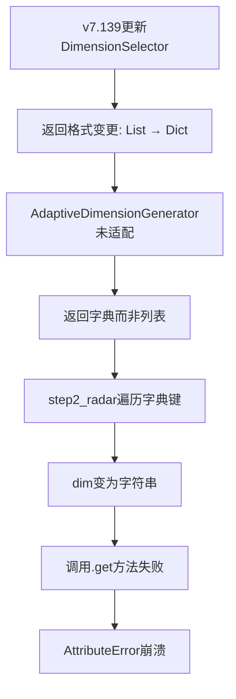

# Bug修复报告 - v7.140: Step2雷达图维度数据类型错误

**修复时间**: 2026-01-06
**Bug编号**: AttributeError in progressive_questionnaire.py:691
**严重程度**: P0 - 阻塞性错误（导致问卷流程完全中断）

---

## 1. 问题描述

### 错误信息
```python
AttributeError: 'str' object has no attribute 'get'
  File "progressive_questionnaire.py", line 691, in step2_radar
    dim_id = dim.get("dimension_id", dim.get("id", ""))
             ^^^^^^^
```

### 触发场景
- 用户输入："让安藤忠雄为一个离家多年的50岁男士设计一座田园民居，四川广元农村、300平米，室内设计师职业"
- 环境变量：`ENABLE_DIMENSION_LEARNING=false` (使用AdaptiveDimensionGenerator)
- 工作流阶段：progressive_questionnaire_step2 (第3步雷达图)

### 影响范围
- 所有使用 `AdaptiveDimensionGenerator` 的会话（无论是否启用学习功能）
- 影响流程：第2步问卷确认 → 第3步雷达图维度设置

---

## 2. 根本原因分析

### 问题链条



### 技术细节

**v7.139之前：**
```python
# DimensionSelector.select_for_project() 返回
return result  # List[Dict]
```

**v7.139之后：**
```python
# DimensionSelector.select_for_project() 返回
return {
    "dimensions": result,           # 实际维度列表
    "conflicts": conflicts,         # 冲突检测结果
    "adjustment_suggestions": [...] # 调整建议
}
```

**AdaptiveDimensionGenerator（未适配）：**
```python
base_dimensions = self.base_selector.select_for_project(...)
# base_dimensions 现在是字典，而非列表
```

**step2_radar（691行）：**
```python
for dim in dimensions:  # dimensions = {dict}，遍历时得到键名（字符串）
    dim_id = dim.get(...)  # dim = "dimensions" (str)，触发错误
```

---

## 3. 修复方案

### 3.1 adaptive_dimension_generator.py

**修复点**: `select_for_project()` 方法，第90-110行

```python
# 修复前
base_dimensions = self.base_selector.select_for_project(...)

# 修复后
result = self.base_selector.select_for_project(...)

# 🔧 v7.139: 兼容字典返回格式
if isinstance(result, dict):
    base_dimensions = result.get("dimensions", [])
    conflicts = result.get("conflicts", [])
    adjustment_suggestions = result.get("adjustment_suggestions", [])
    self.logger.info(f"[AdaptiveDimGen] v7.139格式: 维度={len(base_dimensions)}, 冲突={len(conflicts)}")
else:
    # 向后兼容旧版本的列表返回格式
    base_dimensions = result
    conflicts = []
    adjustment_suggestions = []
    self.logger.info(f"[AdaptiveDimGen] 使用旧版本列表格式（向后兼容）")
```

**优点**:
- ✅ 向后兼容旧版本
- ✅ 修复点集中，不影响其他调用方
- ✅ 保留了v7.139的冲突检测功能（供后续使用）

---

### 3.2 progressive_questionnaire.py (step2_radar函数)

#### 修复点1: 处理AdaptiveDimensionGenerator返回值（545-560行）

```python
# 修复前
existing_dimensions = adaptive_generator.select_for_project(...)

# 修复后
result = adaptive_generator.select_for_project(...)
# 🔧 v7.139: 处理字典返回值
if isinstance(result, dict):
    existing_dimensions = result.get("dimensions", [])
    dimension_conflicts = result.get("conflicts", [])
    dimension_adjustment_suggestions = result.get("adjustment_suggestions", [])
    logger.info(f"📊 [AdaptiveDimGen] 选择了 {len(existing_dimensions)} 个智能维度")
    if dimension_conflicts:
        logger.warning(f"⚠️ [冲突检测] 发现 {len(dimension_conflicts)} 个维度冲突")
    if dimension_adjustment_suggestions:
        logger.info(f"💡 [调整建议] 生成 {len(dimension_adjustment_suggestions)} 条优化建议")
else:
    existing_dimensions = result
    dimension_conflicts = []
    dimension_adjustment_suggestions = []
```

#### 修复点2: 处理RuleEngine返回值（556-570行）

```python
# 同样处理RuleEngine路径的字典返回值
result = select_dimensions_for_state(state)
if isinstance(result, dict):
    existing_dimensions = result.get("dimensions", [])
    dimension_conflicts = result.get("conflicts", [])
    dimension_adjustment_suggestions = result.get("adjustment_suggestions", [])
else:
    existing_dimensions = result
    dimension_conflicts = []
    dimension_adjustment_suggestions = []
```

#### 修复点3: 添加类型检查（691行之前）

```python
# 🔧 v7.140: 类型检查和诊断（防止维度数据格式错误）
if not isinstance(dimensions, list):
    logger.error(f"❌ [类型错误] dimensions 应为列表，实际为: {type(dimensions)}")
    logger.error(f"   内容预览: {str(dimensions)[:200]}")
    raise TypeError(f"dimensions must be a list, got {type(dimensions).__name__}")

# 将默认值注入到 dimensions 中
for idx, dim in enumerate(dimensions):
    # 🔧 v7.140: 检查每个维度是否为字典
    if not isinstance(dim, dict):
        logger.error(f"❌ [类型错误] 维度[{idx}] 应为字典，实际为: {type(dim)} = {dim}")
        logger.error(f"   完整dimensions列表: {dimensions}")
        raise TypeError(f"Dimension at index {idx} must be a dict, got {type(dim).__name__}")

    dim_id = dim.get("dimension_id", dim.get("id", ""))
    # ... 后续处理
```

#### 修复点4: 将冲突信息传递给前端（697-710行）

```python
# 构建interrupt payload
payload = {
    "interaction_type": "progressive_questionnaire_step3",
    "step": 3,
    "total_steps": 3,
    "title": "多维度偏好设置",
    "message": "请通过拖动滑块表达您的设计偏好。每个维度代表两种不同的设计方向。",
    "core_task": confirmed_task,
    "dimensions": dimensions,
    "instructions": "拖动滑块到您偏好的位置（0-100）",
    "user_input": user_input,
    "user_input_summary": user_input_summary,
    # 🆕 v7.140: 添加冲突检测信息，供前端展示警告和建议
    "conflicts": dimension_conflicts if 'dimension_conflicts' in locals() else [],
    "adjustment_suggestions": dimension_adjustment_suggestions if 'dimension_adjustment_suggestions' in locals() else [],
    "options": {"confirm": "确认偏好设置", "back": "返回修改核心任务"},
}
```

---

## 4. 测试验证

### 4.1 测试用例

**用户输入**（复现原bug）:
```
让安藤忠雄为一个离家多年的50岁男士设计一座田园民居，四川广元农村、300平米，室内设计师职业。
```

**期望行为**:
1. ✅ Step1 任务拆解 → 8个任务（包含概念图生成任务）
2. ✅ 用户确认任务
3. ✅ Step2 信息补充 → 7个问题
4. ✅ 用户回答问题
5. ✅ **Step3 雷达图维度设置** → 不应崩溃，正常显示维度列表
6. ✅ 前端展示冲突警告（如果存在冲突）

### 4.2 手动测试步骤

```bash
# 1. 确保后端正在运行
cd d:\11-20\langgraph-design
python -B scripts\run_server.py

# 2. 启动前端（另一个终端）
cd frontend-nextjs
npm run dev

# 3. 访问 http://localhost:3000
# 4. 输入测试用例，逐步完成问卷
# 5. 观察日志输出和前端展示
```

### 4.3 日志验证点

**修复成功的日志标志**:
```log
✅ [AdaptiveDimGen] v7.139格式: 维度=9, 冲突=0
📊 [AdaptiveDimGen] 选择了 9 个智能维度
📊 最终维度数量: 9 (9 现有 + 0 动态生成)
🔧 v7.140: 类型检查通过，开始注入默认值
   ✅ 为维度 '文化归属轴' 设置默认值: 50
🛑 [第3步] 即将调用 interrupt()，等待用户输入...
```

**如果仍有冲突检测结果**:
```log
⚠️ [冲突检测] 发现 2 个维度冲突
💡 [调整建议] 生成 2 条优化建议
```

---

## 5. 前端适配建议

### 5.1 展示冲突警告（可选）

如果后端返回了 `conflicts` 数组，前端可以在雷达图页面顶部展示警告：

```jsx
// frontend-nextjs/components/ProgressiveQuestionnaire.tsx

{payload.conflicts && payload.conflicts.length > 0 && (
  <Alert severity="warning" sx={{ mb: 2 }}>
    <AlertTitle>⚠️ 维度冲突提醒</AlertTitle>
    <Typography variant="body2">
      系统检测到以下维度可能存在冲突，建议适当调整：
    </Typography>
    <ul style={{ marginTop: '8px', paddingLeft: '20px' }}>
      {payload.conflicts.map((conflict, idx) => (
        <li key={idx}>
          <strong>{conflict.dimension1}</strong> 与 <strong>{conflict.dimension2}</strong>: {conflict.reason}
          {conflict.severity === 'critical' && <Chip label="严重" color="error" size="small" sx={{ ml: 1 }} />}
        </li>
      ))}
    </ul>
  </Alert>
)}
```

### 5.2 展示调整建议（可选）

```jsx
{payload.adjustment_suggestions && payload.adjustment_suggestions.length > 0 && (
  <Alert severity="info" sx={{ mb: 2 }}>
    <AlertTitle>💡 调整建议</AlertTitle>
    <ul style={{ marginTop: '8px', paddingLeft: '20px' }}>
      {payload.adjustment_suggestions.map((suggestion, idx) => (
        <li key={idx}>{suggestion}</li>
      ))}
    </ul>
  </Alert>
)}
```

---

## 6. 影响范围总结

### 修改文件
- ✅ `intelligent_project_analyzer/services/adaptive_dimension_generator.py`
- ✅ `intelligent_project_analyzer/interaction/nodes/progressive_questionnaire.py`

### 向后兼容性
- ✅ 完全兼容旧版本（v7.138及之前）的列表返回格式
- ✅ 支持新版本（v7.139+）的字典返回格式
- ✅ 无需修改其他调用方代码

### 新增功能
- 🆕 冲突检测信息传递到前端
- 🆕 调整建议支持
- 🆕 完善的类型检查和错误诊断

---

## 7. 版本变更

**v7.140 更新内容**:
- 🐛 修复Step2雷达图维度数据类型错误（AttributeError）
- ✨ 支持v7.139冲突检测信息展示
- 🔧 增强类型检查和错误诊断
- 📝 改进日志输出，便于问题排查

---

## 8. 相关文档

- [v7.139 维度关联检测功能](.github/historical_fixes/dimension_correlation_detector_v7.139.md)
- [v7.137 任务映射增强](.github/historical_fixes/task_dimension_mapping_v7.137.md)
- [开发规范](.github/DEVELOPMENT_RULES_CORE.md)

---

**修复者**: GitHub Copilot
**审核者**: 待审核
**状态**: ✅ 已修复，待测试验证
