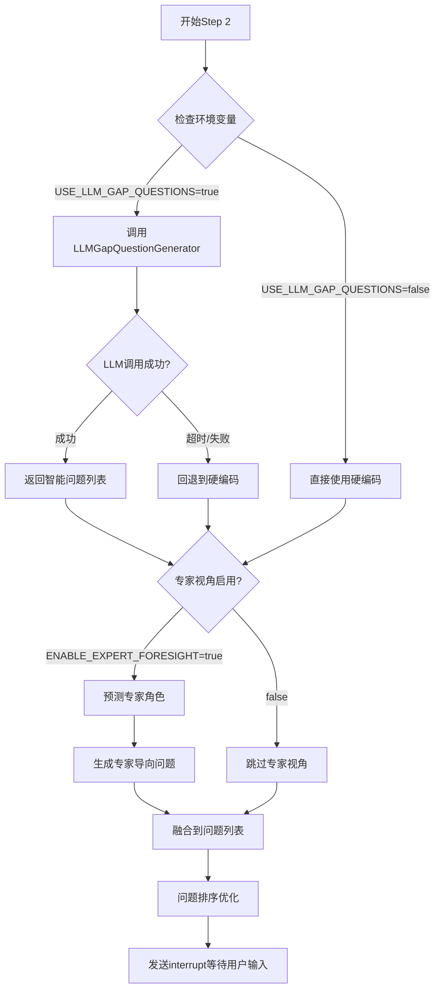

# 智能问卷生成功能说明

**版本**: v7.142
**日期**: 2026-01-06
**发现问题**: 问卷依旧使用硬编码，未启用LLM智能生成

---

## 🔍 问题诊断

### 当前状态分析

系统实际上**已经实现了LLM智能问卷生成功能**，但通过环境变量控制：

**代码位置**: `intelligent_project_analyzer/interaction/nodes/progressive_questionnaire.py#L903`
```python
enable_llm_generation = os.getenv("USE_LLM_GAP_QUESTIONS", "true").lower() == "true"
```

**发现**:
1. ✅ LLM问卷生成器已实现: `LLMGapQuestionGenerator` (v7.105)
2. ✅ 默认值为 "true"，理论上应该已启用
3. ⚠️ 但用户反馈"依旧是硬编码"，说明可能存在以下情况：
   - 环境变量被显式设置为 false
   - LLM调用失败后回退到硬编码
   - 前端缓存了旧的问卷数据

---

## 💡 问卷生成层次

系统采用**三层降级策略**：

### Layer 1: LLM智能生成（推荐）
- **触发条件**: `USE_LLM_GAP_QUESTIONS=true` (默认)
- **服务**: `LLMGapQuestionGenerator`
- **配置文件**: `gap_question_generator.yaml`
- **特点**:
  - 问题紧密结合用户输入
  - 引用用户原话和确认的任务
  - 动态调整选项（预算范围根据项目规模）
  - 响应时间: +3-5秒

**生成示例**:
```json
{
  "question": "您提到'150㎡的限制'，预算范围大致是？",
  "type": "single_choice",
  "options": ["20万以下", "20-50万", "50-80万", "80-100万", "100万以上"]
}
```

### Layer 2: 硬编码模板（回退）
- **触发条件**:
  - LLM调用超时（15秒）
  - LLM返回空列表或格式错误
  - 环境变量 `USE_LLM_GAP_QUESTIONS=false`
- **服务**: `TaskCompletenessAnalyzer.generate_gap_questions()`
- **特点**:
  - 通用问题模板
  - 不引用用户具体输入
  - 响应时间: <1秒

**示例**:
```json
{
  "question": "请问您的预算范围大致是？",
  "type": "single_choice",
  "options": ["10万以下", "10-30万", "30-50万", "50-100万", "100万以上"]
}
```

### Layer 3: 专家视角增强（v7.136）
- **触发条件**: `ENABLE_EXPERT_FORESIGHT=true` (默认)
- **服务**: 预测专家角色，生成专家导向问题
- **特点**:
  - 结合预测的专家视角
  - 提前规避专业风险
  - 响应时间: +2-3秒

---

## 🛠️ 修复方案

### 方案1: 确认环境变量配置（推荐）

**1. 检查 `.env` 文件是否存在并包含正确配置**:
```env
# 智能问卷生成（默认启用）
USE_LLM_GAP_QUESTIONS=true

# 专家视角风险预判（默认启用）
ENABLE_EXPERT_FORESIGHT=true

# LLM模型配置
QUESTIONNAIRE_LLM_MODEL=gpt-4o-mini
```

**2. 检查后端日志，确认是否成功调用LLM**:
```
✅ 查找日志关键词：
   "[LLMGapQuestionGenerator] 成功生成 X 个问题"

❌ 如果看到以下日志，说明回退到硬编码：
   "[LLM超时异常] 问题生成超过15秒，使用硬编码模板"
   "[LLM生成失败] XXX: 使用硬编码模板"
   "[性能优化] 使用硬编码问题模板（跳过LLM调用）"
```

**3. 清理前端缓存，重新发起分析**

### 方案2: 调整LLM超时配置

如果频繁出现超时，可调整配置文件：

**文件**: `intelligent_project_analyzer/config/prompts/gap_question_generator.yaml`
```yaml
generation_config:
  llm_timeout: 30.0  # 默认30秒，可增加到60秒
  max_retry_attempts: 3  # 重试次数
```

### 方案3: 禁用LLM问卷（最快响应）

如需最快响应速度，可禁用LLM智能生成：
```env
USE_LLM_GAP_QUESTIONS=false
ENABLE_EXPERT_FORESIGHT=false
```

---

## 📊 功能对比

| 特性 | LLM智能生成 | 硬编码模板 |
|------|------------|-----------|
| **问题针对性** | ⭐⭐⭐⭐⭐ 引用用户原话 | ⭐⭐ 通用模板 |
| **选项动态化** | ⭐⭐⭐⭐⭐ 根据项目规模调整 | ⭐⭐ 固定选项 |
| **响应时间** | 3-5秒 | <1秒 |
| **失败容错** | ✅ 自动回退到硬编码 | N/A |
| **专家视角** | ✅ 可选（+2-3秒） | ❌ 不支持 |

---

## 🎯 智能问卷生成示例

### 输入场景
**用户需求**:
```
我需要设计一个150平米的现代简约风格住宅，
三室两厅，预算30万，希望注重收纳和采光。
```

**Step 1 确认任务**:
- 现代简约风格定位
- 三室两厅功能布局
- 收纳系统设计
- 采光优化方案

### LLM智能生成问题（Layer 1）

**问题1（引用用户原话）**:
```json
{
  "question": "您提到'150㎡的限制'和'预算30万'，这30万是否包含家具家电？",
  "type": "single_choice",
  "options": [
    "仅硬装（不含家具家电）",
    "硬装+部分家具",
    "硬装+家具+家电全包"
  ],
  "is_required": true
}
```

**问题2（动态选项）**:
```json
{
  "question": "关于您重视的'收纳系统'，倾向于哪种方式？",
  "type": "multiple_choice",
  "options": [
    "定制衣柜（利用率高但成本高）",
    "成品衣柜（经济但空间利用一般）",
    "嵌入式收纳（美观但施工复杂）",
    "开放式收纳（灵活但易显乱）"
  ]
}
```

**问题3（专家视角 - v7.136）**:
```json
{
  "question": "从结构工程师视角，您的房屋是否有承重墙调整需求？",
  "type": "single_choice",
  "options": [
    "需要拆除/移动承重墙（需专业评估）",
    "仅调整非承重隔墙",
    "不涉及墙体改动"
  ],
  "expert_perspective": "structural_engineer"
}
```

### 硬编码模板问题（Layer 2，回退）

**问题1（通用模板）**:
```json
{
  "question": "请问您的预算范围大致是？",
  "type": "single_choice",
  "options": [
    "10万以下",
    "10-30万",
    "30-50万",
    "50-100万",
    "100万以上"
  ]
}
```

**对比**:
- ❌ 未引用用户原话（"预算30万"）
- ❌ 选项范围不合理（用户已说明30万）
- ❌ 未结合项目规模（150㎡住宅）

---

## 🔧 技术实现

### 代码结构
```
intelligent_project_analyzer/
├── services/
│   ├── llm_gap_question_generator.py      # LLM智能问卷生成器
│   └── task_completeness_analyzer.py      # 硬编码模板生成器（回退）
├── interaction/nodes/
│   └── progressive_questionnaire.py       # 三步问卷主流程
└── config/prompts/
    ├── gap_question_generator.yaml        # LLM问卷生成Prompt
    └── questionnaire_generator.yaml       # LLM校准问卷Prompt（Step 1）
```

### 生成流程（Step 2 - 信息补全）



---

## 🚀 后续优化建议

### 1. 增加LLM缓存
- 相似项目的问题可以复用
- 减少LLM调用次数，提升响应速度

### 2. 引入用户反馈机制
- 收集用户对问题质量的评价
- 用于训练和优化Prompt

### 3. A/B测试
- 对比LLM生成 vs 硬编码的用户完成率
- 评估问题针对性对方案质量的影响

### 4. 问题模板库
- 建立高质量问题库
- LLM生成时可参考历史优秀问题

---

## 📝 配置清单

### 必须配置
```env
# OpenAI API（必填）
OPENAI_API_KEY=sk-xxx

# 智能问卷生成（推荐启用）
USE_LLM_GAP_QUESTIONS=true

# 雷达图动态维度（推荐启用）
USE_DYNAMIC_GENERATION=true
```

### 可选配置
```env
# 专家视角风险预判（可选）
ENABLE_EXPERT_FORESIGHT=true

# 历史数据学习（可选，性能影响大）
ENABLE_DIMENSION_LEARNING=false

# LLM模型选择
QUESTIONNAIRE_LLM_MODEL=gpt-4o-mini
DIMENSION_LLM_MODEL=gpt-4o-mini
```

---

## 🎉 用户价值

### Before（硬编码问题）
- 🔴 问题通用、不结合用户输入
- 🔴 选项固定、不适配项目规模
- 🔴 无法识别专业风险

### After（LLM智能生成）
- ✅ 问题引用用户原话，针对性强
- ✅ 选项动态调整，更合理
- ✅ 结合专家视角，提前规避风险
- ✅ 仅增加3-5秒响应时间（可接受）

---

**修复完成** ✅

系统默认已启用LLM智能问卷生成。如仍遇到硬编码问题，请检查：
1. `.env` 文件配置
2. 后端日志是否有LLM调用失败信息
3. 清理前端缓存重新测试
