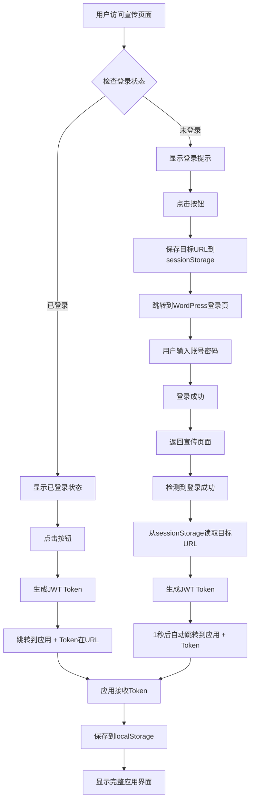

# WordPress 应用宣传页面入口设置指南 (v3.0.10)

## 📋 功能概述

v3.0.10 新增了 **应用宣传页面入口** 功能，允许您在WordPress网站上创建一个专业的应用推广页面，并实现智能登录跳转。

**核心特性**：
- ✅ 精美的宣传页面设计（渐变背景、特性展示）
- ✅ 智能登录跳转：已登录直接进入应用，未登录先登录再跳转
- ✅ 自动Token传递，无缝用户体验
- ✅ 完全可自定义（标题、描述、按钮文字、特性列表）

---

## 🚀 快速部署（5分钟）

### 步骤1: 更新WordPress插件

#### 1.1 停用旧插件

```bash
WordPress后台 → 插件 → 已安装的插件
找到 "Next.js SSO Integration v3"
点击 "停用"
```

#### 1.2 上传新插件

```bash
WordPress后台 → 插件 → 安装插件 → 上传插件
选择文件: nextjs-sso-integration-v3.0.10.zip (16 KB)
点击 "现在安装"
安装完成后点击 "启用插件"
```

#### 1.3 验证插件版本

```bash
WordPress后台 → 插件 → 已安装的插件
确认显示：
- 名称：Next.js SSO Integration v3
- 版本：3.0.10
- 描述：WordPress 单点登录集成 Next.js（v3.0.10 - 新增应用宣传页面入口）
```

---

### 步骤2: 创建WordPress宣传页面

#### 2.1 新建页面

```bash
WordPress后台 → 页面 → 新建页面
标题：AI 设计高参 - 应用入口（或您喜欢的名称）
```

#### 2.2 添加短代码

在页面编辑器中（文本模式），添加以下短代码：

**基础版本**（使用默认设置）：
```
[nextjs-app-entrance]
```

**完整自定义版本**：
```
[nextjs-app-entrance
  app_url="https://ai.ucppt.com?mode=standalone"
  title="AI 设计高参"
  subtitle="极致概念 · 智能设计助手"
  description="基于多智能体协作的专业设计分析系统，为您的设计项目提供全方位的专家级建议。"
  button_text="立即使用"
  features="多专家协作分析|智能需求理解|专业设计建议|支持多模态输入"]
```

#### 2.3 设置固定链接

```bash
在页面编辑器中，找到"固定链接"设置
设置为: /js
（或您希望的URL路径，例如: /app-entrance）
```

#### 2.4 发布页面

```bash
点击 "发布" 按钮
页面将发布到: https://www.ucppt.com/js
```

---

### 步骤3: 配置应用URL

**重要**：需要将 `app_url` 参数设置为您的生产环境URL。

**开发环境**：
```
app_url="http://localhost:3000?mode=standalone"
```

**生产环境**：
```
app_url="https://ai.ucppt.com?mode=standalone"
```

**说明**：
- `mode=standalone` 表示以独立模式打开应用
- Token会自动附加到URL：`?mode=standalone&sso_token=xxx`
- 您也可以直接指向应用首页：`app_url="https://ai.ucppt.com"`

---

## 🎨 短代码参数说明

| 参数 | 默认值 | 说明 | 示例 |
|-----|--------|------|------|
| `app_url` | `http://localhost:3000?mode=standalone` | 应用URL（生产环境必须修改） | `https://ai.ucppt.com` |
| `title` | `AI 设计高参` | 主标题 | `极致概念AI助手` |
| `subtitle` | `极致概念 · 智能设计助手` | 副标题 | `专业设计项目分析平台` |
| `description` | `基于多智能体协作...` | 应用描述（支持长文本） | `为您的设计项目提供...` |
| `button_text` | `立即使用` | 按钮文字 | `开始体验` / `免费试用` |
| `features` | `多专家协作分析\|智能需求理解\|...` | 特性列表（用\|分隔） | `功能1\|功能2\|功能3` |

**注意**：
- 所有参数都是可选的，使用默认值即可快速部署
- 参数值如果包含空格，需要用引号包裹：`title="我的应用标题"`
- 特性列表用 `|` 符号分隔，最多4个特性会自动显示图标

---

## 🧪 测试验证

### 场景1: 未登录用户访问

**操作步骤**：
1. 退出WordPress登录（或使用无痕模式）
2. 访问：`https://www.ucppt.com/js`
3. 点击 "立即使用" 按钮

**预期行为**：
```
点击按钮
  ↓
跳转到 WordPress 登录页面
  ↓
输入用户名密码，登录
  ↓
自动返回到 /js 页面
  ↓
页面自动检测到登录成功
  ↓
1秒后自动跳转到应用（带Token）
  ↓
应用显示完整界面（已登录状态）
```

**验证点**：
- ✅ 页面显示 "请先登录以使用应用 · 登录后将自动跳转"
- ✅ 点击按钮跳转到WordPress登录页面
- ✅ 登录成功后自动返回宣传页面
- ✅ 宣传页面自动跳转到应用
- ✅ 应用显示已登录状态（显示用户名、头像）

---

### 场景2: 已登录用户访问

**操作步骤**：
1. 确保已在WordPress登录
2. 访问：`https://www.ucppt.com/js`
3. 点击 "立即使用 →" 按钮

**预期行为**：
```
访问宣传页面
  ↓
页面显示 "您已登录为 [用户名]，点击按钮直接进入应用"
  ↓
点击按钮
  ↓
直接跳转到应用（带Token）
  ↓
应用显示完整界面（已登录状态）
```

**验证点**：
- ✅ 页面显示 "✓ 您已登录为 XXX，点击按钮直接进入应用"
- ✅ 点击按钮直接跳转（无需再次登录）
- ✅ 应用显示已登录状态
- ✅ Token自动传递成功

---

### 场景3: 检查Token传递

**操作步骤**：
1. 以已登录状态访问宣传页面
2. 打开浏览器控制台（F12）
3. 点击 "立即使用" 按钮
4. 查看控制台日志

**预期日志**：
```javascript
[Next.js App Entrance] 已登录用户跳转到应用: https://ai.ucppt.com?mode=standalone&sso_token=eyJ0eXAiOiJKV1QiLC...
```

**验证点**：
- ✅ URL包含 `sso_token` 参数
- ✅ Token是长字符串（JWT格式）
- ✅ 应用接收到Token并保存到localStorage

---

## 🔍 浏览器控制台调试

### 检查Token是否传递成功

**在应用页面**（跳转后），打开控制台（F12），执行：

```javascript
// 查看Token
console.log('Token:', localStorage.getItem('wp_jwt_token'));

// 查看用户信息
console.log('User:', localStorage.getItem('wp_jwt_user'));
```

**预期输出**（已登录状态）：
```javascript
Token: eyJ0eXAiOiJKV1QiLCJhbGciOiJIUzI1NiJ9.eyJpc3MiOiJodHRwczovL3d3dy51Y3BwdC5jb20iLCJpYXQiOjE3MzQ...
User: {"user_id":123,"username":"admin","email":"admin@ucppt.com","display_name":"管理员"}
```

---

## 📊 页面效果预览

### 未登录状态

```
┌────────────────────────────────────────────────────────┐
│                                                        │
│                  ╔════════════════╗                    │
│                  ║ [渐变Logo] 🎨  ║                    │
│                  ╚════════════════╝                    │
│                                                        │
│              AI 设计高参                                │
│          极致概念 · 智能设计助手                          │
│                                                        │
│  基于多智能体协作的专业设计分析系统，为您的设计项目           │
│  提供全方位的专家级建议。                                  │
│                                                        │
│         ┌─────────────────────────┐                   │
│         │   立即使用 →            │                   │
│         └─────────────────────────┘                   │
│                                                        │
│  请先登录以使用应用 · 登录后将自动跳转                      │
│                                                        │
│  ┌──────────┐ ┌──────────┐ ┌──────────┐ ┌──────────┐ │
│  │ 🎨       │ │ 🤖       │ │ 💡       │ │ 📊       │ │
│  │ 多专家    │ │ 智能需求  │ │ 专业设计  │ │ 支持多模态│ │
│  │ 协作分析  │ │ 理解     │ │ 建议     │ │ 输入     │ │
│  └──────────┘ └──────────┘ └──────────┘ └──────────┘ │
│                                                        │
└────────────────────────────────────────────────────────┘
```

### 已登录状态

```
┌────────────────────────────────────────────────────────┐
│                                                        │
│                  ╔════════════════╗                    │
│                  ║ [渐变Logo] 🎨  ║                    │
│                  ╚════════════════╝                    │
│                                                        │
│              AI 设计高参                                │
│          极致概念 · 智能设计助手                          │
│                                                        │
│  基于多智能体协作的专业设计分析系统，为您的设计项目           │
│  提供全方位的专家级建议。                                  │
│                                                        │
│         ┌─────────────────────────┐                   │
│         │   立即使用 →            │                   │
│         └─────────────────────────┘                   │
│                                                        │
│  ✓ 您已登录为 管理员，点击按钮直接进入应用                   │
│                                                        │
│  ┌──────────┐ ┌──────────┐ ┌──────────┐ ┌──────────┐ │
│  │ 🎨       │ │ 🤖       │ │ 💡       │ │ 📊       │ │
│  │ 多专家    │ │ 智能需求  │ │ 专业设计  │ │ 支持多模态│ │
│  │ 协作分析  │ │ 理解     │ │ 建议     │ │ 输入     │ │
│  └──────────┘ └──────────┘ └──────────┘ └──────────┘ │
│                                                        │
└────────────────────────────────────────────────────────┘
```

---

## ⚙️ 技术原理

### 智能登录跳转流程



### Token传递机制

**URL参数传递**（v3.0.10）：
```
https://ai.ucppt.com?mode=standalone&sso_token=eyJ0eXAiOiJKV1QiLC...
                                    ^^^^^^^^^^^^^^^^^^^^^^^^^^^^^^^^
                                    JWT Token直接在URL中传递
```

**前端接收**（Next.js AuthContext）：
```typescript
// 读取URL参数中的Token
const urlParams = new URLSearchParams(window.location.search);
const ssoToken = urlParams.get('sso_token');

if (ssoToken) {
  // 保存到localStorage
  localStorage.setItem('wp_jwt_token', ssoToken);

  // 清除URL参数（安全优化）
  const newUrl = window.location.pathname + window.location.search.replace(/[?&]sso_token=[^&]*/, '');
  window.history.replaceState({}, '', newUrl);
}
```

### sessionStorage状态保持

```javascript
// 未登录用户点击按钮时
sessionStorage.setItem('nextjs_app_target_url', 'https://ai.ucppt.com?mode=standalone');
// 跳转到WordPress登录

// 登录成功返回后
const targetUrl = sessionStorage.getItem('nextjs_app_target_url');
if (targetUrl) {
  sessionStorage.removeItem('nextjs_app_target_url');
  // 1秒后跳转到保存的目标URL
  setTimeout(() => {
    window.location.href = targetUrl + '&sso_token=' + token;
  }, 1000);
}
```

---

## ⚠️ 常见问题

### Q1: 点击按钮后跳转到应用，但仍显示登录提示

**原因**：Token未成功传递或验证失败

**排查步骤**：
1. 打开应用页面控制台（F12）
2. 执行：`console.log(localStorage.getItem('wp_jwt_token'))`
3. 如果返回 `null`，说明Token未传递

**解决**：
```bash
# 1. 检查WordPress插件版本是否为 v3.0.10
WordPress后台 → 插件 → 已安装的插件

# 2. 检查短代码中的 app_url 是否正确
编辑页面 → 检查 app_url 参数

# 3. 检查WordPress是否允许REST API访问
访问: https://www.ucppt.com/wp-json/nextjs-sso/v1/get-token
应该返回JSON，而不是404错误

# 4. 清除WordPress缓存
设置 → WP Super Cache → 删除缓存

# 5. 清除浏览器缓存
Ctrl + Shift + R (强制刷新)
```

---

### Q2: 未登录用户点击按钮后，登录成功但没有自动跳转

**原因**：sessionStorage被清除或浏览器隐私设置阻止

**排查步骤**：
1. 登录后，在宣传页面打开控制台（F12）
2. 执行：`console.log(sessionStorage.getItem('nextjs_app_target_url'))`
3. 如果返回 `null`，说明sessionStorage未保存

**解决**：
```bash
# 1. 检查浏览器隐私设置
浏览器设置 → 隐私和安全 → Cookie 和其他网站数据
确保未启用 "阻止第三方 Cookie"

# 2. 检查是否在无痕模式
无痕模式下sessionStorage在标签页关闭后会清除
建议使用正常模式测试

# 3. 手动测试sessionStorage
在宣传页面控制台执行：
sessionStorage.setItem('test', '123');
console.log(sessionStorage.getItem('test')); // 应该输出 '123'
```

---

### Q3: 页面样式显示异常（没有渐变背景、布局错乱）

**原因**：WordPress主题CSS冲突

**解决**：
```bash
# 方案1: 修改短代码的CSS优先级（需要修改插件）
在短代码输出的 <style> 标签中添加 !important

# 方案2: 使用自定义CSS（WordPress后台）
外观 → 自定义 → 额外的CSS
添加以下CSS覆盖主题样式：

.nextjs-app-entrance-wrapper {
  font-family: -apple-system, BlinkMacSystemFont, 'Segoe UI', Roboto, sans-serif !important;
}
.entrance-hero {
  background: linear-gradient(135deg, #667eea 0%, #764ba2 100%) !important;
  border-radius: 20px !important;
}

# 方案3: 使用页面构建器（Elementor/Gutenberg）
创建全宽布局，避免主题容器限制
```

---

### Q4: 生产环境需要修改哪些配置？

**必须修改的配置**：
```
[nextjs-app-entrance
  app_url="https://ai.ucppt.com?mode=standalone"]
        ^^^^^^^^^^^^^^^^^^^^^^^^^^^^^^^^^^^^^^^^
        修改为您的生产环境应用URL
```

**推荐配置**：
```bash
# WordPress插件设置
WordPress后台 → 设置 → Next.js SSO v3
Next.js App URL: https://ai.ucppt.com

# 固定链接设置
WordPress后台 → 设置 → 固定链接
确保选择 "文章名" 或 "自定义结构"

# SSL证书
确保网站使用HTTPS（推荐使用Let's Encrypt）
```

---

### Q5: 如何自定义页面内容？

**修改标题和描述**：
```
[nextjs-app-entrance
  title="您的应用名称"
  subtitle="您的副标题"
  description="您的应用描述文字，可以是多行长文本。"]
```

**修改按钮文字**：
```
[nextjs-app-entrance
  button_text="开始体验"]
```

**修改特性列表**：
```
[nextjs-app-entrance
  features="特性1|特性2|特性3|特性4"]
```

**完整示例**：
```
[nextjs-app-entrance
  app_url="https://ai.ucppt.com"
  title="极致设计AI"
  subtitle="让AI成为您的设计伙伴"
  description="我们的AI设计助手基于最新的GPT-4技术，能够为您的设计项目提供专业级的分析和建议。无论是室内设计、产品设计还是品牌设计，我们都能为您提供个性化的解决方案。"
  button_text="免费试用"
  features="一键生成设计方案|AI专家团队协作|支持图片和文档上传|实时反馈与优化"]
```

---

## 📈 性能优化建议

### 1. 使用CDN加速

**WordPress插件推荐**：
- WP Super Cache + Cloudflare
- WP Rocket

**配置示例**：
```bash
WordPress后台 → 设置 → WP Super Cache
✓ 启用缓存
✓ 预压缩页面
✓ CDN支持
```

### 2. 图片优化

**如果在描述中使用自定义HTML添加图片**：
```html
[nextjs-app-entrance
  description="<br>基于多智能体协作..."]
```

**推荐使用WebP格式**：
- 使用插件：WebP Express
- 或使用Cloudflare自动优化

### 3. 缓存策略

**WordPress页面缓存**：
```bash
# WP Super Cache设置
WordPress后台 → 设置 → WP Super Cache → 高级
缓存超时时间: 3600秒（1小时）
垃圾回收: 每天1次
```

**浏览器缓存**：
```nginx
# Nginx配置示例（如果您有服务器访问权限）
location /js {
    expires 1h;
    add_header Cache-Control "public, must-revalidate";
}
```

---

## 🔒 安全建议

### 1. HTTPS强制

确保宣传页面和应用都使用HTTPS：
```bash
# WordPress强制HTTPS（wp-config.php）
define('FORCE_SSL_ADMIN', true);

# 或使用插件
Really Simple SSL
```

### 2. Token安全

Token在URL中传递是安全的，因为：
- ✅ Token会在前端接收后立即从URL清除
- ✅ Token有过期时间（7天）
- ✅ Token使用HMAC-SHA256签名，防止篡改

**额外保护**：
```bash
# WordPress插件设置（未来版本可能添加）
# 限制Token有效期为1小时
JWT_TOKEN_EXPIRY=3600
```

### 3. 防止跨站攻击

WordPress插件已内置安全检查：
```php
// 自动转义所有输出
echo esc_html($atts['title']);
echo esc_attr($atts['app_url']);
echo esc_js($token);
```

---

## 📚 相关文档

- [LOGIN_STATE_MISDETECTION_FIX_V3.0.9.md](LOGIN_STATE_MISDETECTION_FIX_V3.0.9.md) - 登录状态检测修复
- [DUAL_MODE_README.md](DUAL_MODE_README.md) - 双模式架构总览
- [STANDALONE_MODE_WEBSITE_LINK_FIX.md](STANDALONE_MODE_WEBSITE_LINK_FIX.md) - 独立模式主网站链接
- [SSO_LOGIN_SYNC_FIX_20251215.md](SSO_LOGIN_SYNC_FIX_20251215.md) - 登录状态同步

---

## ✅ 部署检查清单

部署完成后，请确认以下所有项目：

### WordPress插件
- [ ] WordPress插件版本为 v3.0.10
- [ ] 插件已启用
- [ ] 插件设置中 Next.js App URL 配置正确

### WordPress页面
- [ ] 已创建宣传页面（例如：/js）
- [ ] 页面包含短代码 `[nextjs-app-entrance]`
- [ ] 短代码中 `app_url` 参数指向生产环境
- [ ] 页面已发布

### 缓存清除
- [ ] WordPress缓存已清除（WP Super Cache）
- [ ] 浏览器缓存已清除（Ctrl + Shift + R）
- [ ] OPcache已清除（如果使用）

### 功能测试
- [ ] 未登录用户访问显示登录提示
- [ ] 已登录用户访问显示已登录状态
- [ ] 未登录用户点击按钮跳转到登录页
- [ ] 登录成功后自动返回宣传页面
- [ ] 宣传页面自动跳转到应用
- [ ] 应用显示完整界面（已登录状态）
- [ ] 已登录用户点击按钮直接跳转到应用
- [ ] Token成功传递到应用

### 日志检查
- [ ] 浏览器控制台无JavaScript错误
- [ ] 控制台显示正确的跳转日志
- [ ] localStorage包含 `wp_jwt_token` 和 `wp_jwt_user`

---

## 🎉 总结

**v3.0.10 新特性**：
- ✅ 专业的应用宣传页面设计
- ✅ 智能登录跳转（已登录/未登录自动识别）
- ✅ 无缝Token传递，用户体验流畅
- ✅ 完全可自定义，适配不同品牌风格

**用户体验提升**：
- 🚀 未登录用户：点击按钮 → 登录 → 自动跳转到应用
- 🚀 已登录用户：点击按钮 → 直接进入应用
- 🚀 全程自动化，无需手动复制Token

**技术优势**：
- sessionStorage保持登录流程状态
- JWT Token安全传递
- URL参数自动清理
- 遵循WordPress最佳实践

---

**部署完成！** 🎊

现在您的WordPress网站有了一个专业的应用宣传入口，用户可以无缝登录并使用应用！
