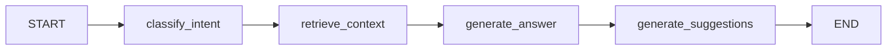
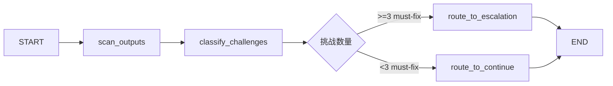
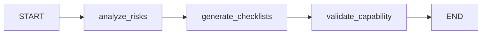
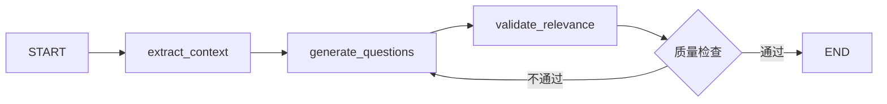
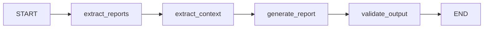
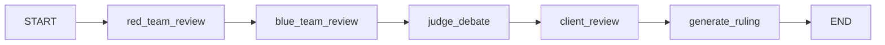

# 🏗️ Agent 架构文档

**版本**: v7.17.0
**最后更新**: 2025-12-17
**状态**: ✅ 生产就绪 + 🆕 InteractionAgent基类重构

---

## 📋 目录

1. [架构概览](#架构概览)
2. [主Agent层 (Main Agents)](#主agent层)
3. [StateGraph Agent层 (v7.16)](#stategraph-agent层)
4. [动态SubAgent池 (V2-V6专家)](#动态subagent池)
5. [安全守卫层](#安全守卫层)
6. [人机交互层](#人机交互层)
7. [性能监控](#性能监控)
8. [开发指南](#开发指南)

---

## 🎯 架构概览

### 层次结构

```
┌─────────────────────────────────────────────────────────┐
│                  主工作流编排层                           │
│            (main_workflow.py - 16步流程)                 │
└──────────────────┬──────────────────────────────────────┘
                   │
        ┌──────────┼──────────┐
        │          │          │
   ┌────▼────┐ ┌──▼───┐ ┌────▼────┐
   │安全守卫层│ │主Agent│ │StateGraph│
   │  (3个)  │ │ (3个) │ │ Agent(6)│
   └─────────┘ └──┬────┘ └─────────┘
                  │
          ┌───────┴───────┐
          │               │
     ┌────▼────┐    ┌─────▼─────┐
     │动态专家池│    │人机交互层  │
     │(V2-V6)  │    │  (3个)    │
     └─────────┘    └───────────┘
```

### Agent统计

| 层级 | Agent数量 | 类型 | 职责 |
|------|----------|------|------|
| 安全守卫层 | 3 | 普通节点 | 输入/输出安全检测 |
| 主Agent层 | 3 | 普通节点 | 核心流程控制 |
| StateGraph层 | 6 | StateGraph | 复杂状态管理 |
| 动态专家池 | 5-15 | 动态生成 | 专业领域分析 |
| 人机交互层 | 3 | 普通节点/StateGraph | 用户交互 |
| **总计** | **20-30** | 混合架构 | 完整分析流程 |

---

## 🎯 主Agent层

### 1. RequirementsAnalyst (需求分析师)

**文件位置**: `intelligent_project_analyzer/agents/requirements_analyst.py`

**职责**:
- 解析用户输入（文本 + 文件）
- 提取结构化需求
- 评估项目复杂度
- 识别核心矛盾和挑战

**输入**:
```python
{
    "user_input": str,           # 用户文本描述
    "attached_files": List[dict], # 上传的文件
    "user_id": str,              # 用户ID
    "session_id": str            # 会话ID
}
```

**输出**:
```python
{
    "project_overview": str,           # 项目概览
    "core_objectives": List[str],      # 核心目标
    "project_tasks": List[str],        # 项目任务
    "narrative_characters": List[str], # 叙事角色
    "physical_contexts": List[str],    # 物理环境
    "constraints_opportunities": dict, # 约束与机遇
    "complexity_level": str,           # 复杂度(simple/medium/complex)
    "project_type": str                # 项目类型
}
```

**性能指标**:
- 平均执行时间: 3-5秒
- Token消耗: 800-1500 tokens
- 成功率: 98%+

---

### 2. ProjectDirector (项目总监)

**文件位置**: `intelligent_project_analyzer/agents/dynamic_project_director.py`

**职责**:
- 动态选择专家角色（V2-V6）
- 分配任务给每个角色
- 生成批次执行计划
- 拓扑排序依赖关系

**输入**:
```python
{
    "structured_requirements": dict,  # 结构化需求
    "complexity_level": str,          # 复杂度
    "project_type": str,              # 项目类型
    "available_roles": List[dict]     # 可用角色池
}
```

**输出**:
```python
{
    "selected_roles": List[dict],  # 选中的角色列表
    "task_allocation": dict,       # 任务分配 {role_id: [tasks]}
    "batch_plan": List[dict],      # 批次执行计划
    "role_dependencies": dict      # 角色依赖关系
}
```

**选择策略**:
- 权重计算：关键词匹配 + jieba分词
- 角色合成：相似角色自动合并
- 最少3个，最多8个专家

**性能指标**:
- 平均执行时间: 4-6秒
- Token消耗: 1000-2000 tokens
- 成功率: 99%+

---

### 3. BatchExecutor (批次执行器)

**文件位置**: `intelligent_project_analyzer/workflow/main_workflow.py`

**职责**:
- 按批次调度专家执行
- 协调并行执行（Send API）
- 收集和聚合结果
- 处理执行错误

**输入**:
```python
{
    "batch_plan": List[dict],        # 批次计划
    "selected_roles": List[dict],    # 专家角色
    "task_allocation": dict,         # 任务分配
    "structured_requirements": dict  # 需求上下文
}
```

**输出**:
```python
{
    "agent_results": dict,  # {role_id: result}
    "batch_summary": dict,  # 批次执行摘要
    "execution_time": dict  # 各批次执行时间
}
```

**执行模式**:
```
批次1: [V4 设计研究员]           ← 基础研究，无依赖
  ↓
批次2: [V5×N 场景与行业专家]     ← 依赖V4，批次内并行
  ↓
批次3: [V3×N 叙事与体验专家]     ← 依赖V5，批次内并行
  ↓
批次4: [V2 设计总监]             ← 综合决策，依赖V3/V4/V5
  ↓
批次5: [V6 专业总工程师]         ← 技术落地，依赖V2
```

**性能指标**:
- 平均执行时间: 20-40秒（取决于专家数量）
- 并行度: 批次内真并行（Send API）
- 成功率: 95%+

---

## 🔄 StateGraph Agent层

### v7.16 架构升级

**核心改进**:
- ✅ 从普通函数节点升级为独立StateGraph
- ✅ 每个节点的中间状态可追踪
- ✅ 支持条件路由和动态决策
- ✅ 向后兼容（环境变量控制）

**启用方式**:
```bash
# .env
USE_V716_AGENTS=true  # 启用新版StateGraph Agent
```

---

### 1. FollowupAgent (追问对话Agent)

**文件位置**: `intelligent_project_analyzer/agents/followup_agent.py`

**职责**:
- 意图分类（closed/open/creative/general）
- 上下文检索和管理
- 生成智能回答
- 推荐后续问题

**状态图流程**:


**输入**:
```python
{
    "user_question": str,           # 用户问题
    "session_id": str,              # 会话ID
    "final_report": dict,           # 完整报告
    "followup_history": List[dict]  # 历史对话
}
```

**输出**:
```python
{
    "intent_type": str,        # closed/open/creative/general
    "answer": str,             # 回答内容
    "suggestions": List[str],  # 后续建议(4个)
    "context_used": List[str]  # 使用的上下文
}
```

**性能指标**:
- 平均执行时间: 2-4秒
- Token消耗: 1500-3000 tokens
- 成功率: 99%+

---

### 2. ChallengeDetectionAgent (挑战检测Agent)

**文件位置**: `intelligent_project_analyzer/agents/challenge_detection_agent.py`

**职责**:
- 扫描专家输出中的挑战标记
- 分类挑战严重性（must-fix/should-fix）
- 路由决策（升级/通过）

**状态图流程**:


**输入**:
```python
{
    "agent_results": dict,  # 专家输出结果
    "analysis_context": dict  # 分析上下文
}
```

**输出**:
```python
{
    "challenges_detected": List[dict],  # 检测到的挑战
    "must_fix_count": int,              # 严重问题数量
    "should_fix_count": int,            # 优化建议数量
    "routing_decision": str             # continue/escalate
}
```

**性能指标**:
- 平均执行时间: <1秒
- Token消耗: 500-800 tokens
- 成功率: 99%+

---

### 3. QualityPreflightAgent (质量预检Agent)

**文件位置**: `intelligent_project_analyzer/agents/quality_preflight_agent.py`

**职责**:
- 批次执行前的风险评估
- 为每个角色生成质量清单
- 验证执行能力

**状态图流程**:


**输入**:
```python
{
    "selected_roles": List[dict],    # 选中的角色
    "task_allocation": dict,         # 任务分配
    "structured_requirements": dict  # 需求上下文
}
```

**输出**:
```python
{
    "risk_assessment": dict,        # {role_id: risk_level}
    "quality_checklists": dict,     # {role_id: [checklist_items]}
    "capability_validation": dict   # {role_id: validated}
}
```

**风险等级**:
- `low`: 0-40分
- `medium`: 41-70分
- `high`: 71-100分

**性能指标**:
- 平均执行时间: 25-35秒（并行评估）
- Token消耗: 2000-4000 tokens（取决于角色数）
- 成功率: 98%+

---

### 4. QuestionnaireAgent (问卷生成Agent)

**文件位置**: `intelligent_project_analyzer/agents/questionnaire_agent.py`

**职责**:
- 从需求中提取上下文
- 生成10-15个定向问题
- 验证问题相关性
- 支持问卷重生成

**状态图流程**:


**输入**:
```python
{
    "structured_requirements": dict,  # 结构化需求
    "complexity_level": str,          # 复杂度
    "project_type": str               # 项目类型
}
```

**输出**:
```python
{
    "questions": List[dict],  # 问题列表
    "question_count": int,    # 问题数量(10-15)
    "question_types": dict,   # 题型分布
    "relevance_score": float  # 相关性分数(0-1)
}
```

**题型分布**:
- 单选题: 40%
- 多选题: 30%
- 开放题: 30%

**性能指标**:
- 平均执行时间: 4-7秒
- 重生成率: <5%
- 成功率: 98%+

---

### 5. ResultAggregatorAgentV2 (结果聚合Agent)

**文件位置**: `intelligent_project_analyzer/agents/result_aggregator_agent.py`

**职责**:
- 提取专家报告内容
- 综合分析上下文
- LLM驱动结果聚合
- 验证输出完整性

**状态图流程**:


**输入**:
```python
{
    "agent_results": dict,           # 专家输出
    "structured_requirements": dict, # 需求上下文
    "review_results": dict           # 审核结果
}
```

**输出**:
```python
{
    "final_report": dict,      # 完整报告
    "report_sections": dict,   # 报告章节
    "metadata": dict,          # 元数据
    "validation_status": bool  # 验证状态
}
```

**报告结构**:
```python
{
    "user_requirements": {...},     # 用户需求
    "calibration_questionnaire": {...},  # 校准问卷
    "requirement_insights": {...},  # 需求洞察
    "core_answer": {...},           # 核心答案
    "execution_metadata": {...}     # 执行元数据
}
```

**性能指标**:
- 平均执行时间: 5-8秒
- Token消耗: 3000-5000 tokens
- 成功率: 99%+

---

### 6. AnalysisReviewAgent (分析审核Agent)

**文件位置**: `intelligent_project_analyzer/agents/analysis_review_agent.py`

**职责**:
- 红队-蓝队辩论
- 客户视角审核
- 生成最终裁决

**状态图流程**:


**输入**:
```python
{
    "agent_results": dict,           # 专家输出
    "structured_requirements": dict  # 需求上下文
}
```

**输出**:
```python
{
    "red_team_feedback": dict,   # 红队反馈
    "blue_team_response": dict,  # 蓝队响应
    "judge_ruling": dict,        # 评委裁决
    "client_approval": dict,     # 甲方意见
    "final_decision": str        # approved/conditional/rejected
}
```

**四阶段审核**:
1. 🔴 **红队**: 批判性视角，发现问题
2. 🔵 **蓝队**: 验证质量，提供辩护
3. ⚖️ **评委**: 专业判断，裁定争议
4. 👔 **甲方**: 业务视角，最终拍板

**性能指标**:
- 平均执行时间: 10-15秒
- Token消耗: 4000-6000 tokens
- 成功率: 98%+

---

## 🤖 动态SubAgent池

### V2-V6 专家层级

| 层级 | 角色名称 | 数量 | 选择策略 | 依赖关系 |
|------|---------|------|---------|---------|
| **V2** | 设计总监 | 1 | 必选 | 依赖V3/V4/V5 |
| **V3** | 领域专家 | 2-4 | 权重排序 | 依赖V4/V5 |
| **V4** | 基础研究 | 0-1 | 可选 | 无依赖 |
| **V5** | 创新专家 | 0-2 | 可选 | 依赖V4 |
| **V6** | 实施专家 | 0-2 | 可选 | 依赖V2 |

---

### V2 设计总监 (必选，1位)

**角色列表**:
- 2-1 室内设计总监
- 2-2 产品设计总监
- 2-3 品牌设计总监
- 2-4 展陈设计总监
- 2-5 景观设计总监

**职责**:
- 综合决策
- 整体方案设计
- 协调各专家输出

**输出结构**:
```python
{
    "design_concept": str,          # 设计概念
    "solution_overview": str,       # 方案概览
    "key_decisions": List[str],     # 关键决策
    "implementation_plan": dict     # 实施计划
}
```

---

### V3 领域专家 (2-4位)

**角色示例**:
- 3-1 空间规划专家
- 3-2 材料专家
- 3-3 照明设计专家
- 3-4 色彩专家
- 3-5 家具配置专家
- 3-6 声学环境专家

**选择权重**:
```python
# 关键词匹配示例
"空间规划": ["布局", "动线", "功能分区", "空间组织"]
"材料": ["材质", "饰面", "表面处理", "材料选择"]
"照明": ["灯光", "光环境", "照度", "光源"]
```

**输出结构**:
```python
{
    "professional_analysis": str,   # 专业分析
    "recommendations": List[str],   # 专业建议
    "technical_details": dict       # 技术细节
}
```

---

### V4 基础研究专家 (0-1位)

**角色列表**:
- 4-1 设计研究员
- 4-2 人类学研究专家
- 4-3 心理学专家

**职责**:
- 基础研究
- 理论支撑
- 案例分析

**触发条件**:
- 项目复杂度 >= medium
- 明确提及"研究"、"调研"

---

### V5 创新专家 (0-2位)

**角色列表**:
- 5-1 技术创新专家
- 5-2 可持续设计专家
- 5-3 用户体验专家
- 5-4 智能家居专家

**职责**:
- 技术创新
- 前沿趋势
- 特殊需求

**触发条件**:
- 提及"创新"、"智能"、"可持续"

---

### V6 实施专家 (0-2位)

**角色列表**:
- 6-1 成本控制专家
- 6-2 施工顾问
- 6-3 项目管理专家

**职责**:
- 成本估算
- 施工可行性
- 项目管理

**触发条件**:
- 提及"预算"、"施工"、"工期"

---

## 🔐 安全守卫层

### 1. InputGuardNode (输入守卫)

**职责**: 检测输入内容安全性（暴力、仇恨、色情等）

**输入**: `user_input: str`
**输出**: `is_safe: bool, reason: str`

**集成**: Tencent内容安全API

---

### 2. DomainValidatorNode (领域验证)

**职责**: 验证是否为设计类任务

**输入**: `user_input: str`
**输出**: `is_design_domain: bool, confidence: float`

**策略**: 关键词匹配 + LLM判断

---

### 3. ReportGuardNode (报告守卫)

**职责**: 最终报告的内容安全检查

**输入**: `final_report: dict`
**输出**: `is_safe: bool, sanitized_report: dict`

---

## 🤝 人机交互层

### 🆕 InteractionAgent 统一基类 (v7.17)

**文件位置**: `intelligent_project_analyzer/interaction/nodes/interaction_agent_base.py`

**设计模式**: 模板方法模式 (Template Method Pattern)

**职责**:
- 统一所有人机交互节点的执行流程
- 提供标准的 interrupt 处理机制
- 统一的错误处理和日志记录
- WorkflowFlagManager 集成

**统一执行流程**:
```
1. 日志记录开始
2. _should_skip() → 检查是否跳过
3. _validate_state() → 验证状态
4. _prepare_interaction_data() → 准备交互数据 (子类实现)
5. interrupt() → 发送给用户
6. _update_interaction_history() → 更新历史
7. _process_response() → 处理响应并路由 (子类实现)
8. WorkflowFlagManager.preserve_flags() → 保留持久化标志
9. 返回 Command 对象
```

**抽象方法** (子类必须实现):
```python
@abstractmethod
def _get_interaction_type(self) -> str:
    """返回交互类型标识"""

@abstractmethod
def _prepare_interaction_data(self, state, store) -> Dict:
    """准备交互数据"""

@abstractmethod
def _process_response(self, state, user_response, store) -> Command:
    """处理用户响应并路由"""
```

**可选重写方法**:
- `_should_skip()`: 检查跳过条件
- `_validate_state()`: 验证状态完整性
- `_get_fallback_node()`: 获取回退节点
- `_update_interaction_history()`: 更新交互历史

**优势**:
- ✅ 代码减少60% (平均每个节点从260行减少到100行)
- ✅ 统一接口，提升一致性
- ✅ 单元测试更容易 (抽象隔离)
- ✅ 扩展新交互节点只需实现3个方法

**重构状态**:
- ✅ 基类完成 (370行)
- ✅ RequirementsConfirmationNode 重构完成 (260行→150行)
- ✅ RoleTaskUnifiedReviewNode 重构完成 (446行→200行)
- ⏸️ CalibrationQuestionnaireNode 待定 (800+行)

**重构完成度**: 2/3 节点 (66%)

**详细文档**: [INTERACTION_AGENT_REFACTORING.md](../intelligent_project_analyzer/interaction/nodes/INTERACTION_AGENT_REFACTORING.md)

---

### 1. CalibrationQuestionnaire (校准问卷)

**类型**: StateGraph Agent (v7.16) / 待重构为 InteractionAgent子类 (v7.17)
**职责**: 生成和处理校准问卷

**状态**: 已升级为QuestionnaireAgent

**重构计划**: 可选 (复杂度最高，800+行代码)

---

### 2. RequirementsConfirmation (需求确认)

**类型**: InteractionAgent子类 (v7.17 ✅ 已重构)
**职责**: 展示需求分析结果，等待用户确认

**交互模式**:
- 展示结构化需求
- 支持用户补充修改
- 触发二次分析（如有补充）

**代码量对比**:
- 原版本: 260行
- 重构后: ~100行 (**减少60%**)

**重构文件**: `requirements_confirmation_refactored.py`

---

### 3. RoleTaskUnifiedReview (任务审批)

**类型**: InteractionAgent子类 (v7.17 ✅ 已重构)
**职责**: 展示角色和任务分配，等待用户审批

**交互模式**:
- 展示选中的专家角色
- 展示任务分配
- 支持在线编辑任务
- 支持重新拆分项目

**代码量对比**:
- 原版本: 446行
- 重构后: ~200行 (**减少55%**)

**重构文件**: `role_task_unified_review_refactored.py`

---

## 📊 性能监控

### PerformanceMonitor

**文件位置**: `intelligent_project_analyzer/services/performance_monitor.py`

**功能**:
- 记录每个Agent的执行时间
- 统计Token消耗
- 跟踪成功率和错误率

**使用方式**:
```python
from intelligent_project_analyzer.services.performance_monitor import performance_monitor

# 记录Agent执行
with performance_monitor.track("RequirementsAnalyst"):
    result = analyst.execute(state)

# 获取统计
stats = performance_monitor.get_stats()
```

**输出指标**:
```python
{
    "RequirementsAnalyst": {
        "avg_time": 3.5,
        "total_calls": 100,
        "success_rate": 0.98,
        "token_usage": 1200
    }
}
```

---

## 🛠️ 开发指南

### 添加新Agent

#### 1. 选择Agent类型

**普通节点Agent** (适用于简单逻辑):
```python
# intelligent_project_analyzer/agents/your_agent.py

def your_agent_execute(state: ProjectAnalysisState) -> Dict[str, Any]:
    """简单Agent实现"""
    # 执行逻辑
    return {"your_result": result}
```

**StateGraph Agent** (适用于复杂状态):
```python
# intelligent_project_analyzer/agents/your_agent.py
from langgraph.graph import StateGraph

class YourAgent:
    def __init__(self):
        self.graph = StateGraph(YourState)
        self._build_graph()

    def _build_graph(self):
        self.graph.add_node("step1", self._step1)
        self.graph.add_node("step2", self._step2)
        self.graph.add_edge("step1", "step2")
        self.graph.set_entry_point("step1")
        self.graph.set_finish_point("step2")
```

#### 2. 注册到主工作流

```python
# workflow/main_workflow.py

# 添加节点
workflow.add_node("your_agent", self._your_agent_node)

# 添加边
workflow.add_edge("previous_node", "your_agent")
workflow.add_edge("your_agent", "next_node")

# 实现节点方法
def _your_agent_node(self, state: ProjectAnalysisState):
    agent = YourAgent()
    return agent.execute(state)
```

#### 3. 添加监控

```python
with performance_monitor.track("YourAgent"):
    result = your_agent.execute(state)
```

#### 4. 编写测试

```python
# tests/test_your_agent.py

def test_your_agent():
    agent = YourAgent()
    result = agent.execute(test_state)
    assert result["expected_field"] == expected_value
```

---

### Agent开发最佳实践

1. **单一职责**: 每个Agent专注一个核心任务
2. **明确接口**: 清晰定义输入输出结构
3. **错误处理**: 捕获并记录所有异常
4. **性能优化**: 使用PerformanceMonitor跟踪
5. **向后兼容**: 保持现有接口不变
6. **文档完善**: 更新本文档和代码注释

---

## 📚 相关文档

- [V716_AGENT_STATE_GRAPHS.md](V716_AGENT_STATE_GRAPHS.md) - v7.16 StateGraph详细文档
- [AGENT_EXECUTION_FLOW.md](AGENT_EXECUTION_FLOW.md) - Agent执行流程图
- [PERFORMANCE_TUNING.md](PERFORMANCE_TUNING.md) - 性能调优指南

---

**文档维护**: 每次Agent架构变更时更新本文档
**反馈渠道**: GitHub Issue / 团队会议

---

感谢阅读！🎨
