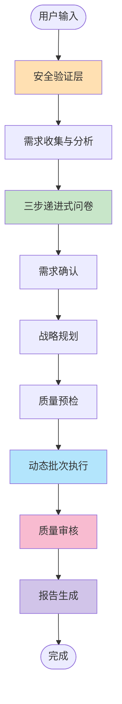
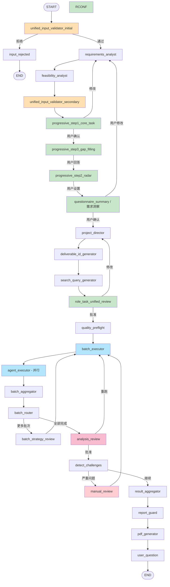

# 系统工作流完整指南

> **版本**: v7.150+
> **最后更新**: 2026-01-07
> **文档类型**: 系统架构与流程说明

## 📋 目录

- [文档概述](#文档概述)
- [系统架构概览](#系统架构概览)
- [工作流程图](#工作流程图)
- [核心文件位置](#核心文件位置)
- [详细执行步骤表](#详细执行步骤表)
  - [阶段 0: 安全验证层](#阶段-0安全验证层)
  - [阶段 1: 需求收集与分析](#阶段-1需求收集与分析)
  - [阶段 2: 三步递进式问卷](#阶段-2三步递进式问卷-v780)
  - [阶段 3: 需求确认](#阶段-3需求确认)
  - [阶段 4: 战略规划](#阶段-4战略规划)
  - [阶段 5: 质量预检](#阶段-5质量预检)
  - [阶段 6: 动态批次执行](#阶段-6动态批次执行-核心创新)
  - [阶段 7: 质量审核](#阶段-7质量审核)
  - [阶段 8: 报告生成](#阶段-8报告生成)
  - [阶段 9: 后续跟进](#阶段-9后续跟进-可选)
- [关键设计特性](#关键设计特性)
- [执行模式](#执行模式)
- [状态字段映射](#状态字段映射)
- [总结](#总结)

---

## 文档概述

本文档详细描述了基于 LangGraph 的多智能体协作系统的完整工作流程，从用户输入到最终报告生成的每一个执行步骤。

### 适用场景
- 室内设计项目分析
- 多专家协作需求
- 复杂项目规划与评估

### 文档用途
- 系统架构理解
- 开发人员参考
- 运维故障排查
- 新功能集成指导

---

## 系统架构概览

该系统是一个基于 **LangGraph** 的多智能体协作平台，专为室内设计项目分析设计。

### 🎯 核心特点

1. **动态批次执行**
   - 支持 1-N 批次的专家并行执行
   - 基于拓扑排序的依赖关系解析
   - 灵活的批次调度策略

2. **三步递进式问卷**
   - Step 1: 核心任务拆解
   - Step 2: 差距填补追问
   - Step 3: 雷达图维度选择

3. **多层质量控制**
   - Layer 1: 执行前风险评估 (quality_preflight)
   - Layer 2: 实时执行监控 (agent_executor)
   - Layer 3: 多视角审核 (analysis_review)

4. **人机协作设计**
   - 7 个关键交互点
   - 平衡自动化与用户控制
   - 智能修改检测机制

### 📊 系统规模

- **总节点数**: 30 个 (v7.151: 合并 requirements_confirmation)
- **交互节点**: 6 个 (v7.151: 减少 1 个)
- **自动节点**: 24 个
- **专家类型**: V2-V7 (6 种角色)
- **支持批次**: 1-N 动态批次
- **执行阶段**: 9 个 (0-8)

---

## 工作流程图

### 高层流程图



### 详细节点流程图



---

## 核心文件位置

### 工作流编排
- [main_workflow.py](d:\11-20\langgraph-design\intelligent_project_analyzer\workflow\main_workflow.py) - 主工作流 (2,712 行)
- [state.py](d:\11-20\langgraph-design\intelligent_project_analyzer\core\state.py) - 状态管理

### 交互节点
- [progressive_questionnaire.py](d:\11-20\langgraph-design\intelligent_project_analyzer\interaction\nodes\progressive_questionnaire.py) - 三步问卷
- [questionnaire_summary.py](d:\11-20\langgraph-design\intelligent_project_analyzer\interaction\nodes\questionnaire_summary.py) - 需求洞察 (🔧 v7.151: 合并了 requirements_confirmation)
- [quality_preflight.py](d:\11-20\langgraph-design\intelligent_project_analyzer\interaction\nodes\quality_preflight.py) - 质量预检
- [analysis_review.py](d:\11-20\langgraph-design\intelligent_project_analyzer\interaction\nodes\analysis_review.py) - 分析审核
- [manual_review.py](d:\11-20\langgraph-design\intelligent_project_analyzer\interaction\nodes\manual_review.py) - 人工审核

### 智能体
- [requirements_analyst.py](d:\11-20\langgraph-design\intelligent_project_analyzer\agents\requirements_analyst.py) - 需求分析师
- [project_director.py](d:\11-20\langgraph-design\intelligent_project_analyzer\agents\project_director.py) - 项目总监
- [task_oriented_expert_factory.py](d:\11-20\langgraph-design\intelligent_project_analyzer\agents\task_oriented_expert_factory.py) - 动态专家工厂
- [result_aggregator.py](d:\11-20\langgraph-design\intelligent_project_analyzer\report\result_aggregator.py) - 结果聚合器

## 详细执行步骤表

### 阶段 0：安全验证层

| 步骤 | 节点名称 | 执行类型 | 主要功能 | 输入字段 | 输出字段 | 路由逻辑 | 用户交互 |
|------|---------|---------|---------|---------|---------|---------|---------|
| 0.1 | `unified_input_validator_initial` | 自动 | 初始内容安全检查<br>- 敏感词检测<br>- 领域分类<br>- 恶意输入过滤 | `user_input` | `domain_classification`<br>`safety_check_passed` | **通过** → `requirements_analyst`<br>**拒绝** → `input_rejected` (END) | ❌ 无 |
| 0.2 | `input_rejected` | 终止 | 显示拒绝原因并结束流程 | `rejection_reason` | - | END | ❌ 无 |

---

### 阶段 1：需求收集与分析

| 步骤 | 节点名称 | 执行类型 | 主要功能 | 输入字段 | 输出字段 | 路由逻辑 | 用户交互 |
|------|---------|---------|---------|---------|---------|---------|---------|
| 1.1 | `requirements_analyst` | 自动 (LLM) | **两阶段需求分析**<br>- Phase 1: 基础解析<br>- Phase 2: JTBD 转换<br>- 提取核心目标、功能需求<br>- 预测交付物及负责人 | `user_input`<br>`domain_classification` | `structured_requirements`<br>`project_type` (B2B/B2C/住宅)<br>`deliverable_metadata` | → `feasibility_analyst` | ❌ 无 |
| 1.2 | `feasibility_analyst` | 自动 (LLM) | **V1.5 可行性分析**<br>- 预算/时间/空间冲突检测<br>- 需求优先级计算<br>- 风险评估 | `structured_requirements` | `feasibility_assessment` (后台决策支持，不显示给前端) | → `unified_input_validator_secondary` | ❌ 无 |
| 1.3 | `unified_input_validator_secondary` | 自动 | 二次安全验证<br>- 检查分析结果是否包含敏感内容 | `structured_requirements` | `secondary_check_passed` | **通过** → `progressive_step1_core_task`<br>**调整** → `requirements_analyst` | ❌ 无 |

---

### 阶段 2：三步递进式问卷 (v7.80+)

| 步骤 | 节点名称 | 执行类型 | 主要功能 | 输入字段 | 输出字段 | 路由逻辑 | 用户交互 |
|------|---------|---------|---------|---------|---------|---------|---------|
| 2.1 | `progressive_step1_core_task` | 交互 (LLM) | **Step 1: 核心任务拆解**<br>- LLM 驱动任务提取<br>- 能力边界检查<br>- 用户确认/调整/补充任务 | `user_input`<br>`structured_requirements` | `extracted_core_tasks`<br>`confirmed_core_tasks`<br>`capability_warnings` | **确认** → `progressive_step3_gap_filling`<br>**修改** → `requirements_analyst` | ✅ **用户确认任务列表** |
| 2.2 | `progressive_step3_gap_filling` | 交互 (LLM) | **Step 2 (UI): 差距填补追问**<br>- 任务完整性分析<br>- LLM 生成针对性问题<br>- 识别缺失维度 | `confirmed_core_tasks`<br>`user_input` | `gap_filling_answers`<br>`task_completeness_analysis` | → `progressive_step2_radar` | ✅ **用户回答追问** |
| 2.3 | `progressive_step2_radar` | 交互 | **Step 3 (UI): 雷达图维度选择**<br>- 9-12 个维度滑块<br>- 动态维度生成 (可选)<br>- 特殊场景维度注入 | `confirmed_core_tasks` | `radar_dimension_values`<br>`selected_dimensions` | → `questionnaire_summary` | ✅ **用户设置维度偏好** |
| 2.4 | `questionnaire_summary` | 交互 (LLM) | **需求洞察 (v7.151 升级)**<br>- 整合 3 步问卷数据<br>- 调用需求重构引擎<br>- 生成 12+ 维度结构化文档<br>- 🆕 **合并需求确认功能**<br>- 支持用户直接编辑需求理解<br>- 智能修改检测 (<50字符微调 vs ≥50字符重大修改)<br>- 能力边界检查 | `confirmed_core_tasks`<br>`gap_filling_answers`<br>`radar_dimension_values` | `restructured_requirements`<br>`questionnaire_summary_completed`<br>`requirements_confirmed`<br>`user_requirement_adjustments` | **确认/微调(<50字符)** → `project_director`<br>**重大修改(≥50字符)** → `requirements_analyst`<br>**拒绝** → `requirements_analyst` | ✅ **用户确认/编辑需求洞察** |

---

### ~~阶段 3：需求确认~~ (已废弃 v7.151)

> **⚠️ 重要变更 (v7.151)**: 原"阶段 3: 需求确认"节点 (`requirements_confirmation`) 已合并到 `questionnaire_summary`（现更名为"需求洞察"），不再作为独立节点存在。
>
> **合并原因**:
> - 减少用户交互次数（从 5 次降至 4 次）
> - 避免重复确认（需求洞察后立即确认更自然）
> - 统一需求理解与确认流程
>
> **功能保留**:
> - ✅ 智能修改检测（阈值从 10 字符提升至 50 字符）
> - ✅ 能力边界检查
> - ✅ 重大修改返回 `requirements_analyst` 重新分析
> - ✅ 微调直接更新本地状态

---

### 阶段 3：战略规划

| 步骤 | 节点名称 | 执行类型 | 主要功能 | 输入字段 | 输出字段 | 路由逻辑 | 用户交互 |
|------|---------|---------|---------|---------|---------|---------|---------|
| 3.1 | `project_director` | 自动 (LLM) | **动态专家选择与任务分配**<br>- 从 YAML 配置选择 3-8 名专家<br>- 创建任务分配表<br>- 生成交付物元数据<br>- 验证循环确保质量 | `structured_requirements`<br>`feasibility_assessment` | `active_agents` (角色列表)<br>`strategic_analysis` (任务分配)<br>`deliverable_owner_map` | → `deliverable_id_generator` | ❌ 无 |
| 3.2 | `deliverable_id_generator` | 自动 | **交付物 ID 生成 (v7.108)**<br>- 为每个交付物分配唯一 ID (D1, D2...)<br>- 关联负责人和支持者 | `deliverable_metadata` | `deliverable_metadata` (更新 ID) | → `search_query_generator` | ❌ 无 |
| 3.3 | `search_query_generator` | 自动 (LLM) | **搜索查询生成 (v7.109)**<br>- 为每个专家生成搜索关键词<br>- 生成概念图配置<br>- 支持多语言查询 | `active_agents`<br>`strategic_analysis` | `search_queries` (每个专家)<br>`concept_image_configs` | → `role_task_unified_review` | ❌ 无 |
| 3.4 | `role_task_unified_review` | 交互 | **统一审核：角色 + 任务**<br>- 显示专家团队<br>- 显示任务分配表<br>- 用户可调整搜索工具配置 | `active_agents`<br>`strategic_analysis` | `role_task_approved`<br>`user_tool_preferences` | **批准** → `quality_preflight`<br>**修改** → `project_director` | ✅ **用户批准专家团队与任务** |

---

### 阶段 4：质量预检

| 步骤 | 节点名称 | 执行类型 | 主要功能 | 输入字段 | 输出字段 | 路由逻辑 | 用户交互 |
|------|---------|---------|---------|---------|---------|---------|---------|
| 4.1 | `quality_preflight` | 自动 (LLM) | **执行前质量风险评估 (v7.136)**<br>- 并行异步评估每个专家<br>- LLM 驱动风险分析<br>- 生成质量检查清单<br>- 高风险任务警告 | `active_agents`<br>`strategic_analysis` | `quality_checklists`<br>`high_risk_warnings` | **高风险** → `interrupt` (用户确认)<br>**低风险** → `batch_executor` | ⚠️ **高风险时需用户确认** |

---

### 阶段 5：动态批次执行 (核心创新)

| 步骤 | 节点名称 | 执行类型 | 主要功能 | 输入字段 | 输出字段 | 路由逻辑 | 用户交互 |
|------|---------|---------|---------|---------|---------|---------|---------|
| 5.1 | `batch_executor` | 自动 | **批次准备与验证**<br>- 加载当前批次专家列表<br>- 准备依赖数据<br>- 创建并行任务 | `execution_batches`<br>`current_batch` | `batch_prepared` | → `_create_batch_sends` (条件边) | ❌ 无 |
| 5.2 | `agent_executor` | 并行 (Send API) | **单个专家执行**<br>- 加载角色配置 (YAML)<br>- 创建专家实例<br>- 执行搜索工具 (Bocha/Tavily/Arxiv/Milvus)<br>- 生成概念图 (v7.108+)<br>- 实时 WebSocket 广播<br>- 质量监控与重试 | `role_id`<br>`task_assignment`<br>`search_queries`<br>`concept_image_config` | `agent_results[role_id]`<br>`concept_images`<br>`search_references` | → `batch_aggregator` | ❌ 无 (并行执行) |
| 5.3 | `batch_aggregator` | 自动 | **批次完成验证**<br>- 轮询检查所有专家完成<br>- 准备依赖数据给下一批次<br>- 更新进度 | `agent_results`<br>`execution_batches` | `completed_batches`<br>`batch_dependencies_data` | → `batch_router` | ❌ 无 |
| 5.4 | `batch_router` | 自动 | **批次路由决策**<br>- 检查是否还有未执行批次<br>- 决定下一步 | `current_batch`<br>`total_batches` | - | **更多批次** → `batch_strategy_review`<br>**全部完成** → `analysis_review` | ❌ 无 |
| 5.5 | `batch_strategy_review` | 交互 (可选) | **批次策略预览 (V2/V6)**<br>- 显示下一批次专家策略<br>- 用户可批准或跳过 | `strategic_analysis`<br>`next_batch_agents` | `batch_approved` | **批准** → `batch_executor`<br>**跳过** → `batch_router` | ⚠️ **根据 execution_mode 决定** |

**批次依赖关系示例**:
- **Batch 1**: V4 (研究专家) + V3 (叙事专家) + V5 (场景专家) - 无依赖
- **Batch 2**: V6 (总工程师) + V2 (设计总监) - 依赖 Batch 1
- **Batch N**: 根据动态需求扩展

---

### 阶段 6：质量审核

| 步骤 | 节点名称 | 执行类型 | 主要功能 | 输入字段 | 输出字段 | 路由逻辑 | 用户交互 |
|------|---------|---------|---------|---------|---------|---------|---------|
| 6.1 | `analysis_review` | 自动 (LLM) | **多视角自动审核**<br>- 红队 (风险识别)<br>- 蓝队 (验证与优化)<br>- 裁判 (优先级排序)<br>- 客户 (最终决策)<br>- 检测 must_fix 问题 | `agent_results`<br>`structured_requirements` | `review_result`<br>`improvement_suggestions`<br>`analysis_approved` | **批准** → `detect_challenges`<br>**重跑 (≤1 轮)** → `batch_executor`<br>**重跑 (>1 轮)** → `detect_challenges` (达到最大轮次) | ❌ 无 (自动化) |
| 6.2 | `detect_challenges` | 自动 (LLM) | **挑战检测 (v3.5)**<br>- 专家可挑战需求分析师的洞察<br>- 三种解决路径: 接受/综合/升级 | `agent_results`<br>`structured_requirements` | `expert_driven_insights`<br>`framework_synthesis`<br>`escalated_challenges` | **>3 must_fix** → `manual_review`<br>**需客户审核** → `analysis_review`<br>**需反馈循环** → `requirements_analyst`<br>**继续** → `result_aggregator` | ❌ 无 |
| 6.3 | `manual_review` | 交互 | **人工审核 (严重质量问题)**<br>- 触发条件: >3 个 must_fix 问题<br>- 用户选择: 继续/中止/选择性修复<br>- 提取受影响专家 | `improvement_suggestions`<br>`review_result` | `agents_to_rerun`<br>`risk_accepted` | **中止** → `batch_executor` (全面修复)<br>**选择性修复** → `batch_executor` (针对性修复)<br>**继续** → `detect_challenges` (接受风险) | ✅ **用户决策修复策略** |

---

### 阶段 7：报告生成

| 步骤 | 节点名称 | 执行类型 | 主要功能 | 输入字段 | 输出字段 | 路由逻辑 | 用户交互 |
|------|---------|---------|---------|---------|---------|---------|---------|
| 7.1 | `result_aggregator` | 自动 (LLM) | **LLM 驱动结果聚合**<br>- 提取所有专家输出<br>- 生成 `FinalReport` (Pydantic 模型)<br>- 交付物答案提取 (v7.0)<br>- 概念图整合 (v7.108)<br>- 搜索引用去重 (v7.122) | `agent_results`<br>`deliverable_metadata`<br>`concept_images`<br>`search_references` | `final_report`<br>`deliverable_answers`<br>`expert_support_chain` | → `report_guard` | ❌ 无 |
| 7.2 | `report_guard` | 自动 | **最终报告内容安全检查**<br>- 敏感词过滤<br>- 合规性验证 | `final_report` | `report_safe` | → `pdf_generator` | ❌ 无 |
| 7.3 | `pdf_generator` | 自动 | **PDF 报告生成**<br>- ReportLab 专业排版<br>- 跨平台中文字体支持<br>- 自定义样式与布局 | `final_report` | `pdf_path` | → `user_question` (可选) 或 END | ❌ 无 |

---

### 阶段 8：后续跟进 (可选)

| 步骤 | 节点名称 | 执行类型 | 主要功能 | 输入字段 | 输出字段 | 路由逻辑 | 用户交互 |
|------|---------|---------|---------|---------|---------|---------|---------|
| 8.1 | `user_question` | 交互 | **后续问题处理**<br>- 允许用户提出额外问题<br>- 可触发重新分析或仅提供信息 | `final_report` | `followup_answers` | **需要分析** → `project_director`<br>**仅信息** → `result_aggregator`<br>**无问题** → END | ✅ **用户提问 (可选)** |

---

## 关键设计特性

### 1. 并发更新处理
- 使用 `Annotated` 类型与 reducer 函数
- 示例: `agent_results: Annotated[Dict, merge_agent_results]`
- 防止并行执行时的竞态条件

### 2. 人机协作交互点 (6 个，v7.151 优化)
1. **Step 1**: 核心任务确认 (`progressive_step1_core_task`)
2. **Step 2**: 差距填补追问 (`progressive_step3_gap_filling`)
3. **Step 3**: 雷达图维度选择 (`progressive_step2_radar`)
4. **Step 4**: 需求洞察确认/编辑 (`questionnaire_summary` - v7.151 合并需求确认)
5. **Step 5**: 专家团队与任务批准 (`role_task_unified_review`)
6. **Step 6**: 人工审核 (仅严重质量问题时，`manual_review`)

> **⚠️ v7.151 变更**: 原"Step 5: 需求最终确认"已合并到"Step 4: 需求洞察"，交互点从 7 个减少至 6 个。

### 3. 质量控制三层架构
- **Layer 1**: `quality_preflight` - 执行前风险评估
- **Layer 2**: `agent_executor` - 实时验证与重试
- **Layer 3**: `analysis_review` - 多视角审核

### 4. 动态批次调度
- 使用拓扑排序解决依赖关系
- 支持 1-N 批次 (非硬编码 2 批次)
- 标准依赖链: V4 → V5 → V3 → V2 → V6

### 5. 错误处理与恢复
- **Checkpoint 系统**: SqliteSaver 持久化状态
- **重试机制**: 基于质量的失败专家重试
- **回退策略**: LLM 失败时的简单关键词回退
- **审核循环**: 最多 3 轮防止无限循环

---

## 执行模式

### Manual Mode (默认)
- 用户确认每个批次执行
- 最大控制权

### Automatic Mode
- 全自动执行
- 无需用户干预

### Preview Mode
- 显示计划后自动执行
- 平衡透明度与效率

---

## 状态字段映射

### 核心状态字段 (ProjectAnalysisState)
- **基础信息**: `session_id`, `user_id`, `created_at`, `updated_at`
- **用户输入**: `user_input`, `structured_requirements`, `project_type`
- **战略分析**: `strategic_analysis`, `active_agents`, `agent_results`
- **交付物管理**: `deliverable_metadata`, `deliverable_owner_map`
- **问卷数据**: `extracted_core_tasks`, `selected_dimensions`, `gap_filling_answers`
- **批次执行**: `execution_batches`, `current_batch`, `total_batches`, `completed_batches`
- **审核系统**: `review_round`, `review_history`, `best_result`, `improvement_suggestions`
- **搜索引用**: `search_references` (跨专家聚合)

---

## 实现计划

### 步骤 1: 创建 Markdown 表格文档
- 基于上述结构生成完整的 Markdown 文档
- 包含所有 9 个阶段的详细表格
- 添加流程图和关键设计说明

### 步骤 2: 可选增强
- 生成 Mermaid 流程图
- 添加状态转换图
- 创建交互点时序图

### 关键文件
- 输出文档: `SYSTEM_WORKFLOW_DETAILED_TABLE.md`
- 参考文件:
  - [main_workflow.py](d:\11-20\langgraph-design\intelligent_project_analyzer\workflow\main_workflow.py)
  - [state.py](d:\11-20\langgraph-design\intelligent_project_analyzer\core\state.py)
  - 所有交互节点文件

---

## 总结

该系统实现了一个复杂的多智能体协作框架，具有以下特点：
- **30 个节点** 组成完整工作流 (v7.151: 合并 requirements_confirmation)
- **6 个人机交互点** 确保用户控制 (v7.151: 优化交互流程)
- **9 个执行阶段** (0-8) 覆盖完整分析流程
- **动态批次调度** 支持灵活扩展
- **三层质量控制** 保证输出质量
- **并发执行支持** 提高效率
- **全面错误恢复** 确保鲁棒性

### v7.151 重要优化

**需求确认流程合并**:
- ✅ 减少用户交互次数（5次 → 4次）
- ✅ 避免重复确认，提升用户体验
- ✅ 统一需求理解与确认流程
- ✅ 保留所有核心功能（智能修改检测、能力边界检查）

该架构虽然为室内设计项目分析设计，但其多智能体协作模式可推广到其他需要多专家协作的领域。

---

## 附录

### A. 节点执行时间估算

| 阶段 | 平均耗时 | 说明 |
|------|---------|------|
| 安全验证层 | < 1s | 规则匹配，速度快 |
| 需求收集与分析 | 10-30s | LLM 调用，取决于输入复杂度 |
| 三步递进式问卷 | 用户决定 | 等待用户输入 |
| 需求确认 | 用户决定 | 等待用户确认 |
| 战略规划 | 15-45s | LLM 选择专家与分配任务 |
| 质量预检 | 5-15s | 并行评估多个专家 |
| 动态批次执行 | 2-10分钟 | 取决于专家数量和搜索工具使用 |
| 质量审核 | 30-90s | 多视角审核 |
| 报告生成 | 20-60s | LLM 聚合 + PDF 生成 |

### B. 常见问题排查

#### 问题 1: 工作流卡在某个节点
**排查步骤**:
1. 检查 Redis 连接状态
2. 查看 checkpoint 数据是否正常
3. 检查节点日志输出
4. 验证 interrupt 是否正确处理

#### 问题 2: 批次执行失败
**排查步骤**:
1. 检查 `execution_batches` 字段格式
2. 验证专家角色配置文件存在
3. 检查搜索工具 API 配置
4. 查看 `agent_results` 是否正确更新

#### 问题 3: 并发更新冲突
**排查步骤**:
1. 确认使用了正确的 reducer 函数
2. 检查 `Annotated` 类型定义
3. 验证 checkpoint 版本一致性

### C. 性能优化建议

1. **批次大小优化**
   - 建议每批次 2-4 个专家
   - 避免单批次超过 5 个专家

2. **LLM 调用优化**
   - 使用流式输出减少等待时间
   - 合理设置 timeout 参数
   - 启用 LLM 缓存机制

3. **搜索工具优化**
   - 限制搜索结果数量 (建议 5-10 条)
   - 使用并行搜索
   - 配置合理的超时时间

4. **状态管理优化**
   - 定期清理过期 checkpoint
   - 使用 Redis 集群提高并发能力
   - 优化状态字段大小

### D. 扩展开发指南

#### 添加新的交互节点

```python
from langgraph.types import Command, interrupt

def my_custom_interaction_node(state: ProjectAnalysisState) -> Command:
    """自定义交互节点"""
    # 1. 准备交互数据
    payload = {
        "interaction_type": "custom_interaction",
        "message": "请确认...",
        "options": {...}
    }

    # 2. 触发中断等待用户输入
    user_response = interrupt(payload)

    # 3. 处理用户响应
    if user_response.get("action") == "approve":
        return Command(
            update={"custom_field": user_response.get("data")},
            goto="next_node"
        )
    else:
        return Command(goto="previous_node")
```

#### 添加新的专家角色

1. 在 `config/roles/` 创建 YAML 配置文件
2. 定义角色元数据和任务模板
3. 在 `project_director.py` 中注册新角色
4. 更新批次依赖关系 (如需要)

#### 添加新的搜索工具

1. 在 `intelligent_project_analyzer/tools/` 创建工具类
2. 实现 `BaseTool` 接口
3. 在 `tool_factory.py` 注册工具
4. 更新 `search_query_generator` 支持新工具

### E. 版本历史

| 版本 | 日期 | 主要变更 |
|------|------|---------|
| v7.151 | 2026-01-XX | **需求确认流程合并** - requirements_confirmation 合并到 questionnaire_summary（需求洞察），交互点从 7 个减少至 6 个 |
| v7.150 | 2026-01-07 | 完整工作流文档创建 |
| v7.147 | 2025-12-XX | 需求洞察节点添加用户确认 |
| v7.135 | 2025-11-XX | 引入需求洞察与需求重构 |
| v7.122 | 2025-10-XX | 搜索引用整合与去重 |
| v7.109 | 2025-09-XX | 搜索查询生成节点 |
| v7.108 | 2025-09-XX | 交付物 ID 生成与概念图关联 |
| v7.87 | 2025-08-XX | 三步递进式问卷上线 |
| v7.80 | 2025-08-XX | 递进式问卷架构重构 |

### F. 相关文档

- [AGENT_ARCHITECTURE.md](AGENT_ARCHITECTURE.md) - 智能体架构说明
- [ADMIN_DASHBOARD_GUIDE.md](ADMIN_DASHBOARD_GUIDE.md) - 管理后台指南
- [GEOIP_IMPLEMENTATION.md](GEOIP_IMPLEMENTATION.md) - GeoIP 实现文档
- [SEARCH_FILTERS_GUIDE.md](SEARCH_FILTERS_GUIDE.md) - 搜索过滤器指南
- [QUICK_FIX_GUIDE.md](QUICK_FIX_GUIDE.md) - 快速修复指南

### G. 贡献指南

如需更新本文档，请遵循以下规范：

1. **表格格式**: 保持 8 列结构一致
2. **版本标注**: 在功能描述中标注版本号 (如 v7.108)
3. **流程图**: 使用 Mermaid 语法
4. **文件引用**: 使用相对路径
5. **更新日志**: 在版本历史中记录变更

---

**文档维护者**: 系统架构团队
**联系方式**: 请通过 GitHub Issues 提交问题
**最后审核**: 2026-01-07
