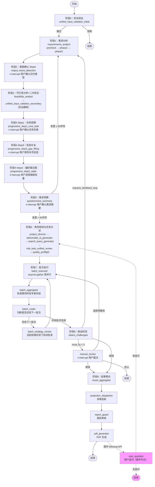

# LangGraph 主图 9 阶段流程文档（含图外 followup）

> 版本：基于代码事实核查 · 2026-02-28
> 核查文件：`main_workflow.py` / `output_intent_detection.py` / `progressive_questionnaire.py` / `questionnaire_summary.py`

---

## 完整流程概览

```
START
  ↓
[阶段 0] 安全验证
  ↓ 通过
[阶段 1] 需求分析
  ↓
[阶段 2] 意图确认 ← interrupt，用户交互
  ↓
[阶段 3] 可行性分析 + 二次验证（后台静默）
  ↓
[阶段 4] 三步递进式问卷
    Step1 任务梳理 ← interrupt
    Step3 信息补全 ← interrupt
    Step2 偏好雷达图 ← interrupt
  ↓
[阶段 5] 需求洞察 ← interrupt，用户确认
  ↓ 确认/微调          ↑ 重大修改（≥50字符）→ 回到阶段1
[阶段 6] 角色规划与任务分派
  ↓
[阶段 7] 动态批次执行（asyncio.gather 真并行，循环）
  ↓
[阶段 8] 挑战检测
  ↓
[阶段 9] 结果聚合 → 多维投射 → 报告审核 → PDF 生成
  ↓
END

── 图外 ──
[followup] 用户追问 API（节点存在但在主图中不可达，由外部 API 路由触发）
```

---

## 阶段详解

### 阶段 0：安全验证

**节点**：`unified_input_validator_initial`
**代码位置**：`main_workflow.py:375-431`

职责：
- 内容安全检测（违禁词、敏感领域）
- 领域分类（是否属于支持的项目类型）
- 任务复杂度初步评估

路由：
- 通过 → `requirements_analyst`
- 拒绝 → `input_rejected` → END

---

### 阶段 1：需求分析

**节点**：`requirements_analyst`（内部子图：precheck → phase1 → phase2）
**代码位置**：`main_workflow.py:500-654`，`requirements_analyst_agent.py:136-297`

职责：
- **Precheck**（第136-171行）：程序化能力边界预检测，7个维度快速判断
- **Phase1**（第174-297行）：
  - L0 项目定性（评估信息密度）
  - 交付物识别（文件类型、受众）
  - 问题类型诊断（8种类型矩阵）
  - 命题候选生成
  - 输出 `info_status: sufficient | insufficient`
- **Phase2**（第300行+）：深度需求结构化（当 Phase1 信息充足时触发）

输出：`structured_requirements`，`info_status`

路由：→ `output_intent_detection`

---

### 阶段 2：意图确认（Step 0）

**节点**：`output_intent_detection`
**代码位置**：`main_workflow.py:656-664`，`output_intent_detection.py:1143-1460`

职责：
- 四源交叉检测交付类型（文件给谁看）
- 身份模式检测（空间为谁设计）
- 范围信号推断（多大 / 多深 / 多长）
- 约束信号提取
- 必须覆盖维度推断
- v12.0：空间区域提取 + 约束信封组装
- v12.1：推荐约束列表构建

**用户交互**：`interrupt()` 等待用户确认交付类型和身份模式（`output_intent_detection.py:1352`）
幂等保护：同时满足 ①`active_projections` 已存在 **且** ②`intent_changed=False` 时跳过 interrupt，直接路由到 `feasibility_analyst`。若需求洞察阶段触发反馈循环（重大修改），`intent_changed` 会被置为 `True`，此时即使 `active_projections` 已有也会重新确认。

输出：
- `active_projections` — 已确认的交付类型列表
- `detected_identity_modes` — 身份模式列表
- `output_framework_signals` — 框架信号（范围 / 约束 / 维度）
- `visual_constraints` — 视觉约束（v12.0）
- `spatial_zones` — 空间区域列表（v12.0）
- `user_intent_constraints` — 用户确认的约束列表（v12.1）

路由：→ `feasibility_analyst`

---

### 阶段 3：可行性分析 + 二次验证

**节点**：`feasibility_analyst` → `unified_input_validator_secondary`
**代码位置**：`main_workflow.py:666-727`，`main_workflow.py:442-485`

职责（全程后台静默，无用户交互）：
- `feasibility_analyst`：评估项目可行性，检测需求冲突
- `unified_input_validator_secondary`：二次验证领域一致性，防止意图确认后出现领域漂移

路由：→ `progressive_step1_core_task`

---

### 阶段 4：三步递进式问卷

> 注意：节点编号（Step1/2/3）是历史命名，**实际执行顺序是 Step1 → Step3 → Step2**。
> 代码注释（`progressive_questionnaire.py:541`）："正确顺序：任务梳理 → 信息补全 → 偏好雷达图 → 需求洞察"

#### Step 1：任务梳理

**节点**：`progressive_step1_core_task`
**代码位置**：`main_workflow.py:743-746`，`progressive_questionnaire.py:60-543`

职责：
- LLM 将用户输入拆解为结构化任务列表
- v7.995 P2：混合生成策略（LLM + 规则并行，第150-186行）
- v15.0：为每个任务分配稳定 ID（`CT-{hash8}`，第192-204行）
- v8.001：构建任务分组元数据（按 category 聚合，第236-253行）
- v7.700 P0：注入模式特定引导问题（第273-278行）
- v13.1：构建意图确认复盘卡片（纯字段提取，零 LLM，第280-304行）
- 诗意解读子流程（第128-147行）
- 特殊场景检测（第493-514行）

**用户交互**：`interrupt()` 等待用户确认 / 调整任务列表（第310行）

输出：`extracted_core_tasks`，`confirmed_core_tasks`，`task_groups`

路由：→ `progressive_step3_gap_filling`（第543行）

---

#### Step 3：信息补全追问

**节点**：`progressive_step3_gap_filling`
**代码位置**：`main_workflow.py:753-756`，`progressive_questionnaire.py:777-1146`

职责：
- 分析已有信息的缺失维度（预算、工期、交付要求等）
- 根据 `active_projections` 生成意向驱动的针对性问题
- 动态调整选项范围（根据项目规模）
- 按优先级排序：概念探索 > 方案设计 > 执行落地

**用户交互**：`interrupt()` 等待用户填写补充信息

> **跳过条件**：若 `TaskCompletenessAnalyzer` 判断 `critical_gaps` 为空（信息完整），直接跳过 interrupt，路由到 `progressive_step2_radar`（代码第893-904行）。
> v8.3 兜底：`completeness_score < 0.7` 或缺失维度 > 2 时强制生成 critical_gaps，防止因分析误判导致信息补全被错误跳过。

输出：`gap_filling_answers`

路由：→ `progressive_step2_radar`（第1146行）

---

#### Step 2：偏好雷达图

**节点**：`progressive_step2_radar`
**代码位置**：`main_workflow.py:748-751`，`progressive_questionnaire.py:550-774`

职责：
- 基于任务类型和项目特征，动态生成多维度雷达图
- v9.0 四级降级策略（第621-646行）：
  1. 主路径：`ProjectSpecificDimensionGenerator`（全量上下文，典型 60s）
  2. 重试1：压缩上下文（典型 30s）
  3. 重试2：最简上下文（典型 20s）
  4. 降级：半动态兜底（关键词 + YAML 检索）
  5. 最终：传统规则引擎
- 质量门槛：最少 5 个维度、最少 3 种 category、质量得分 ≥ 0.55

**用户交互**：`interrupt()` 等待用户选择维度权重

输出：`selected_dimensions`，`radar_dimension_values`

路由：→ `questionnaire_summary`（第774行）

---

### 阶段 5：需求洞察

**节点**：`questionnaire_summary`
**代码位置**：`main_workflow.py:758-771`，`questionnaire_summary.py:47-310`

职责：
- 整合三步问卷的所有用户输入
- 调用需求重构引擎生成结构化需求文档（第142-157行）
- 与 AI 初步分析进行对比 / 融合（第88-135行）
- v7.151：合并需求确认功能，支持用户直接编辑
- v14.0：权重语义翻译（第204-212行）
- v13.0：应用任务校正 + 构建复盘对象（第198-227行）

**用户交互**：`interrupt()` 展示需求摘要供用户确认 / 编辑

输出：`questionnaire_summary`，更新 `structured_requirements`，`weight_interpretations`

路由：
- 确认 / 微调（变更 < 50 字符）→ `project_director`
- 重大修改（变更 ≥ 50 字符）→ `requirements_analyst`（反馈循环回阶段1）

---

### 阶段 6：角色规划与任务分派

**节点链**：`project_director` → `deliverable_id_generator` → `search_query_generator` → `role_task_unified_review` → `quality_preflight`
**代码位置**：`main_workflow.py:815-1073`

各节点职责：

**project_director**（第815-917行）：
- 选择分析框架（10种框架）
- 复杂度评估（4维度评分）
- 动态选择专家角色（V2-V9，共8个角色）
- 生成 `TaskInstruction`（每个专家的目标、交付物、成功标准）
- 计算依赖关系，生成 `execution_batches`

**deliverable_id_generator**（第919-960行）：
- 为每个交付物生成唯一 ID（v7.108）

**search_query_generator**（第962-973行）：
- 生成搜索查询和概念图配置（v7.109）

**role_task_unified_review**（第975-1002行）：
- 统一审核（红蓝对抗 + `TaskGenerationGuard`）

**quality_preflight**（第1016-1073行）：
- 质量预检（静默模式，不阻塞主流程）

输出：`active_agents`，`execution_batches`，`deliverable_metadata`

路由：→ `batch_executor`

---

### 阶段 7：动态批次执行

**节点循环**：`batch_executor` → `batch_aggregator` → `batch_router` → `batch_strategy_review` ↻
**代码位置**：`main_workflow.py:1704-2479`

**batch_executor**（第1704-1858行）：
- v7.502 P0：使用 `asyncio.gather` 实现真并行（替代原 LangGraph Send API 串行方案）
- 典型性能：Batch1 从 10s 降至 3.3s（约 67% 加速）
- 流程：获取当前批次角色列表 → 为每个专家创建异步任务 → `asyncio.gather` 并行执行 → 处理结果

**_execute_single_agent_with_timing**（第1860-1886行）：
- 执行单个专家并记录耗时
- 内部调用 `_execute_agent_node`（第1200-1702行）：
  - 解析角色 ID，获取角色配置
  - 注入质量约束
  - 分层动态本体论注入
  - 创建任务导向专家工厂
  - 执行专家分析
  - 质量验证与重试
  - 生成概念图
  - WebSocket 推送结果

**batch_aggregator**（第1891-2137行）：
- 轮询模式：快速检查是否所有 agent 已完成
- 未完成时返回空字典等待（下一轮轮询）
- 所有 agent 完成后开始详细聚合
- 工具使用率监控

**batch_router**（第2255-2353行）：
- 还有下一批次 → `batch_strategy_review`
- 所有批次完成 → `detect_challenges`

**batch_strategy_review**（第2355-2478行）：
- 支持三种执行模式：`manual`（每批次确认）/ `automatic`（全自动）/ `preview`（显示后自动执行）
- 代码中有 `interrupt()` 等待用户确认（第2442行）
- **当前前端实现下**：前端静默自动批准，用户不感知此 interrupt

---

### 阶段 8：挑战检测

**节点**：`detect_challenges` → `manual_review`（条件触发）
**代码位置**：`main_workflow.py:2143-2496`

**detect_challenges**（第2143-2210行）：
- v3.5 专家主动性协议检测
- 从所有专家输出中提取 `challenge_flags`

路由（第2212-2253行）：
- `must_fix` 数量 > 3 → `manual_review`
- 需要甲方裁决 → `analysis_review`（⚠️ 死代码风险，见下方说明）
- 需要回访需求分析师 → `requirements_analyst`
- 继续流程 → `result_aggregator`

**manual_review**（第2483-2496行）：
- 处理严重质量问题
- `interrupt()` 等待用户裁决：继续 / 终止 / 选择性整改

> ⚠️ **已知风险**：路由函数中仍保留返回 `"analysis_review"` 的分支，但该节点的 `add_node` 调用已在代码中注释掉（废弃于 v2.2）。若该分支被触发，LangGraph 将抛出节点未找到异常。此为待修复的死代码分支，正常流程不会触发。

---

### 阶段 9：结果聚合与输出

**节点链**：`result_aggregator` → `projection_dispatcher` → `report_guard` → `pdf_generator`
**代码位置**：`main_workflow.py:2498-2647`

**result_aggregator**（第2498-2552行）：
- 聚合所有专家结果
- v15.0：DWP 完成度追踪（第2523-2536行）
- 输出：`final_report`，`dwp_completion_map`

**projection_dispatcher**（第2554-2602行）：
- v10.0：根据 `active_projections` 生成多维投射
- 计算五轴坐标 → 确定激活投射 → 并行生成多视角输出
- 输出：`meta_axis_scores`，`active_projections`，`perspective_outputs`

**report_guard**（第487-498行）：
- 内容安全与领域过滤
- 出错时放行（避免误拦）

**pdf_generator**（第2618-2647行）：
- 生成最终 PDF 报告
- 输出：`pdf_path`
- 路由：`_route_after_pdf_generator` 硬编码返回 `END`（第2682-2688行）

---

## 图外：用户追问 followup

**节点**：`user_question`（v7.626）
**代码位置**：`main_workflow.py:2649-2725`

> 该节点在 LangGraph 主图中**不可达**：`pdf_generator` 之后的路由函数硬编码返回 `END`，主图执行到此即终止。
> `user_question` 节点由**外部 API 路由**单独触发，不属于主图执行链。

职责：
- 支持用户在分析完成后继续追问
- v7.626：五阶段反馈推送（SSE）

路由（外部 API 调用时）：
- 有追问 → `project_director`（重新进入阶段6）
- 无追问 → END

---

## 关键设计说明

### 三步问卷的实际执行顺序

节点命名（Step1/2/3）是历史遗留，**实际执行顺序是 Step1 → Step3 → Step2**：

| 执行顺序 | 节点名 | 职责 | 路由目标 | 代码行 |
|---------|--------|------|---------|--------|
| 第1步 | `progressive_step1_core_task` | 任务梳理 | → step3 | 第543行 |
| 第2步 | `progressive_step3_gap_filling` | 信息补全 | → step2 | 第1146行 |
| 第3步 | `progressive_step2_radar` | 偏好雷达图 | → summary | 第774行 |

设计原因：先梳理任务，再补全信息，最后根据完整信息生成雷达图（雷达图依赖前两步的输出）。

### 质量控制三层架构

| 层级 | 节点 | 机制 |
|------|------|------|
| 第一层 | `unified_input_validator_initial/secondary` | 内容安全 + 领域分类 |
| 第二层 | `role_task_unified_review` | TaskGenerationGuard + 红蓝对抗 |
| 第三层 | `detect_challenges` | 专家主动性协议（v3.5） |

### 用户交互节点汇总

| 阶段 | 节点 | interrupt 内容 |
|------|------|---------------|
| 阶段2 | `output_intent_detection` | 确认交付类型和身份模式 |
| 阶段4-Step1 | `progressive_step1_core_task` | 确认 / 调整任务列表 |
| 阶段4-Step3 | `progressive_step3_gap_filling` | 填写补充信息 |
| 阶段4-Step2 | `progressive_step2_radar` | 选择维度权重 |
| 阶段5 | `questionnaire_summary` | 确认 / 编辑需求摘要 |
| 阶段7 | `batch_strategy_review` | 当前前端实现下自动批准 |
| 阶段8 | `manual_review` | 裁决严重质量问题（条件触发） |

---

## 版本演进索引

| 版本 | 变更内容 |
|------|---------|
| v7.17 | Phase1/Phase2 架构拆分 |
| v7.80 | 三步递进式问卷 |
| v7.108 | 交付物 ID 生成器 |
| v7.109 | 搜索查询生成器 |
| v7.135 | 问卷汇总节点（需求洞察） |
| v7.151 | 需求洞察升级，合并需求确认功能 |
| v7.280 | 质量控制前置化 |
| v7.502 P0 | 真并行批次执行（asyncio.gather） |
| v7.626 | 渐进式交互服务（SSE 推送） |
| v7.700 P0 | 模式特定引导问题注入 |
| v7.995 P2 | 混合任务生成策略（LLM + 规则） |
| v9.0 | 雷达维度编排四级降级策略 |
| v10.0 | 输出意图检测节点 + 多维投射系统 |
| v11.0 | 意图确认独立为 Step 0 |
| v12.0 | 空间区域提取 + 约束信封组装 |
| v12.1 | 推荐约束列表构建 |
| v13.0 | 任务校正 + 复盘对象 |
| v13.1 | 意图确认复盘卡片 |
| v14.0 | 权重语义翻译 |
| v15.0 | 稳定任务 ID 生成 + DWP 完成度追踪 |

---

## Mermaid 流程图



---

*文档基于直接读取源代码生成，所有行号均可在对应文件中验证。*
