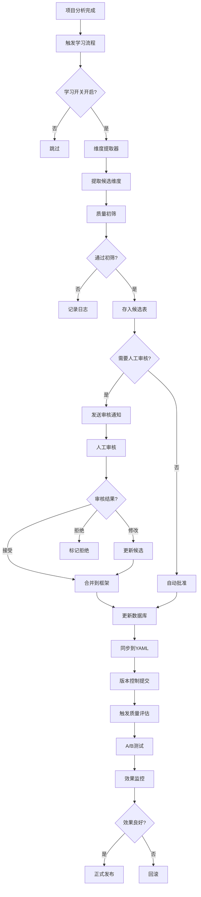

# 本体论智能扩展系统设计方案

**日期**: 2026-02-10
**版本**: v3.0 (智能化升级)
**状态**: 🚧 架构设计中

---

## 📋 当前状况分析

### 现有本体论框架盘点

**文件规模**: 476行
**覆盖项目类型**: 7种
- meta_framework (通用元框架)
- personal_residential (个人住宅)
- commercial_enterprise (商业企业)
- hybrid_residential_commercial (混合项目)
- healthcare_wellness (医疗养老)
- office_coworking (办公空间)
- hospitality_tourism (酒店文旅)
- sports_entertainment_arts (体育娱乐艺术)

**专家强化层**: 9个专家角色

### 识别的局限性

❌ **硬编码问题**:
- 所有维度手工编写，无法自动扩展
- 新的项目类型需要人工添加
- 维度质量依赖人工审核

❌ **覆盖面不足**:
- 缺少工业/制造类项目
- 缺少教育/科研类项目
- 缺少交通/基础设施类项目
- 缺少农业/生态类项目

❌ **深度不够**:
- 每个维度只有简单的 name、description、ask_yourself、examples
- 缺少维度之间的关联关系
- 缺少量化指标和评分体系

❌ **无迭代能力**:
- 无法从专家输出中学习新维度
- 无法自动优化维度描述
- 无法根据项目反馈调整权重

---

## 🎯 智能化升级目标

### 核心能力

1. **自主学习** - 从每次项目分析中提取知识
2. **动态扩展** - 自动识别新的分析维度
3. **质量优化** - 持续改进维度描述和示例
4. **关联挖掘** - 发现维度之间的依赖关系
5. **适应性进化** - 根据项目类型自动调整框架

---

## 🏗️ 智能化架构设计

### 三层智能系统

```
┌─────────────────────────────────────────────────────────────┐
│  Layer 1: 本体论知识库 (Ontology Knowledge Base)              │
│  ━━━━━━━━━━━━━━━━━━━━━━━━━━━━━━━━━━━━━━━━━━━━━━━━━━━━━━━━━ │
│  • 静态框架 (Static Frameworks) - YAML配置                    │
│  • 动态维度池 (Dynamic Dimension Pool) - 数据库存储            │
│  • 维度关系图 (Dimension Graph) - 图数据库                    │
│  • 历史版本 (Version History) - Git追踪                       │
└─────────────────────────────────────────────────────────────┘
               ↓  学习与优化
┌─────────────────────────────────────────────────────────────┐
│  Layer 2: 智能学习引擎 (Intelligent Learning Engine)          │
│  ━━━━━━━━━━━━━━━━━━━━━━━━━━━━━━━━━━━━━━━━━━━━━━━━━━━━━━━━━ │
│  • 维度提取器 (Dimension Extractor)                           │
│    - 从专家输出中识别新维度                                    │
│    - NLP分析关键问题和观察点                                   │
│                                                              │
│  • 质量评估器 (Quality Assessor)                              │
│    - 评估维度的有效性和覆盖面                                  │
│    - 分析维度使用频率                                          │
│                                                              │
│  • 关系挖掘器 (Relation Miner)                                │
│    - 发现维度之间的因果关系                                    │
│    - 构建维度依赖图                                           │
│                                                              │
│  • 优化建模器 (Optimization Modeler)                          │
│    - 生成改进维度描述的建议                                    │
│    - 推荐新的示例和问题                                        │
└─────────────────────────────────────────────────────────────┘
               ↓  应用与验证
┌─────────────────────────────────────────────────────────────┐
│  Layer 3: 自动扩展引擎 (Auto-Extension Engine)                │
│  ━━━━━━━━━━━━━━━━━━━━━━━━━━━━━━━━━━━━━━━━━━━━━━━━━━━━━━━━━ │
│  • 候选维度生成器 (Candidate Generator)                       │
│    - 基于项目特征生成候选维度                                  │
│    - LLM驱动的维度创作                                        │
│                                                              │
│  • 人工审核工作流 (Human Review Workflow)                     │
│    - 专家审核候选维度                                          │
│    - 批量接受/拒绝/修改                                        │
│                                                              │
│  • 自动合并器 (Auto-Merger)                                   │
│    - 将审核通过的维度合并到框架                                │
│    - 自动更新YAML和数据库                                     │
│                                                              │
│  • A/B测试引擎 (A/B Testing Engine)                          │
│    - 对比新旧维度的效果                                        │
│    - 量化评估改进效果                                          │
└─────────────────────────────────────────────────────────────┘
```

---

## 🔧 技术实施方案

### 数据存储架构

#### 1. 扩展的数据模型

```python
# 数据库表结构 (SQLite/PostgreSQL)

# 维度定义表
CREATE TABLE dimensions (
    id INTEGER PRIMARY KEY,
    name TEXT NOT NULL,
    category TEXT NOT NULL,  -- spiritual_world, business_positioning等
    project_type TEXT NOT NULL,  -- personal_residential, commercial_enterprise等
    description TEXT,
    ask_yourself TEXT,
    examples TEXT,

    # 元数据
    version INTEGER DEFAULT 1,
    status TEXT DEFAULT 'active',  -- active, deprecated, testing
    created_at TIMESTAMP,
    updated_at TIMESTAMP,
    created_by TEXT,  -- human, ai_generated, ai_optimized

    # 质量指标
    usage_count INTEGER DEFAULT 0,
    effectiveness_score FLOAT DEFAULT 0.0,
    expert_rating FLOAT,

    # 扩展字段
    metadata JSON,  -- 存储额外信息
    source TEXT  -- 来源：manual, learned_from_session_xxx, optimized_by_ai
);

# 维度关系表
CREATE TABLE dimension_relations (
    id INTEGER PRIMARY KEY,
    source_dimension_id INTEGER,
    target_dimension_id INTEGER,
    relation_type TEXT,  -- depends_on, conflicts_with, enhances, prerequisite
    strength FLOAT,  -- 0.0-1.0
    evidence_count INTEGER,
    created_at TIMESTAMP
);

# 项目类型定义表
CREATE TABLE project_types (
    id INTEGER PRIMARY KEY,
    name TEXT UNIQUE NOT NULL,
    display_name TEXT,
    description TEXT,
    parent_type TEXT,  -- 支持类型继承
    is_active BOOLEAN DEFAULT TRUE,
    created_at TIMESTAMP,
    metadata JSON
);

# 学习会话表
CREATE TABLE learning_sessions (
    id INTEGER PRIMARY KEY,
    session_id TEXT UNIQUE,
    project_type TEXT,
    expert_roles TEXT,  -- JSON array
    extracted_dimensions JSON,  -- 提取的新维度
    quality_metrics JSON,
    timestamp TIMESTAMP
);

# 维度候选表
CREATE TABLE dimension_candidates (
    id INTEGER PRIMARY KEY,
    dimension_data JSON,
    confidence_score FLOAT,
    source_session_id TEXT,
    review_status TEXT DEFAULT 'pending',  -- pending, approved, rejected, modified
    reviewer_id TEXT,
    review_feedback TEXT,
    created_at TIMESTAMP,
    reviewed_at TIMESTAMP
);
```

#### 2. 混合存储策略

```yaml
# 配置文件: config/ontology_config.yaml

storage:
  mode: "hybrid"  # static_only, hybrid, dynamic_only

  static_source:
    path: "knowledge_base/ontology.yaml"
    priority: 1  # 静态配置优先级最高

  dynamic_source:
    database: "sqlite:///ontology_learning.db"
    cache_ttl: 3600  # 缓存1小时

  sync_strategy:
    auto_sync: true
    sync_interval: 86400  # 每天同步一次
    conflict_resolution: "static_wins"  # 冲突时静态配置获胜

learning:
  enabled: true
  auto_extract: true
  min_confidence: 0.7  # 最低置信度阈值
  require_human_review: true  # 需要人工审核

  extraction:
    methods:
      - "expert_output_analysis"  # 分析专家输出
      - "user_feedback_mining"  # 挖掘用户反馈
      - "cross_project_patterns"  # 跨项目模式识别

  optimization:
    frequency: "weekly"
    batch_size: 50
    llm_model: "gpt-4o"  # 用于生成优化建议

extension:
  auto_generation: false  # 默认关闭自动生成
  review_workflow:
    enabled: true
    reviewers: ["admin@example.com"]
    approval_threshold: 2  # 需要2人批准

  quality_gates:
    min_expert_rating: 4.0  # 最低专家评分
    min_usage_count: 10  # 最低使用次数
    min_effectiveness: 0.6  # 最低有效性
```

---

## 🤖 智能学习实现

### 维度提取器实现

```python
# intelligent_project_analyzer/learning/dimension_extractor.py

from typing import List, Dict, Any, Optional
from loguru import logger
import re
from dataclasses import dataclass
import openai

@dataclass
class ExtractedDimension:
    """提取的维度候选"""
    name: str
    category: str
    description: str
    ask_yourself: str
    examples: str
    confidence: float
    source_context: str
    project_type: str

class DimensionExtractor:
    """
    从专家输出中自动提取分析维度

    核心能力：
    1. NLP分析识别关键问题
    2. 模式匹配提取结构化信息
    3. LLM驱动的语义理解
    """

    def __init__(self, llm_model: str = "gpt-4o"):
        self.llm_model = llm_model
        self.patterns = self._compile_patterns()

    def _compile_patterns(self) -> Dict[str, re.Pattern]:
        """编译正则表达式模式"""
        return {
            # 识别"核心问题"模式
            "core_question": re.compile(
                r"(?:关键问题|核心问题|need to consider|should ask)[:：]\s*(.+?)(?:\n|$)",
                re.IGNORECASE
            ),
            # 识别"分析维度"模式
            "dimension_marker": re.compile(
                r"(?:从|分析|考虑|评估)(.{2,20}?)(?:角度|维度|层面|方面)",
            ),
            # 识别建议或示例
            "examples": re.compile(
                r"(?:例如|such as|including)[:：]\s*(.+?)(?:\n|$)",
                re.IGNORECASE
            ),
        }

    async def extract_from_expert_output(
        self,
        expert_output: str,
        project_type: str,
        expert_role: str,
        session_id: str
    ) -> List[ExtractedDimension]:
        """
        从专家输出中提取维度

        策略：
        1. 规则匹配：快速识别明显的维度标记
        2. LLM理解：深度语义分析
        3. 结构化提取：组织成维度候选
        """
        logger.info(f"🔍 开始从 {expert_role} 的输出中提取维度 (项目类型: {project_type})")

        # 第1步：规则匹配
        pattern_matches = self._apply_pattern_matching(expert_output)

        # 第2步：LLM深度分析
        llm_candidates = await self._llm_extract_dimensions(
            expert_output=expert_output,
            project_type=project_type,
            expert_role=expert_role,
            pattern_hints=pattern_matches
        )

        # 第3步：去重和质量过滤
        candidates = self._deduplicate_and_filter(llm_candidates)

        # 第4步：打分和排序
        scored_candidates = self._score_candidates(candidates, expert_output)

        logger.info(f"✅ 提取到 {len(scored_candidates)} 个候选维度")
        return scored_candidates

    def _apply_pattern_matching(self, text: str) -> Dict[str, List[str]]:
        """应用正则表达式模式"""
        matches = {}
        for pattern_name, pattern in self.patterns.items():
            found = pattern.findall(text)
            if found:
                matches[pattern_name] = found
        return matches

    async def _llm_extract_dimensions(
        self,
        expert_output: str,
        project_type: str,
        expert_role: str,
        pattern_hints: Dict[str, List[str]]
    ) -> List[Dict[str, Any]]:
        """使用LLM进行深度语义提取"""

        prompt = f"""
你是一个本体论专家，负责从建筑设计专家的分析报告中提取可复用的分析维度。

**项目类型**: {project_type}
**专家角色**: {expert_role}

**专家输出**:
{expert_output[:3000]}  # 限制长度避免超token

**任务**:
1. 识别专家在分析中关注的核心问题和视角
2. 提取可以泛化到其他类似项目的分析维度
3. 每个维度需要包含：
   - name: 维度名称（中英文）
   - category: 所属分类（如 spiritual_world, business_positioning等）
   - description: 详细解释（50-100字）
   - ask_yourself: 引导性问题（"如何..."、"是否..."格式）
   - examples: 具体示例（逗号分隔）
   - confidence: 你对这个维度的信心（0.0-1.0）

**输出格式** (JSON数组):
```json
[
  {{
    "name": "维度名称 (Dimension Name)",
    "category": "分类名",
    "description": "维度描述...",
    "ask_yourself": "引导性问题？",
    "examples": "示例1, 示例2, 示例3",
    "confidence": 0.85
  }}
]
```

**注意**:
- 只提取真正有价值且可泛化的维度
- 避免过于具体或一次性的观察
- 确保维度名称简洁专业
- confidence低于0.7的不要包含
"""

        try:
            response = await openai.ChatCompletion.acreate(
                model=self.llm_model,
                messages=[
                    {"role": "system", "content": "你是本体论知识工程专家。"},
                    {"role": "user", "content": prompt}
                ],
                temperature=0.3,  # 较低温度确保稳定输出
                max_tokens=2000
            )

            content = response.choices[0].message.content
            # 提取JSON
            import json
            json_match = re.search(r'```json\s*(\[.*?\])\s*```', content, re.DOTALL)
            if json_match:
                candidates = json.loads(json_match.group(1))
                return candidates
            else:
                logger.warning("⚠️ LLM输出未包含有效JSON")
                return []

        except Exception as e:
            logger.error(f"❌ LLM提取失败: {e}")
            return []

    def _deduplicate_and_filter(
        self,
        candidates: List[Dict[str, Any]]
    ) -> List[ExtractedDimension]:
        """去重和质量过滤"""
        seen_names = set()
        filtered = []

        for cand in candidates:
            name = cand.get("name", "").lower()

            # 去重
            if name in seen_names:
                continue
            seen_names.add(name)

            # 质量过滤
            if cand.get("confidence", 0) < 0.7:
                continue

            # 构造对象
            try:
                dimension = ExtractedDimension(
                    name=cand["name"],
                    category=cand.get("category", "unknown"),
                    description=cand["description"],
                    ask_yourself=cand["ask_yourself"],
                    examples=cand["examples"],
                    confidence=cand["confidence"],
                    source_context="",  # 待补充
                    project_type=""  # 待补充
                )
                filtered.append(dimension)
            except KeyError as e:
                logger.warning(f"⚠️ 候选维度缺少必要字段: {e}")
                continue

        return filtered

    def _score_candidates(
        self,
        candidates: List[ExtractedDimension],
        expert_output: str
    ) -> List[ExtractedDimension]:
        """对候选维度打分"""
        # TODO: 实现更复杂的打分逻辑
        # - 检查维度是否在输出中被多次提及
        # - 评估描述的专业性和清晰度
        # - 验证示例的多样性

        return sorted(candidates, key=lambda x: x.confidence, reverse=True)
```

### 质量评估器实现

```python
# intelligent_project_analyzer/learning/quality_assessor.py

from typing import Dict, List, Any
from dataclasses import dataclass
import numpy as np

@dataclass
class QualityMetrics:
    """维度质量指标"""
    effectiveness_score: float  # 有效性得分 (0-1)
    coverage_score: float  # 覆盖面得分 (0-1)
    clarity_score: float  # 清晰度得分 (0-1)
    usage_frequency: float  # 使用频率
    expert_rating_avg: float  # 专家平均评分 (1-5)
    recommendation: str  # keep, optimize, deprecate

class QualityAssessor:
    """
    评估维度的质量和有效性

    评估维度：
    1. 有效性 - 维度是否帮助专家产生高质量输出
    2. 覆盖面 - 维度是否被广泛使用
    3. 清晰度 - 维度描述是否易懂
    4. 专家反馈 - 人工评分
    """

    def __init__(self, db_connection):
        self.db = db_connection

    async def assess_dimension(
        self,
        dimension_id: int
    ) -> QualityMetrics:
        """评估单个维度"""

        # 1. 获取使用数据
        usage_data = await self._get_usage_stats(dimension_id)

        # 2. 计算有效性（基于使用该维度的专家输出质量）
        effectiveness = await self._calculate_effectiveness(dimension_id)

        # 3. 评估覆盖面
        coverage = self._calculate_coverage(usage_data)

        # 4. 评估清晰度（基于描述长度、问题明确性等）
        clarity = await self._calculate_clarity(dimension_id)

        # 5. 获取专家评分
        expert_rating = await self._get_expert_rating(dimension_id)

        # 6. 综合判断
        recommendation = self._make_recommendation(
            effectiveness, coverage, clarity, expert_rating
        )

        return QualityMetrics(
            effectiveness_score=effectiveness,
            coverage_score=coverage,
            clarity_score=clarity,
            usage_frequency=usage_data.get("frequency", 0),
            expert_rating_avg=expert_rating,
            recommendation=recommendation
        )

    async def batch_assess(
        self,
        project_type: str = None
    ) -> Dict[int, QualityMetrics]:
        """批量评估所有维度"""
        query = "SELECT id FROM dimensions WHERE status = 'active'"
        if project_type:
            query += f" AND project_type = '{project_type}'"

        dimension_ids = await self.db.fetch_all(query)

        results = {}
        for row in dimension_ids:
            dim_id = row['id']
            metrics = await self.assess_dimension(dim_id)
            results[dim_id] = metrics

        return results

    def _make_recommendation(
        self,
        effectiveness: float,
        coverage: float,
        clarity: float,
        expert_rating: float
    ) -> str:
        """综合判断维度的处理建议"""

        # 归一化专家评分到 0-1
        normalized_rating = expert_rating / 5.0 if expert_rating > 0 else 0.5

        # 加权计算综合得分
        composite_score = (
            effectiveness * 0.4 +
            coverage * 0.2 +
            clarity * 0.2 +
            normalized_rating * 0.2
        )

        if composite_score >= 0.7:
            return "keep"  # 保留
        elif composite_score >= 0.5:
            return "optimize"  # 优化
        else:
            return "deprecate"  # 废弃

    async def _get_usage_stats(self, dimension_id: int) -> Dict[str, Any]:
        """获取使用统计"""
        # 从数据库查询
        # TODO: 实现实际查询逻辑
        return {"frequency": 0, "last_used": None}

    async def _calculate_effectiveness(self, dimension_id: int) -> float:
        """计算有效性"""
        # TODO: 实现
        # - 查询使用该维度的会话
        # - 评估这些会话的输出质量
        # - 计算相关性
        return 0.0

    def _calculate_coverage(self, usage_data: Dict) -> float:
        """计算覆盖面"""
        # TODO: 实现
        return 0.0

    async def _calculate_clarity(self, dimension_id: int) -> float:
        """计算清晰度"""
        # TODO: 实现
        # - 描述长度合理性
        # - 问题是否明确
        # - 示例是否充分
        return 0.0

    async def _get_expert_rating(self, dimension_id: int) -> float:
        """获取专家评分"""
        query = f"""
        SELECT AVG(expert_rating) as avg_rating
        FROM dimensions
        WHERE id = {dimension_id}
        """
        result = await self.db.fetch_one(query)
        return result['avg_rating'] if result and result['avg_rating'] else 0.0
```

---

## 🔄 持续迭代流程

### 自动化工作流



### 每周优化任务

```python
# intelligent_project_analyzer/learning/weekly_optimizer.py

import schedule
import asyncio
from datetime import datetime, timedelta

class WeeklyOptimizer:
    """每周优化任务调度器"""

    def __init__(self):
        self.assessor = QualityAssessor(db_connection)
        self.optimizer = DimensionOptimizer()

    async def run_weekly_optimization(self):
        """执行每周优化任务"""
        logger.info("🚀 开始每周本体论优化任务")

        # 1. 质量评估
        logger.info("📊 步骤1: 质量评估")
        metrics = await self.assessor.batch_assess()

        # 2. 识别需要优化的维度
        logger.info("🔍 步骤2: 识别优化目标")
        to_optimize = [
            dim_id for dim_id, metric in metrics.items()
            if metric.recommendation == "optimize"
        ]

        # 3. 生成优化建议
        logger.info(f"💡 步骤3: 生成 {len(to_optimize)} 个维度的优化建议")
        suggestions = await self.optimizer.generate_suggestions(to_optimize)

        # 4. 发送审核通知
        logger.info("📧 步骤4: 发送审核通知")
        await self._send_review_notification(suggestions)

        # 5. 清理过期候选
        logger.info("🧹 步骤5: 清理过期候选")
        await self._cleanup_old_candidates()

        logger.info("✅ 每周优化任务完成")

    def schedule_tasks(self):
        """调度定时任务"""
        # 每周日凌晨2点执行
        schedule.every().sunday.at("02:00").do(
            lambda: asyncio.run(self.run_weekly_optimization())
        )

        logger.info("⏰ 已设置每周优化任务调度")
```

---

## 📊 实施路线图

### Phase 1: 基础设施 (1-2周)

- [x] 设计数据库schema
- [ ] 实现数据库迁移脚本
- [ ] 创建混合存储加载器
- [ ] 建立版本控制流程

### Phase 2: 学习引擎 (2-3周)

- [ ] 实现DimensionExtractor
- [ ] 实现QualityAssessor
- [ ] 集成LLM调用
- [ ] 创建候选管理系统

### Phase 3: 审核工作流 (1-2周)

- [ ] 构建审核Web界面
- [ ] 实现邮件通知
- [ ] 批量操作API
- [ ] 审核日志系统

### Phase 4: 自动优化 (2-3周)

- [ ] A/B测试框架
- [ ] 效果监控仪表板
- [ ] 自动回滚机制
- [ ] 定时优化任务

### Phase 5: 内容扩充 (持续)

- [ ] 扩充工业/制造类框架
- [ ] 扩充教育/科研类框架
- [ ] 扩充交通/基础设施框架
- [ ] 扩充农业/生态类框架

---

## ⚠️ 风险与挑战

### 技术风险

❗ **LLM幻觉问题**
- 风险：LLM可能生成不准确的维度
- 缓解：人工审核 + 置信度阈值 + A/B测试

❗ **性能开销**
- 风险：学习流程可能影响主流程性能
- 缓解：异步处理 + 批量操作 + 可选开关

❗ **数据一致性**
- 风险：YAML和数据库可能不同步
- 缓解：单向同步 + 定期对账 + 冲突检测

### 业务风险

❗ **质量下降**
- 风险：自动生成的维度质量不稳定
- 缓解：严格审核 + 质量门禁 + 回滚机制

❗ **维度爆炸**
- 风险：维度数量失控
- 缓解：定期清理 + 合并相似维度 + 优先级排序

---

## 📝 下一步行动

1. **立即执行** (今天):
   - [ ] 审核并批准此设计方案
   - [ ] 创建数据库schema
   - [ ] 初始化学习模块目录结构

2. **本周完成**:
   - [ ] 实现DimensionExtractor基础版本
   - [ ] 完成数据库迁移
   - [ ] 测试混合存储加载

3. **下周开始**:
   - [ ] 开发审核Web界面
   - [ ] 集成到主工作流
   - [ ] 开始首次学习实验

---

**结论**: 通过三层智能系统（知识库 + 学习引擎 + 扩展引擎），我们可以将本体论框架从静态硬编码进化为自主学习、持续优化的动态系统，真正实现"越用越智能"的效果。🚀
