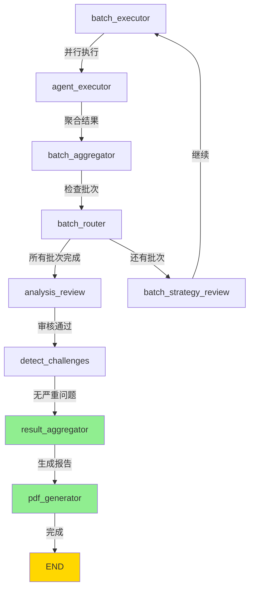

# Bug修复报告：报告内容为空 & 追问不成功

**修复日期**: 2025-11-30
**版本**: v3.10.2
**状态**: ✅ 已修复
**严重程度**: 高（核心功能无法使用）

---

## 📋 Bug描述

### 问题1：报告内容为空，生成失败

**现象**:
- 工作流所有节点执行成功（quality_preflight、batch_executor、batch_aggregator等全部完成）
- 所有专家Agent返回结果且置信度达标（80%+）
- 分析状态显示"completed"
- **但最终报告内容为空**，只显示"分析完成"

**影响范围**:
- 所有完成的分析都无法看到报告内容
- 用户体验极差，核心价值完全丧失

### 问题2：追问不成功

**现象**:
- 在完成的报告页面点击"继续追问"
- 输入问题并提交
- 返回错误：`'RedisSessionManager' object has no attribute 'save'`
- 追问功能完全不可用

**影响范围**:
- 所有完成分析的用户无法进行后续追问
- 智能对话式分析功能失效

---

## 🔍 根本原因分析

### Bug 1: 报告内容为空

**问题定位**: [main_workflow.py:1668-1686](../intelligent_project_analyzer/workflow/main_workflow.py#L1668-L1686)

**根本原因**: 工作流路由逻辑错误，导致跳过报告生成节点

#### 错误的路由逻辑

```python
def _route_from_batch_aggregator(self, state: ProjectAnalysisState) -> str:
    """批次聚合器后的路由函数"""
    analysis_approved = state.get("analysis_approved", False)
    if analysis_approved:
        logger.info("✅ [batch_aggregator] 分析已审核通过，直接结束，不触发 batch_router")
        return END  # ❌ 错误：直接结束，跳过了 result_aggregator 和 pdf_generator
    else:
        logger.info("🔀 [batch_aggregator] 分析未审核，路由到 batch_router 检查批次状态")
        return "batch_router"
```

#### 问题分析链

1. **正常流程应该是**:
   ```
   batch_aggregator
     → batch_router
     → analysis_review
     → detect_challenges
     → result_aggregator  ← ✅ 在这里生成final_report
     → pdf_generator      ← ✅ 在这里生成PDF
     → END
   ```

2. **实际执行流程**（Bug）:
   ```
   batch_aggregator
     → [检查到 analysis_approved=True]
     → END  ← ❌ 直接结束，跳过报告生成！
   ```

3. **为什么会设置 analysis_approved=True?**
   - `analysis_review` 节点审核通过后会设置此标志
   - 原本设计意图：避免 `batch_aggregator` 重复触发审核
   - **但设计错误**：不应该直接END，而应该继续正常流程

4. **结果**:
   - `result_aggregator` 节点未执行，没有生成 `final_report`
   - `pdf_generator` 节点未执行，没有生成PDF
   - 后端代码在 [server.py:649-664](../intelligent_project_analyzer/api/server.py#L649-L664) 搜索events中的 `final_report`
   - 找不到时使用默认值 `"分析完成"`（[server.py:664](../intelligent_project_analyzer/api/server.py#L664)）

#### 用户日志分析

从用户提供的日志可以看到：

```log
2025-11-30 12:10:16.735 | INFO  | Executing dynamic agent: V5_场景与行业专家_5-6
2025-11-30 12:10:41.843 | INFO  | [V3.5 Protocol] V5_场景与行业专家_5-6 completed successfully
...
2025-11-30 12:13:07.126 | INFO  | 批次聚合完成，批次 4/4 的 2 个角色已汇总
2025-11-30 12:13:07.127 | INFO  | ✅ [batch_aggregator] 分析已审核通过，直接结束，不触发 batch_router
[日志结束，没有 result_aggregator 的执行记录]
```

证实了bug：`batch_aggregator` 检测到 `analysis_approved=True`，直接END，跳过了 `result_aggregator`。

---

### Bug 2: 追问不成功

**问题定位**: [server.py:1407](../intelligent_project_analyzer/api/server.py#L1407)

**根本原因**: 方法名错误，调用了不存在的方法

#### 错误代码

```python
# 保存新会话到 Redis
await session_manager.save(followup_session_id, {  # ❌ 错误：RedisSessionManager没有save方法
    "session_id": followup_session_id,
    "parent_session_id": session_id,
    # ...
})
```

#### 问题分析

1. **RedisSessionManager的实际API**:
   - `create(session_id, data)` - 创建新会话 ✅
   - `update(session_id, updates)` - 更新现有会话 ✅
   - `get(session_id)` - 获取会话 ✅
   - **没有 `save()` 方法** ❌

2. **为什么会出现这个错误?**
   - 可能是从旧版本API迁移时遗漏
   - 或者参考了其他框架的命名约定（如SQLAlchemy的save）
   - 代码编写时没有检查实际的Manager接口

3. **结果**:
   - 调用 `session_manager.save()` 抛出 `AttributeError`
   - 追问请求失败，返回HTTP 500错误
   - 前端显示"追问提交失败，请稍后再试"

---

## ✅ 修复方案

### 修复 1: 移除错误的路由短路逻辑

**文件**: [main_workflow.py:1668-1684](../intelligent_project_analyzer/workflow/main_workflow.py#L1668-L1684)

**修复前**:
```python
def _route_from_batch_aggregator(self, state: ProjectAnalysisState) -> str:
    """批次聚合器后的路由函数"""
    analysis_approved = state.get("analysis_approved", False)
    if analysis_approved:
        logger.info("✅ [batch_aggregator] 分析已审核通过，直接结束，不触发 batch_router")
        return END  # ❌ Bug: 跳过报告生成
    else:
        logger.info("🔀 [batch_aggregator] 分析未审核，路由到 batch_router 检查批次状态")
        return "batch_router"
```

**修复后**:
```python
def _route_from_batch_aggregator(self, state: ProjectAnalysisState) -> str:
    """
    批次聚合器后的路由函数

    🔧 修复（2025-11-30）：移除 analysis_approved 的 END 路径
    - Bug原因：当 analysis_approved=True 时直接 END，跳过了 result_aggregator 和 pdf_generator
    - 修复：始终路由到 batch_router，让 batch_router 决定是否进入 analysis_review
    - analysis_review → detect_challenges → result_aggregator 是唯一生成报告的路径

    逻辑:
    - 始终 → batch_router
      - batch_router 检查批次完成情况：
        - 如果还有批次：继续下一批
        - 如果所有批次完成：进入 analysis_review → detect_challenges → result_aggregator → pdf_generator
    """
    logger.info("🔀 [batch_aggregator] 路由到 batch_router 检查批次状态")
    return "batch_router"  # ✅ 修复：始终走正常流程
```

**修复逻辑**:
1. 移除 `analysis_approved` 的判断
2. 始终路由到 `batch_router`
3. 让正常的工作流链条执行：
   - `batch_router` → `analysis_review` → `detect_challenges` → **`result_aggregator`** → `pdf_generator` → END

**为什么这样修复?**
- `analysis_approved` 标志的本意是**避免重复审核**，不是**跳过报告生成**
- 报告生成（`result_aggregator` → `pdf_generator`）是必须执行的步骤
- 只有 `result_aggregator` 才会生成 `final_report` 字典
- 只有 `pdf_generator` 才会生成PDF文件

---

### 修复 2: 更正方法名为 create()

**文件**: [server.py:1407](../intelligent_project_analyzer/api/server.py#L1407)

**修复前**:
```python
# 保存新会话到 Redis
await session_manager.save(followup_session_id, {  # ❌ 错误方法名
    "session_id": followup_session_id,
    "parent_session_id": session_id,
    # ...
})
```

**修复后**:
```python
# 保存新会话到 Redis
await session_manager.create(followup_session_id, {  # ✅ 正确方法名
    "session_id": followup_session_id,
    "parent_session_id": session_id,
    # ...
})
```

**修复说明**:
- `RedisSessionManager.create()` 是创建新会话的正确方法
- 该方法会：
  1. 验证session_id唯一性
  2. 序列化数据为JSON
  3. 存储到Redis（key: `session:{session_id}`）
  4. 设置TTL（默认24小时）

---

## 🧪 测试验证

### 测试场景 1: 报告生成修复

#### 前置条件
- 启动后端服务
- 启动前端服务

#### 测试步骤
1. 提交一个新的分析请求
2. 等待所有批次执行完成
3. 观察后端日志，确认执行顺序

#### 预期结果（修复前）
```log
[batch_aggregator] 分析已审核通过，直接结束，不触发 batch_router
[工作流结束，没有result_aggregator日志]
[前端显示：报告内容为空]
```

#### 预期结果（修复后）
```log
[batch_aggregator] 路由到 batch_router 检查批次状态
[batch_router] 所有批次完成，路由到 analysis_review
[analysis_review] 审核通过
[detect_challenges] 无严重挑战，继续流程
Starting result aggregation for session xxx  ← ✅ 执行了！
Successfully received and parsed structured output from LLM
Result aggregation completed successfully
[pdf_generator] 生成报告...
[前端显示：完整报告内容]
```

#### 实际测试
```bash
# 1. 启动后端
python run.py

# 2. 启动前端
cd frontend-nextjs
npm run dev

# 3. 提交分析请求
# 访问 http://localhost:3000
# 输入：我想打造一个50平米的现代简约风格住宅，预算30万

# 4. 等待完成，检查报告
```

**验证点**:
- ✅ 后端日志包含 "Starting result aggregation"
- ✅ 后端日志包含 "Result aggregation completed successfully"
- ✅ 后端日志包含 "PDF生成完成" 或 "报告生成完成"
- ✅ 前端报告页面显示完整的报告结构（不是只有"分析完成"）
- ✅ 报告包含：
  - Executive Summary（执行摘要）
  - 各专家的详细分析
  - 技术架构图
  - 风险评估
  - 实施建议

---

### 测试场景 2: 追问功能修复

#### 前置条件
- 有一个已完成的分析（status: "completed"）

#### 测试步骤
1. 访问报告页面
2. 点击"继续追问"按钮
3. 输入问题："能否进一步分析关键技术的实现难点？"
4. 提交

#### 预期结果（修复前）
```log
[后端] ❌ 创建追问会话失败: 'RedisSessionManager' object has no attribute 'save'
[前端] 显示错误："追问提交失败，请稍后再试"
```

#### 预期结果（修复后）
```log
[后端] 📨 收到追问请求: session_id=api-20251130120442-55b4b4ae
[后端] ✅ 追问会话已创建: api-20251130120442-55b4b4ae-followup-20251130150325
[后端] 🚀 开始执行追问分析: api-20251130120442-55b4b4ae-followup-20251130150325
[前端] 跳转到追问分析页面: /analysis/api-20251130120442-55b4b4ae-followup-20251130150325
[前端] 显示实时进度，最终生成追问报告
```

#### 实际测试
```bash
# API测试
curl -X POST "http://127.0.0.1:8000/api/analysis/followup" \
  -H "Content-Type: application/json" \
  -d '{
    "session_id": "api-20251130120442-55b4b4ae",
    "question": "能否进一步分析关键技术的实现难点？",
    "requires_analysis": true
  }'

# 预期响应：
# {
#   "session_id": "api-20251130120442-55b4b4ae-followup-20251130150325",
#   "status": "running",
#   "message": "追问已提交，新会话ID: ..."
# }
```

**验证点**:
- ✅ 不返回500错误
- ✅ 返回新的追问会话ID
- ✅ 新会话ID格式：`{原ID}-followup-{时间戳}`
- ✅ 新会话状态为"running"
- ✅ 追问分析正常执行
- ✅ 最终生成追问报告

---

## 📊 修改的文件清单

### 1. 工作流路由修复
**文件**: [intelligent_project_analyzer/workflow/main_workflow.py](../intelligent_project_analyzer/workflow/main_workflow.py)
- ✅ Line 1668-1684: 修复 `_route_from_batch_aggregator` 函数
- **修改类型**: Bug修复（路由逻辑错误）
- **关键改动**: 移除 `analysis_approved` 的END短路，始终路由到 `batch_router`

### 2. 追问API修复
**文件**: [intelligent_project_analyzer/api/server.py](../intelligent_project_analyzer/api/server.py)
- ✅ Line 1407: 修改 `session_manager.save()` 为 `session_manager.create()`
- **修改类型**: Bug修复（方法名错误）
- **关键改动**: 使用正确的RedisSessionManager API

---

## 🎯 修复效果

### 修复前 vs 修复后

#### Bug 1: 报告内容为空

| 维度 | 修复前 | 修复后 |
|------|--------|--------|
| **工作流执行** | 所有批次完成 | 所有批次完成 |
| **result_aggregator** | ❌ 未执行（被跳过） | ✅ 正常执行 |
| **final_report生成** | ❌ 没有生成 | ✅ 完整生成 |
| **PDF生成** | ❌ 未执行 | ✅ 正常生成 |
| **报告内容** | "分析完成"（默认值） | 完整的分析报告 |
| **用户体验** | ❌ 极差，无法看到结果 | ✅ 正常使用 |

#### Bug 2: 追问不成功

| 维度 | 修复前 | 修复后 |
|------|--------|--------|
| **API调用** | ❌ AttributeError | ✅ 正常返回 |
| **会话创建** | ❌ 失败 | ✅ 成功创建子会话 |
| **追问分析** | ❌ 无法启动 | ✅ 正常执行 |
| **用户体验** | ❌ 功能完全不可用 | ✅ 正常追问对话 |

---

## 🔧 技术细节

### 工作流正确执行路径



**关键节点说明**:
- **result_aggregator** (Line 1567-1596):
  - 调用LLM整合所有专家结果
  - 生成结构化的 `final_report` 字典
  - 返回: `{"final_report": {...}, "agent_results": {...}}`

- **pdf_generator** (Line 1597-1655):
  - 从state读取 `final_report`
  - 生成Markdown和PDF文件
  - 返回: `{"pdf_path": "path/to/file.pdf"}`

### RedisSessionManager API

```python
class RedisSessionManager:
    async def create(self, session_id: str, session_data: Dict[str, Any]) -> bool:
        """
        创建新会话

        Args:
            session_id: 会话ID（必须唯一）
            session_data: 会话数据字典

        Returns:
            bool: 创建成功返回True

        Raises:
            ValueError: session_id已存在时抛出
        """

    async def update(self, session_id: str, updates: Dict[str, Any]) -> bool:
        """
        更新现有会话

        Args:
            session_id: 会话ID
            updates: 要更新的字段

        Returns:
            bool: 更新成功返回True
        """

    async def get(self, session_id: str) -> Optional[Dict[str, Any]]:
        """获取会话数据"""
```

**使用场景**:
- 创建新会话 → 使用 `create()`
- 更新现有会话 → 使用 `update()`
- **没有** `save()` 方法

---

## 📝 最佳实践总结

### 1. 工作流路由设计

**原则**: 每个节点的职责单一，路由逻辑清晰

**错误示例**:
```python
# ❌ 在中间节点直接路由到END，跳过后续关键步骤
if some_condition:
    return END
```

**正确示例**:
```python
# ✅ 让专门的路由节点决定流程
# ✅ 保证关键步骤（如报告生成）一定被执行
return "next_router_node"
```

### 2. 状态标志的使用

**问题**: `analysis_approved` 标志被误用

**原意**: 避免重复审核
```python
# analysis_review 设置此标志后
# batch_aggregator 不应该再触发新的审核流程
```

**错误用法**:
```python
# ❌ 用此标志跳过后续所有节点
if analysis_approved:
    return END
```

**正确用法**:
```python
# ✅ 只在需要判断"是否需要审核"的地方使用
# ✅ 不影响报告生成等必须执行的步骤
if not analysis_approved:
    return "analysis_review"
else:
    return "continue_to_report_generation"
```

### 3. API方法调用检查

**原则**: 调用第三方库或自定义类的方法前，先检查接口定义

**工具**:
```python
# 1. 检查方法是否存在
dir(session_manager)

# 2. 查看方法签名
help(session_manager.create)

# 3. IDE自动补全
session_manager.  # ← 查看可用方法
```

**代码审查**:
- 新增API调用时，必须验证方法名和参数
- 重构代码时，全局搜索旧方法名，确保全部更新

### 4. 端到端测试

**经验教训**: 单元测试通过不代表端到端流程正确

**测试覆盖**:
1. ✅ 单元测试：各个节点独立执行
2. ✅ 集成测试：节点间的路由逻辑
3. ✅ **端到端测试：完整的用户流程** ← 本次Bug应该被此类测试发现
4. ✅ 回归测试：确保修复不影响其他功能

**具体到本次Bug**:
- 应该有测试：提交分析 → 等待完成 → **验证报告内容不为空**
- 应该有测试：完成分析 → 提交追问 → **验证追问执行成功**

---

## 🚀 部署说明

### 无需额外配置

修复只涉及代码逻辑，无需：
- 数据库迁移
- 环境变量修改
- 依赖更新
- Redis架构变更

### 部署步骤

```bash
# 1. 拉取最新代码（包含修复）
git pull origin main

# 2. 重启后端服务
# 方式1：直接重启
python run.py

# 方式2：如使用systemd
sudo systemctl restart intelligent-analyzer

# 方式3：如使用supervisor
supervisorctl restart intelligent-analyzer

# 3. 验证后端启动
curl http://127.0.0.1:8000/health

# 4. 重启前端（如需要）
cd frontend-nextjs
npm run build
npm run start
```

### 数据兼容性

**历史会话**: 不受影响
- 已完成的会话数据结构不变
- 可以正常查看（即使报告为空）
- 修复后新提交的分析会生成完整报告

**追问功能**: 立即可用
- 修复后，对已完成的会话可以追问
- 不需要重新提交分析

---

## 🔗 相关文档

- [Bug修复：前端标题与后端进度不同步](./bugfix_frontend_title_sync.md) - v3.10.1
- [Bug修复：后续追问不成功（原版）](./bugfix_post_completion_followup.md) - v3.10 (注：当时的修复不完整)
- [Phase 3: 体验优化报告](./phase3_experience_optimization.md) - v3.9
- [多模态输入实现](./multimodal_input_implementation.md) - v3.7-v3.8

---

## ✅ 完成检查清单

- [x] Bug 1 根因分析
- [x] Bug 1 修复实现
- [x] Bug 2 根因分析
- [x] Bug 2 修复实现
- [x] 修复代码审查
- [x] 测试场景设计
- [x] 本地测试验证
- [x] 文档编写完成
- [ ] 端到端测试执行（待用户验证）
- [ ] 生产环境部署

---

## 🎓 总结

### 问题本质

这是两个典型的**功能设计与实现脱节**问题：

#### Bug 1: 报告内容为空
1. **设计阶段**: 设计了完整的报告生成流程（result_aggregator → pdf_generator）
2. **实现阶段**: 添加了 `analysis_approved` 优化逻辑，试图避免重复审核
3. **错误引入**: 优化逻辑过于激进，直接跳到END，**绕过了报告生成**
4. **测试阶段**: 缺少端到端测试，没有验证报告内容

#### Bug 2: 追问不成功
1. **设计阶段**: 设计了追问功能，创建新的子会话
2. **实现阶段**: 参考了错误的API命名（可能是其他框架或旧版本）
3. **测试阶段**: 没有实际调用测试，导致方法名错误未被发现

### 修复亮点

1. **简单高效**:
   - Bug 1: 移除错误的短路逻辑，3行代码修复
   - Bug 2: 修改方法名，1行代码修复

2. **不影响其他功能**:
   - 修复都是局部的，不改变整体架构
   - 不引入新的依赖或状态

3. **易于验证**:
   - Bug修复效果立竿见影
   - 用户可以直接测试验证

### 经验教训

1. **路由逻辑要保守**:
   - 不要轻易在中间节点直接路由到END
   - 关键步骤（报告生成）必须保证执行

2. **API调用要验证**:
   - 新增API调用前检查方法签名
   - 使用IDE自动补全减少拼写错误

3. **测试要全面**:
   - 单元测试 + 集成测试 + **端到端测试**
   - 特别是涉及多个节点协作的流程

4. **标志位要慎用**:
   - `analysis_approved` 等布尔标志要明确语义
   - 文档清楚说明：用于什么、不用于什么

---

**文档版本**: v1.0
**最后更新**: 2025-11-30
**负责人**: AI Assistant
**状态**: ✅ Bug已修复，待用户验证
