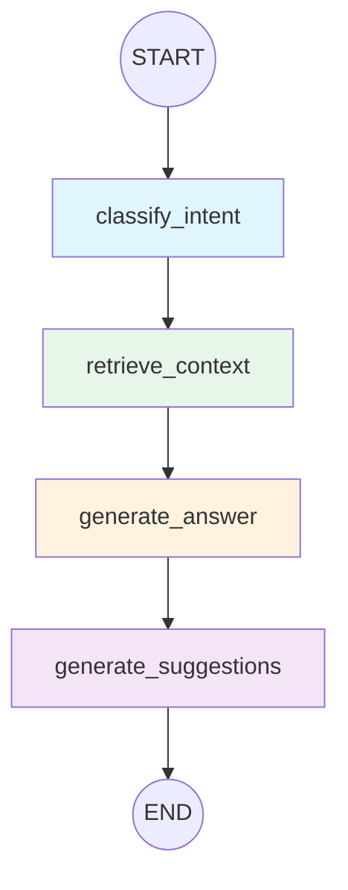
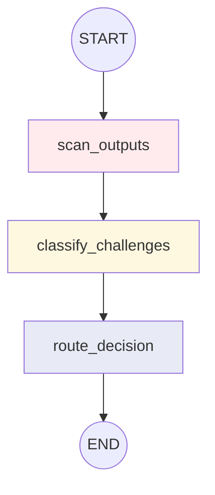
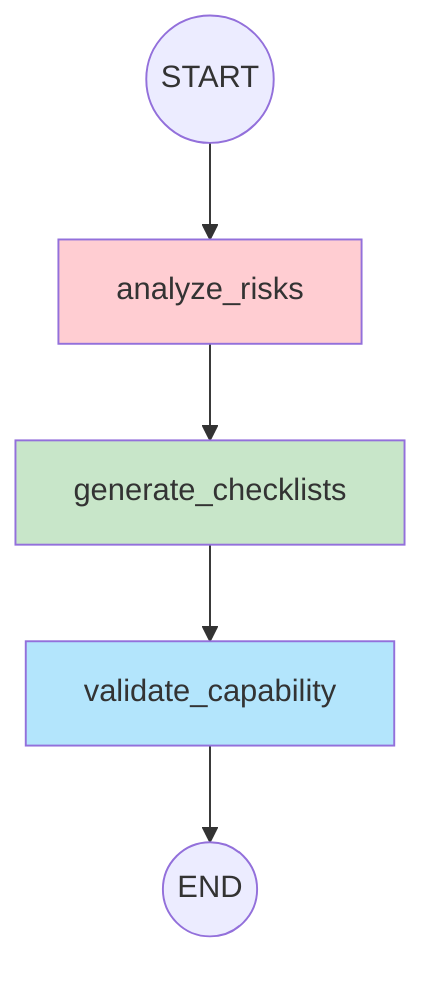
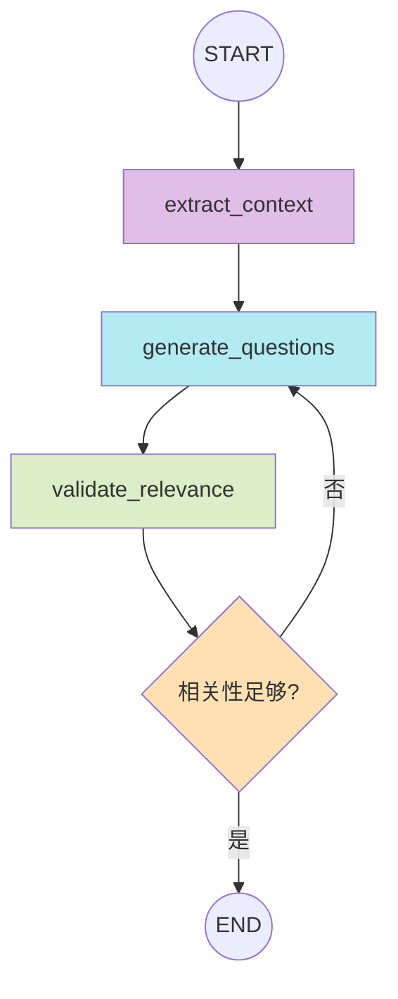
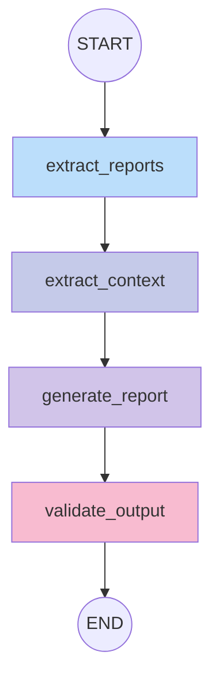
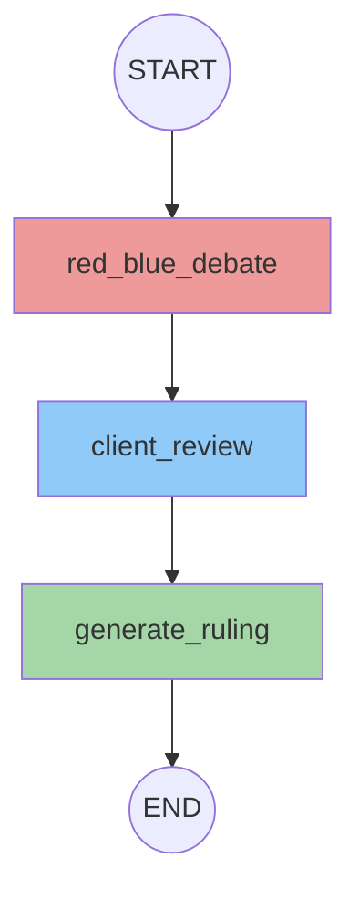
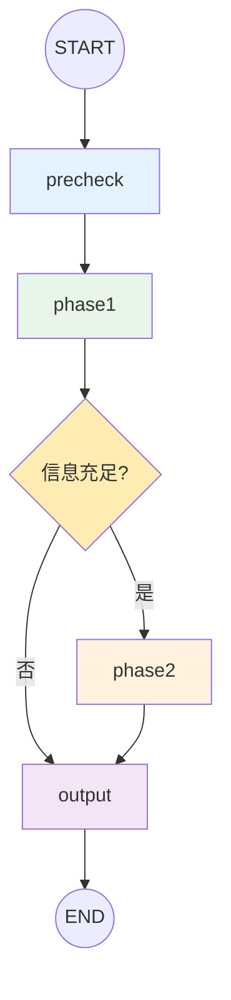
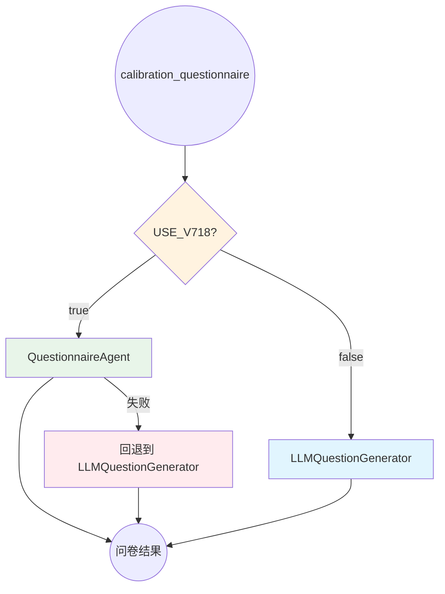
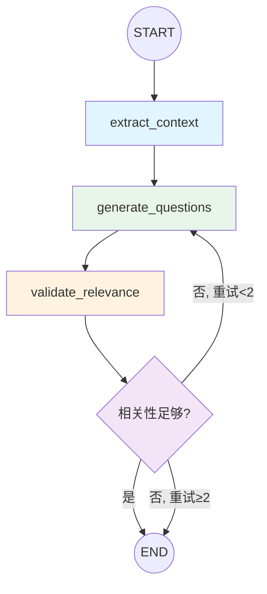

# v7.16-v7.18 LangGraph Agent 状态图文档

> 📅 创建日期: 2025-12-16
> 🔖 版本: v7.18
> 📝 说明: 本文档描述了 v7.16-v7.18 升级中创建的 7 个 LangGraph StateGraph Agent 的状态图结构

---

## 目录

1. [FollowupAgent (追问对话)](#1-followupagent-追问对话)
2. [ChallengeDetectionAgent (挑战检测)](#2-challengedetectionagent-挑战检测)
3. [QualityPreflightAgent (质量预检)](#3-qualitypreflightagent-质量预检)
4. [QuestionnaireAgent (问卷生成)](#4-questionnaireagent-问卷生成)
5. [ResultAggregatorAgentV2 (结果聚合)](#5-resultaggregatoragentv2-结果聚合)
6. [AnalysisReviewAgent (分析审核)](#6-analysisreviewagent-分析审核)
7. [RequirementsAnalystAgentV2 (需求分析师) - v7.17](#7-requirementsanalystagentv2-需求分析师---v717-)
8. [QuestionnaireAgent 工作流集成 - v7.18 🆕](#8-questionnaireagent-工作流集成---v718-)

---

## 更新日志

| 版本 | 日期 | 内容 |
|------|------|------|
| v7.18 | 2025-12-17 | QuestionnaireAgent 集成到主工作流，添加共享函数 |
| v7.17 | 2025-12-17 | 新增 RequirementsAnalystAgentV2 (需求分析师) |
| v7.16.1 | 2025-12-16 | 添加性能监控系统和共享工具函数 |
| v7.16 | 2025-12-16 | 初始版本，6 个核心 Agent |

---

## 1. FollowupAgent (追问对话)

**文件**: `intelligent_project_analyzer/agents/followup_agent.py`

**用途**: 处理用户对报告的追问对话，支持多种意图模式

### 状态图



### 节点说明

| 节点 | 功能 | 输入 | 输出 |
|------|------|------|------|
| `classify_intent` | 意图分类 | question, history | intent (closed/open/creative/general) |
| `retrieve_context` | 上下文检索 | report_context, intent | relevant_sections |
| `generate_answer` | 生成回答 | question, context, intent | answer, references |
| `generate_suggestions` | 后续建议 | question, answer, intent | suggestions |

### 状态定义

```python
class FollowupAgentState(TypedDict):
    # 输入
    question: str                    # 用户问题
    report_context: str              # 报告上下文
    conversation_history: list       # 对话历史
    
    # 中间状态
    intent: str                      # 意图分类结果
    relevant_sections: list          # 相关章节
    intent_prompt: str               # 意图专属提示词
    
    # 输出
    answer: str                      # 生成的回答
    references: list                 # 引用来源
    suggestions: list                # 后续建议
    processing_log: list             # 处理日志
```

---

## 2. ChallengeDetectionAgent (挑战检测)

**文件**: `intelligent_project_analyzer/agents/challenge_detection_agent.py`

**用途**: 检测专家输出中的挑战标记，分类并决定路由策略

### 状态图



### 节点说明

| 节点 | 功能 | 输入 | 输出 |
|------|------|------|------|
| `scan_outputs` | 扫描专家输出 | agent_results | raw_challenges |
| `classify_challenges` | 挑战分类 | raw_challenges | high/medium/low_priority_challenges |
| `route_decision` | 路由决策 | classified_challenges | need_manual/client_decision/feedback_loop |

### 状态定义

```python
class ChallengeDetectionState(TypedDict):
    # 输入
    agent_results: Dict[str, Any]    # 专家分析结果
    
    # 中间状态
    raw_challenges: list             # 原始挑战列表
    challenge_sources: Dict          # 挑战来源
    
    # 输出
    high_priority_challenges: list   # 高优先级挑战
    medium_priority_challenges: list # 中优先级挑战
    low_priority_challenges: list    # 低优先级挑战
    need_manual_intervention: bool   # 是否需要人工介入
    need_client_decision: bool       # 是否需要客户决策
    feedback_loop_needed: bool       # 是否需要反馈循环
    processing_log: list             # 处理日志
```

---

## 3. QualityPreflightAgent (质量预检)

**文件**: `intelligent_project_analyzer/agents/quality_preflight_agent.py`

**用途**: 在专家执行任务前进行风险分析和质量检查

### 状态图



### 节点说明

| 节点 | 功能 | 输入 | 输出 |
|------|------|------|------|
| `analyze_risks` | 风险分析 | selected_roles, requirements | risk_warnings |
| `generate_checklists` | 生成检查清单 | selected_roles | quality_checklists |
| `validate_capability` | 能力验证 | roles, requirements | capability_scores |

### 状态定义

```python
class QualityPreflightState(TypedDict):
    # 输入
    selected_roles: list                    # 已选角色
    structured_requirements: Dict           # 结构化需求
    
    # 中间状态
    risk_analysis: Dict                     # 风险分析结果
    
    # 输出
    preflight_completed: bool               # 预检是否完成
    preflight_report: Dict                  # 预检报告
    quality_checklists: Dict[str, list]     # 质量检查清单
    high_risk_warnings: list                # 高风险警告
    processing_log: list                    # 处理日志
```

---

## 4. QuestionnaireAgent (问卷生成)

**文件**: `intelligent_project_analyzer/agents/questionnaire_agent.py`

**用途**: 智能生成与用户需求相关的问卷问题

### 状态图



### 节点说明

| 节点 | 功能 | 输入 | 输出 |
|------|------|------|------|
| `extract_context` | 上下文提取 | user_input, structured_data | analysis_summary, user_keywords |
| `generate_questions` | 问题生成 | context, llm_model | questions, raw_llm_response |
| `validate_relevance` | 相关性验证 | questions, user_keywords | relevance_score, low_relevance_questions |

### 条件边说明

| 条件函数 | 条件 | 目标节点 |
|----------|------|----------|
| `should_regenerate` | relevance_score < 0.5 且 regeneration_count < max | `generate_questions` |
| `should_regenerate` | relevance_score >= 0.5 或达到最大重试 | `END` |

### 状态定义

```python
class QuestionnaireState(TypedDict):
    # 输入
    user_input: str                        # 用户输入
    structured_data: Dict                  # 结构化数据
    
    # 配置
    _llm_model: Any                        # LLM 模型
    _max_regenerations: int                # 最大重生成次数
    _regeneration_count: int               # 当前重生成次数
    
    # 中间状态
    analysis_summary: str                  # 分析摘要
    user_keywords: list                    # 用户关键词
    raw_llm_response: str                  # 原始 LLM 响应
    
    # 输出
    questions: list                        # 生成的问题
    relevance_score: float                 # 相关性分数
    low_relevance_questions: list          # 低相关问题
    generation_source: str                 # 生成来源
    processing_log: list                   # 处理日志
```

---

## 5. ResultAggregatorAgentV2 (结果聚合)

**文件**: `intelligent_project_analyzer/agents/result_aggregator_agent.py`

**用途**: 聚合所有专家的分析结果，生成最终报告

### 状态图



### 节点说明

| 节点 | 功能 | 输入 | 输出 |
|------|------|------|------|
| `extract_reports` | 提取专家报告 | agent_results, selected_roles | expert_reports |
| `extract_context` | 提取上下文 | state | context_data (questionnaire, requirements) |
| `generate_report` | 生成报告 | expert_reports, context_data, llm | final_report |
| `validate_output` | 验证输出 | final_report | validation_result, is_valid |

### 状态定义

```python
class ResultAggregatorState(TypedDict):
    # 输入
    agent_results: Dict[str, Any]          # 专家结果
    selected_roles: list                   # 已选角色
    structured_requirements: Dict          # 结构化需求
    user_input: str                        # 用户输入
    questionnaire_data: Dict               # 问卷数据
    review_history: list                   # 审核历史
    
    # 配置
    _llm_model: Any                        # LLM 模型
    _config: Dict                          # 配置
    
    # 中间状态
    expert_reports: Dict[str, str]         # 专家报告
    context_data: Dict                     # 上下文数据
    llm_response: Dict                     # LLM 响应
    
    # 输出
    final_report: Dict                     # 最终报告
    validation_result: Dict                # 验证结果
    is_valid: bool                         # 是否有效
    processing_log: list                   # 处理日志
```

---

## 6. AnalysisReviewAgent (分析审核)

**文件**: `intelligent_project_analyzer/agents/analysis_review_agent.py`

**用途**: 执行红蓝对抗审核、甲方审核，生成最终裁定

### 状态图



### 节点说明

| 节点 | 功能 | 输入 | 输出 |
|------|------|------|------|
| `red_blue_debate` | 红蓝对抗 | agent_results, requirements | red_review, blue_review, debate_summary |
| `client_review` | 甲方审核 | debate_summary, requirements | client_review, must_fix_items |
| `generate_ruling` | 生成裁定 | all_reviews | final_ruling, improvement_suggestions |

### 状态定义

```python
class AnalysisReviewState(TypedDict):
    # 输入
    agent_results: Dict[str, Any]         # 专家分析结果
    requirements: Dict                    # 项目需求
    review_iteration_round: int           # 审核轮次
    _llm_model: Any                       # LLM 模型
    
    # 中间状态
    red_review: Dict                      # 红队审核
    blue_review: Dict                     # 蓝队审核
    red_blue_debate: Dict                 # 辩论汇总
    client_review: Dict                   # 甲方审核
    
    # 输出
    final_ruling: str                     # 最终裁定
    improvement_suggestions: list         # 改进建议
    must_fix_count: int                   # 必须修复数量
    analysis_approved: bool               # 是否批准
    agents_to_improve: list               # 需改进的专家
    processing_log: list                  # 处理日志
```

---

## 性能监控

所有 Agent 均集成了 `PerformanceMonitor` 进行性能监控：

```python
from ..utils.shared_agent_utils import PerformanceMonitor

# 在 execute 方法开头
start_time = time.time()

# 在成功返回前
PerformanceMonitor.record("AgentName", time.time() - start_time, "v7.16")
```

### 性能统计 API

```python
# 获取单个 Agent 统计
PerformanceMonitor.get_stats("ChallengeDetectionAgent")

# 获取所有 Agent 对比
PerformanceMonitor.get_comparison()
# 返回: {"AgentName": {"count": N, "avg_ms": X, "min_ms": Y, "max_ms": Z, "version": "v7.16"}}
```

---

## 使用方式

### 启用 v7.16 Agent

设置环境变量：
```bash
export USE_V716_AGENTS=true
```

或在代码中：
```python
import os
os.environ["USE_V716_AGENTS"] = "true"
```

### 向后兼容

每个 Agent 都提供了向后兼容层，可无缝替换原版函数：

```python
# 原版
from intelligent_project_analyzer.agents.dynamic_project_director import detect_and_handle_challenges_node

# 新版（USE_V716_AGENTS=true 时自动切换）
from intelligent_project_analyzer.agents.challenge_detection_agent import detect_and_handle_challenges_v2
```

---

## 相关文档

- [开发规范](../.github/DEVELOPMENT_RULES.md) - 第 8.20-8.22 节
- [集成测试](../tests/test_v716_integration.py)
- [共享工具函数](../intelligent_project_analyzer/utils/shared_agent_utils.py)

---

## 7. RequirementsAnalystAgentV2 (需求分析师) - v7.17 🆕

**文件**: `intelligent_project_analyzer/agents/requirements_analyst_agent.py`

**用途**: 需求分析师的完整 StateGraph 重构，支持两阶段 LLM 分析和程序化能力边界检测

### 状态图



### 节点说明

| 节点 | 功能 | 耗时 | 输出 |
|------|------|------|------|
| `precheck` | 程序化能力边界检测 | ~1ms | info_sufficient, capability_match_rate |
| `phase1` | 快速定性 + 交付物识别 | ~10s | deliverables, info_status, next_step |
| `phase2` | 深度分析 + 专家接口构建 | ~20s | expert_handoff, constraints, character_narrative |
| `output` | 合并结果 + 置信度计算 | ~1ms | structured_data, analysis_mode |

### 条件路由

```python
def should_execute_phase2(state: RequirementsAnalystState) -> Literal["phase2", "output"]:
    """
    条件:
    - info_status == "sufficient" AND
    - recommended_next_step != "questionnaire_first"
    → 执行 Phase2
    """
```

### 状态定义

```python
class RequirementsAnalystState(TypedDict):
    # 输入
    user_input: str                      # 用户原始输入
    session_id: str                      # 会话ID
    
    # Precheck 结果
    precheck_result: Dict[str, Any]      # 能力边界检测结果
    info_sufficient: bool                 # 信息是否充足
    capability_match_rate: float          # 能力匹配率
    precheck_elapsed_ms: float           # 耗时
    
    # Phase1 结果
    phase1_result: Dict[str, Any]        # 快速定性结果
    phase1_elapsed_ms: float             # 耗时
    
    # Phase2 结果
    phase2_result: Dict[str, Any]        # 深度分析结果
    phase2_elapsed_ms: float             # 耗时
    
    # 输出
    structured_data: Dict[str, Any]      # 最终结构化数据
    confidence: float                     # 置信度
    analysis_mode: str                    # two_phase / fast_track / info_insufficient
    project_type: str                     # 项目类型
    total_elapsed_ms: float              # 总耗时
    node_path: List[str]                 # 执行路径记录
    processing_log: List[str]            # 处理日志
    
    # LLM 配置
    _llm_model: Any                      # LLM 模型实例
    _prompts: Dict[str, Any]             # 提示词配置
```

### 环境变量

```bash
# 启用 v7.17 需求分析师 StateGraph Agent
export USE_V717_REQUIREMENTS_ANALYST=true
```

### 测试结果

| 测试类型 | 结果 | 详情 |
|----------|------|------|
| 单元测试 | ✅ 6/6 | 图结构、节点、路由、状态 |
| 集成测试 | ✅ 通过 | Mock LLM 验证 |
| 端到端测试 | ✅ 通过 | 真实 LLM 29秒完成 |

### 相关文件

- `requirements_analyst_agent.py` - StateGraph Agent 实现 (~790行)
- `capability_detector.py` - 程序化能力检测 (~350行)
- `requirements_analyst_phase1.yaml` - Phase1 提示词
- `requirements_analyst_phase2.yaml` - Phase2 提示词
- `test_v717_stategraph_agent.py` - 单元测试
- `test_v717_workflow_integration.py` - 集成测试
- `test_v717_e2e_real_llm.py` - 端到端测试

---

## 8. QuestionnaireAgent 工作流集成 - v7.18 🆕

**文件**: `intelligent_project_analyzer/interaction/nodes/calibration_questionnaire.py`

**用途**: 将 QuestionnaireAgent (v7.16 创建) 集成到主工作流，支持环境变量控制切换

### 集成架构



### 执行流程

```
calibration_questionnaire.py
    ↓
[USE_V718_QUESTIONNAIRE_AGENT=true?]
    ↓ Yes                           ↓ No
QuestionnaireAgent.generate()    LLMQuestionGenerator.generate()
(StateGraph 4节点流程)            (原有 v7.5 逻辑)
    ↓                               ↓
    └──────────────┬────────────────┘
                   ↓
           问卷展示 (前端)
```

### QuestionnaireAgent 状态图 (回顾)



### 新增共享函数 (shared_agent_utils.py)

| 函数 | 用途 | 行数 |
|------|------|------|
| `build_questionnaire_analysis_summary()` | 构建 LLM 提示词上下文 | ~60 |
| `extract_user_keywords()` | 提取用户输入关键词 | ~40 |
| `check_questionnaire_relevance()` | 检查问题相关性 | ~50 |

### 环境变量

```bash
# 启用 v7.18 问卷生成 StateGraph Agent
export USE_V718_QUESTIONNAIRE_AGENT=true
```

### 性能监控

v7.18 为 `LLMQuestionGenerator` 添加了 `PerformanceMonitor` 记录：

```python
from ...utils.shared_agent_utils import PerformanceMonitor

# 在 generate() 方法中
start_time = time.time()
# ... 执行逻辑 ...
PerformanceMonitor.record("LLMQuestionGenerator", time.time() - start_time, "v7.18")
```

### 测试结果

| 测试类型 | 结果 | 详情 |
|----------|------|------|
| 集成测试 | ✅ 12/12 | 全部通过 |
| 环境变量控制 | ✅ 通过 | 正确切换 Agent/Legacy |
| 共享函数 | ✅ 通过 | 3 个函数验证通过 |
| 性能监控 | ✅ 通过 | 正确记录执行时间 |

### 相关文件

- `calibration_questionnaire.py` - Agent 分支入口
- `questionnaire_agent.py` - StateGraph Agent 实现
- `llm_generator.py` - 原有生成器 (添加性能监控)
- `shared_agent_utils.py` - 共享函数 (新增 3 个)
- `test_v718_questionnaire_integration.py` - 集成测试
