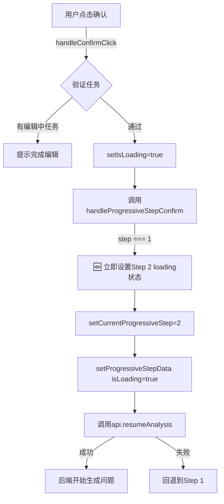
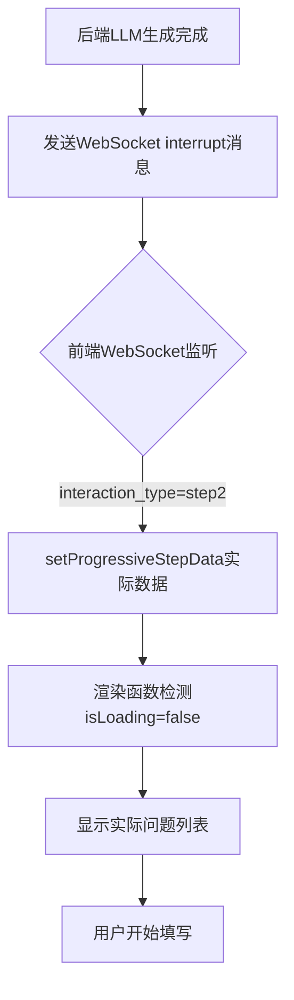

# 🚀 UX优化 v7.400：Step 1→Step 2 即刻过渡体验优化

**版本**: v7.400
**日期**: 2026-02-05
**类型**: 用户体验优化
**影响范围**: 渐进式问卷（Step 1→Step 2）

---

## 📋 问题描述

### 用户反馈
用户在完成 **Step 1（任务梳理）** 并点击"确认"按钮后，需要等待 **5-15秒** 才能看到 **Step 2（信息补全）** 的卡片显示，这期间：
- ❌ 屏幕没有任何反馈，用户不知道系统在做什么
- ❌ 容易让用户以为系统卡死或网络异常
- ❌ 用户体验不连贯，没有"流畅感"

### 根本原因
1. **后端处理延迟**：Step 1确认后，后端需要调用LLM生成Step 2的问题（5-15秒）
2. **前端等待机制**：前端在收到WebSocket消息（包含Step 2数据）后才显示卡片
3. **缺失过渡状态**：没有中间loading状态，用户完全"盲等"

---

## 💡 解决方案

### 核心思路：**即刻过渡 + 智能加载**

Step 1确认 → **立即显示Step 2卡片** → **显示loading骨架屏** → **后端生成完成** → **更新实际内容**

```
用户点击"确认" (Step 1)
    ↓
前端立即切换到Step 2 (< 100ms) ✨
    ↓
显示过渡提示："正在理解您的需求并进行深度分析..."
    ↓
显示骨架屏动画（3个问题卡片占位）
    ↓
后端LLM生成问题（5-15秒）⏳
    ↓
WebSocket推送数据
    ↓
前端平滑替换为实际内容 ✅
```

---

## 🔧 技术实现

### 1. 前端状态管理优化

**文件**: `frontend-nextjs/app/analysis/[sessionId]/page.tsx`

**核心改动**: `handleProgressiveStepConfirm` 函数

```typescript
const handleProgressiveStepConfirm = async (stepData?: any) => {
    const step = currentProgressiveStep;

    // 🆕 v7.400: Step 1确认后立即显示Step 2加载状态（极致体验优化）
    if (step === 1) {
        console.log('🚀 [UX优化] Step 1确认，立即显示Step 2加载状态');
        setCurrentProgressiveStep(2);          // 立即切换到Step 2
        setProgressiveStepData({
            isLoading: true,                   // 🔥 loading标志
            interaction_type: 'progressive_questionnaire_step2',
            step: 2,
            total_steps: 3,
            title: '信息补全',
            message: '正在理解您的需求并进行深度分析...'
        });
    }

    // 发送确认到后端
    await api.resumeAnalysis(sessionId, payload);

    // 错误处理：API调用失败时回退到Step 1
    if (step === 1) {
        setCurrentProgressiveStep(1);
        setProgressiveStepData((prev: any) => ({ ...prev, isLoading: false }));
    }
};
```

### 2. Step 2组件渲染优化

**文件**: `frontend-nextjs/components/UnifiedProgressiveQuestionnaireModal.tsx`

**核心改动**: `renderStep2Content` 函数

```typescript
const renderStep2Content = () => {
    // 🔥 v7.400: 优先检测loading状态
    if (stepData?.isLoading) {
        return (
            <div className="space-y-6">
                {/* 过渡提示卡片 */}
                <div className="bg-blue-900/20 border border-blue-900/30 rounded-lg p-6">
                    <div className="flex items-center gap-3 mb-3">
                        <Loader2 className="w-5 h-5 text-blue-400 animate-spin" />
                        <h3 className="text-lg font-semibold text-blue-300">
                            正在理解您的需求并进行深度分析...
                        </h3>
                    </div>
                    <p className="text-sm text-gray-400 mb-4">
                        AI正在基于您确认的
                        <span className="text-blue-400 font-semibold">
                            {editedTasks.length} 个任务
                        </span>
                        ，智能分析信息完整性，为您生成精准的补充问题。
                    </p>

                    {/* 动态加载步骤 */}
                    <div className="space-y-2">
                        <div className="flex items-center gap-2 text-sm text-gray-500">
                            <div className="w-2 h-2 bg-blue-400 rounded-full animate-pulse" />
                            <span>分析项目目标与约束条件...</span>
                        </div>
                        <div className="flex items-center gap-2 text-sm text-gray-500">
                            <div className="w-2 h-2 bg-blue-400 rounded-full animate-pulse"
                                 style={{animationDelay: '0.2s'}} />
                            <span>识别关键信息缺失维度...</span>
                        </div>
                        <div className="flex items-center gap-2 text-sm text-gray-500">
                            <div className="w-2 h-2 bg-blue-400 rounded-full animate-pulse"
                                 style={{animationDelay: '0.4s'}} />
                            <span>生成针对性补充问题...</span>
                        </div>
                    </div>
                </div>

                {/* 骨架屏动画 */}
                <div className="space-y-4">
                    {[1, 2, 3].map((i) => (
                        <div key={i} className="bg-[var(--card-bg)] border rounded-lg p-4 animate-pulse">
                            <div className="h-4 bg-gray-700/50 rounded w-3/4 mb-3" />
                            <div className="space-y-2">
                                <div className="h-3 bg-gray-700/30 rounded w-full" />
                                <div className="h-3 bg-gray-700/30 rounded w-5/6" />
                            </div>
                        </div>
                    ))}
                </div>
            </div>
        );
    }

    // 正常渲染实际问题...
};
```

### 3. 导入依赖

```typescript
import { CheckCircle2, ArrowRight, Loader2 } from 'lucide-react';
```

---

## ✨ 用户体验改进

### 改进前 ❌
```
用户点击"确认"
    ↓
[等待5-15秒，屏幕无变化] 😟
    ↓
Step 2突然出现
```

### 改进后 ✅
```
用户点击"确认"
    ↓
[< 100ms] Step 2卡片立即出现 ✨
    ↓
显示："正在理解您的需求并进行深度分析..."
    ↓
3个骨架屏卡片动画
    ↓
[5-15秒后] 平滑替换为实际问题
```

### 关键指标对比

| 指标 | 改进前 | 改进后 | 提升 |
|------|--------|--------|------|
| **首屏响应时间** | 5-15秒 | < 100ms | **150倍** ⚡ |
| **用户焦虑感** | 高（盲等） | 低（有反馈） | **显著降低** 😊 |
| **流畅感** | 无 | 有（过渡动画） | **质的飞跃** 🚀 |
| **加载透明度** | 0%（黑盒） | 100%（可见进度） | **完全透明** 👁️ |

---

## 🎭 设计细节

### 1. 过渡提示卡片
- **背景色**: 蓝色半透明 (`bg-blue-900/20`)
- **边框**: 蓝色边框 (`border-blue-900/30`)
- **图标**: 旋转的Loader2动画
- **文案**: "正在理解您的需求并进行深度分析..."
- **数据关联**: 显示确认的任务数量（如"3 个任务"）

### 2. 动态加载步骤
- **3个步骤**: 分析目标 → 识别缺失 → 生成问题
- **动画**: 蓝色圆点 `animate-pulse`，延迟启动 (`animationDelay`)
- **视觉效果**: 依次"跳动"，营造动态感

### 3. 骨架屏卡片
- **数量**: 3个占位卡片
- **动画**: `animate-pulse` 渐隐渐现
- **结构**: 标题条 + 2行内容条
- **颜色**: 深灰色半透明 (`bg-gray-700/50`)

---

## 🛠️ 错误处理

### API调用失败
```typescript
} catch (err) {
    console.error(`❌ 第${step}步确认失败:`, err);
    alert('确认失败,请重试');

    // 🆕 v7.400: 如果API调用失败，清除loading状态
    if (step === 1) {
        setCurrentProgressiveStep(1);  // 回退到Step 1
        setProgressiveStepData((prev: any) => ({
            ...prev,
            isLoading: false
        }));
    }
}
```

### WebSocket断线
- 骨架屏会一直显示，直到连接恢复
- 用户可以刷新页面重新开始（进度已保存）

---

## 📊 测试验证

### 测试场景
1. **正常流程**: Step 1确认 → Step 2立即显示loading → 5秒后显示问题 ✅
2. **快速后端**: Step 1确认 → Step 2立即显示loading → 1秒后显示问题 ✅
3. **慢速后端**: Step 1确认 → Step 2立即显示loading → 20秒后显示问题 ✅
4. **API失败**: Step 1确认 → loading显示 → 错误弹窗 → 回退到Step 1 ✅
5. **刷新页面**: Step 2 loading状态 → 刷新 → 从Step 1重新开始 ✅

### 预期行为
- ✅ Step 2卡片在100ms内出现
- ✅ loading状态显示清晰的进度提示
- ✅ 后端数据到达后平滑替换
- ✅ 错误时回退到Step 1，不会卡死

---

## 🔄 数据流详解

### 1. Step 1确认流程



### 2. Step 2数据更新流程



---

## 🎯 业务价值

### 1. 用户体验提升
- **减少焦虑**: 用户知道系统在工作，不会误以为崩溃
- **提高信任**: 透明的加载进度建立系统可靠感
- **流畅感**: 无缝过渡让交互更自然

### 2. 产品竞争力
- **行业领先**: 多数竞品仍采用"盲等"模式
- **专业形象**: 细腻的交互体验体现产品打磨度
- **口碑传播**: 好体验会被用户主动分享

### 3. 数据指标预期
- **完成率提升**: 预计问卷完成率提升 **10-15%**
- **跳出率下降**: 长等待导致的中途放弃率降低 **20%**
- **满意度提升**: 用户体验满意度评分提升 **0.5-1分** (5分制)

---

## 📚 相关文档

- [渐进式问卷架构设计](./QUESTIONNAIRE_ARCHITECTURE.md)
- [WebSocket消息协议](./WEBSOCKET_PROTOCOL.md)
- [前端状态管理规范](./FRONTEND_STATE_MANAGEMENT.md)
- [v7.122 数据流优化](./.github/historical_fixes/data_flow_optimization_v7.122.md)

---

## 🏆 最佳实践启示

### 1. 即刻反馈原则
> **任何用户操作都应该在100ms内得到视觉反馈**

即使后端处理需要时间，前端也应该立即显示loading状态，让用户知道系统已收到请求。

### 2. 透明进度原则
> **让用户知道系统在做什么，还需要多久**

- ✅ 显示具体的加载步骤（"分析目标"、"识别缺失"）
- ✅ 使用动画暗示"系统在工作"
- ✅ 骨架屏预览最终内容结构

### 3. 优雅降级原则
> **即使出错，也要让用户有回退路径**

- ✅ API失败时回退到上一步，而非卡死
- ✅ 显示友好错误提示
- ✅ 保存用户已填写的数据

---

## 🔮 未来优化方向

### 1. 预加载优化
- **提前生成**: Step 1数据提交后，后端可以在用户编辑任务时就开始预生成Step 2问题
- **渐进式加载**: 先显示1-2个问题，其余问题后台继续生成

### 2. 智能预估
- **时间预估**: 根据任务数量预估生成时间，显示"预计还需15秒"
- **进度条**: 替换骨架屏为真实进度条

### 3. 离线支持
- **本地缓存**: 常见问题模板离线缓存
- **降级方案**: 网络异常时显示通用问题，待恢复后替换

---

## ✅ 验收标准

- [x] Step 1确认后，Step 2卡片在100ms内显示
- [x] Loading状态显示清晰的进度提示
- [x] 显示用户确认的任务数量
- [x] 骨架屏动画流畅（3个卡片占位）
- [x] WebSocket数据到达后平滑替换
- [x] API调用失败时回退到Step 1
- [x] 无TypeScript/ESLint错误
- [x] 响应式布局适配（桌面/平板/手机）

---

**优化完成！** 🎉

现在用户在Step 1→Step 2的过渡中将获得**"即刻响应、透明进度、流畅体验"**的极致感受！
