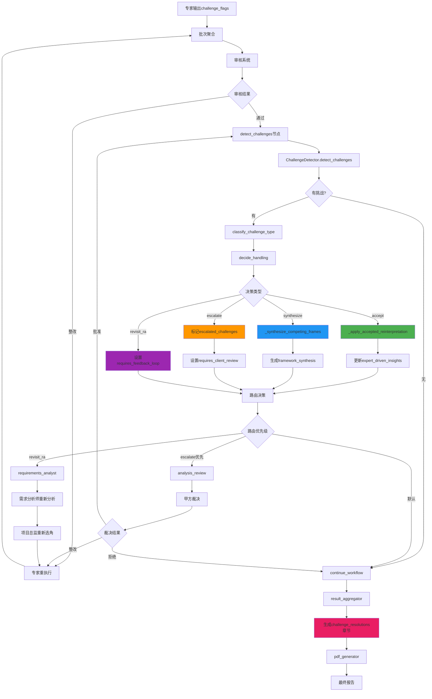

# 专家挑战后的执行路径与响应机制

## 📍 触发位置

挑战检测在工作流的关键节点执行：

```
批次聚合 → 批次路由 → 审核系统 → 【detect_challenges】 → 结果聚合
```

## 🔄 完整执行路径

### 阶段1: 专家提出挑战
```
V2/V3/V4/V5/V6专家
  ↓ (在分析过程中)
专家输出JSON
  ├─ 标准字段 (analysis, recommendations, etc.)
  └─ 🔥 challenge_flags: [...]  ← 专家主动标记挑战
```

**谁响应**: 专家自己在分析时主动标记

---

### 阶段2: 批次聚合
```
batch_aggregator节点
  ↓
收集所有专家输出到state["batch_results"]
  ↓
检查批次完成状态
  ↓
路由决策
```

**谁响应**: `batch_aggregator`节点自动聚合

---

### 阶段3: 审核系统
```
analysis_review节点
  ↓
红队审核 → 蓝队辩护 → 评委裁决 → 甲方决策
  ↓
生成改进建议
  ↓
决策: 通过 / 整改 / 拒绝
```

**关键代码** (`analysis_review.py` Line 180):
```python
# 审核通过后
logger.info("🔥 [v3.5] 审核完成，启动专家主动性协议检测...")
return Command(update=updated_state, goto="detect_challenges")
```

**谁响应**: 
- `MultiPerspectiveReviewCoordinator` 执行四阶段审核
- 审核通过后自动路由到`detect_challenges`节点

---

### 阶段4: 挑战检测 (核心环节)

#### 4.1 检测挑战
```
detect_challenges节点
  ↓
ChallengeDetector初始化
  ↓
从state["batch_results"]提取所有专家输出
  ↓
遍历每个专家的challenge_flags
  ↓
检测到挑战 → 记录到challenges列表
```

**关键代码** (`dynamic_project_director.py` Line 1150):
```python
# 检测挑战
detection_result = detector.detect_challenges(expert_outputs)
# 返回: {
#   "has_challenges": bool,
#   "challenges": List[Dict],
#   "challenge_summary": str
# }
```

**谁响应**: `ChallengeDetector.detect_challenges()`

---

#### 4.2 分类挑战
```
对每个challenge:
  ↓
ChallengeDetector.classify_challenge_type()
  ↓
判断类型:
  ├─ "更深" / "深刻" / "真正" → deeper_insight
  ├─ "不确定" / "模糊" → uncertainty_clarification
  ├─ "框架" / "诠释" → competing_frames
  └─ 其他 → other
```

**关键代码** (`dynamic_project_director.py` Line 918):
```python
def classify_challenge_type(self, challenge: Dict[str, Any]) -> str:
    challenged_item = challenge.get("challenged_item", "").lower()
    rationale = challenge.get("rationale", "").lower()
    
    if "更深" in rationale or "深刻" in rationale:
        return "deeper_insight"
    elif "不确定" in challenged_item or "模糊" in challenged_item:
        return "uncertainty_clarification"
    elif "框架" in challenged_item or "诠释" in rationale:
        return "competing_frames"
    else:
        return "other"
```

**谁响应**: `ChallengeDetector.classify_challenge_type()`

---

#### 4.3 决策处理方式
```
对每个challenge:
  ↓
ChallengeDetector.decide_handling(challenge, challenge_type)
  ↓
决策映射:
  ├─ deeper_insight → accept (接受更深洞察)
  ├─ uncertainty_clarification → revisit_ra (回访需求分析师)
  ├─ competing_frames → synthesize (综合多方案)
  └─ other → escalate (交甲方裁决)
```

**关键代码** (`dynamic_project_director.py` Line 939):
```python
def decide_handling(self, challenge: Dict[str, Any], challenge_type: str) -> str:
    if challenge_type == "deeper_insight":
        logger.info(f"📌 决策: 接受专家的更深洞察")
        return "accept"
    elif challenge_type == "uncertainty_clarification":
        logger.info(f"📌 决策: 回访需求分析师或用户确认")
        return "revisit_ra"
    elif challenge_type == "competing_frames":
        logger.info(f"📌 决策: 综合多个诠释框架")
        return "synthesize"
    else:
        logger.info(f"📌 决策: 交甲方裁决")
        return "escalate"
```

**谁响应**: `ChallengeDetector.decide_handling()`

---

### 阶段5: 闭环执行 (🆕 v3.5.1)

#### 5.1 Accept闭环
```
decision == "accept"
  ↓
_apply_accepted_reinterpretation(state, challenge)
  ↓
更新state["expert_driven_insights"][challenged_item] = {
    "expert_reinterpretation": ...,
    "accepted_from": expert_role,
    "design_impact": ...,
    "status": "accepted"
}
  ↓
记录state["insight_updates"].append({
    "item": challenged_item,
    "new_interpretation": reinterpretation,
    "reason": "专家提出更深洞察，已被项目总监接受"
})
```

**关键代码** (`dynamic_project_director.py` Line 1033):
```python
def _apply_accepted_reinterpretation(state: Dict[str, Any], challenge: Dict[str, Any]):
    # 更新核心洞察
    state["expert_driven_insights"][challenged_item] = {...}
    # 通知其他专家
    state["insight_updates"].append({...})
    
    logger.info(f"✅ [Accept闭环] 采纳{expert_role}对'{challenged_item}'的重新诠释")
```

**谁响应**: `_apply_accepted_reinterpretation()` 函数
**效果**: 专家的新洞察立即更新到state,对后续分析和报告可见

---

#### 5.2 Synthesize闭环
```
decision == "synthesize"
  ↓
_synthesize_competing_frames(state, challenges)
  ↓
提取所有竞争性框架
  ↓
按challenged_item分组
  ↓
生成综合方案:
state["framework_synthesis"][item] = {
    "competing_frames": [...],
    "synthesis_summary": "检测到N个竞争性框架...",
    "recommendation": "建议在报告中并列展示多个方案",
    "requires_deep_analysis": True
}
```

**关键代码** (`dynamic_project_director.py` Line 1063):
```python
def _synthesize_competing_frames(state: Dict[str, Any], challenges: List[Dict[str, Any]]):
    # 提取竞争性框架
    grouped = defaultdict(list)
    for interp in competing_interpretations:
        grouped[interp["challenged_item"]].append(interp)
    
    # 生成综合方案
    state["framework_synthesis"][item] = {...}
    
    logger.info(f"🔄 [Synthesize闭环] 综合{len(interpretations)}个竞争性框架")
```

**谁响应**: `_synthesize_competing_frames()` 函数
**效果**: 竞争性框架被整合,提供混合方案供决策

---

#### 5.3 Escalate闭环
```
decision == "escalate"
  ↓
格式化为审核系统格式:
escalated_issues.append({
    "issue_id": f"CHALLENGE_{expert_role}_{timestamp}",
    "type": "strategic_decision",
    "severity": "high",
    "requires_client_decision": True
})
  ↓
更新标志位:
state["escalated_challenges"] = escalated_issues
state["requires_client_review"] = True
```

**关键代码** (`dynamic_project_director.py` Line 1199):
```python
# Escalate闭环标记
for challenge in escalated:
    escalated_issues.append({
        "issue_id": f"CHALLENGE_{expert_role}_{timestamp}",
        "type": "strategic_decision",
        "requires_client_decision": True
    })

updated_state["escalated_challenges"] = escalated_issues
updated_state["requires_client_review"] = True

logger.warning(f"🚨 [Escalate闭环] {len(escalated)}个挑战需要甲方裁决")
```

**谁响应**: `detect_and_handle_challenges_node()` 函数
**效果**: 标记需要甲方裁决,准备路由到审核节点

---

#### 5.4 Revisit_ra闭环
```
decision == "revisit_ra"
  ↓
设置标志位:
state["requires_feedback_loop"] = True
state["feedback_loop_reason"] = "Expert challenges require clarification"
```

**关键代码** (`dynamic_project_director.py` Line 1223):
```python
if handling_result["requires_revisit"]:
    logger.warning("⚠️ 检测到需要回访需求分析师的挑战")
    updated_state["feedback_loop_reason"] = "Expert challenges require clarification"
```

**谁响应**: `detect_and_handle_challenges_node()` 函数
**效果**: 准备回访需求分析师重新澄清

---

### 阶段6: 路由决策

```
_route_after_challenge_detection(state)
  ↓
优先级判断:
  ├─ requires_client_review == True → "analysis_review" (交甲方)
  ├─ requires_feedback_loop == True → "revisit_requirements" (回访需求分析师)
  └─ 默认 → "continue_workflow" (继续到result_aggregator)
```

**关键代码** (`main_workflow.py` Line 1023):
```python
def _route_after_challenge_detection(self, state: ProjectAnalysisState) -> str:
    # 优先级: escalate > revisit_ra > continue
    
    if state.get("requires_client_review"):
        logger.warning(f"🚨 [v3.5 Escalate] 路由到审核节点")
        return "analysis_review"
    
    if state.get("requires_feedback_loop"):
        logger.info(f"🔄 [v3.5] 启动反馈循环")
        return "revisit_requirements"
    
    logger.info("➡️ [v3.5] 继续正常工作流")
    return "continue_workflow"
```

**谁响应**: `MainWorkflow._route_after_challenge_detection()`

---

### 阶段7: 后续执行路径

#### 路径A: Escalate → analysis_review
```
detect_challenges
  ↓ (requires_client_review=True)
analysis_review (再次审核)
  ↓
甲方裁决战略性挑战
  ↓
可能的结果:
  ├─ 批准 → detect_challenges (再次检测)
  ├─ 整改 → batch_executor (专家重执行)
  └─ 拒绝 → result_aggregator (生成报告)
```

**谁响应**: 
- `analysis_review`节点的审核协调器
- 最终由甲方(`ClientReviewer`)裁决

---

#### 路径B: Revisit_ra → requirements_analyst
```
detect_challenges
  ↓ (requires_feedback_loop=True)
requirements_analyst (重新分析)
  ↓
需求分析师根据专家挑战重新分析
  ↓
生成新的expert_handoff
  ↓
project_director (重新选角)
  ↓
batch_executor (专家重新执行)
  ↓
batch_aggregator
  ↓
analysis_review
  ↓
detect_challenges (再次检测)
```

**谁响应**:
- `RequirementsAnalyst` 重新分析需求
- `DynamicProjectDirector` 重新规划
- 所有V2-V6专家重新执行

---

#### 路径C: Continue → result_aggregator
```
detect_challenges
  ↓ (无需特殊处理)
result_aggregator
  ↓
聚合所有分析结果 + 挑战解决结果
  ↓
生成final_report["challenge_resolutions"] = {
    "accepted_reinterpretations": [...],
    "synthesized_frameworks": [...],
    "escalated_to_client": [...]
}
  ↓
pdf_generator
  ↓
生成最终PDF报告
```

**谁响应**:
- `ResultAggregatorAgent` 聚合结果
- `PDFGenerator` 生成报告

---

## 📊 响应者总览表

| 阶段 | 节点/组件 | 职责 | 响应动作 |
|-----|----------|-----|---------|
| **检测** | `ChallengeDetector` | 检测挑战标记 | 遍历专家输出,提取challenge_flags |
| **分类** | `ChallengeDetector.classify_challenge_type()` | 分类挑战类型 | 4种类型分类(deeper_insight/uncertainty/competing_frames/other) |
| **决策** | `ChallengeDetector.decide_handling()` | 决策处理方式 | 4种决策(accept/revisit_ra/synthesize/escalate) |
| **Accept闭环** | `_apply_accepted_reinterpretation()` | 采纳新洞察 | 更新expert_driven_insights, 记录insight_updates |
| **Synthesize闭环** | `_synthesize_competing_frames()` | 综合框架 | 生成framework_synthesis, 提供混合方案 |
| **Escalate闭环** | `detect_and_handle_challenges_node()` | 标记甲方裁决 | 格式化escalated_challenges, 设置requires_client_review |
| **Revisit_ra闭环** | `detect_and_handle_challenges_node()` | 标记回访 | 设置requires_feedback_loop, 记录原因 |
| **路由** | `MainWorkflow._route_after_challenge_detection()` | 决定下一步 | 路由到analysis_review/revisit_requirements/result_aggregator |
| **审核(Escalate)** | `AnalysisReviewNode` + 甲方审核 | 裁决战略挑战 | 四阶段审核,甲方最终决策 |
| **重分析(Revisit)** | `RequirementsAnalyst` | 重新需求分析 | 生成新expert_handoff,启动新一轮 |
| **报告生成** | `ResultAggregatorAgent` | 聚合闭环结果 | 提取challenge_resolutions, 生成报告 |

---

## 🔄 完整流程图



---

## 💡 关键要点

### 1. 谁主动响应?
- **专家** → 主动标记challenge_flags
- **ChallengeDetector** → 自动检测、分类、决策
- **闭环函数** → 自动执行Accept/Synthesize/Escalate
- **路由逻辑** → 自动决定下一步路径

### 2. 什么时候响应?
- 审核通过后立即执行`detect_challenges`
- 挑战检测在结果聚合**之前**执行
- 闭环操作在路由决策**之前**完成

### 3. 响应的优先级?
```
Escalate (交甲方) > Revisit_ra (回访) > Accept/Synthesize (直接处理) > Continue (无挑战)
```

### 4. 闭环保证?
- ✅ **Accept**: 新洞察更新到state, 报告可见
- ✅ **Synthesize**: 框架综合到state, 混合方案可用
- ✅ **Escalate**: 标记到state, 自动路由审核
- ✅ **Revisit_ra**: 标记到state, 自动回访需求分析师

### 5. 可追溯性?
- 所有闭环结果记录到state
- `challenge_resolutions`章节完整展示
- 审核历史和决策路径可查

---

## 🎯 总结

**专家挑战后的执行路径是完全自动化的闭环系统**:

1. **检测** → ChallengeDetector自动检测
2. **分类** → 智能分类4种类型
3. **决策** → 自动决策处理方式
4. **闭环** → 立即执行Accept/Synthesize/Escalate/Revisit_ra
5. **路由** → 智能路由到下一步节点
6. **响应** → 相应节点自动响应(审核/重分析/报告生成)

**没有人工介入,全程自动化,确保每个挑战都有明确的响应和结果！**
