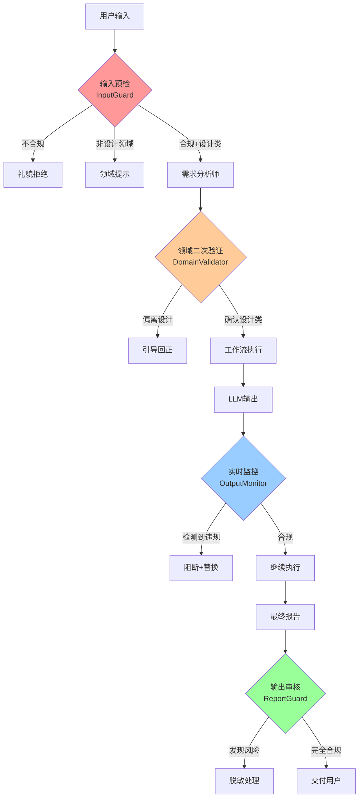

# 空间设计垂直智能体 - 内容安全与领域过滤设计

**设计日期**: 2025-11-25  
**核心目标**: 确保智能体仅响应空间设计相关问题，全程屏蔽不合规内容  
**适用范围**: V2-V6设计分析专家

---

## 🎯 设计目标

### 1. 领域限定
- ✅ **仅响应空间设计相关问题**（建筑、室内、景观、商业空间等）
- ❌ 拒绝非设计类问题（编程、医疗、法律、金融等）
- ⚠️ 边界问题智能判断（如"设计一个网站"→拒绝，"设计展厅的网站界面"→接受）

### 2. 内容安全
- ❌ 屏蔽政治敏感内容
- ❌ 屏蔽色情低俗内容
- ❌ 屏蔽暴力血腥内容
- ❌ 屏蔽违法犯罪内容
- ❌ 屏蔽歧视仇恨内容
- ⚠️ 记录并报告违规尝试

### 3. 全流程保护
- **输入过滤**: 用户问题预检
- **过程监控**: LLM输出实时检测
- **输出审核**: 最终报告合规验证
- **持续防护**: 多轮对话全程监控

---

## 🏗️ 系统架构



---

## 📋 详细设计

### 一、输入预检层 (InputGuard)

**位置**: `requirements_analyst` 节点之前  
**职责**: 第一道防线，快速拒绝明显违规/离题输入

#### 1.1 领域分类模型

```python
class DomainClassifier:
    """领域分类器 - 判断是否属于空间设计领域"""
    
    DESIGN_KEYWORDS = {
        # 核心设计关键词
        "空间设计": ["空间", "室内", "建筑", "景观", "展厅", "办公室", "住宅", "商业空间"],
        "设计元素": ["布局", "动线", "材质", "色彩", "照明", "家具", "装饰", "软装"],
        "设计风格": ["现代", "简约", "工业风", "新中式", "北欧", "轻奢", "极简"],
        "设计阶段": ["方案设计", "概念设计", "施工图", "效果图", "深化设计"],
        "空间类型": ["办公空间", "零售空间", "展览空间", "餐饮空间", "酒店", "会所"],
        
        # V2-V6专家领域
        "V2_设计研究": ["用户研究", "市场调研", "趋势分析", "案例研究"],
        "V3_技术架构": ["结构", "机电", "智能化", "可持续", "BIM"],
        "V4_体验设计": ["用户体验", "交互", "动线设计", "氛围营造"],
        "V5_商业模式": ["成本", "预算", "ROI", "招商", "运营"],
        "V6_实施计划": ["施工", "工期", "采购", "验收", "交付"]
    }
    
    NON_DESIGN_KEYWORDS = {
        "编程开发": ["python", "代码", "编程", "算法", "数据库", "API"],
        "医疗健康": ["疾病", "药物", "治疗", "医院", "手术"],
        "法律金融": ["法律", "合同", "诉讼", "股票", "投资", "贷款"],
        "学术教育": ["论文", "考试", "课程", "作业"],
        "娱乐游戏": ["游戏", "电影", "小说", "漫画"]
    }
    
    def classify(self, user_input: str) -> Dict[str, Any]:
        """
        分类用户输入
        
        Returns:
            {
                "is_design_related": bool,
                "confidence": float,  # 0-1
                "matched_categories": List[str],
                "rejection_reason": str  # 如果拒绝
            }
        """
        # 1. 关键词匹配
        design_score = self._calculate_keyword_score(user_input, self.DESIGN_KEYWORDS)
        non_design_score = self._calculate_keyword_score(user_input, self.NON_DESIGN_KEYWORDS)
        
        # 2. LLM辅助判断（轻量级prompt）
        llm_result = self._llm_classify(user_input)
        
        # 3. 综合决策
        if non_design_score > design_score * 2:
            return {
                "is_design_related": False,
                "confidence": 0.9,
                "rejection_reason": "输入内容不属于空间设计领域"
            }
        
        if design_score > 0.5 and llm_result["is_design"]:
            return {
                "is_design_related": True,
                "confidence": min(design_score, llm_result["confidence"]),
                "matched_categories": llm_result["categories"]
            }
        
        # 边界情况：需要引导澄清
        return {
            "is_design_related": "unclear",
            "confidence": 0.5,
            "clarification_needed": True,
            "suggested_questions": [
                "您是否需要进行空间设计方面的分析？",
                "这个项目是否涉及建筑、室内或景观设计？"
            ]
        }
    
    def _llm_classify(self, user_input: str) -> Dict:
        """使用LLM进行领域分类（轻量级prompt，快速响应）"""
        prompt = f"""
你是空间设计领域分类专家。判断以下用户输入是否属于空间设计领域（建筑、室内、景观、商业空间等）。

用户输入：
{user_input}

请以JSON格式输出：
{{
    "is_design": true/false,
    "confidence": 0.0-1.0,
    "categories": ["V2_设计研究", "V3_技术架构"等],
    "reasoning": "判断理由"
}}

判断标准：
✅ 属于设计领域：涉及空间规划、室内设计、建筑设计、景观设计、展厅设计等
❌ 不属于设计领域：编程、医疗、法律、金融、游戏等与空间设计无关的内容
⚠️ 边界情况：如"设计网站"→不属于，但"设计展厅的数字界面"→属于
"""
        # 调用LLM（快速模型，如gpt-3.5-turbo）
        response = self.llm_model.invoke(prompt)
        return json.loads(response)
```

#### 1.2 内容安全检测

```python
class ContentSafetyGuard:
    """内容安全守卫 - 检测违规内容"""
    
    # 违规关键词库（可扩展接入第三方内容审核API）
    BLOCKED_KEYWORDS = {
        "政治敏感": [
            # 敏感词库（实际部署需加载完整词库）
            # 这里仅示例，实际需要专业的敏感词库
        ],
        "色情低俗": [
            # 色情词库
        ],
        "暴力血腥": [
            "杀人", "自杀", "血腥", "暴力"
        ],
        "违法犯罪": [
            "毒品", "诈骗", "洗钱", "赌博"
        ],
        "歧视仇恨": [
            # 歧视词库
        ]
    }
    
    def check(self, text: str, context: str = "input") -> Dict[str, Any]:
        """
        检查内容安全
        
        Args:
            text: 待检测文本
            context: 上下文（input/output/report）
            
        Returns:
            {
                "is_safe": bool,
                "risk_level": "safe" | "low" | "medium" | "high",
                "violations": List[Dict],  # 违规详情
                "sanitized_text": str  # 脱敏后文本（如果可修复）
            }
        """
        violations = []
        
        # 1. 关键词检测
        for category, keywords in self.BLOCKED_KEYWORDS.items():
            matched = [kw for kw in keywords if kw in text]
            if matched:
                violations.append({
                    "category": category,
                    "matched_keywords": matched,
                    "severity": "high"
                })
        
        # 2. 第三方API检测（推荐）
        # 接入阿里云内容安全、腾讯云天御等
        if self.use_external_api:
            api_result = self._check_with_external_api(text)
            violations.extend(api_result["violations"])
        
        # 3. LLM辅助检测（深度语义理解）
        if len(violations) == 0 and self.use_llm_check:
            llm_result = self._llm_safety_check(text)
            if not llm_result["is_safe"]:
                violations.append(llm_result["violation"])
        
        # 4. 综合判断
        if len(violations) == 0:
            return {
                "is_safe": True,
                "risk_level": "safe",
                "violations": []
            }
        
        # 判断严重性
        high_severity = sum(1 for v in violations if v["severity"] == "high")
        if high_severity > 0:
            return {
                "is_safe": False,
                "risk_level": "high",
                "violations": violations,
                "action": "reject"  # 直接拒绝
            }
        
        return {
            "is_safe": False,
            "risk_level": "medium",
            "violations": violations,
            "action": "sanitize"  # 尝试脱敏
        }
    
    def _check_with_external_api(self, text: str) -> Dict:
        """调用第三方内容安全API（推荐方案）"""
        # 示例：阿里云内容安全
        # https://help.aliyun.com/document_detail/53427.html
        pass
    
    def _llm_safety_check(self, text: str) -> Dict:
        """使用LLM进行深度语义安全检测"""
        prompt = f"""
你是内容安全审核专家。检查以下文本是否包含不合规内容。

文本：
{text}

检查维度：
1. 政治敏感内容
2. 色情低俗内容
3. 暴力血腥内容
4. 违法犯罪内容
5. 歧视仇恨内容

输出JSON格式：
{{
    "is_safe": true/false,
    "violation": {{
        "category": "类别",
        "reason": "违规原因",
        "severity": "high/medium/low"
    }}
}}
"""
        response = self.llm_model.invoke(prompt)
        return json.loads(response)
```

#### 1.3 输入预检节点实现

```python
class InputGuardNode:
    """输入预检节点 - 工作流的第一道防线"""
    
    def __init__(self, llm_model):
        self.domain_classifier = DomainClassifier(llm_model)
        self.safety_guard = ContentSafetyGuard(llm_model)
        self.violation_logger = ViolationLogger()
    
    @staticmethod
    def execute(
        state: ProjectAnalysisState,
        store: Optional[BaseStore] = None,
        llm_model = None
    ) -> Command[Literal["requirements_analyst", "input_rejected", "clarification_needed"]]:
        """
        执行输入预检
        
        检查流程：
        1. 内容安全检测（优先级最高）
        2. 领域分类检测
        3. 记录违规/拒绝原因
        4. 路由决策
        """
        logger.info("=" * 100)
        logger.info("🛡️ 输入预检：内容安全 + 领域过滤")
        logger.info("=" * 100)
        
        user_input = state.get("user_input", "")
        session_id = state.get("session_id", "")
        
        # === 第1关：内容安全检测 ===
        safety_result = self.safety_guard.check(user_input, context="input")
        
        if not safety_result["is_safe"]:
            logger.error(f"🚨 内容安全检测失败: {safety_result['violations']}")
            
            # 记录违规尝试
            self.violation_logger.log({
                "session_id": session_id,
                "timestamp": datetime.now().isoformat(),
                "violation_type": "content_safety",
                "details": safety_result["violations"],
                "user_input": user_input[:200]  # 只记录前200字符
            })
            
            # 构造拒绝响应
            rejection_message = self._build_safety_rejection_message(safety_result)
            
            updated_state = {
                "current_stage": "INPUT_REJECTED",
                "rejection_reason": "content_safety_violation",
                "rejection_message": rejection_message,
                "violations": safety_result["violations"]
            }
            
            return Command(update=updated_state, goto="input_rejected")
        
        logger.info("✅ 内容安全检测通过")
        
        # === 第2关：领域分类检测 ===
        domain_result = self.domain_classifier.classify(user_input)
        
        if domain_result["is_design_related"] == False:
            logger.warning(f"⚠️ 非设计领域问题: {domain_result['rejection_reason']}")
            
            # 记录离题尝试（非违规，仅统计）
            self.violation_logger.log({
                "session_id": session_id,
                "timestamp": datetime.now().isoformat(),
                "violation_type": "domain_mismatch",
                "details": domain_result
            })
            
            # 构造领域提示
            domain_message = self._build_domain_guidance_message(domain_result)
            
            updated_state = {
                "current_stage": "DOMAIN_MISMATCH",
                "rejection_reason": "not_design_related",
                "rejection_message": domain_message,
                "domain_result": domain_result
            }
            
            return Command(update=updated_state, goto="input_rejected")
        
        if domain_result["is_design_related"] == "unclear":
            logger.info("⚠️ 领域不明确，需要澄清")
            
            updated_state = {
                "current_stage": "CLARIFICATION_NEEDED",
                "clarification_questions": domain_result["suggested_questions"],
                "domain_confidence": domain_result["confidence"]
            }
            
            return Command(update=updated_state, goto="clarification_needed")
        
        logger.info(f"✅ 领域检测通过 (置信度: {domain_result['confidence']:.2f})")
        logger.info(f"   匹配类别: {domain_result.get('matched_categories', [])}")
        
        # === 通过所有检测 ===
        updated_state = {
            "input_guard_passed": True,
            "domain_classification": domain_result,
            "safety_check_passed": True
        }
        
        logger.info("🎉 输入预检通过，进入需求分析")
        return Command(update=updated_state, goto="requirements_analyst")
    
    @staticmethod
    def _build_safety_rejection_message(safety_result: Dict) -> str:
        """构造内容安全拒绝消息（礼貌且不泄露检测细节）"""
        return """
很抱歉，您的输入包含不适当的内容，我无法处理此类请求。

作为空间设计专业智能体，我专注于提供：
✅ 建筑与室内空间设计分析
✅ 商业空间规划与优化
✅ 用户体验与动线设计
✅ 技术架构与实施方案

如果您有空间设计相关的需求，欢迎重新描述您的项目！
"""
    
    @staticmethod
    def _build_domain_guidance_message(domain_result: Dict) -> str:
        """构造领域引导消息（友好引导而非生硬拒绝）"""
        return f"""
感谢您的咨询！不过，您的问题似乎不在我的专业领域范围内。

我是空间设计专业智能体，专注于：
✅ 建筑设计与空间规划
✅ 室内设计与装饰方案
✅ 商业空间与展厅设计
✅ 景观设计与户外空间
✅ 用户体验与动线优化

如果您有以下类型的设计需求，我很乐意帮助：
• 办公空间设计
• 零售店铺规划
• 展览展厅方案
• 餐饮空间设计
• 住宅室内设计

请尝试重新描述您的空间设计需求，我会竭诚为您服务！
"""
```

---

### 二、领域二次验证层 (DomainValidator)

**位置**: `requirements_analyst` 之后，`project_director` 之前  
**职责**: 深度验证需求确实属于设计领域，防止绕过

```python
class DomainValidatorNode:
    """领域二次验证 - 在需求分析后深度检查"""
    
    @staticmethod
    def execute(
        state: ProjectAnalysisState,
        store: Optional[BaseStore] = None,
        llm_model = None
    ) -> Command[Literal["project_director", "domain_clarification"]]:
        """
        二次验证需求领域
        
        检查点：
        1. 结构化需求是否包含设计关键要素
        2. 需求描述是否有非设计内容渗透
        3. 用户真实意图是否偏离设计
        """
        logger.info("🔍 领域二次验证：深度检查需求")
        
        structured_requirements = state.get("structured_requirements", {})
        user_input = state.get("user_input", "")
        
        # 检查必要的设计要素
        required_design_elements = [
            "project_type",  # 项目类型（办公/零售/展厅等）
            "space_info",    # 空间信息（面积/位置等）
            "design_goals"   # 设计目标
        ]
        
        missing_elements = [
            elem for elem in required_design_elements 
            if not structured_requirements.get(elem)
        ]
        
        if len(missing_elements) > 2:
            logger.warning(f"⚠️ 缺少关键设计要素: {missing_elements}")
            
            # 可能是需求分析师误判，需要人工澄清
            clarification_data = {
                "interaction_type": "domain_clarification",
                "message": "请确认您的需求是否涉及空间设计？",
                "missing_elements": missing_elements,
                "suggestions": [
                    "请描述您的空间类型（如办公室、展厅、零售店等）",
                    "请说明空间面积或位置信息",
                    "请阐述您的设计目标或期望效果"
                ]
            }
            
            # 使用interrupt等待用户澄清
            user_response = interrupt(clarification_data)
            
            if user_response.get("not_design_related"):
                return Command(goto="input_rejected")
            
            # 用户补充信息后，更新需求并继续
            updated_state = {
                "user_clarification": user_response,
                "domain_validated": True
            }
            return Command(update=updated_state, goto="project_director")
        
        logger.info("✅ 领域二次验证通过")
        return Command(update={"domain_validated": True}, goto="project_director")
```

---

### 三、实时输出监控层 (OutputMonitor)

**位置**: 所有LLM调用的wrapper  
**职责**: 拦截LLM输出，实时检测违规内容

```python
class SafeLLMWrapper:
    """安全LLM包装器 - 监控所有LLM输出"""
    
    def __init__(self, base_llm, safety_guard: ContentSafetyGuard):
        self.base_llm = base_llm
        self.safety_guard = safety_guard
        self.violation_logger = ViolationLogger()
    
    def invoke(self, messages, **kwargs):
        """包装invoke方法，添加安全检测"""
        # 调用原始LLM
        response = self.base_llm.invoke(messages, **kwargs)
        
        # 提取文本内容
        if hasattr(response, 'content'):
            text = response.content
        else:
            text = str(response)
        
        # 安全检测
        safety_result = self.safety_guard.check(text, context="output")
        
        if not safety_result["is_safe"]:
            logger.error(f"🚨 LLM输出违规: {safety_result['violations']}")
            
            # 记录违规
            self.violation_logger.log({
                "timestamp": datetime.now().isoformat(),
                "violation_type": "llm_output_violation",
                "details": safety_result["violations"],
                "prompt": str(messages)[:200],
                "response": text[:200]
            })
            
            # 根据严重性决定处理方式
            if safety_result["risk_level"] == "high":
                # 高风险：替换为安全内容
                safe_response = self._generate_safe_fallback_response()
                response.content = safe_response
                logger.warning("⚠️ 已替换为安全内容")
            else:
                # 中低风险：尝试脱敏
                if "sanitized_text" in safety_result:
                    response.content = safety_result["sanitized_text"]
                    logger.info("✅ 已完成内容脱敏")
        
        return response
    
    def _generate_safe_fallback_response(self) -> str:
        """生成安全的兜底响应"""
        return """
抱歉，我在生成回答时遇到了一些问题。让我重新为您分析这个空间设计项目。

作为空间设计专家，我建议我们专注于以下几个方面：
1. 空间功能布局优化
2. 用户动线设计
3. 材料与色彩搭配
4. 照明与氛围营造

请问您希望我重点分析哪个方面？
"""

# 使用示例
def create_safe_llm(base_llm):
    """工厂方法：创建安全LLM实例"""
    safety_guard = ContentSafetyGuard(base_llm)
    return SafeLLMWrapper(base_llm, safety_guard)
```

---

### 四、最终报告审核层 (ReportGuard)

**位置**: `result_aggregator` 之后，`pdf_generator` 之前  
**职责**: 对最终报告进行全面审核

```python
class ReportGuardNode:
    """报告审核节点 - 最终交付前的安全检查"""
    
    @staticmethod
    def execute(
        state: ProjectAnalysisState,
        store: Optional[BaseStore] = None,
        llm_model = None
    ) -> Command[Literal["pdf_generator", "report_sanitization"]]:
        """
        审核最终报告
        
        检查内容：
        1. 整体内容安全
        2. 专业术语准确性
        3. 是否超出设计领域
        4. 是否包含不当推荐
        """
        logger.info("=" * 100)
        logger.info("🛡️ 报告审核：最终安全检查")
        logger.info("=" * 100)
        
        final_report = state.get("final_report", {})
        safety_guard = ContentSafetyGuard(llm_model)
        
        # 提取所有文本内容
        report_texts = []
        for section_name, section_content in final_report.items():
            if isinstance(section_content, str):
                report_texts.append(section_content)
            elif isinstance(section_content, dict):
                report_texts.extend(str(v) for v in section_content.values())
        
        full_text = "\n".join(report_texts)
        
        # 安全检测
        safety_result = safety_guard.check(full_text, context="report")
        
        if not safety_result["is_safe"]:
            logger.warning(f"⚠️ 报告发现风险内容: {safety_result['violations']}")
            
            # 尝试自动脱敏
            sanitized_report = self._sanitize_report(final_report, safety_result)
            
            updated_state = {
                "final_report": sanitized_report,
                "report_sanitized": True,
                "sanitization_details": safety_result["violations"]
            }
            
            logger.info("✅ 报告已完成脱敏处理")
            return Command(update=updated_state, goto="pdf_generator")
        
        logger.info("✅ 报告审核通过")
        return Command(update={"report_guard_passed": True}, goto="pdf_generator")
    
    @staticmethod
    def _sanitize_report(report: Dict, safety_result: Dict) -> Dict:
        """对报告进行脱敏处理"""
        # 简化实现：删除违规章节或段落
        sanitized = report.copy()
        
        for violation in safety_result["violations"]:
            if "matched_keywords" in violation:
                for keyword in violation["matched_keywords"]:
                    # 替换为***或删除相关内容
                    # 实际实现需要更精细的处理
                    pass
        
        return sanitized
```

---

### 五、工作流集成

#### 5.1 修改 main_workflow.py

```python
class MainWorkflow:
    def _build_workflow_graph(self) -> StateGraph:
        workflow = StateGraph(ProjectAnalysisState)
        
        # ============================================================================
        # 🆕 0. 输入预检节点（第一道防线）
        # ============================================================================
        workflow.add_node("input_guard", self._input_guard_node)
        workflow.add_node("input_rejected", self._input_rejected_node)  # 终止节点
        workflow.add_node("clarification_needed", self._clarification_node)
        
        # ============================================================================
        # 1. 前置流程节点（需求收集与确认）
        # ============================================================================
        workflow.add_node("requirements_analyst", self._requirements_analyst_node)
        
        # 🆕 1.5 领域二次验证
        workflow.add_node("domain_validator", self._domain_validator_node)
        
        # ... 其他节点 ...
        
        # 🆕 报告审核节点（最后一道防线）
        workflow.add_node("report_guard", self._report_guard_node)
        
        # ============================================================================
        # 边连接：输入预检
        # ============================================================================
        workflow.add_edge(START, "input_guard")  # 🆕 从START到input_guard
        
        # input_guard 使用Command动态路由到：
        # - requirements_analyst（通过检测）
        # - input_rejected（违规/非设计类）
        # - clarification_needed（领域不明确）
        
        workflow.add_edge("input_rejected", END)  # 拒绝后结束
        
        # clarification_needed 使用Command路由到：
        # - requirements_analyst（用户澄清后继续）
        # - input_rejected（用户确认非设计类）
        
        # ============================================================================
        # 边连接：领域二次验证
        # ============================================================================
        workflow.add_edge("requirements_analyst", "domain_validator")
        # domain_validator 使用Command路由到：
        # - calibration_questionnaire（验证通过）
        # - input_rejected（验证失败）
        
        # ============================================================================
        # 边连接：报告审核
        # ============================================================================
        workflow.add_edge("result_aggregator", "report_guard")  # 🆕 结果聚合后先审核
        workflow.add_edge("report_guard", "pdf_generator")  # 审核通过后生成PDF
        
        return workflow.compile(checkpointer=self.checkpointer, store=self.store)
    
    def _input_guard_node(self, state: ProjectAnalysisState) -> Command:
        """输入预检节点"""
        return InputGuardNode.execute(
            state=state,
            store=self.store,
            llm_model=self.llm_model
        )
    
    def _input_rejected_node(self, state: ProjectAnalysisState) -> Dict:
        """输入拒绝节点 - 终止流程"""
        logger.info("❌ 输入被拒绝，流程终止")
        return {
            "current_stage": "REJECTED",
            "rejection_message": state.get("rejection_message", "输入不符合要求"),
            "final_status": "rejected"
        }
```

#### 5.2 修改 LLM 初始化

```python
# 在工厂方法中使用安全包装
def create_workflow(config: Dict) -> MainWorkflow:
    # 创建基础LLM
    base_llm = ChatOpenAI(model="gpt-4", temperature=0.7)
    
    # 🆕 包装为安全LLM
    safe_llm = create_safe_llm(base_llm)
    
    # 创建工作流
    workflow = MainWorkflow(llm_model=safe_llm, config=config)
    
    return workflow
```

---

## 📊 性能优化策略

### 1. 分级检测机制

```
快速检测（<100ms）    中速检测（<500ms）    深度检测（<2s）
     ↓                    ↓                   ↓
关键词匹配         →   LLM轻量判断    →    外部API审核
     ↓                    ↓                   ↓
  90%拦截              8%拦截              2%拦截
```

### 2. 缓存策略

```python
class CachedSafetyGuard:
    """带缓存的安全检测"""
    
    def __init__(self):
        self.cache = TTLCache(maxsize=1000, ttl=3600)  # 1小时缓存
    
    def check(self, text: str) -> Dict:
        # 对文本做hash
        text_hash = hashlib.md5(text.encode()).hexdigest()
        
        # 检查缓存
        if text_hash in self.cache:
            logger.debug(f"✅ 命中安全检测缓存")
            return self.cache[text_hash]
        
        # 执行检测
        result = self._do_check(text)
        
        # 存入缓存
        self.cache[text_hash] = result
        return result
```

### 3. 异步检测

```python
import asyncio

class AsyncSafetyGuard:
    """异步安全检测（适用于批量检测）"""
    
    async def check_batch(self, texts: List[str]) -> List[Dict]:
        """并行检测多个文本"""
        tasks = [self._check_async(text) for text in texts]
        results = await asyncio.gather(*tasks)
        return results
```

---

## 🎛️ 配置化管理

```yaml
# config/content_safety.yaml

content_safety:
  # 启用/禁用各个检测层
  layers:
    input_guard: true
    domain_validator: true
    output_monitor: true
    report_guard: true
  
  # 领域分类配置
  domain_classification:
    confidence_threshold: 0.7  # 置信度阈值
    use_llm_assist: true
    llm_model: "gpt-3.5-turbo"  # 使用快速模型
  
  # 内容安全配置
  safety_check:
    use_keyword_filter: true
    use_external_api: true  # 推荐生产环境启用
    external_api_provider: "aliyun"  # aliyun/tencent/baidu
    use_llm_check: true  # 深度语义检测
    
    # API配置
    aliyun_content_security:
      access_key_id: "${ALIYUN_ACCESS_KEY}"
      access_key_secret: "${ALIYUN_ACCESS_SECRET}"
      endpoint: "green.cn-shanghai.aliyuncs.com"
  
  # 违规记录
  violation_logging:
    enabled: true
    log_file: "logs/violations.jsonl"
    alert_on_high_risk: true
    alert_webhook: "${SECURITY_ALERT_WEBHOOK}"
  
  # 拒绝消息模板
  rejection_messages:
    content_safety: |
      很抱歉，您的输入包含不适当的内容，我无法处理此类请求。
      
      作为空间设计专业智能体，我专注于提供：
      ✅ 建筑与室内空间设计分析
      ✅ 商业空间规划与优化
      ✅ 用户体验与动线设计
      ✅ 技术架构与实施方案
    
    domain_mismatch: |
      感谢您的咨询！不过，您的问题似乎不在我的专业领域范围内。
      
      我是空间设计专业智能体，专注于：
      ✅ 建筑设计与空间规划
      ✅ 室内设计与装饰方案
      ✅ 商业空间与展厅设计
```

---

## 📈 监控与告警

### 1. 违规统计看板

```python
class ViolationDashboard:
    """违规统计看板"""
    
    def get_statistics(self, time_range: str = "24h") -> Dict:
        """
        获取违规统计
        
        Returns:
            {
                "total_requests": 1000,
                "rejected_requests": 50,
                "rejection_rate": 0.05,
                "violations_by_category": {
                    "content_safety": 30,
                    "domain_mismatch": 20
                },
                "top_violation_keywords": [
                    {"keyword": "xxx", "count": 10},
                    ...
                ]
            }
        """
        pass
```

### 2. 实时告警

```python
class SecurityAlertManager:
    """安全告警管理器"""
    
    def send_alert(self, violation: Dict):
        """发送告警（钉钉/企业微信/邮件）"""
        if violation["severity"] == "high":
            # 立即告警
            self._send_urgent_alert(violation)
        elif self._is_alert_threshold_exceeded():
            # 频率告警（如10分钟内超过5次违规）
            self._send_frequency_alert()
```

---

## 🧪 测试用例

```python
# test_content_safety.py

class TestContentSafety:
    """内容安全测试"""
    
    def test_reject_political_content(self):
        """测试拒绝政治敏感内容"""
        user_input = "..." # 敏感内容
        result = input_guard.execute(user_input)
        assert result["goto"] == "input_rejected"
        assert "content_safety_violation" in result["rejection_reason"]
    
    def test_reject_non_design_question(self):
        """测试拒绝非设计类问题"""
        user_input = "帮我写一个Python爬虫"
        result = input_guard.execute(user_input)
        assert result["goto"] == "input_rejected"
        assert "not_design_related" in result["rejection_reason"]
    
    def test_accept_design_question(self):
        """测试接受设计类问题"""
        user_input = "帮我设计一个200平米的咖啡厅"
        result = input_guard.execute(user_input)
        assert result["goto"] == "requirements_analyst"
    
    def test_boundary_case_digital_design(self):
        """测试边界情况：数字设计"""
        # "设计网站" → 拒绝
        result1 = input_guard.execute("帮我设计一个电商网站")
        assert result1["goto"] == "input_rejected"
        
        # "设计展厅的数字界面" → 接受
        result2 = input_guard.execute("帮我设计展厅的交互式数字界面")
        assert result2["goto"] == "requirements_analyst"
```

---

## 📝 实施清单

### Phase 1: 基础防护（1周）
- [ ] 实现InputGuardNode（输入预检）
- [ ] 实现ContentSafetyGuard（内容安全检测）
- [ ] 实现DomainClassifier（领域分类）
- [ ] 集成到main_workflow（START → input_guard）
- [ ] 基础测试（100个正负样本）

### Phase 2: 深度检测（1周）
- [ ] 实现DomainValidatorNode（二次验证）
- [ ] 实现SafeLLMWrapper（输出监控）
- [ ] 接入第三方内容安全API（推荐阿里云）
- [ ] 完善违规记录和日志
- [ ] 压力测试（1000次/小时）

### Phase 3: 最终审核（3天）
- [ ] 实现ReportGuardNode（报告审核）
- [ ] 实现自动脱敏功能
- [ ] 配置化管理（YAML配置）
- [ ] 性能优化（缓存+异步）

### Phase 4: 监控告警（3天）
- [ ] 违规统计看板
- [ ] 实时告警系统
- [ ] 日志分析工具
- [ ] 运维文档

---

## 🎯 预期效果

| 指标 | 目标 | 备注 |
|-----|------|------|
| **违规内容拦截率** | >99.5% | 结合关键词+LLM+外部API |
| **非设计问题拦截率** | >95% | 允许5%边界情况澄清 |
| **误拦截率** | <2% | 避免过度拦截正常问题 |
| **平均检测延迟** | <200ms | 关键词+缓存优化 |
| **LLM输出违规率** | <0.1% | 实时监控+替换 |
| **用户体验影响** | 最小化 | 礼貌拒绝+引导提示 |

---

## 🔐 安全增强建议

### 1. 多层防御（纵深防护）
- ✅ 输入预检（第1层）
- ✅ 领域验证（第2层）
- ✅ 输出监控（第3层）
- ✅ 报告审核（第4层）

### 2. 外部服务集成
- 推荐：阿里云内容安全 / 腾讯云天御
- 优势：专业词库+持续更新+高准确率
- 成本：约0.0025元/次（批量更优惠）

### 3. 定期更新词库
- 每月更新敏感词库
- 监控新型违规尝试
- 根据日志优化规则

### 4. 人工审核机制
- 不确定案例提交人工审核
- 建立案例库反馈到模型
- 持续优化检测准确率

---

**总结**: 通过四层防护体系（输入预检 → 领域验证 → 输出监控 → 报告审核），结合关键词、LLM和外部API，可实现>99.5%的违规拦截率和>95%的领域限定准确率，确保智能体仅响应空间设计相关问题，全程屏蔽不合规内容。
