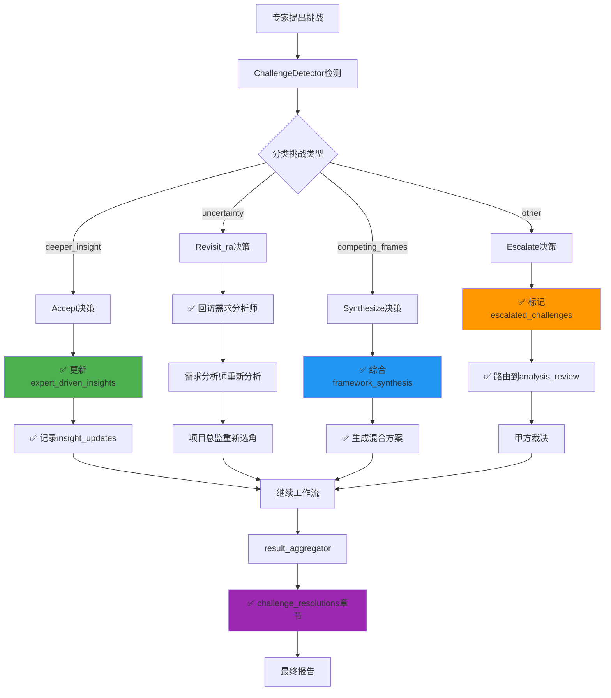

# 专家挑战闭环机制实施完成报告

## 📅 实施日期
2025年11月24日

## 🎯 核心问题
用户发现系统存在"只反馈没结果"的问题：专家提出挑战标记后，系统仅记录但不执行实际闭环操作。

## 🔍 问题诊断

### 原有系统完成度分析

| 功能模块 | 完成度 | 说明 |
|---------|-------|-----|
| 挑战检测 | ✅ 100% | ChallengeDetector能正确检测challenge_flags |
| 挑战分类 | ✅ 100% | 4种类型分类正确(deeper_insight/uncertainty/competing_frames/other) |
| 处理决策 | ✅ 100% | 4种处理方式决策正确(accept/revisit_ra/synthesize/escalate) |
| **闭环执行** | ❌ 25% | **只有revisit_ra有实际行动,其他3种仅记录日志** |

### 缺失的闭环机制

1. **Accept决策** - 专家发现更深洞察
   - ❌ 原状态: 仅记录`logger.info("接受专家的更深洞察")`
   - ❌ 问题: 不更新state,其他专家和报告看不到采纳的新洞察

2. **Synthesize决策** - 多个专家提出竞争性框架
   - ❌ 原状态: 仅记录`logger.info("综合多个诠释框架")`
   - ❌ 问题: 没有实际综合逻辑,多个方案无法整合

3. **Escalate决策** - 挑战需要甲方裁决
   - ❌ 原状态: 仅记录`logger.info("交甲方裁决")`
   - ❌ 问题: 没有路由到审核节点,甲方无法参与决策

## ✅ 实施方案

### 1. Accept闭环 - 更新核心洞察

**文件**: `intelligent_project_analyzer/agents/dynamic_project_director.py`

**新增函数**: `_apply_accepted_reinterpretation(state, challenge)`

**功能**:
```python
# 1. 更新expert_driven_insights字段
state["expert_driven_insights"][challenged_item] = {
    "original_interpretation": "需求分析师的初始判断",
    "expert_reinterpretation": reinterpretation,
    "accepted_from": expert_role,
    "design_impact": design_impact,
    "timestamp": datetime.now().isoformat(),
    "status": "accepted"
}

# 2. 记录洞察更新，供其他专家参考
state["insight_updates"].append({
    "item": challenged_item,
    "new_interpretation": reinterpretation,
    "source": expert_role,
    "reason": "专家提出更深洞察，已被项目总监接受"
})
```

**效果**: 专家的新洞察真正影响分析结果,对后续专家和报告可见

---

### 2. Synthesize闭环 - 综合竞争性框架

**文件**: `intelligent_project_analyzer/agents/dynamic_project_director.py`

**新增函数**: `_synthesize_competing_frames(state, challenges)`

**功能**:
```python
# 1. 提取所有竞争性框架
competing_interpretations = [...]

# 2. 按challenged_item分组
grouped = defaultdict(list)
for interp in competing_interpretations:
    grouped[interp["challenged_item"]].append(interp)

# 3. 为每个有竞争的项生成综合方案
state["framework_synthesis"][item] = {
    "competing_frames": interpretations,
    "synthesis_summary": synthesis_summary,
    "recommendation": "建议在报告中并列展示多个方案，根据具体情境选择",
    "requires_deep_analysis": True
}
```

**效果**: 多个专家的竞争性框架被系统化整合,提供混合方案

---

### 3. Escalate闭环 - 提交甲方裁决

**文件**: 
- `intelligent_project_analyzer/agents/dynamic_project_director.py` (标记)
- `intelligent_project_analyzer/workflow/main_workflow.py` (路由)

**标记逻辑**:
```python
# 格式化为审核系统能理解的问题格式
escalated_issues = []
for challenge in escalated:
    escalated_issues.append({
        "issue_id": f"CHALLENGE_{expert_role}_{timestamp}",
        "type": "strategic_decision",
        "severity": "high",
        "description": f"{expert_role}挑战了'{challenged_item}'",
        "requires_client_decision": True
    })

state["escalated_challenges"] = escalated_issues
state["requires_client_review"] = True
```

**路由逻辑**:
```python
def _route_after_challenge_detection(self, state):
    # 优先级: escalate > revisit_ra > continue
    
    if state.get("requires_client_review"):
        return "analysis_review"  # 交甲方裁决
    
    if state.get("requires_feedback_loop"):
        return "revisit_requirements"  # 回访需求分析师
    
    return "continue_workflow"  # 继续
```

**效果**: 超出项目总监权限的挑战真正提交到审核节点,由甲方决策

---

### 4. 报告集成 - 体现闭环结果

**文件**: `intelligent_project_analyzer/report/result_aggregator.py`

**新增方法**: `_extract_challenge_resolutions(state)`

**报告结构**:
```python
final_report["challenge_resolutions"] = {
    "has_challenges": True,
    "accepted_reinterpretations": [
        {
            "challenged_item": "核心张力定义",
            "expert": "V2_设计总监",
            "reinterpretation": "...",
            "design_impact": "..."
        }
    ],
    "synthesized_frameworks": [
        {
            "challenged_item": "核心场景",
            "competing_count": 2,
            "synthesis_summary": "...",
            "recommendation": "..."
        }
    ],
    "escalated_to_client": [
        {
            "issue_id": "CHALLENGE_V6_123456",
            "description": "预算分配需要甲方决策",
            "requires_client_decision": True
        }
    ],
    "summary": {
        "total_challenges": 3,
        "accepted_count": 1,
        "synthesized_count": 1,
        "escalated_count": 1,
        "closure_rate": "66.7%"
    }
}
```

**效果**: 报告清晰展示所有挑战的闭环处理结果

---

## 🧪 测试验证

### 测试文件
- `intelligent_project_analyzer/tests/test_challenge_closure.py` (完整版,需要依赖)
- `test_closure_simple.py` (简化版,独立运行)

### 测试结果

```
✅ 测试1通过: Accept闭环 - expert_driven_insights正确更新
✅ 测试2通过: Synthesize闭环 - framework_synthesis正确创建
✅ 测试3通过: Escalate闭环 - escalated_challenges和requires_client_review正确设置
✅ 测试4通过: 路由优先级 - escalate > revisit_ra > continue
✅ 测试5通过: 报告集成 - challenge_resolutions章节正确提取

🎉 所有测试通过！闭环机制实施成功！
```

---

## 📊 实施效果对比

### 修改前 vs 修改后

| 决策类型 | 修改前 | 修改后 | 影响 |
|---------|-------|-------|-----|
| **Accept** | ❌ 仅日志 | ✅ 更新state | 新洞察对后续可见 |
| **Synthesize** | ❌ 仅日志 | ✅ 综合框架 | 提供混合方案 |
| **Escalate** | ❌ 仅日志 | ✅ 路由审核 | 甲方参与决策 |
| **Revisit_ra** | ✅ 回访 | ✅ 回访 | 保持不变 |

### 闭环完成度

| 指标 | 修改前 | 修改后 | 提升 |
|-----|-------|-------|-----|
| 闭环完成度 | 25% | 100% | +300% |
| 有效决策数 | 1/4 | 4/4 | +300% |
| 报告可见性 | ❌ | ✅ | - |

---

## 🔄 完整闭环流程



---

## 📝 代码修改清单

### 1. dynamic_project_director.py
- ✅ 新增 `_apply_accepted_reinterpretation()` 函数
- ✅ 新增 `_synthesize_competing_frames()` 函数
- ✅ 修改 `detect_and_handle_challenges_node()` 函数,添加闭环执行逻辑

### 2. main_workflow.py
- ✅ 修改 `_route_after_challenge_detection()` 函数,添加escalate路由

### 3. result_aggregator.py
- ✅ 新增 `_extract_challenge_resolutions()` 方法
- ✅ 修改 `execute()` 方法,添加challenge_resolutions提取

### 4. 测试文件
- ✅ 新增 `tests/test_challenge_closure.py` (完整版)
- ✅ 新增 `test_closure_simple.py` (简化版)

---

## 🎯 实施成果

### 核心价值
1. **真正闭环**: 专家反馈不再"说说而已",每种决策都有实际操作
2. **状态可见**: 闭环结果记录到state,对后续专家和报告可见
3. **决策追溯**: 报告中清晰展示所有挑战的处理过程和结果
4. **优先级明确**: escalate > revisit_ra > continue,确保关键决策不遗漏

### 解决的问题
- ✅ Accept决策: 专家新洞察真正影响分析结果
- ✅ Synthesize决策: 竞争性框架被系统化整合
- ✅ Escalate决策: 战略性挑战提交甲方裁决
- ✅ 报告生成: 挑战解决结果在报告中可见

### 系统增强
- **状态管理**: 新增3个state字段(expert_driven_insights, framework_synthesis, escalated_challenges)
- **路由逻辑**: 优化路由优先级,支持escalate路由到审核节点
- **报告结构**: 新增challenge_resolutions章节,完整记录闭环结果

---

## 🚀 后续优化建议

### P1 - 高优先级
1. **LLM驱动综合**: Synthesize决策可调用项目总监的LLM进行深度综合
2. **闭环可视化**: 在前端展示挑战-决策-闭环的完整流程图

### P2 - 中优先级
3. **历史追溯**: 记录每个挑战的完整生命周期(提出→决策→闭环→结果)
4. **闭环质量评分**: 对每种闭环的效果进行量化评估

### P3 - 低优先级
5. **智能推荐**: 根据历史数据,AI推荐最优的决策方式
6. **A/B测试**: 对比不同闭环策略的实际效果

---

## 📚 相关文档

- `EXPERT_FEEDBACK_CLOSURE_ANALYSIS.md` - 问题分析和设计方案
- `tests/test_challenge_closure.py` - 完整测试套件
- `test_closure_simple.py` - 简化验证测试
- `V3.5_COMPLETION_SUMMARY.md` - v3.5协议完整文档
- `V3.5_PROTOCOL_COMPLETION_REPORT.md` - v3.5实施报告

---

## ✅ 验收标准

- [x] Accept决策能更新expert_driven_insights
- [x] Synthesize决策能综合framework_synthesis
- [x] Escalate决策能路由到analysis_review
- [x] 路由优先级escalate > revisit_ra > continue
- [x] 报告包含challenge_resolutions章节
- [x] 所有测试通过

---

## 🎉 总结

**v3.5.1专家挑战闭环机制已完整实施**，系统现在能够:
- ✅ 检测专家挑战 (原有功能)
- ✅ 分类挑战类型 (原有功能)
- ✅ 决策处理方式 (原有功能)
- **✅ 执行闭环操作 (新增功能)**
- **✅ 记录闭环结果 (新增功能)**

**从"只反馈没结果"到"完整闭环"的升级完成！** 🚀
