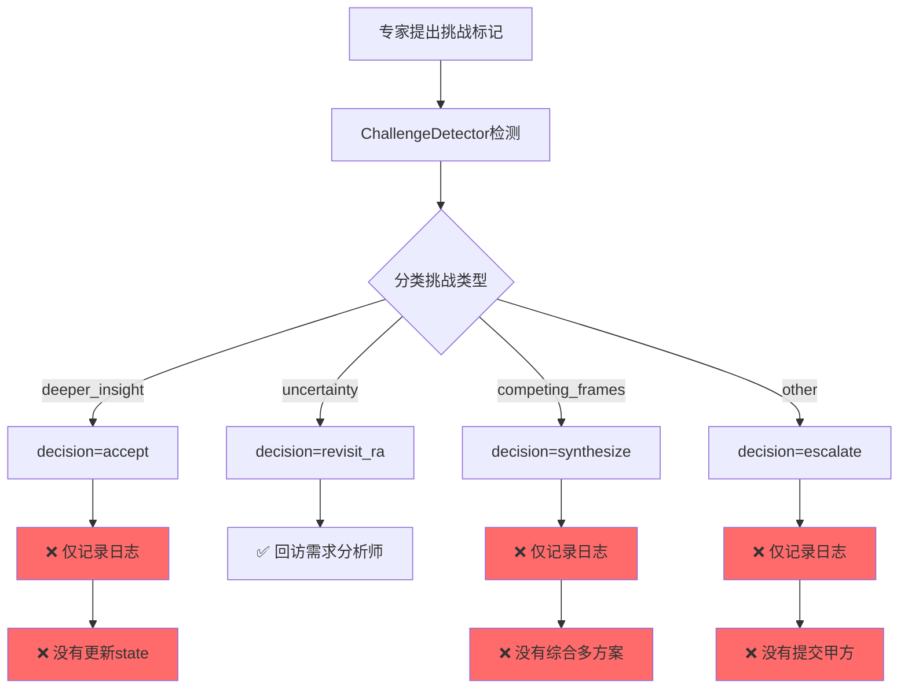
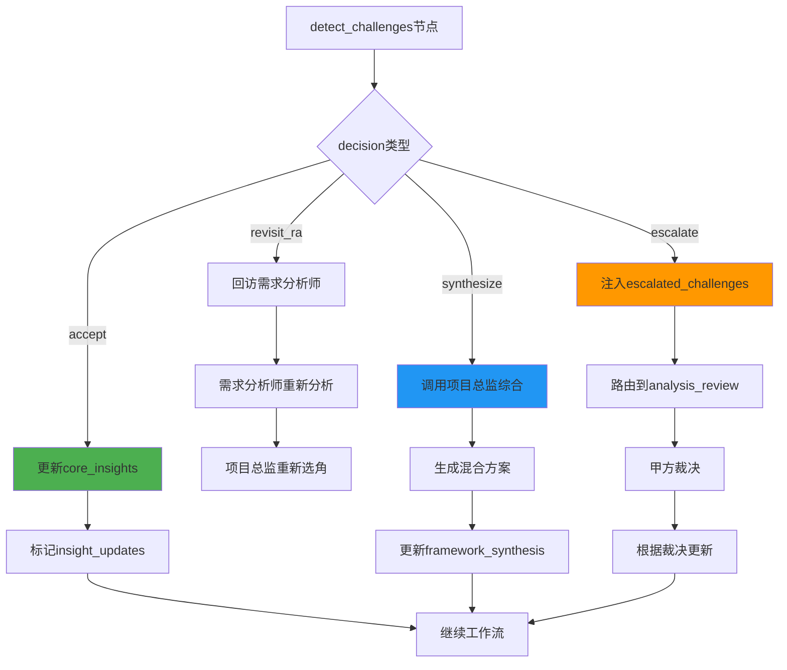

# 专家反馈闭环机制分析

## 🚨 核心问题：只检测,无闭环

### 当前流程



### 代码证据

#### 1. 决策逻辑存在,但执行缺失

**文件**: `dynamic_project_director.py` Line 939-970

```python
def decide_handling(self, challenge: Dict[str, Any], challenge_type: str) -> str:
    if challenge_type == "deeper_insight":
        logger.info(f"📌 决策: 接受专家的更深洞察")
        return "accept"  # ❌ 仅返回字符串,没有实际操作
    
    elif challenge_type == "uncertainty_clarification":
        logger.info(f"📌 决策: 回访需求分析师或用户确认")
        return "revisit_ra"  # ✅ 唯一触发实际行动的
    
    elif challenge_type == "competing_frames":
        logger.info(f"📌 决策: 综合多个诠释框架")
        return "synthesize"  # ❌ 没有综合逻辑
    
    else:
        logger.info(f"📌 决策: 交甲方裁决")
        return "escalate"  # ❌ 没有提交甲方逻辑
```

#### 2. handle_challenges仅统计,不执行

**文件**: `dynamic_project_director.py` Line 971-1023

```python
def handle_challenges(self, detection_result: Dict[str, Any]) -> Dict[str, Any]:
    for challenge in detection_result["challenges"]:
        challenge_type = self.classify_challenge_type(challenge)
        decision = self.decide_handling(challenge, challenge_type)
        
        handling_decisions.append({
            "challenge": challenge,
            "challenge_type": challenge_type,
            "decision": decision  # ❌ 仅记录决策,不执行
        })
        
        # ❌ 只更新标志位,没有实际操作
        if decision == "revisit_ra":
            requires_revisit = True  # → 触发回访
        elif decision == "synthesize":
            requires_synthesis = True  # → ❌ 但没有综合逻辑
        elif decision == "escalate":
            escalated_challenges.append(challenge)  # → ❌ 但没有提交逻辑
```

#### 3. 唯一有效的闭环:revisit_ra

**文件**: `main_workflow.py` Line 1027-1041

```python
def _route_after_challenge_detection(self, state: ProjectAnalysisState) -> str:
    requires_feedback = state.get("requires_feedback_loop", False)
    
    if requires_feedback:  # ✅ 唯一触发实际行动的
        reason = state.get("feedback_loop_reason", "专家挑战需要澄清")
        logger.info(f"🔄 [v3.5] 启动反馈循环: {reason}")
        return "revisit_requirements"  # → 回访需求分析师
    else:
        return "continue_workflow"  # → 继续
```

## 💡 问题总结

| 决策类型 | 当前行为 | 缺失的闭环 |
|---------|---------|-----------|
| **accept** (接受更深洞察) | ❌ 仅记录日志 | 需要更新state中的核心洞察 |
| **revisit_ra** (回访需求分析师) | ✅ 触发反馈循环 | 完整实现 |
| **synthesize** (综合多方案) | ❌ 仅记录日志 | 需要综合多个专家的方案 |
| **escalate** (交甲方裁决) | ❌ 仅记录日志 | 需要提交到analysis_review节点 |

## 🔧 需要实现的闭环机制

### 1. Accept决策的闭环

**场景**: 专家发现更深洞察,挑战需求分析师的判断

**缺失逻辑**:
```python
def _apply_accepted_reinterpretation(state, challenge):
    """接受专家的重新诠释,更新state中的核心洞察"""
    
    # 1. 从challenge中提取专家的新洞察
    expert_role = challenge["expert_role"]
    reinterpretation = challenge["reinterpretation"]
    challenged_item = challenge["challenged_item"]
    
    # 2. 更新state["core_insights"]
    updated_insights = state.get("core_insights", {})
    updated_insights[challenged_item] = {
        "original_interpretation": "需求分析师的原始判断",
        "expert_reinterpretation": reinterpretation,
        "accepted_from": expert_role,
        "timestamp": datetime.now().isoformat()
    }
    
    # 3. 标记为"专家驱动的洞察"
    state["expert_driven_insights"] = updated_insights
    
    # 4. 通知其他专家该洞察已更新
    state["insight_updates"].append({
        "item": challenged_item,
        "new_interpretation": reinterpretation,
        "reason": "专家提出更深洞察"
    })
```

### 2. Synthesize决策的闭环

**场景**: 多个专家提出竞争性框架,需要综合

**缺失逻辑**:
```python
def _synthesize_competing_frames(state, challenges):
    """综合多个专家的竞争性框架"""
    
    # 1. 提取所有竞争性框架
    competing_interpretations = []
    for challenge in challenges:
        if challenge["decision"] == "synthesize":
            competing_interpretations.append({
                "expert": challenge["expert_role"],
                "interpretation": challenge["reinterpretation"],
                "design_impact": challenge.get("design_impact", "")
            })
    
    # 2. 调用项目总监的综合逻辑
    synthesis_prompt = f'''
    检测到{len(competing_interpretations)}个竞争性框架:
    
    {json.dumps(competing_interpretations, ensure_ascii=False, indent=2)}
    
    请综合这些框架,提供:
    1. 共同点和差异点
    2. 推荐的混合方案
    3. 在不同情境下选择哪个框架
    '''
    
    synthesis_result = project_director.synthesize_frameworks(synthesis_prompt)
    
    # 3. 更新state
    state["framework_synthesis"] = {
        "competing_frames": competing_interpretations,
        "synthesis": synthesis_result,
        "recommendation": "根据情境动态选择"
    }
```

### 3. Escalate决策的闭环

**场景**: 专家挑战超出项目总监权限,需要甲方裁决

**缺失逻辑**:
```python
def _escalate_to_client_review(state, escalated_challenges):
    """将挑战提交到甲方审核节点"""
    
    # 1. 格式化挑战为审核问题
    escalated_issues = []
    for challenge in escalated_challenges:
        escalated_issues.append({
            "issue_id": f"CHALLENGE_{challenge['expert_role']}_{datetime.now().strftime('%H%M%S')}",
            "type": "strategic_decision",
            "severity": "high",
            "description": f"{challenge['expert_role']}挑战了'{challenge['challenged_item']}'",
            "expert_rationale": challenge["rationale"],
            "reinterpretation": challenge["reinterpretation"],
            "requires_client_decision": True
        })
    
    # 2. 注入到审核系统
    state["escalated_challenges"] = escalated_issues
    state["requires_client_review"] = True
    
    # 3. 路由到analysis_review节点
    # (在工作流中添加conditional_edges)
    return "analysis_review"
```

## 📊 完整闭环流程设计

### 方案1: 立即执行闭环(推荐)



### 方案2: 延迟到报告生成(次选)

将所有决策记录到state,在`result_aggregator`节点中:
- **accept**: 在报告中标注"采纳专家新洞察"
- **synthesize**: 在报告中并列多个方案
- **escalate**: 在报告中标注"待甲方裁决"

**缺点**: 不会实际改变分析结果,只是记录

## 🎯 推荐实施步骤

### Step 1: 实现accept闭环(优先级P0)

在`detect_and_handle_challenges_node`中添加:

```python
# Line 1070后添加
for decision_item in handling_result["handling_decisions"]:
    if decision_item["decision"] == "accept":
        challenge = decision_item["challenge"]
        _apply_accepted_reinterpretation(updated_state, challenge)
```

### Step 2: 实现synthesize闭环(优先级P1)

在`detect_and_handle_challenges_node`中添加:

```python
if handling_result["requires_synthesis"]:
    synthesis_challenges = [
        d["challenge"] for d in handling_result["handling_decisions"]
        if d["decision"] == "synthesize"
    ]
    _synthesize_competing_frames(updated_state, synthesis_challenges)
```

### Step 3: 实现escalate闭环(优先级P1)

在`_route_after_challenge_detection`中添加escalate路由:

```python
escalated = state.get("challenge_handling", {}).get("escalated_challenges", [])
if escalated:
    logger.warning(f"🚨 检测到{len(escalated)}个需要甲方裁决的挑战")
    return "analysis_review"  # 路由到审核节点
```

### Step 4: 在报告中体现闭环结果(优先级P2)

在`result_aggregator.py`中添加专门章节:

```python
"challenge_resolutions": {
    "accepted_reinterpretations": [...],
    "synthesized_frameworks": [...],
    "escalated_to_client": [...]
}
```

## 🔍 验证方法

### 测试案例1: Accept决策

```python
# 专家输出包含挑战
expert_output = {
    "challenge_flags": [{
        "challenged_item": "核心张力定义",
        "rationale": "真正的张力不是XX,而是YY",
        "reinterpretation": "我的重新诠释是...",
        "design_impact": "这将导向...策略"
    }]
}

# 预期结果
assert "expert_driven_insights" in state
assert state["expert_driven_insights"]["核心张力定义"]["expert_reinterpretation"] == "我的重新诠释是..."
```

### 测试案例2: Synthesize决策

```python
# 多个专家提出竞争性框架
v2_challenge = {"challenged_item": "空间定位", "reinterpretation": "方案A"}
v3_challenge = {"challenged_item": "空间定位", "reinterpretation": "方案B"}

# 预期结果
assert "framework_synthesis" in state
assert len(state["framework_synthesis"]["competing_frames"]) == 2
assert "synthesis" in state["framework_synthesis"]
```

### 测试案例3: Escalate决策

```python
# 专家挑战需要甲方裁决
expert_challenge = {
    "challenged_item": "预算分配",
    "rationale": "超出项目总监权限"
}

# 预期结果
assert state["requires_client_review"] == True
assert len(state["escalated_challenges"]) > 0
assert route == "analysis_review"
```

## 📌 总结

当前系统的专家反馈闭环机制**严重不完整**:

| 机制 | 完成度 | 影响 |
|-----|-------|-----|
| 检测 | ✅ 100% | 能正确检测challenge_flags |
| 分类 | ✅ 100% | 能正确分类4种类型 |
| 决策 | ✅ 100% | 能正确决策处理方式 |
| **执行** | ❌ 25% | **只有revisit_ra有实际行动** |
| **闭环** | ❌ 25% | **其他3种决策只记录日志** |

**必须实施的改进**:
1. ⚠️ **accept决策**: 必须更新state的核心洞察
2. ⚠️ **synthesize决策**: 必须调用综合逻辑生成混合方案
3. ⚠️ **escalate决策**: 必须路由到审核节点交甲方裁决

否则专家的反馈只是"说说而已",没有真正改变分析结果。
