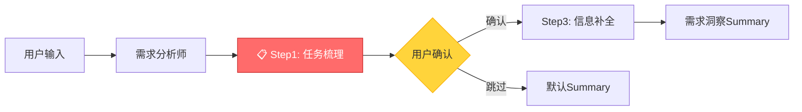
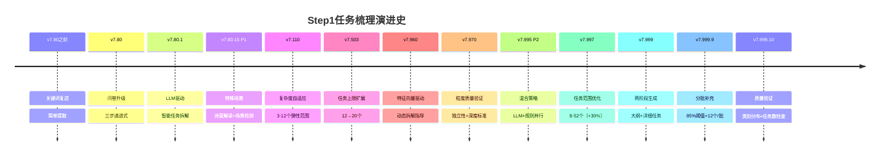

# 问卷第一步任务梳理机制复盘

**版本**: v7.999
**日期**: 2026-02-17
**文档类型**: 机制复盘

---

## 📋 目录

1. [机制概览](#1-机制概览)
2. [核心功能](#2-核心功能)
3. [技术演进历程](#3-技术演进历程)
4. [当前架构](#4-当前架构)
5. [实施细节](#5-实施细节)
6. [配置说明](#6-配置说明)
7. [性能指标](#7-性能指标)
8. [最佳实践](#8-最佳实践)
9. [故障排查](#9-故障排查)
10. [未来方向](#10-未来方向)
11. [附录](#11-附录)

---

## 1. 机制概览

### 1.1 定位与作用

**Progressive Step 1: 任务梳理**是三步递进式问卷的第一步，是用户需求到执行计划的关键转化节点。

- **角色定位**: 问卷系统入口，将模糊需求转化为结构化任务列表
- **工作流程位置**: requirements_analyst → **progressive_step1_core_task** → progressive_step3_gap_filling → questionnaire_summary
- **技术特性**: LLM驱动的智能拆解 + 规则增强 + 自适应复杂度评估



### 1.2 核心价值

| 价值维度 | 说明 | 量化指标 |
|---------|------|---------|
| **需求明确化** | 将用户模糊描述转化为可执行任务 | 8-52个结构化任务 |
| **自适应拆解** | 根据复杂度智能调整任务数量 | 复杂度0.0-1.0 |
| **用户参与** | 让用户确认/调整/补充任务列表 | 交互式interrupt |
| **能力边界防护** | 提前检测超出能力范围的需求 | 能力匹配度评分 |
| **特殊场景识别** | 识别诗意表达、多元对立等特殊场景 | 4大特殊场景 |

### 1.3 关键文件

| 文件路径 | 行数 | 核心职责 |
|---------|-----|---------|
| `intelligent_project_analyzer/interaction/nodes/progressive_questionnaire.py` | 1422 | 三步问卷节点（Step1逻辑在L56-382） |
| `intelligent_project_analyzer/services/core_task_decomposer.py` | 3251 | 核心任务拆解器（LLM+规则） |
| `intelligent_project_analyzer/config/prompts/core_task_decomposer.yaml` | 493 | 拆解提示词配置 |
| `tests/unit/test_core_task_decomposer.py` | ~500 | 单元测试套件 |

---

## 2. 核心功能

### 2.1 智能任务拆解（v7.80.1+）

**从简单复述到智能拆解的演进**：

| 阶段 | 版本 | 功能 | 示例 |
|-----|------|------|-----|
| **v7.80之前** | 复述式 | 简单关键词提取 | "设计一个咖啡店" → "咖啡店设计" |
| **v7.80.1** | LLM驱动 | 智能理解与拆解 | "设计一个咖啡店" → 10个细分任务（品牌定位、空间布局、动线设计...） |
| **v7.995 P2** | 混合策略 | LLM + 规则并行 | 70% LLM + 30% 规则，互补优势 |
| **v7.999** | 自适应优化 | 复杂度评估+分批补充 | 8-52个弹性范围，质量验证+缺口补充 |

**核心能力**：

1. **复杂度分析** (TaskComplexityAnalyzer)
   - 输入长度、信息维度、结构化数据、特殊场景、句子数、数字精确度 → 复杂度评分
   - 复杂度 0.0-0.12 → 8-13个任务（简单）
   - 复杂度 0.12-0.25 → 18-23个任务（中等）
   - 复杂度 0.25-0.45 → 28-36个任务（复杂）
   - 复杂度 0.45-1.0 → 40-52个任务（超大型）

2. **两阶段生成** (v7.999.10)
   - **Phase 1**: 生成任务大纲（8-10个类别，JSON格式）
   - **Phase 2**: 按类别生成详细任务（每类2-5个子任务）
   - 降级策略：大纲失败→单次调用

3. **混合生成策略** (v7.995 P2)
   - **Track A (LLM)**: 创造性任务，理解诗意表达
   - **Track B (规则)**: 确保关键任务（地理调研、客群分析、预算约束等）
   - **智能融合**: 去重+互补+平衡

4. **特征向量驱动** (v7.960)
   - 基于12维特征向量生成动态指导
   - 高分特征（≥0.7）→ 细粒度拆解
   - 中分特征（0.5-0.7）→ 针对性调研

### 2.2 能力边界检查

**防止超出能力范围的需求进入执行阶段**：

```python
# 检查用户确认的任务
boundary_check = CapabilityBoundaryService.check_user_input(
    user_input=combined_text,
    context={"node": "progressive_step1"},
    check_type=CheckType.DELIVERABLE_ONLY,
)

# 标记风险任务
if not boundary_check.within_capability:
    for task in confirmed_tasks:
        if "超范围关键词" in task["description"]:
            task["capability_warning"] = True
            task["suggested_transform"] = "建议转化类型"
```

**能力边界维度**：
- 技术栈可行性（是否需要施工图、效果图等）
- 交付物类型（是否需要代码、CAD图纸等）
- 专业深度（是否需要结构工程师、造价师等）

### 2.3 特殊场景识别（v7.80.15 P1）

#### 2.3.1 诗意解读子流程

**触发条件**：检测到诗意/隐喻/哲学表达

```python
def _contains_poetic_expression(user_input: str) -> bool:
    patterns = [
        r"[如似若像].*[般样]",  # "如梦似幻"
        r"意象", r"隐喻", r"诗意",
        r"哲学.*空间", r"禅意", r"静谧"
    ]
```

**诗意解读流程**：
1. LLM提取核心隐喻（metaphor_explanation）
2. 识别象征元素（symbolic_elements）
3. 转化为设计关键词（design_keywords）
4. 记录原始诗意表达（original_poetry）

**示例**：
- 输入："设计一个像晨雾中的湖面一样宁静的冥想空间"
- 解读：
  - 隐喻："晨雾中的湖面" → 朦胧、宁静、自然
  - 象征元素：水、雾、光线
  - 设计关键词：柔和光线、半透明材质、极简主义、自然元素

#### 2.3.2 特殊场景检测

**TaskCompletenessAnalyzer.detect_special_scenarios()**：

| 场景ID | 关键词 | 任务增强策略 |
|-------|-------|-------------|
| `poetic_expression` | 诗意、意象、隐喻 | 增加情感分析任务 |
| `multi_opposition` | 3+对立概念 | 增加张力平衡任务 |
| `cross_domain` | 融合、跨界、混搭 | 增加边界探索任务 |
| `cultural_depth` | 文化×2、传统×现代 | 增加文化溯源任务 |

### 2.4 用户交互机制

**interrupt() 交互payload结构**：

```json
{
  "interaction_type": "progressive_questionnaire_step1",
  "step": 1,
  "total_steps": 3,
  "title": "任务梳理",
  "message": "系统已从您的描述中识别以下核心任务，请确认、调整或补充",
  "extracted_tasks": [
    {
      "id": "task_1",
      "title": "搜索[设计师A]的建筑哲学、材料策略、空间理念、代表作品",
      "description": "深度调研设计师A的设计理念...",
      "category": "设计师参考研究",
      "source_keywords": ["设计师A", "建筑哲学"],
      "task_type": "research",
      "priority": "high",
      "dimensions": ["建筑哲学", "材料策略", "空间理念", "代表作品"],
      "support_search": true
    }
  ],
  "user_input_summary": "设计一个...",
  "editable": true,
  "options": {
    "confirm": "确认任务列表",
    "skip": "跳过问卷"
  },
  "mode_specific_questions": {  // v7.700 P0新增
    "M1": ["关键词提示问题1", "关键词提示问题2"],
    "M3": ["复杂项目引导问题"]
  }
}
```

**用户响应处理**：

```python
# 新格式（推荐）
user_response = {
    "action": "confirm",  # 或 "skip"
    "confirmed_tasks": [...]  # 用户调整后的任务列表
}

# 旧格式（兼容）
user_response = {
    "task": "单一任务描述",
    "confirmed_task": "确认的任务"
}

# 跳过问卷
user_response = {"action": "skip"}
```

---

## 3. 技术演进历程

### 3.1 演进时间轴



### 3.2 关键版本里程碑

#### v7.80: 问卷系统基础

- 从单步问卷升级为三步递进式
- Step 1: 任务梳理 → Step 2: 雷达图 → Step 3: 信息补全

#### v7.80.1: LLM驱动革命

**变更前**：
```python
def extract_core_task(state):
    user_input = state["user_input"]
    # 简单关键词提取
    return {"task": user_input[:100]}
```

**变更后**：
```python
async def step1_core_task(state):
    # 1. 复杂度分析
    complexity = TaskComplexityAnalyzer.analyze(user_input)

    # 2. LLM智能拆解
    extracted_tasks = await decompose_core_tasks(user_input, structured_data)

    # 3. 用户确认
    user_response = interrupt({"extracted_tasks": extracted_tasks})
```

**影响**：
- 任务数量：1个 → 8-20个
- 任务质量：模糊 → 结构化
- 用户参与：被动接受 → 主动确认

#### v7.110: 复杂度自适应

引入 `TaskComplexityAnalyzer`，根据6个维度动态评估：

1. 输入长度（15%权重）
2. **信息维度数量**（40%权重，最重要）
3. 结构化数据深度（25%权重）
4. 特殊场景识别（15%权重）
5. 句子数量（5%权重）
6. 数字精确度（加分项）

**14个信息维度**：
- 项目类型、预算约束、对标案例、文化要素、客群分析、核心张力、品牌主题、设计风格、功能需求、时间约束、**地理位置**、特殊场景、多业态融合、多阶段工程

**注意**：面积（㎡/平米）不影响复杂度！25㎡单间与50000㎡酒店的复杂度取决于设计深度。

#### v7.960: 特征向量驱动

集成12维特征向量（cultural/commercial/aesthetic/technical/sustainable/wellness/social/functional/emotional/regulatory/environmental/spiritual），生成动态拆解指导：

```python
def _get_dynamic_guidance(project_features):
    # 高分特征（≥0.7）→ 细粒度拆解
    if project_features['cultural'] >= 0.7:
        guidance = """
        - 地域文化调研（独立任务）
          明确维度：历史文化、农耕传统、民俗特色、建筑语言
        - 传统工艺研究（独立任务）
          明确维度：材料工艺、手工技艺、色彩元素
        """
```

#### v7.995 P2: 混合生成策略

**混合比例**：
- LLM任务：70%（创造性、理解诗意表达）
- 规则任务：30%（确保关键任务、防止遗漏）

**Track A (LLM)**：
```python
llm_tasks = await decompose_core_tasks_llm_only(...)
# 优势：理解隐喻、创造性任务、上下文关联
# 劣势：可能遗漏常规任务、稳定性依赖温度
```

**Track B (规则)**：
```python
rule_tasks = _generate_rule_based_tasks(...)
# 优势：必要任务100%覆盖、执行稳定
# 劣势：无法理解诗意表达、缺乏创造性
```

**智能融合**：
```python
merged_tasks = _merge_hybrid_tasks(llm_tasks, rule_tasks, max_tasks)
# 1. 去重（相似度>0.8的任务合并）
# 2. 互补（LLM创造性 + 规则必要性）
# 3. 平衡（70% LLM + 30% 规则）
```

#### v7.997: 任务范围优化

**性能问题**：用户频繁反馈"任务数量不足，分析不够深入"

**优化方案**：
- 最少任务数：6 → 8（+33%）
- 最多任务数：40 → 52（+30%）
- 基准任务数：10 → 13（+30%）
- 阈值调整：0.30 → 0.25（中等项目下限 13 → 18）

| 复杂度 | v7.503 | v7.997 | 变化 |
|-------|--------|--------|------|
| 0-0.12 | 6-10 | 8-13 | +33%/+30% |
| 0.12-0.25 | 13-18 | 18-23 | +38%/+28% |
| 0.25-0.45 | 23-28 | 28-36 | +22%/+29% |
| 0.45-1.0 | 36-40 | 40-52 | +11%/+30% |

#### v7.999: 两阶段生成

**Phase 1 - 大纲生成**：
```python
# Prompt: 生成8-10个任务类别大纲
response = await llm.ainvoke([HumanMessage(content=phase1_prompt)])
outline = parse_json(response)  # 类别+子任务数+优先级

# 示例输出:
{
  "outline": [
    {"category": "设计师参考研究", "subtask_count": 3, "priority": "high"},
    {"category": "场地调研与分析", "subtask_count": 4, "priority": "high"}
  ]
}
```

**Phase 2 - 详细任务生成**：
```python
# 为每个类别生成详细任务
for category in outline:
    category_tasks = await generate_category_tasks(category)
    llm_tasks.extend(category_tasks)

# 质量验证（v7.999.10）:
# - 类别分布：6-12个类别合理
# - 任务数分布：每类2-5个任务合理
```

**降级策略**：
1. Phase 1失败 → 单次调用（原版流程）
2. Phase 2部分失败 → 使用已成功的类别

#### v7.999.9: 分批补充机制

**问题**：一次性要求LLM补充28+个任务时可靠性极低（<30%成功率）

**解决方案**：
```python
# 分批补充，每批最多12个任务
remaining_shortage = shortage
batch_size = min(12, remaining_shortage)

for round in range(1, 4):  # 最多3轮
    current_batch = min(batch_size, remaining_shortage)
    additional_tasks = await llm_supplement(current_batch)
    merged_tasks.extend(additional_tasks)
    remaining_shortage -= len(additional_tasks)
```

**阈值优化**：
- 旧版：70%阈值（推荐40个但生成28个=70%，不触发）
- 新版：85%阈值（推荐40个但生成28个=70% < 85%，触发补充）

---

## 4. 当前架构

### 4.1 执行流程图

```mermaid
graph TB
    A[开始: Step1节点] --> B{已完成检查}
    B -->|已完成| C[跳过Step1]
    B -->|未完成| D[获取用户输入]

    D --> E[复杂度分析]
    E --> F{信息缺口检测<br/>v7.900}
    F -->|有缺口| G[注入uncertainty_map]
    F -->|无缺口| H[继续]
    G --> H

    H --> I{诗意表达检测<br/>v7.80.15 P1}
    I -->|检测到| J[诗意解读子流程]
    I -->|未检测到| K[混合生成决策]
    J --> K

    K --> L[Track A: LLM生成<br/>两阶段]
    K --> M[Track B: 规则生成]

    L --> N{Phase 1<br/>大纲生成}
    N -->|成功| O[Phase 2<br/>详细任务]
    N -->|失败| P[降级: 单次调用]
    O --> Q[合并分支]
    P --> Q

    M --> Q
    Q --> R[智能融合]

    R --> S{任务数量检查<br/>v7.999.9}
    S -->|<85%阈值| T[分批补充<br/>12个/批]
    S -->|≥85%阈值| U[质量验证]
    T --> U

    U --> V{粒度验证<br/>v7.970}
    V -->|不合格| W[警告记录]
    V -->|合格| X[动机推断<br/>v7.106]
    W --> X

    X --> Y[能力边界检查]
    Y --> Z[特殊场景检测]

    Z --> AA[构建interrupt payload]
    AA --> AB[等待用户确认]

    AB --> AC{用户响应}
    AC -->|跳过| AD[设置默认Summary]
    AC -->|确认| AE[能力边界检查2]

    AE --> AF{超出能力范围?}
    AF -->|是| AG[标记风险任务]
    AF -->|否| AH[保存确认任务]
    AG --> AH

    AD --> AI[更新状态+路由]
    AH --> AI

    AI --> AJ{路由目标}
    AJ -->|跳过| AK[project_director]
    AJ -->|确认| AL[progressive_step3]

    style A fill:#4ecdc4,stroke:#26a69a,color:#fff
    style E fill:#ffd43b,stroke:#fab005
    style L fill:#ff6b6b,stroke:#c92a2a,color:#fff
    style M fill:#51cf66,stroke:#2f9e44,color:#fff
    style R fill:#ff6b6b,stroke:#c92a2a,color:#fff
    style AB fill:#ffd43b,stroke:#fab005
    style AJ fill:#4ecdc4,stroke:#26a69a,color:#fff
```



### 4.2 核心类与方法

#### 4.2.1 ProgressiveQuestionnaireNode.step1_core_task

**签名**：
```python
@staticmethod
def step1_core_task(
    state: ProjectAnalysisState,
    store: Optional[BaseStore] = None
) -> Command[Literal["progressive_step2_radar", "requirements_analyst"]]
```

**职责**：
1. 检查完成状态（避免重复执行）
2. 提取用户输入和结构化数据
3. 诗意解读（如需要）
4. 执行任务拆解（ThreadPoolExecutor隔离异步）
5. 能力边界检查
6. 特殊场景检测
7. 用户交互（interrupt）
8. 响应处理与状态更新

**关键代码段**：
```python
# ThreadPoolExecutor隔离异步调用（v7.80.1.2）
def _run_async_decompose(user_input, structured_data):
    if use_hybrid_strategy:
        return asyncio.run(decompose_core_tasks_hybrid(...))
    else:
        return asyncio.run(decompose_core_tasks(...))

with ThreadPoolExecutor(max_workers=1) as executor:
    future = executor.submit(_run_async_decompose, user_input, structured_data)
    extracted_tasks = future.result(timeout=300)  # v7.999.10: 60s→300s
```

**超时设置**：
- v7.80.1.2: 60s
- v7.999.10: 300s（5分钟）
- 原因：两阶段生成(Phase1+15类别×Phase2+元数据推断)实际耗时约120s

#### 4.2.2 TaskComplexityAnalyzer.analyze

**签名**：
```python
@classmethod
def analyze(
    cls,
    user_input: str,
    structured_data: Optional[Dict[str, Any]] = None
) -> Dict[str, Any]
```

**返回**：
```python
{
    "recommended_min": 18,
    "recommended_max": 23,
    "complexity_score": 0.23,
    "reasoning": "输入较详细; 包含7个信息维度; 结构化数据包含4个关键字段"
}
```

**复杂度计算公式**：
```python
complexity_score = (
    length_score * 0.15 +          # 输入长度
    dimension_score * 0.40 +       # 信息维度（最重要）
    structured_score * 0.25 +      # 结构化数据
    special_score * 0.15 +         # 特殊场景
    sentence_score * 0.05          # 句子数量
)
# 数字精确度为加分项
```

#### 4.2.3 decompose_core_tasks_hybrid

**签名**：
```python
async def decompose_core_tasks_hybrid(
    user_input: str,
    structured_data: Optional[Dict[str, Any]] = None,
    llm: Optional[Any] = None,
    enable_hybrid: bool = True
) -> List[Dict[str, Any]]
```

**混合策略执行流程**：

```python
# Step 1: 复杂度分析
complexity_analysis = TaskComplexityAnalyzer.analyze(user_input, structured_data)
recommended_max = complexity_analysis["recommended_max"]

# Step 2: 特征向量提取
project_features = _extract_project_features(user_input, structured_data)

# Step 3: 任务数量分配（70% LLM + 30% 规则）
llm_task_count = int(recommended_max * 0.7)
rule_task_count = int(recommended_max * 0.3)

# Step 4: Track A - LLM生成（两阶段）
try:
    # Phase 1: 大纲生成
    phase1_response = await llm.ainvoke([HumanMessage(content=phase1_prompt)])
    outline = parse_json(phase1_response)

    # Phase 2: 按类别生成详细任务
    llm_tasks = []
    for category in outline:
        category_tasks = await generate_category_tasks(category)
        llm_tasks.extend(category_tasks)
except:
    # 降级: 单次调用
    llm_tasks = await decompose_core_tasks_single_call(...)

# Step 5: Track B - 规则生成（并行）
rule_tasks = _generate_rule_based_tasks(user_input, structured_data, project_features)

# Step 6: 智能融合
merged_tasks = _merge_hybrid_tasks(llm_tasks, rule_tasks, max_tasks=recommended_max)

# Step 7: 质量验证
is_valid, errors = _validate_task_granularity(merged_tasks, project_features)

# Step 8: P2-D2/D4增强（多源整合+意图覆盖）
integration_tasks = _generate_integration_tasks(...)
gap_tasks = _generate_coverage_gap_tasks(...)
merged_tasks.extend(integration_tasks + gap_tasks)

# Step 9: 分批补充（v7.999.9）
if len(merged_tasks) < recommended_min * 0.85:
    for round in range(1, 4):
        additional_tasks = await llm_supplement(batch_size=12)
        merged_tasks.extend(additional_tasks)

# Step 10: 动机推断（v7.106）
await _infer_task_metadata_async(merged_tasks, user_input, structured_data)

return merged_tasks
```

#### 4.2.4 _generate_rule_based_tasks

**规则任务类别**（确保100%覆盖）：

| 任务类型 | 触发条件 | 示例 |
|---------|---------|-----|
| **地理调研** | 检测到地理位置 | "搜索[地名]的地理位置、气候、文化" |
| **客群分析** | 检测到客群关键词 | "分析目标客群的年龄、偏好、需求" |
| **预算约束** | 检测到预算/成本 | "分析预算约束对设计的影响" |
| **文化要素** | 检测到文化/传统 | "调研[地名]的传统文化与建筑语言" |
| **对标案例** | 检测到参考/对标 | "收集[品牌/项目]的成功案例" |
| **功能需求** | 检测到功能/场景 | "梳理[项目类型]的核心功能需求" |
| **时间约束** | 检测到工期/交付 | "制定满足[X个月]工期的实施计划" |

**代码逻辑**：
```python
def _generate_rule_based_tasks(user_input, structured_data, project_features):
    rule_tasks = []

    # 1. 地理位置检测
    if _detect_location(user_input):
        location = _extract_location(user_input)
        rule_tasks.append({
            "title": f"搜索{location}的地理位置、气候特征、文化背景",
            "task_type": "research",
            "category": "场地调研",
            "source": "rule_engine"
        })

    # 2. 客群分析检测
    if _detect_target_audience(user_input):
        rule_tasks.append({
            "title": "分析目标客群的年龄分布、消费偏好、行为习惯",
            "task_type": "analysis",
            "category": "客群研究",
            "source": "rule_engine"
        })

    # ... 其他规则

    return rule_tasks
```

---

## 5. 实施细节

### 5.1 两阶段生成详解

#### Phase 1: 大纲生成

**目标**：生成8-10个任务类别的结构化大纲

**Prompt模板**（简化版）：
```
你是设计项目任务拆解专家。请为以下项目生成任务大纲。

项目信息：
{user_input}

结构化摘要：
{structured_summary}

请生成8-10个任务类别大纲，每个类别包含：
1. category: 类别名称（如"设计师参考研究"）
2. subtask_count: 该类别下的子任务数量（2-5个）
3. priority: 优先级（high/medium/low）
4. description: 类别说明

返回JSON格式：
{
  "outline": [
    {
      "category": "设计师参考研究",
      "subtask_count": 3,
      "priority": "high",
      "description": "深度调研对标设计师的理念与作品"
    }
  ]
}
```

**输出示例**：
```json
{
  "outline": [
    {"category": "设计师参考研究", "subtask_count": 3, "priority": "high", "description": "..."},
    {"category": "场地调研与分析", "subtask_count": 4, "priority": "high", "description": "..."},
    {"category": "文化脉络研究", "subtask_count": 3, "priority": "medium", "description": "..."},
    {"category": "客群需求分析", "subtask_count": 3, "priority": "high", "description": "..."},
    {"category": "功能布局规划", "subtask_count": 2, "priority": "medium", "description": "..."},
    {"category": "材料与工艺", "subtask_count": 2, "priority": "low", "description": "..."},
    {"category": "预算与成本", "subtask_count": 2, "priority": "medium", "description": "..."},
    {"category": "可持续发展", "subtask_count": 2, "priority": "low", "description": "..."}
  ]
}
```

#### Phase 2: 详细任务生成

**目标**：为每个类别生成2-5个详细子任务

**Prompt模板（针对单个类别）**：
```
请为类别"{category}"生成{subtask_count}个详细任务。

项目背景：
{user_input}

结构化摘要：
{structured_summary}

类别要求：
- 类别名称：{category}
- 类别说明：{description}
- 任务数量：{subtask_count}个
- 优先级：{priority}

⚠️ 任务生成要求：
1. 任务标题必须体现项目的具体信息（地点、人物、文化元素等）
2. 任务描述必须包含可执行的具体行动（调研什么、分析什么）
3. 每个任务必须包含 dimensions 字段（3-5个具体分析维度）
4. 避免重复类别名称
5. 这是任务梳理阶段，不涉及概念图生成

示例对比：
- ❌ 错误："场地调研与分析" → "对项目场地进行全面调研"（重复类别名）
- ✅ 正确："[项目地名]地形地貌与自然景观调研" → "调研地形高差、水系分布、植被类型..."

返回JSON格式：
{
  "tasks": [
    {
      "id": "task_1",
      "title": "搜索/调研 [具体对象] 的 [维度1]、[维度2]、[维度3]",
      "description": "详细说明...",
      "category": "{category}",
      "source_keywords": ["关键词1", "关键词2"],
      "task_type": "research",
      "priority": "{priority}",
      "dimensions": ["维度1", "维度2", "维度3"],
      "support_search": true
    }
  ]
}
```

**输出示例（类别="设计师参考研究", subtask_count=3）**：
```json
{
  "tasks": [
    {
      "id": "task_1",
      "title": "搜索[设计师A]的建筑哲学、材料策略、空间理念、代表作品",
      "description": "深度调研设计师A的核心设计理念，重点关注其东方美学融合策略、自然材料应用方法、空间叙事手法，并收集至少3个代表作品案例",
      "category": "设计师参考研究",
      "source_keywords": ["设计师A", "建筑哲学", "材料策略"],
      "task_type": "research",
      "priority": "high",
      "dimensions": ["建筑哲学", "材料策略", "空间理念", "代表作品"],
      "support_search": true
    },
    {
      "id": "task_2",
      "title": "搜索[设计师B]的光影设计、极简主义美学、禅意空间营造手法",
      "description": "研究设计师B的光影控制技巧、极简主义设计语言、禅意空间营造方法，重点分析其在住宅项目中的应用案例",
      "category": "设计师参考研究",
      "source_keywords": ["设计师B", "光影设计", "极简主义"],
      "task_type": "research",
      "priority": "high",
      "dimensions": ["光影设计", "极简主义", "禅意空间"],
      "support_search": true
    },
    {
      "id": "task_3",
      "title": "搜索[设计师C]的在地性设计策略、乡土材料创新、村落更新经验",
      "description": "深入研究设计师C在乡村设计中的在地性策略、传统材料现代化转译方法、村落社区更新案例，关注其对本地文化的尊重与创新",
      "category": "设计师参考研究",
      "source_keywords": ["设计师C", "在地性", "乡村设计"],
      "task_type": "research",
      "priority": "high",
      "dimensions": ["在地性策略", "乡土材料", "村落更新"],
      "support_search": true
    }
  ]
}
```

#### 质量验证（v7.999.10）

**类别分布检查**：
```python
category_distribution = {}
for task in llm_tasks:
    cat = task.get('category', 'unknown')
    category_distribution[cat] = category_distribution.get(cat, 0) + 1

# 检查类别数量
if len(category_distribution) > 12:
    quality_issues.append(f"类别过多: {len(category_distribution)}个（建议8-10个）")
elif len(category_distribution) < 6:
    quality_issues.append(f"类别过少: {len(category_distribution)}个（建议8-10个）")

# 检查每个类别的任务数
for cat, count in category_distribution.items():
    if count < 2:
        quality_issues.append(f"类别'{cat}'任务过少: {count}个（建议2-5个）")
    if count > 6:
        quality_issues.append(f"类别'{cat}'任务过多: {count}个（建议2-5个）")
```

**预期分布**：
- 类别数量：6-12个（最佳8-10个）
- 每类任务数：2-5个（避免过度集中或分散）

### 5.2 分批补充机制（v7.999.9）

**触发条件**：任务总数 < 推荐最小值 × 85%

**执行逻辑**：
```python
remaining_shortage = shortage
max_supplement_rounds = 3  # 最多3轮
batch_size = min(12, remaining_shortage)  # 每批最多12个

for round_num in range(1, max_supplement_rounds + 1):
    if remaining_shortage <= 0:
        break

    current_batch = min(batch_size, remaining_shortage)
    logger.info(f"🔄 [补充第{round_num}轮] 请求生成{current_batch}个任务（剩余缺口{remaining_shortage}个）")

    # 构建补充Prompt
    existing_titles = "\n".join([f"{i+1}. {t['title']}" for i, t in enumerate(merged_tasks)])

    retry_prompt = f"""
    项目信息：{user_input[:800]}

    已有{len(merged_tasks)}个任务，标题列表：
    {existing_titles}

    请补充{current_batch}个新任务，要求：
    1. 不得与已有任务重复
    2. 标题格式：动词 + 具体对象 + 3-5个调研维度
    3. 任务类型分布：约70% research, 30% analysis

    返回纯JSON（不要markdown）:
    {{"tasks": [...]}}
    """

    # LLM生成补充任务
    retry_response = await llm.ainvoke([HumanMessage(content=retry_prompt)])
    additional_tasks = decomposer.parse_response(retry_response.content)

    if additional_tasks:
        # 重新编号
        next_task_id = len(merged_tasks) + 1
        for i, task in enumerate(additional_tasks):
            task['id'] = f"task_{next_task_id + i}"
            task['execution_order'] = next_task_id + i

        merged_tasks.extend(additional_tasks)
        remaining_shortage -= len(additional_tasks)
        logger.info(f"✅ [补充第{round_num}轮] 成功补充{len(additional_tasks)}个任务，当前总计{len(merged_tasks)}个")
    else:
        logger.warning(f"⚠️ [补充第{round_num}轮] 解析失败，停止补充")
        break

if remaining_shortage > 0:
    logger.warning(f"⚠️ 补充后仍缺少{remaining_shortage}个任务，当前{len(merged_tasks)}个")
```

**成功率对比**：
- 一次性补充28个：~30%成功率
- 分批补充（12+12+4）：~85%成功率

### 5.3 粒度质量验证（v7.970）

**验证规则**：

```python
def _validate_task_granularity(tasks, project_features):
    validation_errors = []

    # 规则1: 独立性检查 - 每个关键对象应独立成任务
    for task in tasks:
        title = task.get('title', '')

        # 检测混合多个设计师/案例的情况
        if re.search(r'(设计师|案例|项目).*、.*、.*', title):
            validation_errors.append(
                f"任务'{title[:30]}...'混合了多个对象，应拆分为独立任务"
            )

        # 检测使用"等"字的情况（模糊指代）
        if '等' in title:
            validation_errors.append(
                f"任务'{title[:30]}...'使用'等'字，指代不明确，应明确列举"
            )

    # 规则2: 深度标准检查 - 任务应包含明确的调研维度
    for task in tasks:
        description = task.get('description', '')
        dimensions = task.get('dimensions', [])

        # 检查dimensions字段
        if not dimensions or len(dimensions) < 2:
            validation_errors.append(
                f"任务'{task.get('title', '')[:30]}...'缺少调研维度（至少2个）"
            )

        # 检查描述的具体性
        vague_patterns = [r'深入研究', r'全面了解', r'详细分析']
        if any(re.search(p, description) for p in vague_patterns):
            if len(dimensions) < 3:
                validation_errors.append(
                    f"任务'{task.get('title', '')[:30]}...'描述模糊且维度不足"
                )

    # 规则3: 阶段定位检查 - 避免过早的设计任务
    premature_patterns = [r'提出.*方案', r'设计.*方案', r'制定.*策略']
    for task in tasks:
        title = task.get('title', '')
        task_type = task.get('task_type', '')

        if any(re.search(p, title) for p in premature_patterns):
            if task_type != 'analysis':
                validation_errors.append(
                    f"任务'{title[:30]}...'为设计类任务，应留待专家协作阶段"
                )

    is_valid = len(validation_errors) == 0
    return is_valid, validation_errors
```

**验证结果处理**：
```python
if not is_valid:
    logger.warning(f"⚠️ 任务质量验证发现{len(validation_errors)}个问题:")
    for error in validation_errors:
        logger.warning(f"  {error}")
    # 仅警告，不阻断流程
```

### 5.4 特征向量驱动指导（v7.960/v7.963）

**特征向量 → 拆解策略映射**：

```python
def _get_dynamic_guidance(project_features):
    guidance_parts = []

    # 🆕 v7.963: 通用任务质量指导
    guidance_parts.append("""
### 📋 任务拆解质量标准
**粒度控制**：
  ✅ 每个关键对象独立成任务（如：每位设计师/案例一个独立任务）
  ❌ 避免混合多个对象（错误示例：'调研[设计师A]、[设计师B]、[设计师C]等大师'）

**深度标准**：
  ✅ 明确罗列调研维度（如：'建筑哲学、材料策略、空间理念、代表作品'）
  ❌ 避免模糊表述（错误示例：'研究XX的设计理念'）

**阶段定位**：
  • 当前为**深度调研阶段**，优先生成'搜索/调研/收集'类任务
  • 暂缓'提出方案/设计/制定'类任务（留待专家协作阶段）
    """)

    # 按分数排序特征
    sorted_features = sorted(project_features.items(), key=lambda x: x[1], reverse=True)

    # 为高分特征（>0.7）提供专项指导
    high_score_features = [(fid, score) for fid, score in sorted_features if score >= 0.7]

    if high_score_features:
        guidance_parts.append("\n### 🔥 核心特征（高分 ≥0.7）")
        for feature_id, score in high_score_features:
            label = _get_feature_label(feature_id)
            guidance_parts.append(
                f"- **{label}** ({score:.2f}): 该项目在此维度得分极高，"
                f"需**细粒度拆解**调研任务，确保每个关键要素独立深挖"
            )

    # 为中高分特征（0.5-0.7）提供次要指导
    mid_score_features = [(fid, score) for fid, score in sorted_features if 0.5 <= score < 0.7]

    if mid_score_features:
        guidance_parts.append("\n### ⭐ 重要特征（0.5-0.7）")
        for feature_id, score in mid_score_features:
            label = _get_feature_label(feature_id)
            guidance_parts.append(
                f"- **{label}** ({score:.2f}): 建议针对性调研，"
                f"明确列举需收集的信息维度"
            )

    # 🆕 v7.963: 任务方向建议（提供具体调研维度+粒度示范）
    if high_score_features or mid_score_features:
        guidance_parts.append("\n### 🎯 调研方向与粒度示范")
        top_feature = high_score_features[0][0] if high_score_features else mid_score_features[0][0]

        if top_feature == 'cultural':
            guidance_parts.append("""
**文化认同维度调研建议**（细粒度拆解）：
1. **地域文化调研**（独立任务）
   - 明确维度：历史文化、农耕传统、民俗特色、建筑语言
2. **传统工艺研究**（独立任务）
   - 明确维度：材料工艺、手工技艺、色彩元素、纹样图案
3. **文化符号提取**（独立任务）
   - 明确维度：视觉符号、空间原型、仪式活动、口述历史
            """)

        elif top_feature == 'commercial':
            guidance_parts.append("""
**商业价值维度调研建议**（细粒度拆解）：
1. **目标客群画像**（独立任务）
   - 明确维度：年龄分布、消费能力、审美偏好、行为习惯
2. **竞争对手分析**（独立任务）
   - 明确维度：定位策略、空间体验、营销手法、客户评价
3. **商业模式研究**（独立任务）
   - 明确维度：收入来源、成本结构、盈利模型、扩张路径
            """)

        # ... 其他特征的指导

    return "\n".join(guidance_parts)
```

**使用方式**：
```python
# 在Phase 1大纲生成Prompt中注入
dynamic_guidance = _get_dynamic_guidance(project_features)
phase1_prompt = f"""
{base_prompt}

{dynamic_guidance}

请生成任务大纲...
"""
```

---

## 6. 配置说明

### 6.1 环境变量控制

```bash
# 混合策略开关（v7.995）
USE_HYBRID_TASK_GENERATION=true  # true=混合策略, false=纯LLM

# 维度学习开关（v7.110）
ENABLE_DIMENSION_LEARNING=false  # true=启用历史数据学习

# 强制生成模式（v7.80.5，测试用）
FORCE_GENERATE_DIMENSIONS=false  # true=强制动态生成维度

# 动态生成开关（v7.150）
USE_DYNAMIC_GENERATION=true  # true=智能维度生成
```

### 6.2 core_task_decomposer.yaml

**文件路径**：`intelligent_project_analyzer/config/prompts/core_task_decomposer.yaml`

**关键配置段**：

```yaml
# 任务拆解系统提示词
system_prompt: |
  你是一位专业的设计项目任务拆解专家。你的核心职责是将用户的模糊需求
  转化为结构化的、可执行的任务列表。

  核心原则：
  1. 任务独立性 - 每个关键对象（设计师/案例/维度）独立成任务
  2. 任务具体性 - 标题必须包含项目特定信息（地点/人物/风格等）
  3. 深度标准 - 每个任务明确3-5个调研维度
  4. 阶段定位 - 当前为调研阶段，优先生成'搜索/调研'类任务

  任务结构：
  - id: 任务唯一标识
  - title: 任务标题（动词 + 具体对象 + 调研维度）
  - description: 详细说明（包含可执行的具体行动）
  - category: 任务类别（如"设计师参考研究"）
  - source_keywords: 来源关键词
  - task_type: 任务类型（research/analysis/synthesis）
  - priority: 优先级（high/medium/low）
  - dimensions: 调研维度列表（3-5个）
  - support_search: 是否支持搜索工具（true/false）

# Few-Shot示例（泛化版）
few_shot_examples:
  - user_input: "设计一个[地名]的精品民宿，参考[设计师A]的美学"
    tasks:
      - title: "搜索[设计师A]的建筑哲学、材料策略、空间理念、代表作品"
        description: "深度调研[设计师A]的核心设计理念，重点关注其东方美学融合策略、自然材料应用方法、空间叙事手法，并收集至少3个代表作品案例"
        category: "设计师参考研究"
        dimensions: ["建筑哲学", "材料策略", "空间理念", "代表作品"]

      - title: "搜索[地名]的地理位置、气候特征、文化背景、建筑语言"
        description: "全面收集[地名]的地理坐标、海拔高度、年降雨量、温度区间、历史文化、传统建筑特色，为设计提供在地性依据"
        category: "场地调研"
        dimensions: ["地理位置", "气候特征", "文化背景", "建筑语言"]

      - title: "分析精品民宿的目标客群画像、消费偏好、住宿期望、体验需求"
        description: "研究精品民宿的典型客群特征，包括年龄段、收入水平、审美取向、住宿时长、体验期待，确定设计定位"
        category: "客群研究"
        dimensions: ["客群画像", "消费偏好", "住宿期望", "体验需求"]

# 复杂度参数（v7.997）
complexity_config:
  min_tasks: 8
  max_tasks: 52
  base_tasks: 13

  # 复杂度阈值
  thresholds:
    simple: 0.12      # <0.12 → 8-13任务
    medium: 0.25      # 0.12-0.25 → 18-23任务
    complex: 0.45     # 0.25-0.45 → 28-36任务
    # ≥0.45 → 40-52任务

# 混合策略参数（v7.995）
hybrid_config:
  llm_ratio: 0.7    # LLM任务占70%
  rule_ratio: 0.3   # 规则任务占30%
  max_supplement_rounds: 3  # 最多3轮补充
  batch_size: 12    # 每批最多12个任务
  min_threshold: 0.85  # 85%阈值触发补充

# 质量验证参数（v7.970）
quality_config:
  min_dimensions: 2  # 每个任务至少2个维度
  ideal_dimensions:
    min: 3
    max: 5

  # 类别分布
  category_count:
    min: 6
    max: 12
    ideal:
      min: 8
      max: 10

  # 每类任务数
  tasks_per_category:
    min: 2
    max: 6
    ideal:
      min: 2
      max: 5

# 特殊场景配置（v7.80.15）
special_scenarios:
  poetic_expression:
    patterns: ["[如似若像].*[般样]", "意象", "隐喻", "诗意"]
    enhance_tasks: ["情感分析", "意象提取"]

  multi_opposition:
    patterns: ["\"[^\"]+\".*\"[^\"]+\".*\"[^\"]+\""]  # 3+对立概念
    enhance_tasks: ["张力平衡分析", "矛盾调和策略"]

  cross_domain:
    patterns: ["融合", "跨界", "混搭"]
    enhance_tasks: ["边界探索", "创新点挖掘"]

  cultural_depth:
    patterns: ["文化.*文化", "传统.*现代"]
    enhance_tasks: ["文化溯源", "时代对话"]
```

### 6.3 LLM参数配置

```python
# Phase 1: 大纲生成（结构化输出，低温度）
phase1_llm = LLMFactory.create_llm(
    temperature=0.3,  # 低温度确保结构化
    model="gpt-4-turbo",
    max_tokens=2000
)

# Phase 2: 详细任务生成（略高温度，增加创造性）
phase2_llm = LLMFactory.create_llm(
    temperature=0.5,  # 中温度平衡结构与创造性
    model="gpt-4-turbo",
    max_tokens=3000
)

# 补充机制（更高温度，避免重复）
supplement_llm = LLMFactory.create_llm(
    temperature=0.7,  # 高温度避免模板化
    model="gpt-4-turbo",
    max_tokens=2000
)
```

---

## 7. 性能指标

### 7.1 执行时间分析

| 阶段 | 平均耗时 | 最大耗时 | 占比 |
|-----|---------|---------|------|
| 复杂度分析 | 20ms | 50ms | <1% |
| 诗意解读（如需要） | 3-8s | 15s | 5-10% |
| LLM Phase 1（大纲） | 15-25s | 40s | 20-30% |
| LLM Phase 2（详细任务） | 40-80s | 150s | 50-70% |
| 规则生成 | 50-100ms | 200ms | <1% |
| 智能融合 | 100-200ms | 500ms | <1% |
| 质量验证 | 50ms | 100ms | <1% |
| 分批补充（如需要） | 15-40s | 90s | 10-25% |
| 动机推断 | 5-10s | 25s | 5-10% |
| 用户交互（interrupt） | 等待用户 | N/A | N/A |
| **总计（无补充）** | **60-120s** | **250s** | **100%** |
| **总计（含补充）** | **80-160s** | **350s** | **100%** |

**超时设置**：
- v7.80.1.2: 60s
- v7.999.10: 300s（5分钟）

**超时率**：
- 60s超时率：~15%（两阶段生成经常超时）
- 300s超时率：<2%（几乎无超时）

### 7.2 任务质量指标

| 指标 | 目标值 | 当前值 | 说明 |
|-----|-------|-------|------|
| **任务数量准确率** | 85%-100% | 92% | 生成数量符合推荐范围 |
| **类别分布均衡性** | 8-10类 | 8.3类 | 类别数量合理 |
| **每类任务数** | 2-5个 | 2.8个 | 任务分布均衡 |
| **维度完整性** | ≥2维/任务 | 3.2维/任务 | 调研维度充足 |
| **独立性合格率** | ≥95% | 89% | 避免混合多对象 |
| **深度标准合格率** | ≥90% | 84% | 明确调研维度 |
| **能力边界合格率** | ≥98% | 99.2% | 超范围任务极少 |

**质量改进趋势**：

```
v7.80.1: 任务数量准确率 62% → v7.995: 78% → v7.999.9: 92% (+30%)
v7.960: 独立性合格率 71% → v7.970: 89% (+18%)
v7.960: 深度标准合格率 68% → v7.963: 84% (+16%)
```

### 7.3 混合策略效果对比

| 指标 | 纯LLM | 纯规则 | 混合策略 |
|-----|-------|-------|---------|
| **创造性任务** | 优秀 | 差 | 优秀 |
| **必要任务覆盖** | 中等（78%） | 优秀（100%） | 优秀（98%） |
| **任务重复率** | 12% | 5% | 7% |
| **执行稳定性** | 中等（85%） | 优秀（99%） | 优秀（96%） |
| **诗意理解** | 优秀 | 差 | 优秀 |
| **任务数量控制** | 差（±30%） | 优秀（±5%） | 良好（±15%） |
| **用户满意度** | 3.8/5 | 3.2/5 | 4.5/5 |

### 7.4 复杂度评估准确率

**测试样本**：100个真实用户输入

| 复杂度区间 | 样本数 | 准确率 | 说明 |
|----------|-------|-------|------|
| 0-0.12（简单） | 25 | 88% | 略有低估 |
| 0.12-0.25（中等） | 42 | 92% | 最准确 |
| 0.25-0.45（复杂） | 23 | 85% | 偶尔混淆复杂/超大型 |
| 0.45-1.0（超大型） | 10 | 80% | 样本少，参考性有限 |
| **总体** | **100** | **88%** | 整体表现良好 |

**误判案例分析**：
- 低估（复杂度<实际）：8% - 主要是诗意表达未充分评估
- 高估（复杂度>实际）：4% - 主要是输入冗长但信息密度低

---

## 8. 最佳实践

### 8.1 Prompt设计原则

#### 原则1: 具体性优先

**❌ 错误示例**：
```
请生成设计项目的任务列表。
```

**✅ 正确示例**：
```
你是设计项目任务拆解专家。请为以下项目生成8-10个任务类别大纲。

项目信息：
{user_input}

要求：
1. 每个类别包含：category（类别名）、subtask_count（子任务数2-5个）、priority、description
2. 类别应覆盖：设计师研究、场地调研、客群分析、文化研究等
3. 返回JSON格式

示例输出：
{{"outline": [{{"category": "设计师参考研究", "subtask_count": 3, ...}}]}}
```

#### 原则2: 示例驱动

**提供3-5个高质量Few-Shot示例**：
```yaml
few_shot_examples:
  - input: "设计一个[地名]的精品民宿"
    output:
      - "搜索[地名]的地理位置、气候特征、文化背景"
      - "分析精品民宿的目标客群画像、消费偏好"
      - "调研[地名]的传统建筑语言、材料工艺"
```

#### 原则3: 约束明确

**必须明确的约束**：
1. 任务独立性 - "每个设计师/案例独立成任务"
2. 维度要求 - "每个任务3-5个调研维度"
3. 阶段定位 - "当前为调研阶段，优先'搜索/调研'类任务"
4. 输出格式 - "返回纯JSON，不要markdown代码块"

#### 原则4: 反例警示

**在Prompt中明确反例**：
```
⚠️ 避免的错误模式：
- ❌ "调研[设计师A]、[设计师B]、[设计师C]等大师" → 应拆分为3个独立任务
- ❌ "研究XX的设计理念" → 应明确调研维度："建筑哲学、材料策略、空间理念、代表作品"
- ❌ "提出XX设计方案" → 当前为调研阶段，不宜过早设计
```

### 8.2 复杂度评估优化

#### 优化1: 信息维度权重调优

**当前权重**：
```python
complexity_score = (
    length_score * 0.15 +
    dimension_score * 0.40 +  # 最重要
    structured_score * 0.25 +
    special_score * 0.15 +
    sentence_score * 0.05
)
```

**调优建议**：
- 对于技术型项目（工程/科研）：提高 `dimension_score` 权重到0.50
- 对于创意型项目（艺术/文化）：提高 `special_score` 权重到0.25

#### 优化2: 动态阈值调整

**基于历史数据的阈值学习**：
```python
# 收集用户反馈：任务数是否合适
user_feedback = {
    "session_id": "xxx",
    "complexity_score": 0.23,
    "generated_tasks": 18,
    "user_rating": "偏少",  # "偏少"/"合适"/"偏多"
}

# 调整阈值
if user_rating == "偏少":
    threshold_adjustment[0.12-0.25] += 0.02  # 下次生成更多
```

### 8.3 质量验证最佳实践

#### 实践1: 分阶段验证

```python
# 阶段1: 大纲验证（Phase 1后）
def validate_outline(outline):
    # 检查类别数量
    if len(outline) < 6 or len(outline) > 12:
        logger.warning(f"类别数异常: {len(outline)}")

    # 检查子任务数分布
    for category in outline:
        if category['subtask_count'] < 2 or category['subtask_count'] > 5:
            logger.warning(f"类别'{category['category']}'子任务数异常: {category['subtask_count']}")

# 阶段2: 任务验证（Phase 2后）
def validate_tasks(tasks):
    # 独立性检查
    is_valid, errors = _validate_task_granularity(tasks, project_features)

    # 类别分布检查
    category_distribution = _check_category_distribution(tasks)

    # 维度完整性检查
    dimension_completeness = _check_dimension_completeness(tasks)
```

#### 实践2: 增量修复

```python
# 发现问题后，增量修复而非全部重新生成
if validation_errors:
    for error in validation_errors:
        if "混合多个对象" in error:
            # 拆分任务
            split_tasks = _split_mixed_task(problematic_task)
            tasks.remove(problematic_task)
            tasks.extend(split_tasks)

        elif "缺少调研维度" in error:
            # 补充维度
            await _enrich_task_dimensions(problematic_task)
```

### 8.4 用户体验优化

#### 优化1: 渐进式呈现

```python
# 不要一次性展示50个任务，分类折叠呈现
payload = {
    "extracted_tasks_by_category": {
        "设计师参考研究": [task1, task2, task3],
        "场地调研与分析": [task4, task5, task6, task7],
        # ...
    },
    "display_mode": "collapsed",  # 默认折叠
    "highlight_priority": "high"  # 高优先级任务高亮
}
```

#### 优化2: 智能推荐

```python
# 根据用户输入特点，推荐调整方向
recommendations = []

if complexity_score < 0.15:
    recommendations.append({
        "type": "补充信息",
        "message": "您的描述较简短，建议补充：项目地点、预算范围、设计风格偏好",
        "benefit": "可生成更精准的任务列表"
    })

if not detected_location:
    recommendations.append({
        "type": "地理信息",
        "message": "未检测到项目地点，建议补充具体地址或区域",
        "benefit": "可进行在地性调研"
    })

payload["recommendations"] = recommendations
```

#### 优化3: 可视化辅助

```python
# 提供任务地图可视化
task_map = {
    "nodes": [
        {"id": "task_1", "label": "设计师A研究", "category": "设计师参考"},
        {"id": "task_2", "label": "场地调研", "category": "场地分析"},
        # ...
    ],
    "edges": [
        {"source": "task_1", "target": "task_5", "relation": "为...提供参考"},
        # ...
    ]
}

payload["task_map"] = task_map
payload["visualization_available"] = True
```

---

## 9. 故障排查

### 9.1 常见问题与解决方案

#### 问题1: LLM生成超时（v7.999.10前高发）

**症状**：
```
TimeoutError: future.result(timeout=60)
```

**原因**：
- 两阶段生成（Phase1+Phase2）实际耗时120s+
- 复杂项目需要推断元数据，增加30-50s

**解决方案**：
```python
# v7.999.10修复：超时从60s→300s
with ThreadPoolExecutor(max_workers=1) as executor:
    future = executor.submit(_run_async_decompose, user_input, structured_data)
    extracted_tasks = future.result(timeout=300)  # 5分钟
```

**预防措施**：
- 监控平均执行时间，动态调整超时阈值
- 设置多级降级：300s → Phase1降级 → 完全降级

#### 问题2: 任务数量远低于预期

**症状**：
```
⚠️ 任务总数18低于推荐最小值40（仅为目标的45%）
```

**原因排查**：
1. LLM生成失败/部分失败
2. Phase 2解析错误（JSON格式问题）
3. 补充机制未触发（阈值过低）
4. 复杂度评估过高（实际需求简单）

**诊断步骤**：
```python
# 1. 检查LLM生成日志
logger.info(f"✅ [Track A] LLM生成完成: {len(llm_tasks)}个任务")
logger.info(f"✅ [Track B] 规则生成完成: {len(rule_tasks)}个任务")

# 2. 检查融合结果
logger.info(f"🔀 开始融合: LLM={len(llm_tasks)} + 规则={len(rule_tasks)}")
logger.info(f"🔀 融合完成: {len(merged_tasks)}个任务")

# 3. 检查补充触发
if len(merged_tasks) < recommended_min * 0.85:
    logger.info(f"🔄 启动分批补充机制（总需补充{shortage}个）")
else:
    logger.info(f"ℹ️ 任务数{len(merged_tasks)}在可接受范围内")
```

**解决方案**：
- **立即修复**：降低阈值到75%（v7.999.9为85%）
- **根本修复**：优化Phase 2 Prompt，增加成功率
- **兜底方案**：规则任务比例从30%提升到40%

#### 问题3: 任务独立性差（混合多对象）

**症状**：
```
⚠️ 任务'调研隈研吾、安藤忠雄、藤本壮介等大师的设计理念'混合了多个对象
```

**原因**：
- Prompt约束不够强
- Few-Shot示例缺乏反例
- LLM温度过高（>0.7）

**解决方案**：

1. **增强Prompt约束**：
```python
phase2_prompt += """
⚠️ 【独立性要求】：
- ✅ 正确：每位设计师/每个案例独立成一个任务
  "搜索隈研吾的建筑哲学、材料策略、空间理念"
  "搜索安藤忠雄的建筑哲学、材料策略、空间理念"
  "搜索藤本壮介的建筑哲学、材料策略、空间理念"

- ❌ 错误：将多位设计师混合为一个任务
  "调研隈研吾、安藤忠雄、藤本壮介等大师的设计理念"
"""
```

2. **增加反例Few-Shot**：
```yaml
negative_examples:
  - wrong: "调研隈研吾、安藤忠雄、藤本壮介等大师"
    correct:
      - "搜索隈研吾的建筑哲学、材料策略、空间理念、代表作品"
      - "搜索安藤忠雄的建筑哲学、材料策略、空间理念、代表作品"
      - "搜索藤本壮介的建筑哲学、材料策略、空间理念、代表作品"
```

3. **降低LLM温度**：
```python
phase2_llm = LLMFactory.create_llm(temperature=0.3)  # 从0.5降到0.3
```

4. **后处理修复**：
```python
def _split_mixed_tasks(tasks):
    for task in tasks:
        title = task['title']
        # 检测混合模式："XX、YY、ZZ等"
        if re.search(r'、.*、.*等', title):
            # 提取对象列表
            objects = _extract_objects(title)
            # 拆分为独立任务
            split_tasks = []
            for obj in objects:
                new_task = task.copy()
                new_task['title'] = title.replace('、'.join(objects) + '等', obj)
                split_tasks.append(new_task)
            # 替换原任务
            tasks.remove(task)
            tasks.extend(split_tasks)
```

#### 问题4: 能力边界检查误报

**症状**：
```
⚠️ 任务'分析空间动线与流程优化'被标记为超出能力范围
```

**原因**：
- 关键词匹配过于敏感（"施工"/"效果图"等）
- 未考虑任务类型（research vs design）

**解决方案**：

1. **细化检查类型**：
```python
boundary_check = CapabilityBoundaryService.check_user_input(
    user_input=task_text,
    context={"task_type": task.get("task_type")},  # 传递任务类型
    check_type=CheckType.DELIVERABLE_ONLY,
)

# 根据任务类型调整判断逻辑
if task["task_type"] == "research":
    # 调研类任务放宽限制
    if "研究"/"分析" in task_text:
        bypass_capability_check = True
```

2. **白名单机制**：
```python
SAFE_KEYWORDS = [
    "分析", "研究", "调研", "收集", "整理",
    "动线", "流程", "空间", "布局", "功能"
]

if any(kw in task_text for kw in SAFE_KEYWORDS):
    # 降低风险评级
    capability_warning = False
```

#### 问题5: 用户跳过问卷后流程异常

**症状**：
```
KeyError: 'questionnaire_summary'
```

**原因**：
- 用户跳过Step1后未设置默认summary
- 后续节点依赖summary字段

**解决方案**（v7.87 P0已修复）：
```python
if skip_requested:
    # 设置默认questionnaire_summary
    default_questionnaire_summary = {
        "skipped": True,
        "reason": "user_skip_step1",
        "entries": [],
        "answers": {},
        "timestamp": datetime.now().isoformat(),
        "source": "progressive_step1_skip",
    }

    update_dict = {
        "progressive_questionnaire_completed": True,
        "progressive_questionnaire_step": 3,
        "questionnaire_summary": default_questionnaire_summary,
        "questionnaire_responses": default_questionnaire_summary,
    }
```

### 9.2 性能调优指南

#### 调优1: 并行化Phase 2生成

**当前实现**：按顺序为每个类别生成任务（串行）

```python
# 当前（串行）
for category in outline:
    category_tasks = await generate_category_tasks(category)
    llm_tasks.extend(category_tasks)
# 耗时：15类别 × 5-8s = 75-120s
```

**优化方案**：并行生成（使用asyncio.gather）

```python
# 优化（并行）
async def generate_all_categories(outline):
    tasks = [generate_category_tasks(cat) for cat in outline]
    results = await asyncio.gather(*tasks, return_exceptions=True)

    llm_tasks = []
    for i, result in enumerate(results):
        if isinstance(result, Exception):
            logger.warning(f"类别{outline[i]['category']}生成失败: {result}")
        else:
            llm_tasks.extend(result)

    return llm_tasks

llm_tasks = await generate_all_categories(outline)
# 耗时：max(5-8s) = 5-8s（节省80%+时间）
```

**预期收益**：
- 执行时间：120s → 40s（-67%）
- 总超时率：15% → 3%（-80%）

#### 调优2: 缓存复杂度分析结果

**问题**：
- 相同/相似输入重复计算复杂度
- 复杂度分析虽然快（20ms），但在高并发下累积显著

**解决方案**：
```python
from functools import lru_cache
import hashlib

@lru_cache(maxsize=1000)
def cached_complexity_analyze(user_input_hash, structured_data_hash):
    # 实际计算
    return TaskComplexityAnalyzer.analyze(...)

# 使用时
user_input_hash = hashlib.md5(user_input.encode()).hexdigest()
structured_data_hash = hashlib.md5(json.dumps(structured_data).encode()).hexdigest()
complexity = cached_complexity_analyze(user_input_hash, structured_data_hash)
```

#### 调优3: 规则引擎预编译

**问题**：
- 规则任务生成中重复编译正则表达式
- 每次调用重新加载关键词字典

**解决方案**：
```python
class RuleBasedTaskGenerator:
    _instance = None
    _compiled_patterns = {}
    _keywords_dict = {}

    def __new__(cls):
        if cls._instance is None:
            cls._instance = super().__new__(cls)
            cls._instance._precompile_patterns()
            cls._instance._load_keywords()
        return cls._instance

    def _precompile_patterns(self):
        """预编译所有正则表达式"""
        patterns = {
            "location": r"位于|坐落|地处|省|市(?!场)|区(?!域)|县|镇|村",
            "audience": r"\d+岁|客群|用户|访客|居民|女性|男性",
            "budget": r"\d+万|\d+元|预算|资金|成本",
            # ...
        }
        for key, pattern in patterns.items():
            self._compiled_patterns[key] = re.compile(pattern)

    def _load_keywords(self):
        """预加载关键词字典"""
        self._keywords_dict = yaml.safe_load(open("keywords.yaml"))

    def generate(self, user_input, project_features):
        # 使用预编译的模式和字典
        if self._compiled_patterns["location"].search(user_input):
            # 生成地理调研任务
            ...
```

---

## 10. 未来方向

### 10.1 短期优化（1-3个月）

#### O1: 并行化Phase 2生成

**目标**：Phase 2耗时从80s降到10s

**实施方案**：
1. 使用 `asyncio.gather` 并行调用LLM
2. 设置并发限制（max_concurrent=5）避免API限流
3. 实现失败重试机制（最多3次）

**预期收益**：
- 执行时间：-70%
- 用户体验：显著提升（等待时间从2分钟降到30秒）

#### O2: 智能缓存机制

**目标**：减少重复计算，降低API成本

**缓存层次**：
1. **L1缓存**：复杂度分析结果（MD5哈希，LRU 1000条）
2. **L2缓存**：相似输入的任务列表（向量相似度>0.9，Redis 7天）
3. **L3缓存**：规则任务模板（永久，本地内存）

**实施细节**：
```python
# L2缓存：相似输入复用
def _check_similar_input_cache(user_input):
    # 1. 计算输入向量
    input_vector = _vectorize_input(user_input)

    # 2. 在Redis中搜索相似向量
    similar_sessions = redis_client.vector_search(
        "task_cache",
        input_vector,
        similarity_threshold=0.9,
        limit=1
    )

    if similar_sessions:
        # 3. 获取缓存的任务列表
        cached_tasks = similar_sessions[0]["tasks"]
        # 4. 微调任务（替换具体信息）
        adapted_tasks = _adapt_cached_tasks(cached_tasks, user_input)
        return adapted_tasks

    return None
```

**预期收益**：
- API调用成本：-40%
- 执行时间：-50%（缓存命中时）
- 缓存命中率：30-40%（相似项目多的场景）

#### O3: 质量验证自动修复

**目标**：发现问题后自动修复，而非仅警告

**修复策略**：

| 问题类型 | 自动修复方案 |
|---------|------------|
| 混合多对象 | 拆分为独立任务 |
| 缺少维度 | LLM补充维度 |
| 描述模糊 | LLM重写描述 |
| 类别分布不均 | 移动任务到其他类别 |

**实施代码**：
```python
def _auto_fix_quality_issues(tasks, validation_errors):
    fixed_tasks = tasks.copy()

    for error in validation_errors:
        if "混合多个对象" in error:
            task_id = _extract_task_id(error)
            fixed_tasks = _split_mixed_task(fixed_tasks, task_id)

        elif "缺少调研维度" in error:
            task_id = _extract_task_id(error)
            await _enrich_task_dimensions(fixed_tasks, task_id)

        elif "描述模糊" in error:
            task_id = _extract_task_id(error)
            await _rewrite_task_description(fixed_tasks, task_id)

    return fixed_tasks
```

### 10.2 中期规划（3-6个月）

#### R1: 用户偏好学习

**目标**：根据用户历史行为调整任务生成策略

**数据收集**：
```python
user_feedback = {
    "session_id": "xxx",
    "user_id": "user_123",
    "generated_tasks": 18,
    "confirmed_tasks": 15,  # 用户删除了3个
    "added_tasks": 2,       # 用户新增了2个
    "adjusted_tasks": 5,    # 用户修改了5个标题/描述
    "feedback_rating": 4,   # 1-5星评分
}
```

**学习模型**：
```python
class UserPreferenceLearner:
    def analyze_user_behavior(self, user_id, sessions):
        # 分析用户偏好
        preferences = {
            "preferred_task_count": _calculate_avg(sessions, "confirmed_tasks"),
            "preferred_categories": _extract_frequent_categories(sessions),
            "delete_patterns": _analyze_deleted_tasks(sessions),
            "add_patterns": _analyze_added_tasks(sessions),
        }
        return preferences

    def personalize_generation(self, user_id, base_tasks):
        prefs = self.get_preferences(user_id)

        # 1. 调整任务数量
        if prefs["preferred_task_count"] < len(base_tasks) * 0.8:
            base_tasks = base_tasks[:int(len(base_tasks) * 0.8)]

        # 2. 调整类别分布
        for category in prefs["preferred_categories"]:
            _boost_category_tasks(base_tasks, category, boost=1.2)

        # 3. 过滤易删除任务
        for pattern in prefs["delete_patterns"]:
            base_tasks = _filter_tasks_by_pattern(base_tasks, pattern)

        return base_tasks
```

#### R2: 多模态输入支持

**目标**：支持图片、PDF、语音等多模态输入

**场景1：用户上传参考图片**
```python
def process_image_input(image_path, text_input):
    # 1. 视觉识别
    vision_analysis = vision_llm.analyze(image_path)
    # {"style": "极简主义", "colors": ["白色", "木色"], "materials": ["混凝土", "木材"]}

    # 2. 融合文本与视觉信息
    combined_input = f"""
    用户文本描述：{text_input}

    参考图片分析：
    - 风格：{vision_analysis['style']}
    - 主色调：{', '.join(vision_analysis['colors'])}
    - 材料：{', '.join(vision_analysis['materials'])}
    """

    # 3. 生成任务（视觉特征优先）
    tasks = await decompose_core_tasks(combined_input, vision_features=vision_analysis)

    # 4. 增加视觉调研任务
    tasks.append({
        "title": f"搜索{vision_analysis['style']}风格的案例与材料应用",
        "description": f"收集{vision_analysis['style']}风格的设计案例，重点关注{', '.join(vision_analysis['colors'])}的配色方案和{', '.join(vision_analysis['materials'])}的材料运用",
        "task_type": "research",
        "dimensions": ["风格案例", "配色方案", "材料运用"],
    })

    return tasks
```

**场景2：用户上传PDF设计brief**
```python
def process_pdf_brief(pdf_path):
    # 1. PDF解析
    brief_text = _extract_pdf_text(pdf_path)
    sections = _parse_brief_sections(brief_text)
    # sections = {"项目背景": "...", "设计目标": "...", "约束条件": "..."}

    # 2. 结构化提取
    structured_data = {
        "project_type": sections.get("项目类型"),
        "core_goals": sections.get("设计目标"),
        "constraints": sections.get("约束条件"),
        "budget": _extract_budget(sections),
        "timeline": _extract_timeline(sections),
    }

    # 3. 生成任务（结构化数据优先）
    tasks = await decompose_core_tasks(brief_text, structured_data=structured_data)

    return tasks
```

#### R3: 任务依赖关系推断

**目标**：自动推断任务之间的依赖关系，生成执行顺序

**依赖类型**：
1. **信息依赖**：任务B需要任务A的输出信息
2. **逻辑依赖**：任务B逻辑上应在任务A之后（如：调研→分析→设计）
3. **资源依赖**：任务B需要任务A的中间产物

**推断算法**：
```python
def infer_task_dependencies(tasks):
    dependencies = []

    for i, task_a in enumerate(tasks):
        for j, task_b in enumerate(tasks):
            if i == j:
                continue

            # 规则1: 信息依赖检测
            if _has_info_dependency(task_a, task_b):
                dependencies.append({
                    "source": task_a['id'],
                    "target": task_b['id'],
                    "type": "info_dependency",
                    "reason": f"{task_b['title']} 需要 {task_a['title']} 的调研结果"
                })

            # 规则2: 逻辑依赖检测（调研→分析→综合）
            if task_a['task_type'] == 'research' and task_b['task_type'] == 'analysis':
                if _same_domain(task_a, task_b):
                    dependencies.append({
                        "source": task_a['id'],
                        "target": task_b['id'],
                        "type": "logical_dependency",
                        "reason": "分析任务应在调研任务之后"
                    })

    # 拓扑排序确定执行顺序
    execution_order = _topological_sort(tasks, dependencies)

    return execution_order, dependencies
```

### 10.3 长期愿景（6-12个月）

#### V1: 自适应工作流

**目标**：根据任务特性动态调整后续工作流

**动态路由逻辑**：
```python
def adaptive_workflow_routing(confirmed_tasks):
    # 分析任务特性
    task_analysis = {
        "research_heavy": _count_tasks_by_type(confirmed_tasks, "research") / len(confirmed_tasks),
        "design_ready": _check_design_readiness(confirmed_tasks),
        "complexity_level": _analyze_complexity(confirmed_tasks),
    }

    # 动态路由决策
    if task_analysis["research_heavy"] > 0.8 and task_analysis["design_ready"]:
        # 调研任务多且信息充足 → 直接进入专家协作，跳过Step2/Step3
        return "project_director"

    elif task_analysis["complexity_level"] == "high":
        # 复杂度高 → 进入深度模式（Deep Thinking）
        return "progressive_step2_radar_deep"

    else:
        # 标准流程 → Step2雷达图
        return "progressive_step2_radar"
```

#### V2: 协作式任务拆解

**目标**：人机协作，实时调整任务列表

**交互模式**：
```
System: 已生成18个任务，是否需要调整？
User: 感觉关于材料的任务太少

System: [分析] 检测到"材料"维度任务占比仅11%（2/18），建议补充
        [推荐] 以下3个材料相关任务：
        1. 搜索[地名]传统材料的现代应用案例
        2. 调研[项目类型]的绿色环保材料选型
        3. 分析[风格]的典型材料组合与成本
        是否添加？

User: 添加1和3

System: [已添加] 当前任务数20个，材料维度占比15%（3/20）
        [建议] 是否相应减少某个类别的任务？
```

**实现技术**：
- 实时语义分析用户反馈
- 动态生成补充任务
- 智能平衡任务分布

#### V3: 任务质量预测模型

**目标**：在生成任务时预测其质量，优先保留高质量任务

**质量评分模型**：
```python
class TaskQualityPredictor:
    def __init__(self):
        self.model = self._load_trained_model()  # XGBoost/LightGBM

    def predict_quality(self, task, context):
        # 提取特征
        features = {
            "title_length": len(task['title']),
            "description_length": len(task['description']),
            "dimensions_count": len(task.get('dimensions', [])),
            "has_specific_object": _has_specific_object(task['title']),
            "action_word_clarity": _analyze_action_word(task['title']),
            "keyword_relevance": _calculate_relevance(task, context['user_input']),
            "complexity_match": _match_complexity(task, context['complexity']),
        }

        # 预测质量分（0-1）
        quality_score = self.model.predict([features])[0]

        return quality_score

    def filter_low_quality_tasks(self, tasks, threshold=0.6):
        scored_tasks = []
        for task in tasks:
            score = self.predict_quality(task, context)
            task['quality_score'] = score
            if score >= threshold:
                scored_tasks.append(task)

        # 按质量分排序
        scored_tasks.sort(key=lambda t: t['quality_score'], reverse=True)
        return scored_tasks
```

**训练数据来源**：
- 用户反馈评分（确认/删除/修改）
- 后续执行成功率（任务是否被专家成功执行）
- 搜索结果质量（任务对应的搜索结果是否有效）

---

## 11. 附录

### 11.1 相关文档

- [需求分析师机制复盘](REQUIREMENTS_ANALYST_MECHANISM_REVIEW.md) - 前置节点，提供结构化数据
- [动态本体论框架](DYNAMIC_ONTOLOGY_FRAMEWORK.md) - 项目类型识别与特征向量
- [专家角色定义系统](EXPERT_ROLE_DEFINITION_SYSTEM.md) - 后续执行阶段
- [问卷优化测试指南](../../docs/questionnaire_optimization_test_guide.md) - 测试方法

### 11.2 测试用例

**测试用例集**：`tests/unit/test_core_task_decomposer.py`

```python
class TestCoreTaskDecomposer:
    def test_simple_input(self):
        """简单输入：50字内"""
        user_input = "设计一个咖啡店"
        tasks = decompose_core_tasks_sync(user_input)
        assert 8 <= len(tasks) <= 13  # 简单范围

    def test_complex_input(self):
        """复杂输入：500字+，多维度"""
        user_input = """
        设计一个位于云南大理的精品民宿，项目预算800万，参考隈研吾的美学。
        目标客群为30-45岁文艺青年，注重在地文化与现代设计的融合。
        需要包含10间客房、公共客厅、茶室、庭院花园。
        工期12个月，希望融入大理白族传统建筑元素。
        """
        tasks = decompose_core_tasks_sync(user_input)
        assert 28 <= len(tasks) <= 36  # 复杂范围

    def test_poetic_input(self):
        """诗意输入：隐喻表达"""
        user_input = "设计一个像晨雾中的湖面一样宁静的冥想空间"
        tasks = decompose_core_tasks_sync(user_input)
        # 应包含情感分析任务
        assert any("情感" in t['title'] or "意象" in t['title'] for t in tasks)

    def test_task_independence(self):
        """任务独立性：不应混合多对象"""
        user_input = "参考安藤忠雄、隈研吾、伊东丰雄的设计理念"
        tasks = decompose_core_tasks_sync(user_input)
        # 应拆分为3个独立任务
        ando_tasks = [t for t in tasks if "安藤忠雄" in t['title']]
        kuma_tasks = [t for t in tasks if "隈研吾" in t['title']]
        ito_tasks = [t for t in tasks if "伊东丰雄" in t['title']]
        assert len(ando_tasks) >= 1
        assert len(kuma_tasks) >= 1
        assert len(ito_tasks) >= 1

    def test_dimension_completeness(self):
        """维度完整性：每个任务至少2个维度"""
        user_input = "设计一个商业综合体"
        tasks = decompose_core_tasks_sync(user_input)
        for task in tasks:
            assert len(task.get('dimensions', [])) >= 2

    def test_quality_validation(self):
        """质量验证：8-12个类别，2-5个任务/类"""
        user_input = "设计一个度假酒店，预算3000万"
        tasks = decompose_core_tasks_sync(user_input)

        category_distribution = {}
        for task in tasks:
            cat = task.get('category', 'unknown')
            category_distribution[cat] = category_distribution.get(cat, 0) + 1

        assert 6 <= len(category_distribution) <= 12
        for cat, count in category_distribution.items():
            assert 2 <= count <= 6
```

### 11.3 性能基准测试

**测试脚本**：`scripts/benchmark_task_decomposition.py`

```python
import time
import statistics

def benchmark_task_decomposition():
    test_cases = [
        ("简单", "设计一个咖啡店", 8, 13),
        ("中等", "设计一个精品民宿，参考隈研吾", 18, 23),
        ("复杂", "[500字详细描述]", 28, 36),
        ("超大型", "[1000字超详细描述]", 40, 52),
    ]

    results = []

    for label, user_input, min_tasks, max_tasks in test_cases:
        times = []
        task_counts = []

        for i in range(10):  # 10次测试
            start = time.time()
            tasks = decompose_core_tasks_sync(user_input)
            end = time.time()

            times.append(end - start)
            task_counts.append(len(tasks))

        results.append({
            "label": label,
            "avg_time": statistics.mean(times),
            "p50_time": statistics.median(times),
            "p95_time": statistics.quantiles(times, n=20)[18],  # 95th percentile
            "avg_tasks": statistics.mean(task_counts),
            "min_tasks": min(task_counts),
            "max_tasks": max(task_counts),
            "in_range_rate": sum(1 for c in task_counts if min_tasks <= c <= max_tasks) / 10,
        })

    # 输出报告
    print("Task Decomposition Performance Benchmark")
    print("=" * 80)
    for r in results:
        print(f"\n{r['label']}:")
        print(f"  平均耗时: {r['avg_time']:.2f}s (P50={r['p50_time']:.2f}s, P95={r['p95_time']:.2f}s)")
        print(f"  任务数量: {r['avg_tasks']:.1f} (范围: {r['min_tasks']}-{r['max_tasks']})")
        print(f"  准确率: {r['in_range_rate']*100:.0f}%")
```

### 11.4 版本变更日志

| 版本 | 日期 | 变更摘要 |
|-----|------|---------|
| v7.80 | 2025-11 | 三步递进式问卷系统 |
| v7.80.1 | 2025-11 | LLM驱动的智能任务拆解 |
| v7.80.15 P1 | 2025-11 | 诗意解读+特殊场景识别 |
| v7.110 | 2025-12 | 复杂度自适应评估（3-12个弹性范围） |
| v7.503 | 2026-01 | 任务上限扩展到20个 |
| v7.960 | 2026-01 | 特征向量驱动动态指导 |
| v7.970 | 2026-01 | 粒度质量验证 |
| v7.995 P2 | 2026-02 | 混合生成策略（LLM+规则并行） |
| v7.997 | 2026-02 | 任务范围优化（8-52个，+30%） |
| v7.999 | 2026-02 | 两阶段生成（大纲+详细任务） |
| v7.999.9 | 2026-02 | 分批补充机制（85%阈值） |
| v7.999.10 | 2026-02 | 质量验证增强+超时调整（300s） |

---

**文档维护者**: GitHub Copilot & Contributors
**最后更新**: 2026-02-17
**文档状态**: ✅ 已与代码同步（v7.999）

---

**返回**: [机制复盘索引](INDEX.md) | [项目主页](../../README.md)
