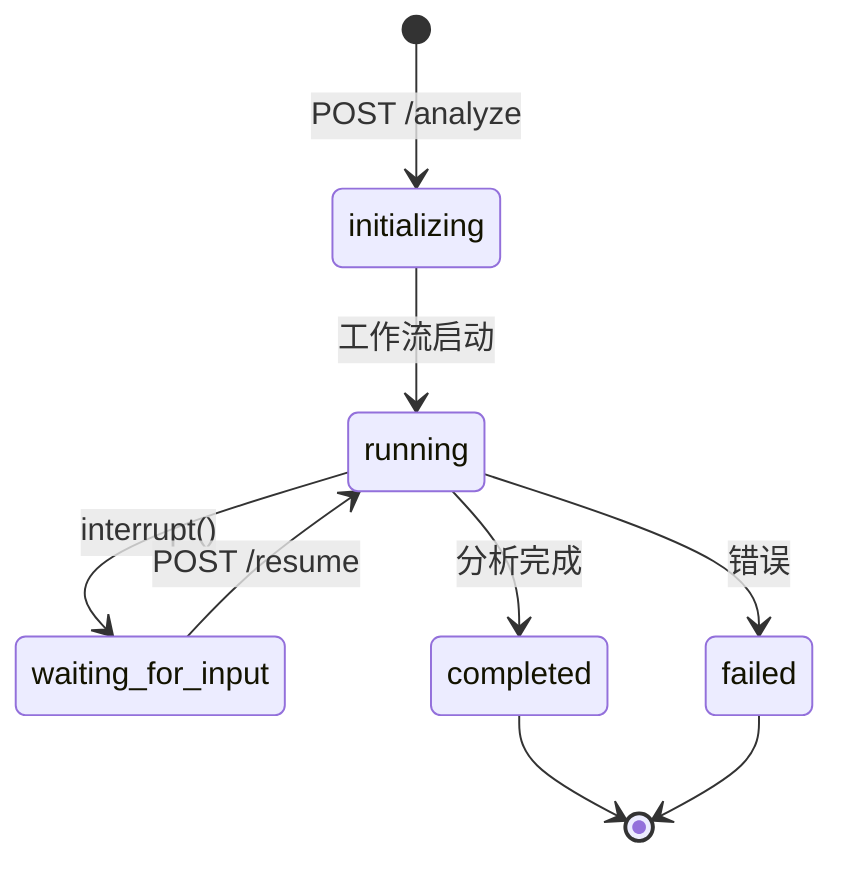

# API 服务模块 - AI 协作文档

> 📍 **路径导航**: [根目录](../../CLAUDE.md) > [intelligent_project_analyzer](../) > **api**

---

## 📋 模块职责

**FastAPI 后端服务 (RESTful API Server)**

本模块提供完整的 RESTful API 接口，支持前后端分离架构，处理分析请求、会话管理、状态轮询和结果返回。

### 核心功能
- ⚡ **异步执行**: 后台异步运行工作流
- 🔄 **会话管理**: 多会话并发支持
- 📡 **状态轮询**: 实时获取分析进度
- 💬 **Interrupt 处理**: 支持人机交互暂停和恢复
- 🛡️ **错误处理**: GraphRecursionError 自动恢复最佳结果
- 🌐 **CORS 支持**: 跨域请求支持

---

## 📁 文件结构

```
api/
├── server.py          # FastAPI 服务器主文件
└── client.py          # API 客户端（前端调用）
```

---

## 🔑 关键 API 端点

### 1. 健康检查

**端点**: `GET /health`

**响应**:
```json
{
    "status": "healthy",
    "version": "2.0.0",
    "mode": "dynamic",
    "timestamp": "2025-11-16T00:44:22Z"
}
```

---

### 2. 启动分析

**端点**: `POST /analyze`

**请求体**:
```json
{
    "user_input": "项目需求描述..."
}
```

**响应**:
```json
{
    "session_id": "uuid-xxx",
    "status": "initializing",
    "message": "分析已启动"
}
```

---

### 3. 获取状态

**端点**: `GET /status/{session_id}`

**响应** (运行中):
```json
{
    "session_id": "uuid-xxx",
    "status": "running",
    "current_stage": "parallel_analysis",
    "progress": 0.5,
    "interrupt_data": null
}
```

**响应** (等待输入):
```json
{
    "session_id": "uuid-xxx",
    "status": "waiting_for_input",
    "progress": 0.3,
    "interrupt_data": {
        "interaction_type": "requirements_confirmation",
        "message": "请确认以下需求分析...",
        "requirements_summary": {...}
    }
}
```

---

### 4. 恢复执行

**端点**: `POST /resume`

**请求体**:
```json
{
    "session_id": "uuid-xxx",
    "resume_value": "approve"  // 或 {"action": "approve", "feedback": "..."}
}
```

---

### 5. 获取结果

**端点**: `GET /results/{session_id}`

**响应**:
```json
{
    "session_id": "uuid-xxx",
    "status": "completed",
    "results": {...},
    "final_report": {...}
}
```

---

## 🧠 核心实现

### 会话管理

```python
# 全局变量存储工作流实例和状态
workflows: Dict[str, MainWorkflow] = {}
sessions: Dict[str, Dict[str, Any]] = {}

# 创建会话
session_id = str(uuid.uuid4())
sessions[session_id] = {
    "status": "initializing",
    "progress": 0.0,
    "user_input": user_input,
    "created_at": datetime.now()
}
```

---

### 异步执行工作流

```python
async def run_workflow_async(session_id: str, user_input: str):
    """异步执行工作流（仅 Dynamic Mode）"""
    try:
        # 更新会话状态
        sessions[session_id]["status"] = "running"

        # 创建工作流
        workflow = create_workflow()
        workflows[session_id] = workflow

        # 流式执行
        for chunk in workflow.graph.stream(initial_state, config):
            # 检查 interrupt
            if "__interrupt__" in chunk:
                interrupt_value = chunk["__interrupt__"][0].value
                sessions[session_id]["status"] = "waiting_for_input"
                sessions[session_id]["interrupt_data"] = interrupt_value
                return

        # 完成
        sessions[session_id]["status"] = "completed"

    except GraphRecursionError as e:
        # 达到递归限制，使用最佳结果
        best_result = state_values.get("best_result")
        if best_result:
            state_values["agent_results"] = best_result
        sessions[session_id]["status"] = "completed"
```

---

### Interrupt 处理

```python
# 检查 interrupt
if "__interrupt__" in chunk:
    interrupt_tuple = chunk["__interrupt__"]
    interrupt_obj = interrupt_tuple[0] if isinstance(interrupt_tuple, tuple) else interrupt_tuple

    # 提取 value
    interrupt_value = interrupt_obj.value if hasattr(interrupt_obj, 'value') else interrupt_obj

    # 更新会话状态
    sessions[session_id]["status"] = "waiting_for_input"
    sessions[session_id]["interrupt_data"] = interrupt_value
    return
```

---

### 恢复执行

```python
@app.post("/resume", response_model=SessionResponse)
async def resume_analysis(request: ResumeRequest):
    """恢复分析执行"""
    if session_id not in workflows:
        raise HTTPException(status_code=404, detail="会话不存在")

    workflow = workflows[session_id]
    config = {"configurable": {"thread_id": session_id}}

    # 使用 Command(resume=value) 恢复执行
    for chunk in workflow.graph.stream(Command(resume=request.resume_value), config):
        # 处理后续执行...
        pass
```

---

## 📊 状态机



---

## 🛠️ 配置管理

使用 Pydantic Settings 统一配置：

```python
from intelligent_project_analyzer.settings import settings

# LLM 配置
api_key = settings.llm.api_key
model_name = settings.llm.model
max_tokens = settings.llm.max_tokens

# API 配置
api_base_url = settings.api_base_url
```

---

## 🧪 测试

**启动服务器**:
```bash
python intelligent_project_analyzer/api/server.py
```

**访问 API 文档**:
- Swagger UI: http://localhost:8000/docs
- ReDoc: http://localhost:8000/redoc

**测试健康检查**:
```bash
curl http://localhost:8000/health
```

---

## 📚 相关资源

- [核心状态管理](../core/CLAUDE.md)
- [工作流编排](../workflow/CLAUDE.md)
- [前端界面](../frontend/CLAUDE.md)
- [FastAPI 官方文档](https://fastapi.tiangolo.com/)

---

**最后更新**: 2025-11-16
**覆盖率**: 95%
**文档版本**: 1.0.0
