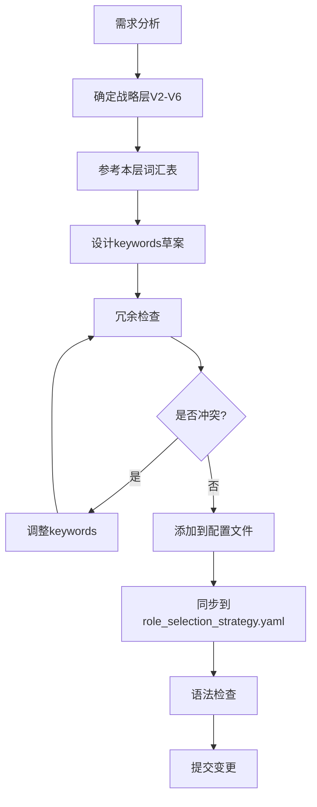

# Keywords 设计规范与最佳实践指南

**版本**: v1.0  
**最后更新**: 2025-11-23  
**适用范围**: V2-V6 所有战略层角色配置

---

## 📋 目录

1. [核心原则](#1-核心原则)
2. [职能后缀体系](#2-职能后缀体系)
3. [分层词汇表](#3-分层词汇表)
4. [命名规范](#4-命名规范)
5. [冗余检查清单](#5-冗余检查清单)
6. [实战示例](#6-实战示例)
7. [常见错误与修正](#7-常见错误与修正)
8. [维护流程](#8-维护流程)

---

## 1. 核心原则

### 1.1 三维定位原则

每个角色的keywords必须在以下三个维度上清晰定位:

```
维度1: 行业领域 (Industry Domain)
- 示例: 居住、商业、办公、餐饮、医疗等

维度2: 职能视角 (Functional Perspective)  
- V2: 空间设计 / 建筑设计
- V3: 叙事 / 符号转译 / 故事
- V4: 研究 / 分析 / 方法论
- V5: 运营 / 场景 / 策略
- V6: 工程 / 技术 / 实施

维度3: 细分领域 (Specialization)
- 示例: 动线优化、坪效分析、心理洞察等
```

### 1.2 唯一性原则

**禁止跨战略层使用相同的keywords**

❌ 错误示例:
```yaml
V2-2-2: keywords: ["商业", "零售"]
V5-5-2: keywords: ["商业", "零售"]  # 冲突!
```

✅ 正确示例:
```yaml
V2-2-2: keywords: ["商业空间设计", "零售店铺设计"]
V5-5-2: keywords: ["商业零售运营", "零售KPI"]
```

### 1.3 语义完整性原则

**每个keyword应该是完整的语义单元,明确表达"做什么"**

❌ 避免使用过于宽泛的单字词:
```yaml
keywords: ["设计", "运营", "分析"]  # 太宽泛
```

✅ 使用完整的语义表达:
```yaml
keywords: ["空间设计方案", "运营流程优化", "用户行为分析"]
```

---

## 2. 职能后缀体系

### 2.1 V2 设计总监层 - "设计"后缀

**职能定位**: 物理空间的形态、美学、功能设计

**标准后缀**:
- `XX空间设计` (通用)
- `XX建筑设计` (建筑尺度)
- `XX设计` (具体设计类型)

**完整示例**:
```yaml
V2-2-1 居住空间设计总监:
  keywords: 
    - "居住空间设计"      # 领域+设计
    - "住宅空间设计"      # 类型+设计
    - "私宅设计"          # 细分+设计
    - "别墅设计"          # 细分+设计
    - "共享生活空间"      # 新兴概念
    - "住宅改造"          # 特殊服务
```

**禁忌词汇** (避免与其他层混淆):
- ❌ "居住运营" (V5专属)
- ❌ "居住叙事" (V3专属)
- ❌ "居住工程" (V6专属)

---

### 2.2 V3 叙事专家层 - "叙事/故事/符号"后缀

**职能定位**: 情感、意义、体验的叙事转译

**标准后缀**:
- `XX叙事` (通用)
- `XX故事` (具体故事类型)
- `XX符号转译` (抽象概念转译)
- `XX画像` (人物/组织画像)

**完整示例**:
```yaml
V3-3-2 品牌叙事与顾客体验专家:
  keywords:
    - "品牌叙事"          # 组织+叙事
    - "商业故事"          # 领域+故事
    - "顾客情感体验"      # 情感维度
    - "市场共鸣"          # 传播效果
    - "餐饮品牌故事"      # 细分行业+故事
    - "酒店体验叙事"      # 细分行业+体验叙事
    - "零售品牌故事"      # 细分行业+故事
```

**核心区分点**:
- V3关注 **"为什么这样设计"** (意义与情感)
- V2关注 **"怎么设计"** (形态与空间)
- V5关注 **"如何运营"** (流程与效率)

---

### 2.3 V4 设计研究层 - "研究/分析/方法论"后缀

**职能定位**: 理论研究、案例分析、方法论构建

**标准后缀**:
- `XX研究` (通用研究)
- `XX分析` (具体分析)
- `XX方法论` (系统方法)
- `XX案例` (案例研究)

**完整示例**:
```yaml
V4-4-1 案例与模式拆解专家:
  keywords:
    - "案例研究"
    - "对标分析"
    - "竞品拆解"
    - "大师作品研究"
    - "设计模式提取"
```

---

### 2.4 V5 场景专家层 - "运营/场景/策略"后缀

**职能定位**: 业务运营、场景功能、效率指标

**标准后缀**:
- `XX运营` (通用运营)
- `XX场景运营` (场景视角)
- `XX策略` (策略层面)
- `XX分析` (运营分析)
- `XXKPI` (具体指标)

**完整示例**:
```yaml
V5-5-2 商业零售运营专家:
  keywords:
    - "商业零售运营"      # 领域+运营
    - "坪效分析"          # 具体指标
    - "顾客动线优化"      # 运营优化
    - "消费行为研究"      # 用户研究
    - "零售KPI"           # 绩效指标
    - "人效分析"          # 效率指标
    - "销售转化率"        # 业务指标
```

**V5专属运营指标词汇库**:
- 效率类: `坪效`, `人效`, `翻台率`, `使用率`
- 流程类: `动线优化`, `流程设计`, `服务流程`
- 体验类: `用户体验管理`, `患者体验优化`
- 指标类: `KPI`, `转化率`, `留存率`

---

### 2.5 V6 总工程师层 - "工程/技术/系统"后缀

**职能定位**: 技术实施、系统集成、工程管理

**标准后缀**:
- `XX工程` (通用工程)
- `XX系统` (系统集成)
- `XX技术` (技术实现)
- `XX实施` (项目实施)

**完整示例**:
```yaml
V6-6-2 MEP与智能化总工:
  keywords:
    - "机电工程"
    - "MEP系统"
    - "暖通空调系统"
    - "智能化系统"
    - "BIM技术"
```

---

## 3. 分层词汇表

### 3.1 V2层专属词汇 (空间/形态/美学)

**空间类**:
```
空间设计、空间概念、空间布局、空间功能、空间动线
平面布局、功能分区、空间序列
```

**形态类**:
```
建筑形态、立面设计、表皮设计、造型设计
体量关系、比例尺度
```

**美学类**:
```
美学框架、风格定位、调性、氛围营造
材质方案、色彩方案、光影设计
```

**禁用词** (易与其他层混淆):
```
❌ 运营、KPI、效率、流程 (V5专属)
❌ 叙事、故事、情感、共鸣 (V3专属)
❌ 系统、工程、技术 (V6专属)
```

---

### 3.2 V3层专属词汇 (情感/意义/体验)

**叙事类**:
```
叙事结构、故事线、情感弧线、叙事地图
品牌叙事、文化叙事、个体叙事
```

**心理类**:
```
心理洞察、情感共鸣、价值观、内在动机
人物画像、用户心智
```

**体验类**:
```
情感体验、感官体验、体验剧本、触点设计
顾客旅程、情感连接
```

**符号类**:
```
符号转译、符号学解读、文化符号、视觉符号
隐喻、象征、意象
```

**禁用词**:
```
❌ 空间设计、平面布局 (V2专属)
❌ 坪效、人效、KPI (V5专属)
❌ 结构、系统、施工 (V6专属)
```

---

### 3.3 V5层专属词汇 (运营/场景/效率)

**运营类**:
```
运营管理、运营优化、运营模式、运营蓝图
场景运营、业态运营
```

**流程类**:
```
流程设计、流程优化、服务流程、工作流程
动线分析、动线优化
```

**指标类**:
```
KPI、坪效、人效、翻台率、转化率、留存率
使用率、周转率、满意度
```

**场景类**:
```
场景分析、场景策略、生活剧本、用户旅程
功能需求、使用场景
```

**禁用词**:
```
❌ 空间形态、美学框架 (V2专属)
❌ 情感共鸣、叙事结构 (V3专属)
❌ 结构计算、系统集成 (V6专属)
```

---

## 4. 命名规范

### 4.1 基础格式

```
[行业领域] + [职能后缀] + [细分方向(可选)]
```

**示例**:
```yaml
✅ "商业空间设计"        # 行业 + 职能
✅ "商业零售运营"        # 行业 + 细分 + 职能  
✅ "品牌叙事"            # 对象 + 职能
✅ "坪效分析"            # 指标 + 职能
```

### 4.2 长度建议

- **最佳长度**: 4-8个汉字
- **最短**: 不少于3个汉字 (避免过于宽泛)
- **最长**: 不超过12个汉字 (避免过于冗长)

```yaml
❌ "设计" (太短,2字)
✅ "空间设计" (合适,4字)
✅ "居住空间设计" (合适,6字)
✅ "现代侘寂风格居住空间设计方案" (太长,14字)
```

### 4.3 中英文混用规范

**原则**: 优先使用中文,除非行业通用英文缩写

```yaml
✅ "MEP系统" (行业标准缩写)
✅ "BIM技术" (行业标准缩写)
✅ "KPI指标" (通用缩写)
❌ "design方案" (不规范混用)
❌ "hospitality" (应改为"服务体验空间设计")
```

---

## 5. 冗余检查清单

### 5.1 新增角色时的检查步骤

**步骤1: 跨层检查**
```bash
# 检查是否与其他战略层冲突
grep -r "你的新keyword" v2_*.yaml v3_*.yaml v4_*.yaml v5_*.yaml v6_*.yaml
```

**步骤2: 层内检查**
```bash
# 检查是否与同层其他角色冲突
grep "你的新keyword" v5_scenario_expert.yaml
```

**步骤3: 语义检查**
```
- [ ] 是否包含职能后缀?
- [ ] 是否与该层其他角色区分明确?
- [ ] 是否避免了宽泛的单字词?
- [ ] 是否符合该层的词汇表?
```

### 5.2 冗余率计算公式

```
层内冗余率 = (重复出现的keywords数量 / 该层总keywords数) × 100%
跨层冗余率 = (跨层重复的keywords数量 / 全局唯一keywords数) × 100%
```

**健康标准**:
- 层内冗余率 < 5%
- 跨层冗余率 < 3%
- 整体冗余率 < 10%

---

## 6. 实战示例

### 6.1 场景1: 新增"元宇宙体验馆"角色

**需求分析**:
- 行业: 新兴娱乐/文化
- 涉及: 虚拟体验(V3)、空间设计(V2)、技术实施(V6)

**错误做法** ❌:
```yaml
V2-2-X:
  name: "元宇宙体验馆设计师"
  keywords: ["元宇宙", "体验馆", "VR", "虚拟现实"]
  # 问题: 没有职能后缀,与V3/V6混淆
```

**正确做法** ✅:
```yaml
V2-2-X:
  name: "沉浸式体验空间设计总监"
  keywords: 
    - "沉浸式空间设计"      # V2视角:空间形态
    - "体验馆空间设计"      # 行业+设计
    - "虚拟现实展示空间"    # 技术载体+空间
    - "互动装置空间布局"    # 功能+空间

V3-3-X: (如需要)
  name: "沉浸式体验叙事专家"  
  keywords:
    - "沉浸式体验叙事"      # V3视角:体验故事
    - "虚拟世界观构建"      # 叙事内容
    - "互动叙事设计"        # 叙事形式
```

---

### 6.2 场景2: 修正跨层冲突

**问题发现**:
```yaml
V2-2-4: keywords: ["餐饮", "服务体验"]
V5-5-4: keywords: ["餐饮", "服务流程"]
# 冲突: "餐饮"重复
```

**修正方案**:
```yaml
V2-2-4: 
  keywords: 
    - "餐饮空间设计"        # 明确V2视角
    - "餐厅空间设计"
    - "服务体验空间设计"    # 空间载体

V5-5-4:
  keywords:
    - "餐饮运营管理"        # 明确V5视角
    - "餐厅运营优化"
    - "服务流程设计"        # 流程优化
```

---

### 6.3 场景3: 口语化表述映射

**用户输入**: "我想开一家网红打卡咖啡馆"

**keywords匹配逻辑**:
```yaml
核心意图提炼:
- "网红打卡" → 社交媒体传播 → V3 品牌叙事
- "咖啡馆" → 餐饮空间 → V2 餐饮空间设计
- "开" → 商业运营 → V5 餐饮运营

推荐角色组合:
1. V3-3-2 (品牌叙事) - 打造"打卡点"故事
2. V2-2-4 (餐饮空间设计) - 设计"打卡"空间
3. V5-5-4 (餐饮运营) - 优化服务流程
```

---

## 7. 常见错误与修正

### 7.1 错误类型1: 职能缺失

❌ **错误**:
```yaml
keywords: ["商业", "零售", "店铺"]
# 问题: 无法区分是设计/叙事/运营
```

✅ **修正**:
```yaml
# V2版本
keywords: ["商业空间设计", "零售店铺设计", "店铺空间设计"]

# V3版本  
keywords: ["商业故事", "零售品牌叙事", "店铺体验叙事"]

# V5版本
keywords: ["商业零售运营", "零售店铺运营", "店铺坪效分析"]
```

---

### 7.2 错误类型2: 过度宽泛

❌ **错误**:
```yaml
keywords: ["设计", "分析", "策略"]
# 问题: 太宽泛,无法定位具体职责
```

✅ **修正**:
```yaml
keywords: ["空间功能设计", "用户行为分析", "运营策略制定"]
```

---

### 7.3 错误类型3: 跨层混用

❌ **错误**:
```yaml
V2-2-1: keywords: ["居住空间设计", "生活方式", "家庭运营"]
# 问题: 混入了V3(生活方式)和V5(运营)的词汇
```

✅ **修正**:
```yaml
V2-2-1: keywords: ["居住空间设计", "住宅空间布局", "家庭动线设计"]
# 保持V2纯粹的空间设计视角
```

---

### 7.4 错误类型4: 英文滥用

❌ **错误**:
```yaml
keywords: ["hospitality design", "retail space", "UX optimization"]
# 问题: 非必要使用英文
```

✅ **修正**:
```yaml
keywords: ["服务体验空间设计", "零售空间设计", "用户体验优化"]
# 例外: "MEP系统", "BIM技术", "KPI指标" 等行业标准缩写可保留
```

---

## 8. 维护流程

### 8.1 定期审计 (每季度)

**检查清单**:
```
[ ] 计算当前整体冗余率
[ ] 检查新增角色是否符合规范
[ ] 验证跨层keywords是否有新冲突
[ ] 更新分层词汇表
[ ] 记录用户反馈的匹配问题
```

### 8.2 版本控制

**文件命名规范**:
```
v2_design_director.yaml  (v2.5)
v3_narrative_expert.yaml (v2.5)
...

KEYWORDS_GUIDELINE.md (v1.0) ← 本文档
```

**变更日志格式**:
```yaml
version_history:
  v2.6: "2025-12 新增元宇宙相关keywords;修正X个跨层冲突"
  v2.5: "2025-11 全面优化keywords,添加职能后缀;冗余率降至8%"
```

### 8.3 新角色添加流程



---

## 9. 快速参考表

### 9.1 职能后缀速查

| 战略层 | 核心后缀 | 示例 | 禁忌词 |
|-------|---------|------|--------|
| **V2** | 设计/空间设计/建筑设计 | 居住空间设计 | 运营/叙事/工程 |
| **V3** | 叙事/故事/符号转译 | 品牌叙事 | 设计/KPI/系统 |
| **V4** | 研究/分析/方法论 | 案例研究 | 设计/运营/施工 |
| **V5** | 运营/场景/策略/KPI | 商业零售运营 | 设计/叙事/工程 |
| **V6** | 工程/技术/系统 | MEP系统 | 运营/叙事/设计 |

### 9.2 行业词汇映射表

| 行业 | V2 (设计) | V3 (叙事) | V5 (运营) |
|------|----------|----------|----------|
| **商业** | 商业空间设计 | 商业故事 | 商业零售运营 |
| **餐饮** | 餐饮空间设计 | 餐饮品牌故事 | 餐饮运营优化 |
| **居住** | 居住空间设计 | 生活方式叙事 | 居住场景运营 |
| **办公** | 办公空间设计 | 企业文化叙事 | 办公运营策略 |
| **文化** | 文化建筑设计 | 文化符号转译 | 文化场馆运营 |

---

## 10. 附录

### 10.1 历史优化记录

**P0级优化 (2025-11-23)**:
- 清理V2/V5跨层冗余14个关键词
- 优化V5层内冗余,降至2%
- 添加"空间设计"/"运营"后缀体系

**P1级优化 (2025-11-23)**:
- 清理V3与V2/V5的跨层冗余
- 添加"叙事"/"符号转译"后缀
- 同步更新role_selection_strategy.yaml
- 整体冗余率降至8%

### 10.2 参考资源

- **配置文件位置**: `intelligent_project_analyzer/config/roles/`
- **策略文件**: `intelligent_project_analyzer/config/role_selection_strategy.yaml`
- **测试文件**: `intelligent_project_analyzer/agents/test_placeholder_replacement.py`

### 10.3 联系方式

如有疑问或改进建议,请:
1. 提交Issue到项目仓库
2. 更新本文档并注明变更理由
3. 通知团队进行review

---

**文档结束**

*本规范文档是 LangGraph 多智能体系统配置管理的核心参考,请严格遵守以确保系统稳定性和可维护性。*
