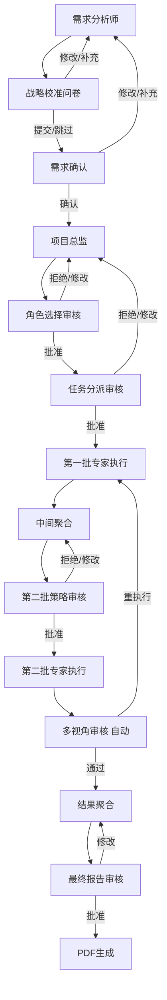

# 人机交互模块 - AI 协作文档

> 📍 **路径导航**: [根目录](../../CLAUDE.md) > [intelligent_project_analyzer](../) > **interaction**

---

## 📋 模块职责

**人机交互节点 (Human-in-the-Loop Interaction Nodes)**

本模块实现了工作流中的关键人机交互点，通过 LangGraph 的 `interrupt()` 机制暂停执行，等待用户输入、审核和确认，确保分析流程符合用户期望。

### 核心功能
- 🎯 **需求确认**: 确保需求分析准确无误再继续
- 📝 **战略校准问卷**: 收集用户的战术和美学偏好
- 👥 **角色选择审核**: 审核项目总监选择的专家团队
- 📋 **任务分派审核**: 确认每个专家的任务清单
- 🔍 **第二批策略审核**: 审核 V2/V6 专家的工作策略
- 🎭 **多视角审核**: 自动化的红蓝对抗审核（无需人工参与）

---

## 📁 文件结构

```
interaction/
├── interaction_nodes.py              # 主交互节点集合
│   ├── CalibrationQuestionnaireNode  # 战略校准问卷
│   ├── RequirementsConfirmationNode  # 需求确认
│   ├── AnalysisReviewNode            # 分析结果审核（自动化）
│   ├── FinalReviewNode               # 最终报告审核
│   └── UserQuestionNode              # 用户追问处理
│
├── role_selection_review.py          # 角色选择审核节点
│   └── RoleSelectionReviewNode
│
├── task_assignment_review.py         # 任务分派审核节点
│   └── TaskAssignmentReviewNode
│
└── second_batch_strategy_review.py   # 第二批策略审核节点
    └── SecondBatchStrategyReviewNode
```

---

## 🔑 关键实现

### 1. 战略校准问卷节点 (CalibrationQuestionnaireNode)

**职责**: 在需求分析后，向用户展示动态生成的战略校准问卷，收集战术和美学层面的偏好。

**关键特性**:
- ✅ 动态生成问卷（由需求分析师提供）
- ✅ 支持自然语言对话（通过意图解析器）
- ✅ 用户补充/修改会触发重新分析
- ✅ 可选跳过（如果问卷为空）

**交互数据结构**:
```python
{
    "interaction_type": "calibration_questionnaire",
    "message": "请回答以下战略校准问题...",
    "questionnaire": {
        "introduction": "以下问题旨在精准捕捉您的个人偏好...",
        "questions": [...]  # 动态生成的问题列表
    },
    "options": {
        "submit": "提交问卷答案",
        "skip": "跳过问卷，直接确认需求"
    }
}
```

**路由逻辑**:
- **approve/submit**: → `requirements_confirmation` (继续)
- **skip**: → `requirements_confirmation` (跳过问卷)
- **modify**: → `requirements_analyst` (重新分析)
- **add** (有实质性补充): → `requirements_analyst` (重新分析)

**代码位置**: `interaction_nodes.py` 第 18-211 行

---

### 2. 需求确认节点 (RequirementsConfirmationNode)

**职责**: 在需求分析完成后，展示结构化需求摘要，等待用户确认。

**关键特性**:
- ✅ 展示需求摘要（项目概述、目标、用户、功能、成功指标）
- ✅ 支持自然语言对话
- ✅ 用户补充/修改会触发重新分析
- ✅ 确保需求准确再进入项目总监阶段

**交互数据结构**:
```python
{
    "interaction_type": "requirements_confirmation",
    "message": "请确认以下需求分析是否准确：",
    "requirements_summary": {
        "project_overview": "...",
        "core_objectives": [...],
        "target_users": "...",
        "functional_requirements": [...],
        "success_criteria": [...]
    },
    "options": {
        "approve": "确认需求分析准确，继续项目分析",
        "revise": "需求分析需要修改，重新分析需求"
    }
}
```

**路由逻辑**:
- **approve** (无补充): → `project_director` (继续)
- **approve** (有补充/修改): → `requirements_analyst` (重新分析)
- **revise/reject**: → `requirements_analyst` (重新分析)

**重要设计**:
> 📌 根据客户需求，即使用户点击"确认"，如果提供了补充信息或修改意见，也会返回需求分析师重新分析。

**代码位置**: `interaction_nodes.py` 第 213-358 行

---

### 3. 角色选择审核节点 (RoleSelectionReviewNode)

**职责**: 审核项目总监选择的专家团队，确保角色选择合理。

**关键特性**:
- ✅ 验证角色选择（通过 StrategyManager）
- ✅ 提供互补性推荐
- ✅ 生成决策透明度说明
- ✅ 支持重新执行模式（跳过审核）

**交互数据结构**:
```python
{
    "interaction_type": "role_selection_review",
    "message": "项目总监已完成角色选择,请审核并确认:",
    "decision_explanation": {...},  # 决策说明
    "selected_roles": [...],         # 选择的角色列表
    "validation": {...},             # 验证结果
    "recommendations": {...},        # 互补性推荐
    "strategy_info": {
        "current_strategy": "default",
        "available_strategies": [...]
    },
    "options": {
        "approve": "确认选择,继续执行",
        "modify": "修改角色选择",
        "change_strategy": "更换选择策略",
        "reject": "拒绝并重新选择"
    }
}
```

**路由逻辑** (使用 `Command`):
- **approve**: → `task_assignment_review` (继续)
- **reject/revise**: → `project_director` (重新选择)
- **modify**: → `project_director` (带修改请求)

**跳过审核** (重新执行模式):
```python
if state.get("skip_role_review"):
    return Command(
        update={"role_selection_approved": True},
        goto="task_assignment_review"
    )
```

**代码位置**: `role_selection_review.py` 第 15-398 行

---

### 4. 任务分派审核节点 (TaskAssignmentReviewNode)

**职责**: 审核项目总监分配给每个专家的任务清单。

**关键特性**:
- ✅ 展示详细的任务列表（包含任务优先级）
- ✅ 验证任务分配（每个角色至少2个任务）
- ✅ 自动补充模板任务（如果定制任务为空）
- ✅ 创建 `Send` 对象列表（并行执行第一批专家）

**交互数据结构**:
```python
{
    "interaction_type": "task_assignment_review",
    "message": "项目总监已完成任务分派,请审核各角色的任务清单:",
    "task_list": [
        {
            "role_id": "V3_人物及叙事专家_3-1",
            "role_name": "人物及叙事专家",
            "tasks": [
                {
                    "task_id": "V3_..._task_1",
                    "description": "...",
                    "priority": "high"
                }
            ],
            "focus_areas": [...],
            "expected_output": "...",
            "dependencies": [...],
            "task_count": 5
        }
    ],
    "validation": {...},
    "summary": {
        "total_roles": 3,
        "total_tasks": 15,
        "roles_with_tasks": 3
    }
}
```

**关键实现** - 创建 Send 对象:
```python
def _create_first_batch_sends(self, state) -> List[Send]:
    """创建第一批专家的 Send 对象列表（仅 Dynamic Mode）"""
    active_agents = state.get("active_agents", [])
    send_list = []

    # 筛选第一批专家 (V3, V4, V5)
    first_batch_roles = [
        role_id for role_id in active_agents
        if role_id.startswith("V3_") or
           role_id.startswith("V4_") or
           role_id.startswith("V5_")
    ]

    for role_id in first_batch_roles:
        agent_state = dict(state)
        agent_state["role_id"] = role_id
        agent_state["current_stage"] = AnalysisStage.PARALLEL_ANALYSIS.value
        agent_state["execution_batch"] = "first"
        send_list.append(Send("first_batch_agent", agent_state))

    return send_list
```

**路由逻辑**:
- **approve**: → `Send 列表` (并行执行第一批)
- **reject/revise**: → `project_director` (重新分派)

**代码位置**: `task_assignment_review.py` 第 16-542 行

---

### 5. 第二批策略审核节点 (SecondBatchStrategyReviewNode)

**职责**: 在第一批专家完成后，审核 V2/V6 的工作策略。

**关键特性**:
- ✅ 动态生成 V2/V6 的策略预览
- ✅ 提取第一批专家的关键洞察作为依赖
- ✅ 使用 LLM 动态生成搜索查询（降级为关键词提取）
- ✅ 支持动态角色 ID（V2_设计总监_2-1）

**策略预览结构**:
```python
{
    "agent_name": "设计总监",  # 动态获取
    "agent_type": "v2_design_research",
    "dependencies": {
        "V3_人物及叙事专家_3-1": {
            "available": True,
            "confidence": "85%",
            "key_findings_count": 5,
            "top_findings": [...]
        },
        "V4_设计研究员_4-1": {...},
        "V5_场景与用户生态专家_5-1": {...}
    },
    "search_queries": {
        "knowledge_base": "商业街区设计指南 零售空间...",
        "design_trends": "商业空间设计趋势 2024",
        "academic_research": "commercial space design..."
    },
    "work_focus": [
        "基于V3-V4-V5的分析结果，进行深度设计研究",
        "分析当前设计趋势和最佳实践",
        ...
    ],
    "tools_to_use": ["ragflow"],
    "estimated_duration": "30-40秒"
}
```

**关键实现** - 动态获取角色名称:
```python
def _generate_v2_strategy_preview(self, agent_results, project_task, character_narrative, state):
    """生成V2设计研究分析师的策略预览"""
    # 1. 动态获取 V2 角色名称
    active_agents = state.get("active_agents", [])
    v2_role_id = next((r for r in active_agents if r.startswith("V2_")), None)

    if v2_role_id:
        parts = v2_role_id.rsplit("_", 1)
        base_type, role_id = parts
        role_config = self.role_manager.get_role_config(base_type, role_id)
        agent_name = role_config.get("name", "V2 设计总监")
    else:
        agent_name = "V2 设计总监"

    # 2. 提取第一批专家的关键洞察
    v3_key = next((k for k in agent_results.keys() if k.startswith("V3_")), None)
    # ...
```

**搜索查询生成** - LLM 驱动:
```python
def _generate_v2_search_queries(self, project_task, character_narrative):
    """生成V2的搜索查询 - 使用LLM动态生成"""
    if not self.llm_model:
        return self._generate_v2_search_queries_fallback(...)

    prompt = f"""基于以下项目信息,为设计总监(V2)生成3个精准的搜索查询...
    项目任务: {project_task}
    人物叙事: {character_narrative}

    以JSON格式输出:
    {{
        "knowledge_base": "商业街区设计指南 零售空间...",
        "design_trends": "商业空间设计趋势 2024",
        "academic_research": "commercial space design..."
    }}
    """

    response = self.llm_model.invoke(...)
    # 解析JSON响应
```

**路由逻辑**:
- **approve**: → `Send 列表` (并行执行第二批)
- **reject/revise**: → `intermediate_aggregator` (重新规划)

**代码位置**: `second_batch_strategy_review.py` 第 19-928 行

---

### 6. 多视角审核节点 (AnalysisReviewNode)

**职责**: 自动化的多视角审核系统（红蓝对抗 → 评委裁决 → 甲方审核）。

**关键特性**:
- ✅ **无需用户参与** - 系统自动执行
- ✅ 多轮审核循环（最多3轮）
- ✅ 保存最佳结果（按评分）
- ✅ 生成审核反馈（传递给专家）
- ✅ 支持针对性重执行（特定专家或全部）

**审核流程**:
```
1. 执行多视角审核（红蓝对抗、评委裁决、甲方审核）
2. 获取最终决策：approve / rerun_specific / rerun_all / reject
3. 更新最佳结果（如果当前评分更高）
4. 生成审核反馈（用于改进）
5. 根据决策路由：
   - approve → result_aggregator（使用最佳结果）
   - rerun_specific → first_batch_agent / second_batch_agent
   - rerun_all → project_director
   - reject → result_aggregator（已达最大轮次）
```

**关键实现** - 路由到特定专家:
```python
def _route_to_specific_agents(cls, agents_to_rerun, updated_state):
    """
    路由到特定需要重新执行的专家

    支持两种ID格式：
    1. 固定ID: v3_technical_architecture
    2. 动态ID: V3_人物及叙事专家_3-1
    """
    # 提取动态ID的前缀
    def extract_prefix(agent_id: str) -> str:
        if agent_id.startswith("V") and "_" in agent_id:
            return agent_id.split("_")[0]  # V3, V4, V5
        return ""

    agent_prefixes = {extract_prefix(agent_id) for agent_id in agents_to_rerun}

    # 检查是否需要第一批 (V3, V4, V5)
    needs_first_batch = bool(agent_prefixes & {"V3", "V4", "V5"})
    # 检查是否需要第二批 (V2, V6)
    needs_second_batch = bool(agent_prefixes & {"V2", "V6"})

    if needs_first_batch and needs_second_batch:
        # 两批都需要，先执行第一批，完成后自动执行第二批
        updated_state["skip_role_review"] = True
        updated_state["skip_task_review"] = True
        updated_state["pending_second_batch"] = second_batch_agents
        return Command(update=updated_state, goto="first_batch_agent")
    elif needs_first_batch:
        return Command(update=updated_state, goto="first_batch_agent")
    elif needs_second_batch:
        return Command(update=updated_state, goto="second_batch_agent")
```

**最佳结果保存**:
```python
# 更新最佳结果
if overall_score > best_score:
    logger.info(f"🎉 发现更优方案！评分: {best_score:.1f} → {overall_score:.1f}")
    best_result = agent_results.copy()
    best_score = overall_score
else:
    logger.info(f"📊 当前评分{overall_score:.1f}未超过最佳{best_score:.1f}，保留最佳结果")

# 批准时使用最佳结果
if decision_type == "approve":
    if best_result and overall_score < best_score:
        logger.info(f"✅ 使用最佳结果（评分{best_score:.1f}）")
        updated_state["agent_results"] = best_result
    else:
        logger.info(f"✅ 使用当前结果（评分{overall_score:.1f}）")
```

**代码位置**: `interaction_nodes.py` 第 360-705 行

---

## 🧠 核心概念

### Interrupt 机制

所有交互节点都使用 LangGraph 的 `interrupt()` 函数暂停执行：

```python
# 调用 interrupt 暂停工作流
user_response = interrupt(interaction_data)

# 执行到这里时，说明已经被恢复（用户提供了响应）
logger.info(f"Received user response: {user_response}")
```

**重要提示**:
> ⚠️ **不要捕获 Interrupt 异常！** Interrupt 是 LangGraph 的正常控制流，必须让它传播到框架层。

### Command 路由

所有交互节点都使用 `Command` 对象进行路由：

```python
from langgraph.types import Command

# 批准并继续
return Command(
    update={"task_assignment_approved": True},
    goto="first_batch_agent"  # 可以是节点名或 Send 列表
)

# 拒绝并返回
return Command(
    update={"requirements_confirmed": False},
    goto="requirements_analyst"
)
```

### 意图解析器

支持自然语言对话，通过意图解析器理解用户输入：

```python
from ..utils.intent_parser import parse_user_intent

intent_result = parse_user_intent(
    user_response,
    context="角色选择审核",
    stage="role_selection_review"
)

intent = intent_result["intent"]  # approve, reject, modify, skip, etc.
content = intent_result.get("content", "")
```

支持的意图类型：
- `approve`: 批准/确认/同意
- `reject`: 拒绝/不同意
- `revise`: 修改/重新分析
- `modify`: 修改（带内容）
- `skip`: 跳过
- `add`: 补充信息

---

## 🔄 交互流程

完整的人机交互流程：



---

## 📊 状态字段

交互节点使用和更新的关键状态字段：

| 字段名 | 类型 | 说明 |
|--------|------|------|
| `interaction_history` | List[Dict] | 所有交互记录 |
| `calibration_answers` | Dict | 战略校准问卷答案 |
| `calibration_skipped` | bool | 是否跳过问卷 |
| `requirements_confirmed` | bool | 需求是否已确认 |
| `role_selection_approved` | bool | 角色选择是否批准 |
| `task_assignment_approved` | bool | 任务分派是否批准 |
| `second_batch_approved` | bool | 第二批策略是否批准 |
| `skip_role_review` | bool | 跳过角色审核（重执行模式） |
| `skip_task_review` | bool | 跳过任务审核（重执行模式） |
| `review_history` | List[Dict] | 多视角审核历史 |
| `best_result` | Dict | 最佳分析结果 |
| `best_score` | float | 最佳评分 |

---

## 🛠️ 依赖关系

```python
# 直接依赖
from ..core.state import ProjectAnalysisState, AnalysisStage
from ..core.types import InteractionType
from ..core.strategy_manager import StrategyManager
from ..core.role_manager import RoleManager
from ..utils.intent_parser import parse_user_intent
from ..review import MultiPerspectiveReviewCoordinator

# LangGraph 依赖
from langgraph.types import interrupt, Command, Send
from langgraph.store.base import BaseStore
```

---

## 🧪 测试建议

### 单元测试

1. **测试 interrupt 恢复机制**
   ```python
   # 模拟用户响应
   def test_requirements_confirmation():
       state = {"structured_requirements": {...}}
       # 模拟 interrupt 返回值
       with mock.patch('intelligent_project_analyzer.interaction.interaction_nodes.interrupt', return_value="approve"):
           result = RequirementsConfirmationNode.execute(state)
           assert result.goto == "project_director"
   ```

2. **测试意图解析**
   ```python
   def test_intent_parsing():
       responses = ["同意", "拒绝", "我要修改", "跳过"]
       for response in responses:
           intent_result = parse_user_intent(response, context="测试", stage="test")
           assert intent_result["intent"] in ["approve", "reject", "modify", "skip"]
   ```

3. **测试 Send 对象生成**
   ```python
   def test_create_first_batch_sends():
       state = {
           "active_agents": ["V3_人物及叙事专家_3-1", "V4_设计研究员_4-1", "V5_场景与用户生态专家_5-1"]
       }
       node = TaskAssignmentReviewNode()
       sends = node._create_first_batch_sends(state)
       assert len(sends) == 3
       assert all(isinstance(s, Send) for s in sends)
   ```

### 集成测试

1. **完整交互流程测试**
   - 模拟用户从需求确认到最终审核的完整流程
   - 测试不同的用户响应路径

2. **重执行模式测试**
   - 测试审核系统要求重执行特定专家的场景
   - 验证 `skip_role_review` 和 `skip_task_review` 逻辑

---

## 📝 常见问题 (FAQ)

### Q1: 为什么不能捕获 Interrupt 异常？

**A**: `interrupt()` 不是异常，而是 LangGraph 的控制流机制。当调用 `interrupt(data)` 时，LangGraph 会：
1. 保存当前状态
2. 暂停工作流执行
3. 等待用户通过 `Command(resume=value)` 恢复
4. 恢复执行时，`interrupt()` 返回 `value`

如果捕获它，LangGraph 无法正确暂停和恢复。

---

### Q2: 用户响应的格式是什么？

**A**: 用户响应可以是：
- **字符串**: `"approve"`, `"reject"`, `"我要修改这个地方"`
- **字典**: `{"action": "approve", "feedback": "很好"}`
- **任何 JSON 可序列化的对象**

意图解析器会自动识别格式并提取意图。

---

### Q3: 如何跳过某个交互点？

**A**: 设置对应的跳过标志：
```python
state["skip_role_review"] = True  # 跳过角色选择审核
state["skip_task_review"] = True  # 跳过任务分派审核
```

这通常在重执行模式中使用，避免重复的审核流程。

---

### Q4: 为什么需求确认后仍然返回需求分析师？

**A**: 根据客户需求，即使用户点击"确认"，如果提供了补充信息（`additional_info`）或修改意见（`modifications`），系统会将其添加到用户输入中，并返回需求分析师重新分析，确保分析结果包含所有信息。

```python
if has_modifications or has_additions:
    updated_state["user_input"] = original_input + supplement_text
    return Command(update=updated_state, goto="requirements_analyst")
```

---

### Q5: 多视角审核为什么不需要用户参与？

**A**: 多视角审核是一个自动化的质量保证机制，通过红蓝对抗、评委裁决、甲方审核等多个视角自动评估分析质量。系统会：
1. 自动执行多轮审核
2. 保存最佳结果
3. 生成审核反馈
4. 自动决策是否需要重执行

这样可以减少用户负担，同时确保分析质量。

---

## 🚀 最佳实践

### 1. 设计交互数据

**清晰的结构**:
```python
interaction_data = {
    "interaction_type": "role_selection_review",  # 唯一标识
    "message": "用户友好的提示信息",
    "data": {
        # 核心数据
    },
    "options": {
        # 可选操作（用于UI生成）
    }
}
```

### 2. 处理用户响应

**优先使用意图解析器**:
```python
# ✅ 推荐
intent_result = parse_user_intent(user_response, context="...", stage="...")
intent = intent_result["intent"]

if intent == "approve":
    return Command(update={...}, goto="next_node")
elif intent in ["reject", "revise"]:
    return Command(update={...}, goto="previous_node")
```

### 3. 路由决策

**使用 Command 对象**:
```python
# ✅ 推荐 - 清晰的路由
return Command(
    update={
        "task_assignment_approved": True,
        "skip_role_review": False
    },
    goto="first_batch_agent"  # 或 Send 列表
)

# ❌ 避免 - 直接返回状态更新
return {"task_assignment_approved": True}  # 无法路由
```

### 4. 错误处理

**记录关键信息**:
```python
if not strategic_analysis:
    logger.error("No strategic analysis found in state")
    logger.debug(f"Available state keys: {list(state.keys())}")
    return Command(update={"error": "..."}, goto="previous_node")
```

---

## 📚 相关资源

### 内部文档
- [核心状态管理](../core/CLAUDE.md)
- [工作流编排](../workflow/CLAUDE.md)
- [审核系统](../review/CLAUDE.md)
- [实用工具 - 意图解析器](../utils/CLAUDE.md)

### 官方文档
- [LangGraph Interrupt 机制](https://langchain-ai.github.io/langgraph/concepts/#interrupt)
- [LangGraph Command API](https://langchain-ai.github.io/langgraph/concepts/#command)
- [LangGraph Send API](https://langchain-ai.github.io/langgraph/concepts/#send)

---

**最后更新**: 2025-11-16
**覆盖率**: 100%
**文档版本**: 1.0.0
