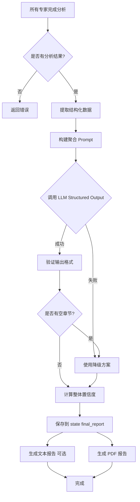

# 报告生成模块 - AI 协作文档

> 📍 **路径导航**: [根目录](../../CLAUDE.md) > [intelligent_project_analyzer](../) > **report**

---

## 📋 模块职责

**报告生成系统 (Report Generation System)**

本模块负责将所有专家的分析结果聚合、整合，并生成最终的项目分析报告。支持文本和 PDF 两种格式，使用 LLM 驱动的智能聚合算法确保报告质量。

### 核心功能
- 📊 **结果聚合**: 使用 LLM 整合所有专家的分析结果
- 📝 **文本生成**: 生成纯文本格式报告（调试用）
- 📄 **PDF 生成**: 生成专业的 PDF 格式报告
- 🎯 **结构化输出**: 使用 Pydantic 模型确保输出格式一致
- 🔍 **质量控制**: 整体置信度计算和验证

---

## 📁 文件结构

```
report/
├── result_aggregator.py      # 结果聚合器（LLM驱动）
│   ├── ResultAggregatorAgent
│   ├── ExecutiveSummary (Pydantic模型)
│   ├── ReportSectionWithId (Pydantic模型)
│   ├── ComprehensiveAnalysis (Pydantic模型)
│   ├── Conclusions (Pydantic模型)
│   └── FinalReport (Pydantic模型)
│
├── text_generator.py         # 纯文本报告生成器
│   └── TextGeneratorAgent
│
└── pdf_generator.py          # PDF报告生成器
    └── PDFGeneratorAgent
```

---

## 🔑 关键实现

### 1. 结果聚合器 (ResultAggregatorAgent)

**职责**: 使用 LLM 将所有专家的分析结果聚合成一个完整的报告结构。

**核心特性**:
- ✅ **LLM 驱动**: 使用 OpenAI Structured Outputs 确保输出格式
- ✅ **Pydantic 模型**: 定义严格的数据结构（支持 `extra='forbid'`）
- ✅ **智能聚合**: 跨领域洞察、整合建议、风险评估
- ✅ **动态角色支持**: 兼容动态角色 ID（V3_人物及叙事专家_3-1）
- ✅ **降级方案**: LLM 失败时使用简单聚合

**聚合流程**:
```
1. 提取所有专家的结构化数据
2. 构建聚合 Prompt（包含项目需求、专家结果）
3. 调用 LLM with_structured_output(FinalReport)
4. 验证输出（检查空章节）
5. 计算整体置信度
6. 保存到 state["final_report"]
```

**Pydantic 模型定义**:

```python
class FinalReport(BaseModel):
    """最终报告结构（支持 OpenAI Structured Outputs strict mode）"""
    model_config = ConfigDict(
        extra='forbid',  # 禁止额外属性
        populate_by_name=True  # 允许使用别名
    )

    inquiry_architecture: str = Field(
        description="探询架构类型：深度优先探询/广度优先探询/直接探询"
    )

    executive_summary: ExecutiveSummary = Field(
        description="执行摘要"
    )

    sections: List[ReportSectionWithId] = Field(
        description="报告章节列表，每个专家一个章节"
    )

    comprehensive_analysis: ComprehensiveAnalysis = Field(
        description="综合分析"
    )

    conclusions: Conclusions = Field(
        description="结论和建议"
    )

    expert_reports: Optional[str] = Field(
        default="",
        description="专家原始报告（附录用）"
    )
```

**关键字段说明**:
- `sections`: 使用 `List[ReportSectionWithId]` 代替 `Dict[str, Any]`，因为 OpenAI Structured Outputs 对动态键字典支持不佳
- `extra='forbid'`: 禁止额外属性，支持 strict mode
- 所有必填字段不设置默认值（解决"LLM returned empty sections"问题）

**聚合 Prompt 示例**:
```python
system_prompt = """你是一位资深的项目分析整合专家...

你的任务：
1. 理解所有专家的分析结果
2. 生成执行摘要
3. 整理每个专家的分析为独立章节
4. 进行跨领域综合分析
5. 提出最终结论和建议

输出要求：
- 使用提供的结构化输出格式
- 确保每个章节内容完整（不要留空）
- 整体置信度基于所有专家的平均置信度
"""

user_prompt = f"""
项目需求：
{structured_requirements}

专家分析结果：
{agent_results}

请生成完整的项目分析报告。
"""
```

**代码位置**: `result_aggregator.py` 第 1-700+ 行

---

### 2. 纯文本报告生成器 (TextGeneratorAgent)

**职责**: 生成纯文本格式的报告，主要用于调试和查看完整数据结构。

**核心特性**:
- ✅ 生成易读的纯文本格式
- ✅ 包含完整的 `final_report` JSON 数据
- ✅ 保存到 `./reports/` 目录
- ✅ 带时间戳的文件名

**报告结构**:
```
================================================================================
智能项目分析报告 (调试版本)
================================================================================

## 元数据
生成时间: 2025-11-16 00:00:00
会话ID: session_123
智能体数量: 5
整体置信度: 0.85

================================================================================
1. 执行摘要
================================================================================

项目概述:
...

关键发现:
  • 发现1
  • 发现2

关键建议:
  • 建议1
  • 建议2

================================================================================
2. 人物及叙事专家分析
================================================================================
置信度: 0.85

内容:
...

================================================================================
原始 final_report 数据结构
================================================================================
{
  "inquiry_architecture": "深度优先探询",
  "executive_summary": {...},
  ...
}
```

**使用场景**:
- 调试 LLM 输出格式
- 查看完整的数据结构
- 快速验证聚合结果

**代码位置**: `text_generator.py` 第 1-182 行

---

### 3. PDF 报告生成器 (PDFGeneratorAgent)

**职责**: 使用 ReportLab 生成专业的 PDF 格式报告。

**核心特性**:
- ✅ 中文字体支持（自动检测系统字体）
- ✅ 自定义样式（标题、章节、正文）
- ✅ 表格支持（元数据、成功指标等）
- ✅ 分页和页眉页脚
- ✅ 多平台兼容（Windows/macOS/Linux）

**字体注册** (跨平台):
```python
def _register_chinese_fonts(self):
    """注册中文字体"""
    system = platform.system()

    if system == "Windows":
        font_paths = [
            ('SimHei', 'C:/Windows/Fonts/simhei.ttf'),  # 黑体 (TTF)
            ('SimSun', 'C:/Windows/Fonts/simsun.ttc'),  # 宋体 (TTC)
        ]
    elif system == "Darwin":  # macOS
        font_paths = [
            ('PingFang', '/System/Library/Fonts/PingFang.ttc'),
        ]
    else:  # Linux
        font_paths = [
            ('WenQuanYi', '/usr/share/fonts/truetype/wqy/wqy-zenhei.ttc'),
        ]

    # 尝试注册字体
    for font_name, font_path in font_paths:
        if os.path.exists(font_path):
            pdfmetrics.registerFont(TTFont(font_name, font_path))
            # 注册字体家族（避免查找 bold/italic 变体）
            pdfmetrics.registerFontFamily(
                font_name,
                normal=font_name,
                bold=font_name,
                italic=font_name,
                boldItalic=font_name
            )
            self.default_font = font_name
            break

    # 如果 TTF 字体都失败，使用 CID 字体（Adobe 内置）
    if not registered_font:
        pdfmetrics.registerFont(UnicodeCIDFont('STSong-Light'))
        self.default_font = 'STSong-Light'
```

**自定义样式**:
```python
def _setup_custom_styles(self):
    """设置自定义样式"""
    custom_styles = [
        ('CustomTitle', {
            'fontName': self.default_font,
            'fontSize': 24,
            'alignment': TA_CENTER,
            'textColor': colors.darkblue
        }),
        ('SectionTitle', {
            'fontName': self.default_font,
            'fontSize': 16,
            'textColor': colors.darkblue
        }),
        ('CustomBodyText', {
            'fontName': self.default_font,
            'fontSize': 11,
            'alignment': TA_JUSTIFY
        })
    ]

    for style_name, style_props in custom_styles:
        self.styles.add(ParagraphStyle(name=style_name, **style_props))
```

**报告组件** (使用 ReportLab Platypus):
```python
def _generate_pdf_report(self, state):
    """生成 PDF 报告"""
    pdf_path = f"./reports/project_analysis_{session_id}_{timestamp}.pdf"

    doc = SimpleDocTemplate(pdf_path, pagesize=A4)
    story = []

    # 1. 标题页
    story.append(Paragraph("智能项目分析报告", self.styles['CustomTitle']))
    story.append(Spacer(1, 0.5*inch))

    # 2. 元数据表格
    metadata_data = [
        ["生成时间", metadata.get('generated_at')],
        ["会话ID", metadata.get('session_id')],
        ["整体置信度", f"{metadata.get('overall_confidence', 0):.2%}"]
    ]
    metadata_table = Table(metadata_data, colWidths=[3*cm, 10*cm])
    metadata_table.setStyle(TableStyle([
        ('BACKGROUND', (0, 0), (0, -1), colors.lightgrey),
        ('GRID', (0, 0), (-1, -1), 0.5, colors.grey)
    ]))
    story.append(metadata_table)

    # 3. 执行摘要
    story.append(PageBreak())
    story.append(Paragraph("1. 执行摘要", self.styles['SectionTitle']))
    story.append(Paragraph(executive_summary['project_overview'], self.styles['CustomBodyText']))

    # 4. 各专家章节
    for section in sections:
        story.append(PageBreak())
        story.append(Paragraph(section['title'], self.styles['SectionTitle']))
        story.append(Paragraph(section['content'], self.styles['CustomBodyText']))

    # 5. 构建 PDF
    doc.build(story)
```

**代码位置**: `pdf_generator.py` 第 1-400+ 行

---

## 🧠 核心概念

### Structured Outputs（结构化输出）

使用 OpenAI 的 Structured Outputs 功能确保 LLM 输出符合 Pydantic 模型：

```python
# 1. 定义 Pydantic 模型（strict mode）
class FinalReport(BaseModel):
    model_config = ConfigDict(extra='forbid')
    inquiry_architecture: str = Field(description="...")
    executive_summary: ExecutiveSummary = Field(description="...")
    sections: List[ReportSectionWithId] = Field(description="...")
    # ...

# 2. 创建结构化输出 LLM
structured_llm = self.llm.with_structured_output(FinalReport, strict=True)

# 3. 调用并自动解析
final_report: FinalReport = structured_llm.invoke(messages)

# 4. 转换为字典
final_report_dict = final_report.model_dump()
```

**关键注意事项**:
- ✅ 使用 `extra='forbid'` 禁止额外属性
- ✅ 避免使用动态键字典（`Dict[str, Any]`）
- ✅ 使用 `List[Model]` 代替 `Dict[str, Model]`
- ✅ 所有必填字段不设置默认值

---

### 降级方案

当 LLM 聚合失败时，使用简单聚合算法：

```python
def _simple_aggregation(self, state):
    """简单聚合（降级方案）"""
    agent_results = state.get("agent_results", {})

    # 计算平均置信度
    confidences = [
        result.get("confidence", 0)
        for result in agent_results.values()
        if isinstance(result, dict)
    ]
    avg_confidence = sum(confidences) / len(confidences) if confidences else 0

    # 提取关键发现（每个专家前3个）
    key_findings = []
    for result in agent_results.values():
        findings = self._extract_key_findings(result)
        key_findings.extend(findings[:3])

    # 构建简单报告
    final_report = {
        "inquiry_architecture": "直接探询",
        "executive_summary": {
            "project_overview": "项目分析报告（自动生成）",
            "key_findings": key_findings,
            "key_recommendations": ["建议1", "建议2"],
            "success_factors": ["因素1", "因素2"]
        },
        "sections": [...],  # 每个专家一个章节
        "comprehensive_analysis": {...},
        "conclusions": {...},
        "metadata": {
            "overall_confidence": avg_confidence,
            "generated_at": datetime.now().isoformat()
        }
    }

    return final_report
```

---

## 📊 数据模型

### ExecutiveSummary（执行摘要）

```python
class ExecutiveSummary(BaseModel):
    model_config = ConfigDict(extra='forbid')

    project_overview: str = Field(description="项目概述")
    key_findings: List[str] = Field(description="关键发现列表")
    key_recommendations: List[str] = Field(description="核心建议列表")
    success_factors: List[str] = Field(description="成功要素列表")
```

---

### ReportSectionWithId（报告章节）

```python
class ReportSectionWithId(BaseModel):
    """
    报告章节数据 - 包含 section_id 字段

    使用 List[ReportSectionWithId] 替代 Dict[str, ReportSectionData]
    解决 OpenAI Structured Outputs 对动态键字典支持不佳的问题
    """
    model_config = ConfigDict(extra='forbid')

    section_id: str = Field(description="章节ID,如 V3_人物及叙事专家_3-1")
    title: str = Field(description="章节标题")
    content: str = Field(description="章节内容（字符串格式）")
    confidence: float = Field(description="分析置信度,0-1之间", ge=0, le=1)
```

**为什么使用 List 而不是 Dict？**

OpenAI Structured Outputs 的 strict mode 不支持动态键字典（如 `Dict[str, SomeModel]`），因为动态键无法在 JSON Schema 中明确定义。

解决方案：将字典转换为列表，每个元素包含 `section_id` 字段。

```python
# ❌ 不支持
sections: Dict[str, ReportSectionData]

# ✅ 推荐
sections: List[ReportSectionWithId]
```

---

### ComprehensiveAnalysis（综合分析）

```python
class ComprehensiveAnalysis(BaseModel):
    model_config = ConfigDict(extra='forbid')

    cross_domain_insights: List[str] = Field(description="跨领域洞察")
    integrated_recommendations: List[str] = Field(description="整合建议")
    risk_assessment: List[str] = Field(description="风险评估")
    implementation_roadmap: List[str] = Field(description="实施路线图")
```

---

### Conclusions（结论和建议）

```python
class Conclusions(BaseModel):
    model_config = ConfigDict(extra='forbid')

    project_analysis_summary: str = Field(description="项目分析总结")
    next_steps: List[str] = Field(description="下一步行动建议")
    success_metrics: List[str] = Field(description="成功指标")
```

---

## 🔄 聚合流程

完整的聚合流程图：



---

## 🛠️ 依赖关系

```python
# 直接依赖
from ..agents.base import BaseAgent, LLMAgent
from ..core.state import ProjectAnalysisState, AgentType, AnalysisStage
from ..core.types import AnalysisResult, ReportSection

# Pydantic 依赖
from pydantic import BaseModel, Field, ConfigDict

# LangChain 依赖
from langchain_core.messages import HumanMessage, SystemMessage
from langchain_core.runnables import RunnableConfig

# ReportLab 依赖 (PDF 生成)
from reportlab.lib.pagesizes import A4
from reportlab.platypus import SimpleDocTemplate, Paragraph, Table
from reportlab.lib.styles import getSampleStyleSheet, ParagraphStyle
from reportlab.pdfbase import pdfmetrics
from reportlab.pdfbase.ttfonts import TTFont
```

---

## 🧪 测试建议

### 单元测试

1. **测试 Pydantic 模型验证**
   ```python
   def test_final_report_validation():
       # 测试必填字段
       with pytest.raises(ValidationError):
           FinalReport()  # 缺少必填字段

       # 测试正确数据
       report = FinalReport(
           inquiry_architecture="深度优先探询",
           executive_summary=ExecutiveSummary(...),
           sections=[...],
           comprehensive_analysis=ComprehensiveAnalysis(...),
           conclusions=Conclusions(...)
       )
       assert report.inquiry_architecture == "深度优先探询"
   ```

2. **测试降级方案**
   ```python
   def test_simple_aggregation():
       state = {
           "agent_results": {
               "V3_人物及叙事专家_3-1": {
                   "confidence": 0.85,
                   "structured_data": {...}
               }
           }
       }
       agent = ResultAggregatorAgent()
       result = agent._simple_aggregation(state)
       assert "executive_summary" in result
       assert result["metadata"]["overall_confidence"] > 0
   ```

3. **测试字体注册**
   ```python
   def test_chinese_font_registration():
       agent = PDFGeneratorAgent()
       assert hasattr(agent, 'default_font')
       assert agent.default_font in ['SimHei', 'SimSun', 'STSong-Light', 'Helvetica']
   ```

### 集成测试

1. **完整聚合流程测试**
   - 模拟所有专家的分析结果
   - 调用 ResultAggregatorAgent.execute()
   - 验证 `state["final_report"]` 结构

2. **PDF 生成测试**
   - 生成 PDF 文件
   - 验证文件存在
   - 验证文件大小 > 0

---

## 📝 常见问题 (FAQ)

### Q1: 为什么使用 List[ReportSectionWithId] 而不是 Dict[str, ReportSectionData]？

**A**: OpenAI Structured Outputs 的 strict mode 不支持动态键字典，因为：
1. JSON Schema 无法定义未知的键名
2. LLM 可能生成不符合预期的键名
3. 验证逻辑复杂

使用 List + `section_id` 字段可以解决这个问题：
- 每个元素包含自己的 ID
- 结构明确，易于验证
- LLM 更容易理解和生成

---

### Q2: 如何处理 LLM 返回空章节的问题？

**A**: 通过以下措施：
1. **不设置默认值**: 所有必填字段不设置默认值，强制 LLM 提供内容
2. **验证输出**: 检查 `sections` 列表是否为空
3. **降级方案**: 如果验证失败，使用简单聚合算法
4. **明确的 Prompt**: 在系统提示中强调"确保每个章节内容完整（不要留空）"

```python
# 验证逻辑
if not final_report_dict.get("sections"):
    logger.warning("LLM returned empty sections, using simple aggregation")
    return self._simple_aggregation(state)
```

---

### Q3: 如何在 Windows 上解决中文字体问题？

**A**: PDF 生成器会自动检测和注册系统字体：
1. 优先使用 TTF 文件（黑体 simhei.ttf）
2. 降级为 TTC 文件（宋体 simsun.ttc）
3. 最终降级为 CID 字体（STSong-Light）

**手动指定字体**:
```python
# 如果自动检测失败，可以手动指定
agent = PDFGeneratorAgent(config={
    "font_name": "SimHei",
    "font_path": "C:/Windows/Fonts/simhei.ttf"
})
```

---

### Q4: 为什么需要纯文本报告生成器？

**A**: 纯文本报告主要用于：
1. **调试**: 快速查看完整的数据结构
2. **验证**: 检查 LLM 输出是否符合预期
3. **备份**: 保存原始数据（包括 JSON）
4. **测试**: 不依赖 ReportLab（可能未安装）

在生产环境中，可以禁用文本报告生成。

---

### Q5: 如何自定义报告样式？

**A**: 通过修改 `_setup_custom_styles()` 方法：

```python
def _setup_custom_styles(self):
    custom_styles = [
        ('MyCustomTitle', {
            'fontName': self.default_font,
            'fontSize': 28,  # 更大的标题
            'alignment': TA_CENTER,
            'textColor': colors.red  # 红色标题
        })
    ]

    for style_name, style_props in custom_styles:
        self.styles.add(ParagraphStyle(name=style_name, **style_props))

# 使用自定义样式
story.append(Paragraph("标题", self.styles['MyCustomTitle']))
```

---

## 🚀 最佳实践

### 1. 设计 Pydantic 模型

**使用 strict mode**:
```python
class MyModel(BaseModel):
    model_config = ConfigDict(
        extra='forbid',  # 禁止额外属性
        populate_by_name=True  # 允许别名
    )

    required_field: str = Field(description="必填字段，不设置默认值")
    optional_field: Optional[str] = Field(default="", description="可选字段")
```

### 2. 编写聚合 Prompt

**清晰的指令**:
```python
system_prompt = """
你是一位资深的项目分析整合专家。

任务：
1. 理解所有专家的分析结果
2. 生成完整的项目分析报告

要求：
- 确保每个章节内容完整（不要留空）
- 使用提供的结构化输出格式
- 整体置信度基于所有专家的平均置信度
"""
```

### 3. 处理错误

**多级降级**:
```python
try:
    # 1. 尝试 LLM 聚合
    final_report = self._llm_aggregation(state)
except Exception as e:
    logger.warning(f"LLM aggregation failed: {e}, using simple aggregation")
    try:
        # 2. 降级为简单聚合
        final_report = self._simple_aggregation(state)
    except Exception as e2:
        logger.error(f"Simple aggregation failed: {e2}")
        # 3. 最终降级：最小化报告
        final_report = self._minimal_report(state)
```

### 4. 优化 PDF 生成

**分页策略**:
```python
# 长内容添加分页
if len(content) > 5000:  # 超过5000字符
    story.append(PageBreak())

# 章节标题前添加分页
for section in sections:
    story.append(PageBreak())
    story.append(Paragraph(section['title'], self.styles['SectionTitle']))
```

---

## 📚 相关资源

### 内部文档
- [核心状态管理](../core/CLAUDE.md)
- [智能体系统](../agents/CLAUDE.md)
- [工作流编排](../workflow/CLAUDE.md)

### 官方文档
- [OpenAI Structured Outputs](https://platform.openai.com/docs/guides/structured-outputs)
- [Pydantic Documentation](https://docs.pydantic.dev/)
- [ReportLab User Guide](https://www.reportlab.com/docs/reportlab-userguide.pdf)

---

**最后更新**: 2025-11-16
**覆盖率**: 100%
**文档版本**: 1.0.0
