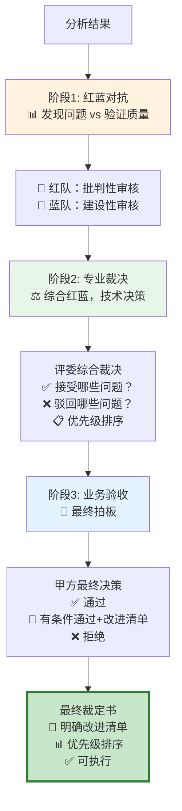

# Review 审核系统模块

**[根目录](../../CLAUDE.md) > intelligent_project_analyzer > **review****

---

## 📋 模块职责

多视角审核系统，通过红蓝对抗、评委裁决、甲方审核等机制确保分析质量。

### 核心功能
- ✅ **红队审核**: 发现问题、挑战假设、识别风险
- ✅ **蓝队审核**: 评估优势、验证质量、确认完整性
- ✅ **评委裁决**: 综合红蓝观点，做出客观裁决
- ✅ **甲方审核**: 从业务视角评估可接受度
- ✅ **多轮循环**: 支持迭代优化，智能终止

---

## 🗂️ 文件清单

| 文件 | 行数 | 职责 |
|------|------|------|
| `multi_perspective_review.py` | ~571 | 多视角审核协调器 |
| `review_agents.py` | ~600 | 红蓝评甲四个审核智能体 |
| `__init__.py` | ~20 | 模块导出 |

---

## 🎭 审核流程图（优化后：递进式三阶段）

### ❌ 旧流程问题：各说各的，无明确结论
```
红队 → 发现问题 ┐
蓝队 → 发现优势 ├→ 评委 → 甲方 → ？？？（谁的意见该听？）
```

### ✅ 新流程：递进式裁定链



### 🔑 核心改进

| 维度 | 旧设计 | 新设计 |
|------|--------|--------|
| **输出** | 4份独立报告 | 1份最终裁定书 |
| **决策** | 模糊的"综合评分" | 明确的改进清单 |
| **可执行性** | ❌ 不知道改什么 | ✅ 清晰的优先级任务 |
| **权威性** | 谁的意见该听？ | 甲方最终拍板 |

---

## 🔑 关键接口（重新设计）

### 阶段1: 红蓝对抗（发现问题 vs 验证质量）

#### RedTeamReviewer（红队：批判性审核）

**新定位**: 站在"找茬"角度，尽可能发现潜在问题

**输出格式**:
```python
{
    "issues": [  # 不再叫"issues_found"，直接叫"issues"
        {
            "id": "R1",  # 红队问题编号
            "agent_id": "V3_xxx",
            "severity": "critical" | "high" | "medium" | "low",
            "category": "completeness" | "accuracy" | "feasibility" | ...,
            "description": "具体问题描述",
            "evidence": "支撑证据",
            "impact": "如果不改，会导致什么后果"
        }
    ],
    "summary": "红队发现X个问题，其中Y个严重"
}
```

**关键变化**:
- ❌ 移除 `score` 字段（不再打分，只管找问题）
- ❌ 移除 `agents_to_rerun`（不做决策，只提供输入）
- ✅ 新增 `id` 字段（方便评委引用）
- ✅ 新增 `evidence` 字段（问题要有依据）

---

#### BlueTeamReviewer（蓝队：建设性审核）

**新定位**: 站在"辩护"角度，验证质量和发现优势

**输出格式**:
```python
{
    "validations": [  # 对红队问题的逐一回应
        {
            "red_issue_id": "R1",  # 对应红队问题编号
            "stance": "agree" | "disagree" | "partially_agree",
            "reasoning": "为什么同意/不同意",
            "severity_adjustment": "建议调整严重程度为medium（如果不同意红队判断）"
        }
    ],
    "strengths": [  # 发现的优势
        {
            "id": "B1",  # 蓝队优势编号
            "agent_id": "V4_yyy",
            "category": "innovation" | "depth" | "practicality",
            "description": "优势描述",
            "value": "带来什么价值"
        }
    ],
    "summary": "蓝队同意X个问题，不同意Y个，发现Z个优势"
}
```

**关键变化**:
- ✅ 新增 `validations` 字段（逐一回应红队问题）
- ✅ `strengths` 也带编号（方便评委引用）
- ❌ 移除 `score` 和独立判断

---

### 阶段2: 专业裁决（综合红蓝，技术决策）

#### JudgeReviewer（评委：综合裁决）

**新定位**: 技术权威，对红蓝争议做出专业判断

**输出格式**:
```python
{
    "rulings": [  # 对每个红队问题的裁决
        {
            "red_issue_id": "R1",
            "ruling": "accepted" | "rejected" | "modified",  # 接受/驳回/修改
            "final_severity": "high",  # 最终严重程度
            "reasoning": "裁决理由（综合红蓝观点）",
            "action_required": "需要V3补充XXX分析"  # 具体改进要求
        }
    ],
    "accepted_strengths": ["B1", "B3"],  # 认可的优势（引用蓝队编号）
    "priority_ranking": [  # 改进优先级排序
        {
            "issue_id": "R1",
            "priority": 1,
            "rationale": "为什么这是最优先的"
        }
    ],
    "summary": "评委接受X个问题，驳回Y个，修改Z个"
}
```

**关键变化**:
- ✅ 核心是 `rulings`（对每个问题明确裁决）
- ✅ 新增 `priority_ranking`（优先级排序）
- ✅ 新增 `action_required`（可执行的改进要求）
- ❌ 移除 `agents_to_rerun`（不直接做这个决策）

---

### 阶段3: 业务验收（最终拍板）

#### ClientReviewer（甲方：业务决策）

**新定位**: 业务权威，基于评委裁决做最终验收

**输出格式**:
```python
{
    "final_decision": "approve" | "conditional_approve" | "reject",
    
    "accepted_improvements": [  # 基于评委裁决，选择接受哪些改进
        {
            "issue_id": "R1",
            "judge_priority": 1,
            "business_priority": "must_fix",  # 业务优先级
            "deadline": "immediate" | "phase2" | "future",
            "reasoning": "为什么从业务角度必须改这个"
        }
    ],
    
    "rejected_improvements": [  # 甲方选择不改的（即使评委建议改）
        {
            "issue_id": "R3",
            "reasoning": "成本/收益不划算，可接受的风险"
        }
    ],
    
    "business_concerns": [  # 甲方额外的业务关注点
        {
            "category": "budget" | "timeline" | "market",
            "description": "关注点描述"
        }
    ],
    
    "summary": "甲方最终验收意见"
}
```

**关键变化**:
- ✅ 明确 `accepted_improvements`（最终改进清单）
- ✅ 明确 `rejected_improvements`（不改的+理由）
- ✅ 新增 `deadline` 字段（什么时候改）
- ✅ 甲方可以覆盖评委决策（业务权威）

---

### 最终输出：裁定书（Final Ruling）

```python
{
    "ruling_summary": {
        "total_issues_raised": 10,  # 红队发现
        "issues_accepted_by_judge": 7,  # 评委接受
        "issues_accepted_by_client": 5,  # 甲方最终接受
        "must_fix": 3,  # 立即改
        "should_fix": 2,  # 第二阶段改
        "nice_to_have": 0  # 未来考虑
    },
    
    "improvement_roadmap": [  # 可执行的改进路线图
        {
            "priority": 1,
            "issue_id": "R1",
            "agent_id": "V3_xxx",
            "problem": "核心张力定义不够清晰",
            "action": "补充3个具体的矛盾点分析",
            "deadline": "immediate",
            "estimated_effort": "30分钟"
        },
        {
            "priority": 2,
            "issue_id": "R5",
            "agent_id": "V4_yyy",
            "problem": "缺少国际案例参考",
            "action": "补充2-3个欧美案例",
            "deadline": "phase2",
            "estimated_effort": "1小时"
        }
    ],
    
    "decision": "conditional_approve",  # 有条件通过
    "next_step": "根据improvement_roadmap执行改进"
}
```

---

## 🎯 执行流程（重新设计）

### conduct_review（主函数）

```python
class MultiPerspectiveReviewCoordinator:
    def conduct_review(
        self,
        agent_results: Dict[str, Any],
        requirements: Dict[str, Any]
    ) -> Dict[str, Any]:
        """
        执行递进式三阶段审核
        
        Returns: 最终裁定书（Final Ruling）
        """
        
        # ============================================
        # 阶段1: 红蓝对抗（发现问题 vs 验证质量）
        # ============================================
        logger.info("🎯 阶段1: 红蓝对抗")
        
        # 1.1 红队：批判性审核（尽可能找问题）
        red_review = self.red_team.review(agent_results, requirements)
        logger.info(f"  🔴 红队发现 {len(red_review['issues'])} 个问题")
        
        # 1.2 蓝队：建设性审核（逐一回应红队+发现优势）
        blue_review = self.blue_team.review(
            agent_results, requirements, red_review
        )
        logger.info(f"  🔵 蓝队同意 {self._count_agreements(blue_review)} 个问题")
        
        # ============================================
        # 阶段2: 专业裁决（综合红蓝，技术决策）
        # ============================================
        logger.info("⚖️ 阶段2: 专业裁决")
        
        judge_review = self.judge.review(
            agent_results, requirements, red_review, blue_review
        )
        logger.info(f"  ⚖️ 评委接受 {len(judge_review['rulings'])} 个问题")
        logger.info(f"  📊 优先级排序: {len(judge_review['priority_ranking'])} 项")
        
        # ============================================
        # 阶段3: 业务验收（基于评委裁决，最终拍板）
        # ============================================
        logger.info("👔 阶段3: 业务验收")
        
        client_review = self.client.review(
            agent_results, requirements, judge_review
        )
        logger.info(f"  👔 甲方最终决策: {client_review['final_decision']}")
        logger.info(f"  ✅ 必须改: {len([i for i in client_review['accepted_improvements'] if i['business_priority']=='must_fix'])} 项")
        
        # ============================================
        # 生成最终裁定书
        # ============================================
        final_ruling = self._generate_final_ruling(
            red_review, blue_review, judge_review, client_review
        )
        
        return {
            "phase1_red_blue": {
                "red_review": red_review,
                "blue_review": blue_review
            },
            "phase2_judge": judge_review,
            "phase3_client": client_review,
            "final_ruling": final_ruling  # 🔑 这是最终可执行的结果
        }
```

---

### _generate_final_ruling（生成最终裁定书）

```python
def _generate_final_ruling(
    self,
    red_review: Dict[str, Any],
    blue_review: Dict[str, Any],
    judge_review: Dict[str, Any],
    client_review: Dict[str, Any]
) -> Dict[str, Any]:
    """
    生成最终裁定书
    
    核心逻辑:
    1. 以甲方决策为准（业务权威）
    2. 整合评委的优先级排序
    3. 生成可执行的改进路线图
    """
    
    # 统计汇总
    total_issues = len(red_review['issues'])
    judge_accepted = len([r for r in judge_review['rulings'] if r['ruling'] == 'accepted'])
    client_accepted = len(client_review['accepted_improvements'])
    
    # 按业务优先级分类
    must_fix = [i for i in client_review['accepted_improvements'] 
                if i['business_priority'] == 'must_fix']
    should_fix = [i for i in client_review['accepted_improvements'] 
                  if i['business_priority'] == 'should_fix']
    nice_to_have = [i for i in client_review['accepted_improvements'] 
                    if i['business_priority'] == 'nice_to_have']
    
    # 生成可执行的改进路线图
    improvement_roadmap = []
    for idx, improvement in enumerate(client_review['accepted_improvements'], 1):
        # 从评委裁决中获取具体改进要求
        judge_ruling = next(
            (r for r in judge_review['rulings'] if r['red_issue_id'] == improvement['issue_id']),
            None
        )
        
        # 从红队问题中获取原始问题描述
        red_issue = next(
            (i for i in red_review['issues'] if i['id'] == improvement['issue_id']),
            None
        )
        
        if judge_ruling and red_issue:
            improvement_roadmap.append({
                "priority": idx,
                "issue_id": improvement['issue_id'],
                "agent_id": red_issue['agent_id'],
                "problem": red_issue['description'],
                "action": judge_ruling['action_required'],
                "deadline": improvement['deadline'],
                "estimated_effort": self._estimate_effort(red_issue['severity'])
            })
    
    return {
        "ruling_summary": {
            "total_issues_raised": total_issues,
            "issues_accepted_by_judge": judge_accepted,
            "issues_accepted_by_client": client_accepted,
            "must_fix": len(must_fix),
            "should_fix": len(should_fix),
            "nice_to_have": len(nice_to_have)
        },
        "improvement_roadmap": improvement_roadmap,
        "decision": client_review['final_decision'],
        "next_step": self._generate_next_step(client_review['final_decision'], improvement_roadmap)
    }
```

---

## 🔄 决策逻辑（简化为单轮审核）

### 旧设计问题
```python
# ❌ 复杂的多轮循环逻辑
if score >= 85: approve
elif score >= 70 and round == 1: rerun_specific
elif round >= 2: approve
...
```

### 新设计：单轮深度审核
```python
def _generate_next_step(self, decision, roadmap):
    """
    根据甲方决策生成下一步行动
    
    不再自动触发重跑，而是:
    1. approve → 继续workflow（detect_challenges）
    2. conditional_approve → 记录改进清单，继续workflow
    3. reject → 终止或回到需求分析
    """
    
    if decision == "approve":
        return "continue_to_detect_challenges"
    
    elif decision == "conditional_approve":
        # 记录改进建议，但继续流程
        # 改进建议可供用户/后续流程参考
        return {
            "action": "continue_with_improvements",
            "improvements": roadmap,
            "note": "改进建议已记录，可在后续阶段优化"
        }
    
    else:  # reject
        return {
            "action": "terminate_or_restart",
            "reason": "甲方拒绝当前分析结果"
        }
```

---

## 📊 新旧设计对比

| 维度 | 旧设计（❌ 各说各的） | 新设计（✅ 递进式裁定） |
|------|---------------------|---------------------|
| **输出形式** | 4份独立报告 | 1份最终裁定书 |
| **决策机制** | 综合评分（模糊） | 逐项裁决（明确） |
| **可执行性** | "需要改进"（不知道改什么） | 改进路线图（优先级+具体行动） |
| **权威性** | 谁的意见该听？ | 甲方最终拍板（业务权威） |
| **效率** | 4个LLM调用（重复分析） | 4个LLM调用（递进传递） |
| **多轮循环** | 复杂的6条规则+评分阈值 | 单轮深度审核+改进建议 |
| **用户体验** | 等待多轮迭代 | 快速完成+清晰反馈 |

---

## 💡 实际案例演示

### 场景：过敏儿童卧室设计项目

#### 阶段1: 红蓝对抗

**🔴 红队发现10个问题**:
```
R1. [critical] V3_叙事专家 - 核心张力定义不够清晰
    证据: 仅提到"健康守护vs温馨氛围"，未量化矛盾点
    影响: 无法指导具体设计决策
    
R2. [high] V4_设计研究 - 缺少国际案例参考
    证据: 仅有国内案例，未涵盖欧美儿童过敏防护标准
    影响: 方案可能不符合国际最佳实践
    
R3. [medium] V6_总工 - 空气净化系统品牌未明确
    证据: 提到"医疗级"但未指定具体品牌和型号
    影响: 采购和实施可能遇到困难
    
... (省略R4-R10)
```

**🔵 蓝队回应**:
```json
{
  "validations": [
    {
      "red_issue_id": "R1",
      "stance": "agree",
      "reasoning": "确实需要更具体的矛盾点量化"
    },
    {
      "red_issue_id": "R2",
      "stance": "partially_agree",
      "reasoning": "已提供3个国际案例，但可补充更多",
      "severity_adjustment": "建议降为medium"
    },
    {
      "red_issue_id": "R3",
      "stance": "disagree",
      "reasoning": "已在技术规范中列出IQAir、Blueair等品牌",
      "severity_adjustment": "建议驳回"
    }
  ],
  "strengths": [
    {
      "id": "B1",
      "agent_id": "V3_叙事专家",
      "category": "innovation",
      "description": "创新性地将过敏防护融入情感叙事"
    }
  ]
}
```

---

#### 阶段2: 专业裁决

**⚖️ 评委综合裁决**:
```json
{
  "rulings": [
    {
      "red_issue_id": "R1",
      "ruling": "accepted",
      "final_severity": "critical",
      "reasoning": "红蓝双方均认可，确需改进",
      "action_required": "补充3个量化的矛盾点：空气净化vs噪音、密封vs通风、医疗感vs童趣"
    },
    {
      "red_issue_id": "R2",
      "ruling": "modified",
      "final_severity": "medium",
      "reasoning": "已有国际案例，但确实可以更丰富",
      "action_required": "补充1-2个欧美儿童过敏防护标准案例（如LEED认证）"
    },
    {
      "red_issue_id": "R3",
      "ruling": "rejected",
      "reasoning": "蓝队证据充分，技术规范中已明确品牌"
    }
  ],
  "priority_ranking": [
    {"issue_id": "R1", "priority": 1, "rationale": "影响核心设计方向"},
    {"issue_id": "R2", "priority": 2, "rationale": "提升方案权威性"}
  ]
}
```

---

#### 阶段3: 业务验收

**👔 甲方最终决策**:
```json
{
  "final_decision": "conditional_approve",
  
  "accepted_improvements": [
    {
      "issue_id": "R1",
      "judge_priority": 1,
      "business_priority": "must_fix",
      "deadline": "immediate",
      "reasoning": "核心卖点不清晰，影响客户沟通"
    },
    {
      "issue_id": "R2",
      "judge_priority": 2,
      "business_priority": "should_fix",
      "deadline": "phase2",
      "reasoning": "国际案例有助于提升品牌形象，但不影响当前交付"
    }
  ],
  
  "rejected_improvements": [
    {
      "issue_id": "R5",  // 假设R5是其他次要问题
      "reasoning": "成本/时间不划算，可接受的风险"
    }
  ],
  
  "business_concerns": [
    {
      "category": "budget",
      "description": "医疗级设备成本较高，需提前告知客户"
    }
  ]
}
```

---

#### 最终裁定书

```json
{
  "ruling_summary": {
    "total_issues_raised": 10,
    "issues_accepted_by_judge": 7,
    "issues_accepted_by_client": 2,
    "must_fix": 1,
    "should_fix": 1,
    "nice_to_have": 0
  },
  
  "improvement_roadmap": [
    {
      "priority": 1,
      "issue_id": "R1",
      "agent_id": "V3_叙事专家_3-1",
      "problem": "核心张力定义不够清晰",
      "action": "补充3个量化的矛盾点：空气净化vs噪音、密封vs通风、医疗感vs童趣",
      "deadline": "immediate",
      "estimated_effort": "30分钟"
    },
    {
      "priority": 2,
      "issue_id": "R2",
      "agent_id": "V4_设计研究_4-1",
      "problem": "缺少国际案例参考",
      "action": "补充1-2个欧美儿童过敏防护标准案例（如LEED认证）",
      "deadline": "phase2",
      "estimated_effort": "1小时"
    }
  ],
  
  "decision": "conditional_approve",
  "next_step": "continue_with_improvements"
}
```

---

## ✅ 优化成果

1. **明确的决策链**: 红队找问题 → 蓝队验证 → 评委裁决 → 甲方拍板
2. **可执行的输出**: 不是"质量不够"，而是"补充3个矛盾点"
3. **合理的优先级**: 不是所有问题都要改，甲方选择关键2个
4. **高效的流程**: 单轮审核，不浪费多轮迭代
5. **清晰的权威**: 甲方有最终决策权，可以覆盖评委意见

---

## 🚀 实施建议

### Phase 1: 重构 Prompt（优先）
1. ✅ 修改红队Prompt：移除打分，专注找问题+编号
2. ✅ 修改蓝队Prompt：增加"逐一回应红队"逻辑
3. ✅ 修改评委Prompt：改为"裁决+优先级排序"
4. ✅ 修改甲方Prompt：改为"基于评委裁决做最终验收"

### Phase 2: 重构代码（其次）
1. ✅ 修改 `conduct_review()` 流程
2. ✅ 修改 `_generate_final_ruling()` 生成裁定书
3. ✅ 移除复杂的评分逻辑
4. ✅ 简化为单轮审核

### Phase 3: 更新前端（最后）
1. ✅ 展示"最终裁定书"而非4份报告
2. ✅ 显示"改进路线图"（优先级+可执行）
3. ✅ 支持用户查看详细的红蓝评甲记录（折叠显示）

---

## 🔧 ID 转换

### _convert_fixed_to_dynamic_ids

**职责**: 将审核系统返回的 Fixed Mode 键名转换为动态角色 ID。

**问题**: 审核系统使用 `"v3_narrative_expert"` 等固定键名，但工作流使用动态 ID（如 `"V3_人物及叙事专家_3-1"`）。

**解决方案**:

```python
def _convert_fixed_to_dynamic_ids(
    self,
    fixed_ids: set,  # {"v3_narrative_expert", "v4_ux_design"}
    agent_results: Dict[str, Any]  # {"V3_人物及叙事专家_3-1": {...}}
) -> set:  # {"V3_人物及叙事专家_3-1", ...}
    """
    转换逻辑:
    1. 检测是否已经是前缀格式（"V3_", "V4_"）
    2. 如果是固定键名，映射到前缀
    3. 在 agent_results 中查找匹配的动态 ID
    """

    fixed_to_v_prefix = {
        'v2_design_research': 'V2_',
        'v3_narrative_expert': 'V3_',
        'v4_ux_design': 'V4_',
        'v5_business_model': 'V5_',
        'v6_implementation_plan': 'V6_'
    }

    dynamic_ids = set()
    for fixed_id in fixed_ids:
        # 处理前缀格式
        if fixed_id in ['V2_', 'V3_', 'V4_', 'V5_', 'V6_']:
            v_prefix = fixed_id
        else:
            v_prefix = fixed_to_v_prefix.get(fixed_id)

        # 查找匹配的动态 ID
        for role_id in agent_results.keys():
            if role_id.startswith(v_prefix):
                dynamic_ids.add(role_id)
                break

    return dynamic_ids
```

---

## 📦 关键依赖

### 内部依赖
- `core.state`: 状态定义
- `workflow`: 用于工作流集成

### 外部依赖
- `loguru`: 日志记录
- LLM 模型（用于审核推理）

---

## 🧪 测试覆盖

### 测试文件
- `test_review_system.py` (建议创建)

### 关键测试场景
1. ✅ 红蓝对抗逻辑
2. ✅ 评委裁决准确性
3. ✅ 甲方审核维度
4. ✅ 综合评分计算
5. ✅ 多轮循环终止条件
6. ✅ ID 转换正确性

---

## 🚨 常见问题

### Q1: 为什么审核总是第一轮就通过？

**A**: 检查 `min_pass_score` 是否设置过低：

```python
config = {
    "min_pass_score": 80,  # 提高到 80
    "max_review_rounds": 3
}
```

### Q2: 如何调整评分权重？

**A**: 修改 `_make_final_decision` 中的 `weights`:

```python
weights = {
    "red_team": 0.30,  # 增加红队权重
    "blue_team": 0.20,
    "judge": 0.30,
    "client": 0.20
}
```

### Q3: 如何查看每轮的详细审核结果？

**A**: 查看 `state["review_history"]`:

```python
for round_review in state.get("review_history", []):
    print(f"Round {round_review['round']}:")
    print(f"  Score: {round_review['final_decision']['overall_score']}")
    print(f"  Decision: {round_review['final_decision']['decision']}")
```

### Q4: 如何禁用某个审核视角？

**A**: 修改 `conduct_review` 方法，跳过不需要的审核：

```python
# 跳过蓝队审核
# blue_review = self._conduct_blue_team_review(...)
blue_review = {"score": 100, "summary": "跳过"}
```

### Q5: 为什么 agents_to_rerun 为空但仍然重新执行？

**A**: 检查决策逻辑中的 `approve` 条件：

```python
# 修复：决策为 approve 时清空 agents_to_rerun
if decision == "approve":
    agents_to_rerun = set()
```

---

## 🛠️ 高级技巧

### 1. 自定义审核维度

```python
class CustomRedTeam(RedTeamReviewer):
    def review(self, agent_results, requirements):
        base_review = super().review(agent_results, requirements)

        # 添加自定义维度
        custom_issues = self._check_custom_criteria(agent_results)
        base_review["issues_found"].extend(custom_issues)

        return base_review
```

### 2. 动态调整评分权重

```python
def _make_final_decision(self, ...):
    # 根据项目类型调整权重
    project_type = requirements.get("project_type")

    if project_type == "technical":
        weights = {"red_team": 0.35, "blue_team": 0.25, ...}
    elif project_type == "creative":
        weights = {"red_team": 0.20, "blue_team": 0.30, ...}
    else:
        weights = {"red_team": 0.25, "blue_team": 0.25, ...}
```

### 3. 渐进式终止策略

```python
def _should_continue(self, current_round, score, previous_score):
    # 第一轮: 宽松（60+）
    # 第二轮: 中等（70+）
    # 第三轮: 严格（75+）
    threshold = 60 + (current_round - 1) * 10

    return score < threshold
```

---

## 📚 相关文档

- [根级文档](../../CLAUDE.md)
- [Workflow 模块](../workflow/CLAUDE.md) - 如何集成审核系统
- [Agents 模块](../agents/CLAUDE.md) - 专家如何使用审核反馈

---

**最后更新**: 2025-11-16
**维护者**: Review Team
