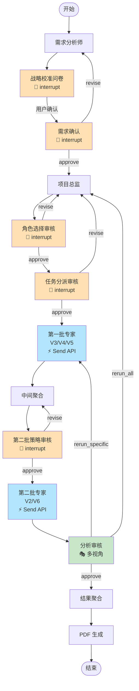

# Workflow 工作流模块

**[根目录](../../CLAUDE.md) > intelligent_project_analyzer > **workflow****

---

## 📋 模块职责

工作流编排模块，负责使用 LangGraph 构建和执行多智能体协作的状态机工作流。

### 核心功能
- ✅ **主工作流**: `MainWorkflow` 编排完整分析流程
- ✅ **动态工作流**: `DynamicWorkflow` 支持运行时构建
- ✅ **节点定义**: 各阶段的执行节点
- ✅ **路由逻辑**: 基于 Command 的动态路由
- ✅ **双批次执行**: 第一批(V3/V4/V5) → 第二批(V2/V6)

---

## 🗂️ 文件清单

| 文件 | 行数 | 职责 |
|------|------|------|
| `main_workflow.py` | ~788 | 主工作流编排器 |
| `dynamic_workflow.py` | ~400 | 动态工作流构建 |
| `__init__.py` | ~20 | 模块导出 |

---

## 🔄 工作流程图



---

## 🔑 关键接口

### 1. MainWorkflow (主工作流)

**初始化**:

```python
class MainWorkflow:
    def __init__(self, llm_model, config: Optional[Dict[str, Any]] = None):
        """
        初始化主工作流

        Args:
            llm_model: LLM 模型实例 (ChatOpenAI)
            config: 配置参数
        """
```

**核心方法**:

```python
def run(self, user_input: str, session_id: Optional[str] = None) -> Dict[str, Any]:
    """运行工作流（同步）"""

def _build_workflow_graph(self) -> StateGraph:
    """构建工作流图"""
```

**工作流构建** (`_build_workflow_graph`):

```python
workflow = StateGraph(ProjectAnalysisState)

# 添加节点
workflow.add_node("requirements_analyst", self._requirements_analyst_node)
workflow.add_node("calibration_questionnaire", self._calibration_questionnaire_node)
workflow.add_node("requirements_confirmation", self._requirements_confirmation_node)
workflow.add_node("project_director", self._project_director_node)
workflow.add_node("role_selection_review", self._role_selection_review_node)
workflow.add_node("task_assignment_review", self._task_assignment_review_node)
workflow.add_node("first_batch_agent", self._execute_agent_node)
workflow.add_node("intermediate_aggregator", self._intermediate_aggregator_node)
workflow.add_node("second_batch_strategy_review", self._second_batch_strategy_review_node)
workflow.add_node("second_batch_agent", self._execute_agent_node)
workflow.add_node("analysis_review", self._analysis_review_node)
workflow.add_node("result_aggregator", self._result_aggregator_node)
workflow.add_node("pdf_generator", self._pdf_generator_node)

# 添加边
workflow.add_edge(START, "requirements_analyst")
workflow.add_edge("requirements_analyst", "calibration_questionnaire")
workflow.add_edge("project_director", "role_selection_review")
workflow.add_edge("role_selection_review", "task_assignment_review")
workflow.add_edge("first_batch_agent", "intermediate_aggregator")
workflow.add_edge("intermediate_aggregator", "second_batch_strategy_review")
workflow.add_edge("second_batch_agent", "analysis_review")
workflow.add_edge("result_aggregator", "pdf_generator")
workflow.add_edge("pdf_generator", END)

# 编译图
return workflow.compile(checkpointer=self.checkpointer, store=self.store)
```

**⚠️ 重要**：节点返回 `Command` 时，不要配置 `add_conditional_edges`，否则会冲突。

---

## 🎯 核心节点详解

### 1. 需求分析师节点

```python
def _requirements_analyst_node(self, state: ProjectAnalysisState) -> Dict[str, Any]:
    """
    需求分析师节点

    输入: state["user_input"]
    输出: state["structured_requirements"]
    """
    agent = AgentFactory.create_agent(
        AgentType.REQUIREMENTS_ANALYST,
        llm_model=self.llm_model,
        config=self.config
    )
    result = agent.execute(state, {}, self.store)

    return {
        "current_stage": AnalysisStage.REQUIREMENT_COLLECTION.value,
        "structured_requirements": result.structured_data,
        "agent_results": {
            AgentType.REQUIREMENTS_ANALYST.value: result.to_dict()
        },
        "updated_at": datetime.now().isoformat()
    }
```

### 2. 项目总监节点（Dynamic Mode）

```python
def _project_director_node(self, state: ProjectAnalysisState) -> Dict[str, Any]:
    """
    项目总监节点 - 动态选择角色

    输入: state["structured_requirements"]
    输出: state["active_agents"], state["subagents"]
    """
    agent = AgentFactory.create_agent(
        AgentType.PROJECT_DIRECTOR,
        llm_model=self.llm_model,
        config=self.config
    )

    # 返回 Command 对象
    command = agent.execute(state, {}, self.store)

    # 提取状态更新
    state_update = command.update or {}
    active_agents = state_update.get("active_agents", [])

    logger.info(f"Dynamic mode: Selected {len(active_agents)} roles")

    return state_update
```

### 3. 并行执行节点（Send API）

**第一批专家**:

```python
def _continue_to_first_batch_agents(self, state: ProjectAnalysisState) -> List[Send]:
    """
    创建第一批并行任务 (V3/V4/V5)

    使用 LangGraph Send API 实现并行执行
    """
    active_agents = state.get("active_agents", [])

    # 筛选第一批角色
    first_batch_roles = [
        role_id for role_id in active_agents
        if role_id.startswith("V3_") or role_id.startswith("V4_") or role_id.startswith("V5_")
    ]

    # 创建 Send 对象列表
    send_list = []
    for role_id in first_batch_roles:
        agent_state = dict(state)
        agent_state["role_id"] = role_id
        agent_state["execution_batch"] = "first"

        send_list.append(Send("first_batch_agent", agent_state))

    return send_list
```

**智能体执行节点**:

```python
def _execute_agent_node(self, state: ProjectAnalysisState) -> Dict[str, Any]:
    """
    执行单个智能体

    输入: state["role_id"]
    输出: state["agent_results"][role_id]
    """
    role_id = state.get("role_id")
    from intelligent_project_analyzer.agents.specialized_agent_factory import SpecializedAgentFactory
    from intelligent_project_analyzer.core.role_manager import RoleManager

    role_manager = RoleManager()
    base_type, rid = role_manager.parse_full_role_id(role_id)
    role_config = role_manager.get_role_config(base_type, rid)

    # 创建动态智能体
    agent_node = SpecializedAgentFactory.create_simple_agent_node(
        role_id, role_config, self.llm_model
    )

    result = agent_node(state)
    role_results = result.get("role_results", [])

    # 返回部分更新
    return {
        "agent_results": {
            role_id: {
                "role_id": role_id,
                "analysis": role_results[0].get("result", ""),
                "confidence": 0.8
            }
        }
    }
```

### 4. 中间聚合节点

```python
def _intermediate_aggregator_node(self, state: ProjectAnalysisState) -> Dict[str, Any]:
    """
    中间聚合节点 - 验证第一批结果

    检查 V3/V4/V5 是否完成，为 V2/V6 准备依赖数据
    """
    agent_results = state.get("agent_results", {})
    active_agents = state.get("active_agents", [])

    # 筛选第一批角色
    first_batch_roles = [
        role_id for role_id in active_agents
        if role_id.startswith("V3_") or role_id.startswith("V4_") or role_id.startswith("V5_")
    ]

    # 验证完成情况
    completed_agents = [
        role_id for role_id in first_batch_roles
        if role_id in agent_results
    ]

    dependency_summary = {
        "first_batch_completed": len(completed_agents) == len(first_batch_roles),
        "completed_count": len(completed_agents),
        "total_count": len(first_batch_roles),
        "timestamp": datetime.now().isoformat()
    }

    return {"dependency_summary": dependency_summary}
```

### 5. 分析审核节点

```python
def _analysis_review_node(self, state: ProjectAnalysisState) -> Command:
    """
    多视角自动化审核

    红蓝对抗 → 评委裁决 → 甲方审核 → 决策

    返回: Command(goto="result_aggregator" | "first_batch_agent" | "project_director")
    """
    return AnalysisReviewNode.execute(
        state=state,
        store=self.store,
        llm_model=self.llm_model,
        config=self.config
    )
```

---

## 💬 人机交互节点

所有交互节点都返回 `Command` 对象：

### 战略校准问卷

```python
def _calibration_questionnaire_node(self, state: ProjectAnalysisState) -> Command:
    """
    生成战略校准问卷并等待用户回答

    触发 interrupt() 暂停工作流
    """
    return CalibrationQuestionnaireNode.execute(state, self.store)
```

### 需求确认

```python
def _requirements_confirmation_node(self, state: ProjectAnalysisState) -> Command:
    """
    确认需求分析结果

    返回:
        Command(goto="project_director") - 用户确认
        Command(goto="requirements_analyst") - 用户要求修改
    """
    return RequirementsConfirmationNode.execute(state, self.store)
```

### 角色选择审核

```python
def _role_selection_review_node(self, state: ProjectAnalysisState) -> Command:
    """
    审核项目总监选择的角色

    返回:
        Command(goto="task_assignment_review") - 批准
        Command(goto="project_director") - 修改
    """
    return role_selection_review_node(state)
```

### 任务分派审核

```python
def _task_assignment_review_node(self, state: ProjectAnalysisState) -> Command:
    """
    审核任务分派

    返回:
        Command(goto="first_batch_agent") - 批准
        Command(goto="project_director") - 修改
    """
    return task_assignment_review_node(state)
```

### 第二批策略审核

```python
def _second_batch_strategy_review_node(self, state: ProjectAnalysisState) -> Command:
    """
    审核 V2/V6 的工作策略

    返回:
        Command(goto="second_batch_agent") - 批准
        Command(goto="intermediate_aggregator") - 修改
    """
    review_node = SecondBatchStrategyReviewNode(llm_model=self.llm_model)
    return review_node.execute(state)
```

---

## 🔧 工具与存储

### Checkpointer (检查点)

```python
from langgraph.checkpoint.memory import MemorySaver

self.checkpointer = MemorySaver()
```

**作用**: 支持 interrupt 和 resume，保存工作流状态。

### Store (存储)

```python
from langgraph.store.memory import InMemoryStore

self.store = InMemoryStore()
```

**作用**: 跨节点共享数据（如问卷、反馈等）。

---

## 📦 关键依赖

### 内部依赖
- `core.state`: 状态定义
- `core.types`: 类型定义
- `agents`: 智能体工厂
- `interaction`: 人机交互节点
- `review`: 审核系统
- `report`: 报告生成

### 外部依赖
- `langgraph.graph`: StateGraph, START, END
- `langgraph.types`: Command, Send
- `langgraph.checkpoint.memory`: MemorySaver
- `langgraph.store.memory`: InMemoryStore

---

## 🧪 测试覆盖

### 测试文件
- `test_workflow_creation.py`: 工作流创建测试

### 关键测试场景
1. ✅ 工作流图构建
2. ✅ 节点执行顺序
3. ✅ Command 路由逻辑
4. ✅ Send API 并行执行
5. ⚠️ Interrupt 和 Resume（集成测试）

---

## 🚨 常见问题

### Q1: 为什么工作流提前结束？

**A**: 检查返回 `Command` 的节点是否配置了 `add_conditional_edges`。

```python
# ❌ 错误：节点返回 Command，又配置条件边
workflow.add_node("my_node", lambda s: Command(goto="next"))
workflow.add_conditional_edges("my_node", ...)  # 冲突！

# ✅ 正确：只使用 Command 路由
workflow.add_node("my_node", lambda s: Command(goto="next"))
```

### Q2: 如何调试节点执行顺序？

**A**: 在每个节点添加日志：

```python
def _my_node(self, state):
    logger.info(f"🎯 Entering my_node, current_stage={state.get('current_stage')}")
    # ... 节点逻辑
    logger.info(f"✅ Exiting my_node")
    return update
```

### Q3: 并行节点如何共享数据？

**A**: 通过 `state["agent_results"]`，使用 reducer 自动合并：

```python
# 节点 A 写入
return {"agent_results": {"V3_xxx": {...}}}

# 节点 B 写入
return {"agent_results": {"V4_yyy": {...}}}

# LangGraph 自动合并为
state["agent_results"] = {
    "V3_xxx": {...},
    "V4_yyy": {...}
}
```

### Q4: 如何触发 interrupt？

**A**: 使用 `interrupt()` 函数：

```python
from langgraph.types import interrupt

def my_node(state):
    data = {"question": "是否确认？"}
    user_input = interrupt(data)  # 暂停工作流
    # 用户恢复后，user_input 包含用户输入
    return {"user_confirmed": user_input == "approve"}
```

### Q5: 如何恢复被 interrupt 的工作流？

**A**: 使用 `Command(resume=value)`:

```python
# 在 API 服务中
workflow.graph.stream(Command(resume="approve"), config)
```

---

## 🛠️ 高级技巧

### 1. 动态路由

使用 `Command(goto=...)` 实现运行时路由：

```python
def my_decision_node(state):
    score = state.get("score", 0)

    if score >= 80:
        return Command(goto="success_node")
    elif score >= 60:
        return Command(goto="review_node")
    else:
        return Command(goto="retry_node")
```

### 2. 条件批次执行

```python
def route_to_second_batch(state):
    dependency = state.get("dependency_summary", {})

    if dependency.get("first_batch_completed"):
        # 第一批完成，执行第二批
        return "second_batch_agent"
    else:
        # 失败，返回重新分析
        return "project_director"
```

### 3. 多轮循环控制

```python
def analysis_review_routing(state):
    review_round = state.get("review_round", 0)
    max_rounds = 3

    if review_round >= max_rounds:
        # 达到最大轮次，强制通过
        return "result_aggregator"

    decision = state.get("review_decision")
    if decision == "approve":
        return "result_aggregator"
    elif decision == "rerun_specific":
        return "first_batch_agent"
    else:
        return "project_director"
```

---

## 📚 相关文档

- [根级文档](../../CLAUDE.md)
- [Core 模块](../core/CLAUDE.md) - 状态定义
- [Agents 模块](../agents/CLAUDE.md) - 智能体实现
- [Interaction 模块](../interaction/CLAUDE.md) - 人机交互节点
- [Review 模块](../review/CLAUDE.md) - 审核系统

---

**最后更新**: 2025-11-16
**维护者**: Workflow Team
